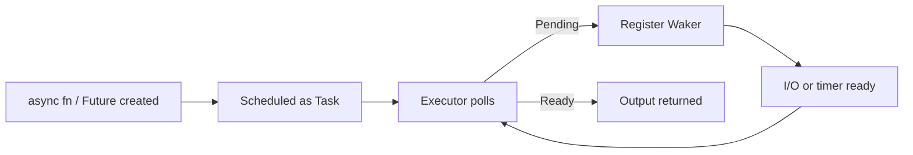
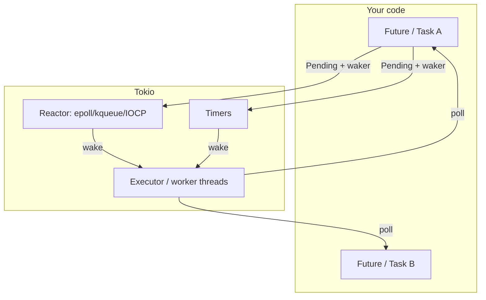

# Async Fundamentals

## Learning Goals

- Explain what a **Future** is and why it is *lazy* (work starts only when polled).
- Contrast async concurrency with OS threads: many tasks, few worker threads.
- Write `async fn`, use `.await`, and compose futures with `join!` / `select!` concepts.
- Understand **cancellation** as a normal control path, not an exceptional one.
- Recognize blocking hazards inside async code and how to avoid them.
- Use Edition 2024 / modern stable Rust async style with Tokio as the default runtime.

## Concept Diagram



Async Rust is **cooperative**: a task yields at `.await` points so the runtime can poll other tasks. Nothing runs until something drives the future (usually a runtime like Tokio).

## Why Async Exists

Network services spend most of their time **waiting**: DNS, TCP connect, TLS handshake, reading a request body, calling another service, waiting on a timer. With one OS thread per connection, you pay stack memory and scheduler overhead even while idle.

Async lets **one thread** (or a small pool) juggle thousands of in-flight operations by switching at await points instead of blocking the OS thread.

| Model | Good for | Cost |
|-------|----------|------|
| Sync + threads | CPU-bound work, simple CLIs | Memory per thread, limited concurrency |
| Async tasks | I/O-bound services | Mental model + runtime; avoid blocking |
| Hybrid | Real production | Async for I/O, `spawn_blocking` / threads for CPU |

Async is **not** automatically faster for pure CPU work. For heavy computation, use dedicated threads or `tokio::task::spawn_blocking`.

## Mental Model: Futures Are Lazy

In Rust, calling an `async fn` does **not** start the work. It builds a **state machine** (a `Future`) that advances when **polled**.

```rust
// Pseudocode shape of what the compiler builds for async fns:
// enum MyFuture {
//     Start { ... },
//     WaitingOnIo { ... },
//     Done,
// }
// impl Future for MyFuture {
//     type Output = ...;
//     fn poll(self: Pin<&mut Self>, cx: &mut Context<'_>) -> Poll<Self::Output> { ... }
// }
```

You almost never implement `poll` by hand. You write `async`/`await` and let the compiler generate the state machine.

### Minimal async main with Tokio

```toml
# Cargo.toml
[package]
name = "async-demo"
version = "0.1.0"
edition = "2024"

[dependencies]
tokio = { version = "1", features = ["full"] }
```

```rust
use tokio::time::{sleep, Duration};

#[tokio::main]
async fn main() {
    println!("before sleep");
    sleep(Duration::from_millis(100)).await;
    println!("after sleep");
}
```

```bash
cargo run
```

`#[tokio::main]` starts the runtime and blocks the OS thread until the future completes. The `.await` yields control so the runtime can do other work while the timer runs.

## Async Functions and `.await`

```rust
async fn fetch_user_id() -> u64 {
    // Imagine network I/O here.
    42
}

async fn greet() -> String {
    let id = fetch_user_id().await;
    format!("user-{id}")
}

#[tokio::main]
async fn main() {
    let g = greet().await;
    println!("{g}");
}
```

Rules of thumb:

1. You can only `.await` inside an `async` context (async fn, async block, or async closure).
2. `.await` may yield; code after it may run later on a different worker thread (if multi-threaded runtime).
3. Values held across `.await` must be `Send` when the future is sent across threads (Tokio multi-thread default).

## Concurrent Composition: `join!` and friends

Sequential awaits wait for one operation, then the next:

```rust
use tokio::time::{sleep, Duration};

async fn work(name: &str, ms: u64) -> String {
    sleep(Duration::from_millis(ms)).await;
    format!("{name}-done")
}

#[tokio::main]
async fn main() {
    // Sequential: ~150ms total
    let a = work("a", 100).await;
    let b = work("b", 50).await;
    println!("{a} {b}");
}
```

Concurrent join runs both futures at once:

```rust
use tokio::time::{sleep, Duration};

async fn work(name: &str, ms: u64) -> String {
    sleep(Duration::from_millis(ms)).await;
    format!("{name}-done")
}

#[tokio::main]
async fn main() {
    // Concurrent: ~100ms total (max of the two)
    let (a, b) = tokio::join!(work("a", 100), work("b", 50));
    println!("{a} {b}");
}
```

| Macro / API | Behavior |
|-------------|----------|
| `tokio::join!(a, b)` | Wait for all; both run concurrently |
| `tokio::try_join!(a, b)` | Like join, but first `Err` short-circuits |
| `tokio::select!` | Wait for first ready branch; cancel others (by not polling them) |
| `futures::future::join_all` | Dynamic list of futures |
| `tokio::spawn` | Run as independent task on the runtime |

### `select!` for race / timeout patterns

```rust
use tokio::time::{sleep, timeout, Duration};

async fn slow_op() -> &'static str {
    sleep(Duration::from_secs(2)).await;
    "finished"
}

#[tokio::main]
async fn main() {
    match timeout(Duration::from_millis(500), slow_op()).await {
        Ok(v) => println!("got {v}"),
        Err(_) => println!("timed out"),
    }

    tokio::select! {
        v = slow_op() => println!("select finished: {v}"),
        _ = sleep(Duration::from_millis(100)) => println!("select: timer won"),
    }
}
```

## Tasks vs Futures

- A **future** is a value that will produce a result when polled to completion.
- A **task** is a future that the runtime has scheduled (e.g. via `tokio::spawn`).

```rust
use tokio::time::{sleep, Duration};

#[tokio::main]
async fn main() {
    let handle = tokio::spawn(async {
        sleep(Duration::from_millis(50)).await;
        7 * 6
    });

    // Do other work...
    let answer = handle.await.expect("task panicked");
    println!("answer = {answer}");
}
```

`spawn` requires the future to be `'static` + `Send` (on multi-thread runtime). Share data with `Arc`, channels, or owned values—not stack borrows into the spawned task.

## Cancellation Is Normal

When a future is dropped before completion (e.g. `select!` takes another branch, or a timeout fires), work stops at the next await boundary. **There is no automatic rollback.**

Implications:

- Prefer **structured** concurrency: keep child tasks in a `JoinSet` or await them before leaving a scope.
- Make operations **idempotent** where retries or partial progress are possible.
- Use **RAII guards** and `Drop` for cleanup of temporary resources.
- For critical cleanup that must run even on cancel, consider `tokio::select!` with a dedicated cleanup path, or `AsyncDrop`-style patterns carefully (prefer explicit finally-style blocks).

```rust
use tokio::time::{sleep, Duration};

struct Guard(&'static str);

impl Drop for Guard {
    fn drop(&mut self) {
        println!("cleanup: {}", self.0);
    }
}

async fn cancellable_work() {
    let _g = Guard("temp file / connection");
    sleep(Duration::from_secs(10)).await;
    println!("completed (often cancelled before this)");
}

#[tokio::main]
async fn main() {
    tokio::select! {
        _ = cancellable_work() => {},
        _ = sleep(Duration::from_millis(20)) => {
            println!("cancelled via select");
        }
    }
    // Guard drops when the cancellable_work future is dropped.
}
```

## Blocking Hazards

Inside async tasks, **never** call blocking APIs that hold a worker thread for a long time:

```rust
#[tokio::main]
async fn main() {
    // BAD: blocks the async worker; other tasks starve.
    // std::thread::sleep(std::time::Duration::from_secs(1));

    // GOOD: async sleep yields the worker.
    tokio::time::sleep(std::time::Duration::from_secs(1)).await;
}
```

For blocking filesystem or CPU work on Tokio:

```rust
#[tokio::main]
async fn main() {
    let text = tokio::task::spawn_blocking(|| {
        // Blocking std I/O or CPU-heavy work is OK here.
        std::fs::read_to_string("Cargo.toml").unwrap_or_default()
    })
    .await
    .expect("join");

    println!("chars={}", text.len());
}
```

| Do | Don't |
|----|-------|
| `tokio::time::sleep` | `std::thread::sleep` in async |
| `tokio::fs` or `spawn_blocking` + `std::fs` | long `std::fs` on async workers |
| `tokio::sync::Mutex` for short critical sections | hold `std::sync::Mutex` across `.await` |
| bounded channels / semaphores | unbounded spawn storms |

## Streams and Async Iteration

Many I/O sources are **streams** of values over time (TCP lines, message queues). The `futures` / `tokio_stream` crates provide stream combinators.

```rust
use futures::StreamExt;
use tokio_stream::wrappers::IntervalStream;
use tokio::time::{interval, Duration};

#[tokio::main]
async fn main() {
    let ticker = IntervalStream::new(interval(Duration::from_millis(50)));
    let mut limited = ticker.take(3);

    while let Some(_tick) = limited.next().await {
        println!("tick");
    }
}
```

```toml
# add to Cargo.toml
futures = "0.3"
tokio-stream = "0.1"
```

## Error Handling in Async Code

`async fn` can return `Result` like any other function. Prefer `?` and typed errors.

```rust
use std::time::Duration;
use tokio::time::timeout;

async fn flaky() -> Result<&'static str, &'static str> {
    Err("downstream unavailable")
}

async fn with_budget() -> Result<&'static str, String> {
    match timeout(Duration::from_millis(200), flaky()).await {
        Ok(Ok(v)) => Ok(v),
        Ok(Err(e)) => Err(format!("op failed: {e}")),
        Err(_) => Err("op timed out".into()),
    }
}

#[tokio::main]
async fn main() {
    match with_budget().await {
        Ok(v) => println!("ok: {v}"),
        Err(e) => eprintln!("error: {e}"),
    }
}
```

## Async Traits (Modern Stable Rust)

Historically, `async fn` in traits needed workarounds. On modern stable Rust (2024+ era toolchains), **async functions in traits** are supported, with some dyn-dispatch caveats. For object-safe async traits, libraries still use `#[async_trait]` or return `Pin<Box<dyn Future...>>`.

```rust
trait Fetcher {
    async fn fetch(&self, key: &str) -> Option<String>;
}

struct Memory;

impl Fetcher for Memory {
    async fn fetch(&self, key: &str) -> Option<String> {
        Some(format!("value-for-{key}"))
    }
}

async fn use_fetcher<F: Fetcher>(f: &F) {
    let v = f.fetch("cfg").await;
    println!("{v:?}");
}

#[tokio::main]
async fn main() {
    use_fetcher(&Memory).await;
}
```

When you need `dyn Fetcher`, prefer an explicit boxed-future method or a well-maintained helper crate; see the Pin & Futures chapter.

## End-to-End Mini Example: Concurrent Fake Downloads

```rust
use std::time::Duration;
use tokio::time::sleep;

async fn download(url: &str, ms: u64) -> String {
    println!("start {url}");
    sleep(Duration::from_millis(ms)).await;
    println!("done  {url}");
    format!("body:{url}")
}

#[tokio::main]
async fn main() {
    let urls = [
        ("https://example.com/a", 80),
        ("https://example.com/b", 40),
        ("https://example.com/c", 60),
    ];

    let mut handles = Vec::new();
    for (url, ms) in urls {
        let url = url.to_string();
        handles.push(tokio::spawn(async move { download(&url, ms).await }));
    }

    for h in handles {
        let body = h.await.expect("task");
        println!("received {body}");
    }
}
```

This spawns unbounded concurrency (fine for 3 URLs; dangerous for 30_000). Later chapters add **semaphores** and **JoinSet** for backpressure.

## How to Think About the Runtime



You write async logic; the **executor** polls ready tasks; the **reactor** waits on OS I/O and wakes tasks when sockets/timers fire.

## Hands-On Practice

1. Create a crate with `edition = "2024"` and Tokio `features = ["full"]`.
2. Write two async functions with different sleep delays; run them sequentially, then with `tokio::join!`. Measure wall-clock difference roughly with `std::time::Instant`.
3. Use `timeout` to cancel a 2-second sleep after 100ms; print which path ran.
4. Spawn three tasks that each sleep and return a number; sum the results after joining all handles.
5. Intentionally put `std::thread::sleep` inside an async task, then replace it with `tokio::time::sleep` and note the difference under concurrent load (e.g. 20 tasks).
6. Add `spawn_blocking` around a deliberate `std::fs::read` of a large file and keep the async path responsive.
7. Run `cargo fmt`, `cargo clippy`, and `cargo test` on your experiments.

## Common Mistakes

- **Assuming `async fn` starts work immediately** — it only builds a future.
- **Forgetting `.await`** — the compiler often warns; the future is created and immediately dropped.
- **Blocking the runtime** with `std::thread::sleep`, heavy CPU, or long `std::sync::Mutex` holds across await.
- **Spawning unbounded tasks** for every request without a limit → memory and scheduler collapse.
- **Holding `!Send` types across await** on multi-thread runtime (e.g. some `Rc`/`RefCell` patterns).
- **Ignoring cancellation** — partial side effects without cleanup or idempotency.
- **Using async for pure CPU loops** and expecting speedups without parallelism.
- **`unwrap()` on `JoinHandle`** without considering task panics.

## Review Questions

1. What does `Poll::Pending` mean, and who is responsible for waking the task later?
2. Why can 10_000 async tasks be fine when 10_000 OS threads are not?
3. What happens to an in-flight future when `select!` chooses a different branch?
4. When should you use `spawn_blocking` instead of awaiting async I/O APIs?
5. Why might a type need to be `Send` if it lives across an `.await`?

## Chapter Summary

Async Rust models concurrent I/O as **lazy futures** polled by a **runtime**. You write `async`/`await`, compose work with `join!`/`select!`/`spawn`, and treat **cancellation**, **timeouts**, and **non-blocking** discipline as core correctness concerns—not optional polish. With that model in place, the next chapter puts **Tokio** into daily practice: timers, channels, semaphores, I/O types, and structured task management.

Move on only after you can explain lazy futures, run a concurrent `join!` example, and avoid at least one blocking hazard on purpose.
