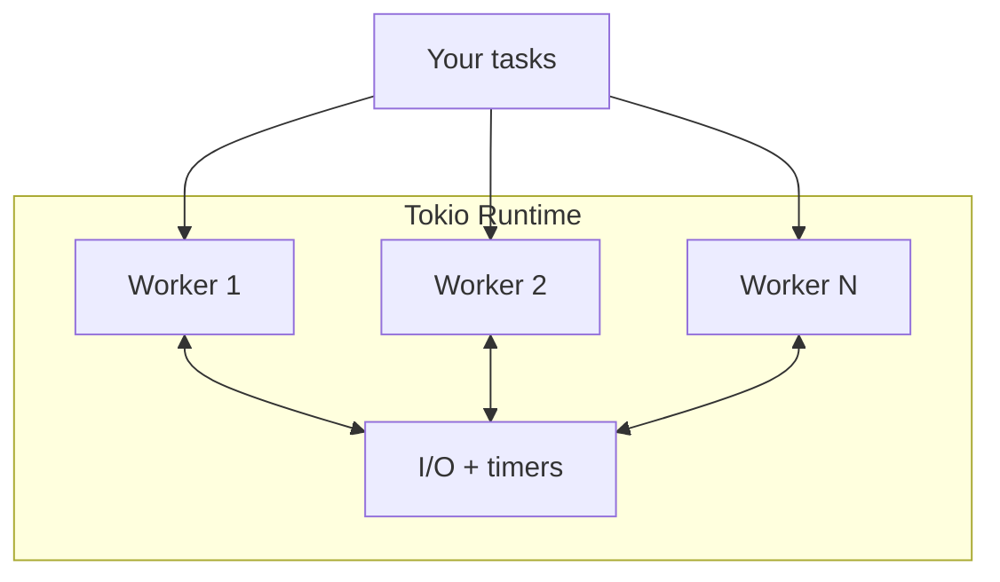

# Tokio in Practice

## Learning Goals

- Configure Tokio (features, single-thread vs multi-thread runtime).
- Use core primitives: time, `spawn`, `JoinSet`, channels, `Mutex`/`RwLock`, `Semaphore`.
- Perform async I/O with `tokio::fs`, `TcpListener` / `TcpStream`.
- Apply backpressure with bounded channels and concurrency limits.
- Structure shutdown with signals and cooperative cancellation.
- Prefer idiomatic patterns for Edition 2024 / Tokio 1.x on modern stable Rust.

## Concept Diagram



Tokio is the de-facto async runtime for Rust services: executor + reactor + timers + a batteries-included standard library for async I/O and sync primitives.

## Project Setup

```toml
# Cargo.toml
[package]
name = "tokio-practice"
version = "0.1.0"
edition = "2024"

[dependencies]
tokio = { version = "1", features = [
  "rt-multi-thread",
  "macros",
  "time",
  "net",
  "io-util",
  "fs",
  "sync",
  "signal",
  "process",
] }
# Or simply features = ["full"] while learning.
anyhow = "1"
tracing = "0.1"
tracing-subscriber = { version = "0.3", features = ["env-filter"] }
```

```bash
cargo new tokio-practice
# edit Cargo.toml, then:
cargo run
```

### Runtime entry points

```rust
// Multi-thread (default for servers)
#[tokio::main]
async fn main() {
    println!("workers schedule across a pool");
}

// Explicit builder when you need control:
// fn main() {
//     tokio::runtime::Builder::new_multi_thread()
//         .worker_threads(4)
//         .enable_all()
//         .build()
//         .unwrap()
//         .block_on(async { /* ... */ });
// }
```

For `!Send` futures (rare; e.g. holding `Rc` across await), use `#[tokio::main(flavor = "current_thread")]` or `LocalSet`. Prefer making data `Send` for servers.

## Timers and Sleep

```rust
use std::time::Duration;
use tokio::time::{interval, sleep, Instant};

#[tokio::main]
async fn main() {
    let start = Instant::now();
    sleep(Duration::from_millis(100)).await;
    println!("slept {:?}", start.elapsed());

    let mut tick = interval(Duration::from_millis(50));
    for i in 0..3 {
        tick.tick().await; // first tick completes immediately
        println!("tick {i}");
    }
}
```

Use `timeout` / `tokio::time::timeout` for deadline-aware operations (covered in fundamentals; use constantly in practice).

## Spawning Tasks and `JoinSet`

### Basic spawn

```rust
use tokio::time::{sleep, Duration};

#[tokio::main]
async fn main() {
    let h = tokio::spawn(async {
        sleep(Duration::from_millis(30)).await;
        42
    });
    assert_eq!(h.await.unwrap(), 42);
}
```

### Structured fan-out with `JoinSet`

```rust
use tokio::task::JoinSet;
use tokio::time::{sleep, Duration};

#[tokio::main]
async fn main() {
    let mut set = JoinSet::new();
    for id in 0..5u32 {
        set.spawn(async move {
            sleep(Duration::from_millis(10 * id as u64)).await;
            id * id
        });
    }

    let mut sum = 0u32;
    while let Some(res) = set.join_next().await {
        sum += res.expect("task panicked");
    }
    println!("sum={sum}");
}
```

`JoinSet` keeps child lifetimes explicit: you can abort remaining tasks on error, which is safer than fire-and-forget `spawn` without tracking handles.

## Channels: mpsc, oneshot, broadcast, watch

### Multi-producer single-consumer (`mpsc`)

```rust
use tokio::sync::mpsc;

#[tokio::main]
async fn main() {
    let (tx, mut rx) = mpsc::channel::<String>(8); // capacity = backpressure

    let producer = tokio::spawn(async move {
        for i in 0..5 {
            tx.send(format!("msg-{i}")).await.expect("rx alive");
        }
    });

    while let Some(msg) = rx.recv().await {
        println!("got {msg}");
    }
    producer.await.unwrap();
}
```

Bounded channels **apply backpressure**: `send().await` waits when full. Prefer bounded over unbounded for services.

### Oneshot (single response)

```rust
use tokio::sync::oneshot;

#[tokio::main]
async fn main() {
    let (tx, rx) = oneshot::channel();

    tokio::spawn(async move {
        let _ = tx.send(99);
    });

    let v = rx.await.expect("sender dropped");
    println!("oneshot={v}");
}
```

### `watch` for shared configuration

```rust
use tokio::sync::watch;

#[tokio::main]
async fn main() {
    let (tx, mut rx) = watch::channel("v1".to_string());

    tokio::spawn(async move {
        tx.send("v2".into()).unwrap();
    });

    rx.changed().await.unwrap();
    println!("cfg={}", *rx.borrow());
}
```

| Channel | Use when |
|---------|----------|
| `mpsc` | job queues, workers |
| `oneshot` | request/response, task result |
| `broadcast` | fan-out events to many receivers |
| `watch` | latest-value config / readiness |

## Sync primitives: Mutex, RwLock, Notify, Semaphore

### Async mutex (safe across await)

```rust
use std::sync::Arc;
use tokio::sync::Mutex;

#[tokio::main]
async fn main() {
    let counter = Arc::new(Mutex::new(0u64));
    let mut handles = vec![];

    for _ in 0..10 {
        let c = Arc::clone(&counter);
        handles.push(tokio::spawn(async move {
            let mut g = c.lock().await;
            *g += 1;
        }));
    }
    for h in handles {
        h.await.unwrap();
    }
    println!("count={}", *counter.lock().await);
}
```

Prefer short critical sections. Do not hold a lock while performing slow I/O unless that serialization is intentional.

### Semaphore for concurrency limits

```rust
use std::sync::Arc;
use tokio::sync::Semaphore;
use tokio::time::{sleep, Duration};

#[tokio::main]
async fn main() {
    let sem = Arc::new(Semaphore::new(3)); // max 3 concurrent
    let mut handles = vec![];

    for id in 0..10 {
        let sem = Arc::clone(&sem);
        handles.push(tokio::spawn(async move {
            let _permit = sem.acquire().await.unwrap();
            println!("running {id}");
            sleep(Duration::from_millis(50)).await;
        }));
    }
    for h in handles {
        h.await.unwrap();
    }
}
```

This is the practical answer to “how do I download 10_000 URLs without melting?”

## Async I/O: TCP echo server

```rust
use tokio::io::{AsyncReadExt, AsyncWriteExt};
use tokio::net::TcpListener;

#[tokio::main]
async fn main() -> anyhow::Result<()> {
    let listener = TcpListener::bind("127.0.0.1:7000").await?;
    println!("listening on 127.0.0.1:7000");

    loop {
        let (mut socket, addr) = listener.accept().await?;
        println!("accepted {addr}");

        tokio::spawn(async move {
            let mut buf = vec![0u8; 1024];
            loop {
                let n = match socket.read(&mut buf).await {
                    Ok(0) => return, // EOF
                    Ok(n) => n,
                    Err(e) => {
                        eprintln!("read error: {e}");
                        return;
                    }
                };
                if let Err(e) = socket.write_all(&buf[..n]).await {
                    eprintln!("write error: {e}");
                    return;
                }
            }
        });
    }
}
```

```bash
# terminal 1
cargo run

# terminal 2
nc 127.0.0.1 7000
# type lines; they echo back
```

Production additions (later chapters): connection limits, idle timeouts, framing, metrics, graceful drain.

## Async filesystem

```rust
use tokio::fs;

#[tokio::main]
async fn main() -> anyhow::Result<()> {
    fs::write("hello.txt", b"tokio fs\n").await?;
    let data = fs::read_to_string("hello.txt").await?;
    println!("{data}");
    Ok(())
}
```

On some platforms `tokio::fs` uses a blocking thread pool under the hood—still prefer it over raw `std::fs` on async workers for clarity and correct pool use.

## Cooperative shutdown

```rust
use tokio::signal;
use tokio::sync::watch;
use tokio::time::{sleep, Duration};

#[tokio::main]
async fn main() -> anyhow::Result<()> {
    let (tx, rx) = watch::channel(false);

    let worker = tokio::spawn(async move {
        let mut rx = rx;
        loop {
            tokio::select! {
                _ = sleep(Duration::from_millis(200)) => {
                    println!("tick");
                }
                _ = rx.changed() => {
                    if *rx.borrow() {
                        println!("worker stopping");
                        break;
                    }
                }
            }
        }
    });

    signal::ctrl_c().await?;
    println!("signal received");
    let _ = tx.send(true);
    worker.await?;
    Ok(())
}
```

Pattern: broadcast a shutdown flag (or close a channel), stop accepting new work, drain in-flight tasks with a deadline.

## Tracing for async services

```rust
use tracing::{info, instrument};
use tracing_subscriber::EnvFilter;

#[instrument]
async fn handle(id: u64) {
    info!("start");
    tokio::time::sleep(std::time::Duration::from_millis(10)).await;
    info!("end");
}

#[tokio::main]
async fn main() {
    tracing_subscriber::fmt()
        .with_env_filter(EnvFilter::from_default_env())
        .init();

    handle(1).await;
}
```

```bash
RUST_LOG=info,tokio=debug cargo run
```

`tracing` integrates well with async (spans across await points). Prefer it over ad-hoc `println!` in services.

## Selecting features deliberately

| Feature set | When |
|-------------|------|
| `full` | Learning, prototypes |
| Explicit list | Production binaries (faster compile, smaller surface) |
| `rt-multi-thread` + `macros` + `net` + `time` + `sync` | Typical HTTP service |
| `process` + `io-util` | CLI wrappers / sidecar tools |

```bash
# See what you pull in:
cargo tree -p tokio
```

## Worker architecture sketch

```rust
use tokio::sync::mpsc;

struct Job {
    id: u32,
}

async fn worker(mut rx: mpsc::Receiver<Job>) {
    while let Some(job) = rx.recv().await {
        println!("processing {}", job.id);
        // await I/O here
    }
}

#[tokio::main]
async fn main() {
    let (tx, rx) = mpsc::channel(32);
    let w = tokio::spawn(worker(rx));

    for id in 1..=5 {
        tx.send(Job { id }).await.unwrap();
    }
    drop(tx); // close channel → worker exits
    w.await.unwrap();
}
```

This pattern scales: multiple workers, one queue, explicit shutdown by dropping senders.

## Hands-On Practice

1. Build a TCP line-echo server; test with `nc`.
2. Add a `Semaphore` so at most 2 connections are active; verify the third waits.
3. Replace free `spawn` loops with a `JoinSet`; on first task error, `abort_all` and exit.
4. Create a bounded `mpsc` of capacity 2; spawn a fast producer and slow consumer; observe backpressure.
5. Implement Ctrl+C shutdown that stops accepting and waits up to 2 seconds for workers.
6. Add `tracing` spans around accept/read/write paths; run with `RUST_LOG=info`.
7. Switch from `features = ["full"]` to a minimal feature list and ensure the project still builds.
8. Run `cargo fmt`, `cargo clippy -- -D warnings` (as far as practical), and add one unit test that uses `tokio::test`.

```rust
#[tokio::test]
async fn adds() {
    async fn add(a: u32, b: u32) -> u32 { a + b }
    assert_eq!(add(2, 3).await, 5);
}
```

## Common Mistakes

- **Unbounded `mpsc` or unbounded spawn** under load → OOM.
- **`std::sync::Mutex` held across `.await`** → deadlocks and runtime stalls.
- **Ignoring `JoinHandle` errors** (task panics swallowed).
- **Accept loop without limits** (FD exhaustion).
- **Forgetting to enable Tokio features** (`time`, `net`, …) → confusing compile errors.
- **Using multi-thread runtime with `!Send` data** without `LocalSet`.
- **Busy loops without await** → one task monopolizes a worker (insert `yield_now` only as a last resort; prefer real I/O awaits).
- **Logging secrets** in debug traces of request bodies.

## Review Questions

1. How does a bounded channel create backpressure?
2. When is `JoinSet` preferable to a `Vec<JoinHandle<_>>`?
3. Why is `tokio::sync::Mutex` used instead of `std::sync::Mutex` across await points?
4. What is a safe default concurrency limit for outbound HTTP fan-out?
5. Which Tokio features would you enable for a timer-only background worker with no networking?

## Chapter Summary

Tokio is the practical toolkit for async Rust: **runtime**, **tasks**, **time**, **channels**, **async locks**, **semaphores**, and **I/O types**. Production quality comes from **bounded concurrency**, **structured task lifecycles**, **cooperative shutdown**, and **tracing**—not from spawning tasks alone. Next, we lift these primitives into **async architecture**: layering, backpressure end-to-end, and failure domains.
