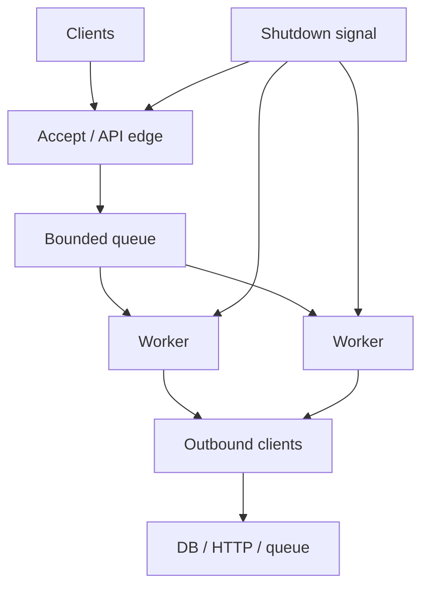
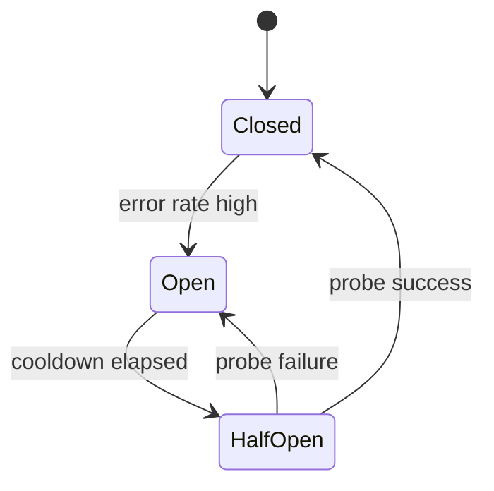

# Async Architecture

## Learning Goals

- Design async systems with clear **failure domains**, **backpressure**, and **timeouts**.
- Separate accept path, worker pool, and outbound I/O with explicit queues.
- Apply structured concurrency: ownership of tasks, cancellation trees, drain on shutdown.
- Classify errors (retryable vs terminal) and place retries at the right layer.
- Avoid classic anti-patterns: unbounded queues, shared mutable god-state, lock-over-await.
- Sketch architectures you can evolve into real services (HTTP, workers, gateways).

## Concept Diagram



Async architecture is less about clever futures and more about **control of concurrency and resources** under load and failure.

## Principles

1. **Every async boundary needs a budget** — time, concurrency, memory, file descriptors.
2. **Backpressure must reach the edge** — if workers are saturated, accept fewer jobs or reject fast.
3. **Structure > fire-and-forget** — know which parent owns which tasks.
4. **Timeouts are correctness** — infinite wait is a production bug.
5. **Idempotency enables retries** — retries without it create double side effects.
6. **Observe the queues** — depth, wait time, drop/reject counts matter as much as CPU.

## Layered Service Shape

| Layer | Responsibility | Typical types |
|-------|----------------|---------------|
| Edge | authn/authz, validation, timeout budget | hyper/axum handlers |
| Application | use-cases, orchestration | plain async fns |
| Ports | traits for DB/HTTP | async traits / dyn where needed |
| Adapters | SQL, Redis, HTTP clients | pool + timeouts |
| Runtime | tasks, channels, shutdown | Tokio |

Keep handlers thin: parse → call use-case → map errors → respond.

```rust
// Architectural sketch (not a full web framework).
struct AppState {
    jobs: tokio::sync::mpsc::Sender<Job>,
}

struct Job {
    id: String,
    payload: Vec<u8>,
}

async fn enqueue(state: &AppState, job: Job) -> Result<(), &'static str> {
    state
        .jobs
        .try_send(job)
        .map_err(|_| "busy: queue full") // fail-fast backpressure to client
}
```

`try_send` + 503/429 at the edge is often better than unbounded `send().await` that makes latency explode.

## Concurrency Patterns

### 1. Worker pool + bounded queue

```rust
use std::sync::Arc;
use tokio::sync::{mpsc, Semaphore};
use tokio::task::JoinSet;

struct Job(u32);

async fn worker(mut rx: mpsc::Receiver<Job>, limit: Arc<Semaphore>) {
    while let Some(Job(id)) = rx.recv().await {
        let permit = limit.clone().acquire_owned().await.unwrap();
        tokio::spawn(async move {
            let _permit = permit;
            // simulate work
            tokio::time::sleep(std::time::Duration::from_millis(20)).await;
            println!("done {id}");
        });
    }
}

#[tokio::main]
async fn main() {
    let (tx, rx) = mpsc::channel::<Job>(64);
    let limit = Arc::new(Semaphore::new(8));
    let w = tokio::spawn(worker(rx, limit));

    for id in 0..20 {
        if tx.send(Job(id)).await.is_err() {
            break;
        }
    }
    drop(tx);
    w.await.unwrap();
}
```

Refine further: process jobs **inline in N workers** (no nested spawn) when you want stricter concurrency accounting.

### 2. Pipelines (stage channels)


Each stage has its own concurrency and queue size. A slow stage fills its inbound queue and naturally slows the previous stage if channels are bounded.

### 3. Scatter-gather with a deadline

```rust
use std::time::Duration;
use tokio::time::timeout;

async fn fanout(ids: Vec<u32>) -> Vec<u32> {
    let mut set = tokio::task::JoinSet::new();
    for id in ids {
        set.spawn(async move {
            tokio::time::sleep(Duration::from_millis(10)).await;
            id * 2
        });
    }

    let mut out = Vec::new();
    let collect = async {
        while let Some(res) = set.join_next().await {
            if let Ok(v) = res {
                out.push(v);
            }
        }
        out
    };

    match timeout(Duration::from_millis(100), collect).await {
        Ok(v) => v,
        Err(_) => {
            set.abort_all();
            Vec::new() // or partial results if you collected outside
        }
    }
}
```

Decide product behavior: **all-or-nothing**, **best-effort partial**, or **hedged requests**.

## Timeouts, Deadlines, and Budgets

Propagate a single **deadline** through the call graph when possible.

```rust
use std::time::{Duration, Instant};

#[derive(Clone, Copy)]
struct Deadline(Instant);

impl Deadline {
    fn from_now(d: Duration) -> Self {
        Self(Instant::now() + d)
    }

    fn remaining(self) -> Duration {
        self.0.saturating_duration_since(Instant::now())
    }
}

async fn call_downstream(dl: Deadline) -> Result<(), &'static str> {
    let left = dl.remaining();
    if left.is_zero() {
        return Err("deadline exceeded");
    }
    tokio::time::timeout(left, async {
        // actual I/O
        Ok::<(), &'static str>(())
    })
    .await
    .map_err(|_| "deadline exceeded")?
}
```

Budget example for a 200ms p95 API:

| Step | Budget |
|------|--------|
| Validate + auth | 10ms |
| Cache lookup | 15ms |
| DB | 60ms |
| Downstream HTTP | 90ms |
| Serialize | 10ms |
| Slack / jitter | 15ms |

## Retry Policy Architecture

Put retries **close to the dependency**, with:

- max attempts
- exponential backoff + **full jitter**
- retry only **idempotent** + **transient** errors
- overall deadline still enforced
- metrics: attempts, successes after retry, give-ups

```rust
use std::time::Duration;
use rand::Rng;

async fn with_retries<F, Fut, T, E>(mut op: F, max: u32) -> Result<T, E>
where
    F: FnMut() -> Fut,
    Fut: std::future::Future<Output = Result<T, E>>,
    E: std::fmt::Debug,
{
    let mut attempt = 0;
    loop {
        attempt += 1;
        match op().await {
            Ok(v) => return Ok(v),
            Err(e) if attempt >= max => return Err(e),
            Err(_e) => {
                let base = 2u64.pow(attempt.saturating_sub(1)).min(8) * 20;
                let jitter = rand::thread_rng().gen_range(0..base);
                tokio::time::sleep(Duration::from_millis(jitter)).await;
            }
        }
    }
}
```

```toml
rand = "0.8"
```

**Do not** blindly retry `POST` that creates orders unless the API is idempotent (idempotency keys).

## Circuit Breaker (conceptual)

When a dependency is hard-down, fail fast:



Implementation options: hand-rolled state in `Arc<Mutex<...>>`, or libraries. The architectural point is to **shed load** and **protect thread/task pools**.

## Shared State: What Belongs Where

| Kind | Sharing tool | Notes |
|------|--------------|-------|
| Immutable config | `Arc<Config>` | cheap clones |
| Hot counters | atomics / metrics crate | avoid mutex storms |
| Pools | `Arc<Pool>` | built-in concurrency |
| Business caches | dedicated task or concurrent map | watch lock duration |
| Latest settings | `watch` channel | fans out updates |

Avoid a single giant `Mutex<AppState>` that every request locks.

## Cancellation Trees

When a request is cancelled (client disconnect, timeout), cancel **dependent** outbound work.

```rust
use tokio_util::sync::CancellationToken;

async fn handle(cancel: CancellationToken) {
    tokio::select! {
        _ = cancel.cancelled() => {
            println!("request cancelled");
        }
        _ = do_work() => {
            println!("work finished");
        }
    }
}

async fn do_work() {
    tokio::time::sleep(std::time::Duration::from_secs(5)).await;
}
```

```toml
tokio-util = { version = "0.7", features = ["rt"] }
```

Parent token cancels children created via `child_token()` — structured cancellation without global flags.

## Graceful Shutdown Architecture

Phases:

1. **Stop accepting** new work (close listener / fail readiness).
2. **Drain** in-flight requests until empty or deadline.
3. **Abort** stragglers; flush logs/metrics.
4. **Exit** non-zero if drain timed out (so orchestrators notice).

```rust
use std::sync::atomic::{AtomicBool, Ordering};
use std::sync::Arc;
use tokio::sync::mpsc;

#[tokio::main]
async fn main() {
    let accepting = Arc::new(AtomicBool::new(true));
    let (tx, mut rx) = mpsc::channel::<u32>(16);
    let accepting_w = Arc::clone(&accepting);

    let accept_loop = tokio::spawn(async move {
        for id in 0..100u32 {
            if !accepting_w.load(Ordering::Relaxed) {
                break;
            }
            let _ = tx.send(id).await;
            tokio::time::sleep(std::time::Duration::from_millis(5)).await;
        }
    });

    let worker = tokio::spawn(async move {
        while let Some(id) = rx.recv().await {
            println!("work {id}");
        }
    });

    tokio::signal::ctrl_c().await.ok();
    accepting.store(false, Ordering::Relaxed);
    // drop senders by waiting accept_loop, then worker sees EOF
    accept_loop.await.ok();
    worker.await.ok();
}
```

## Anti-Patterns

| Anti-pattern | Symptom | Fix |
|--------------|---------|-----|
| Unbounded queues | latency cliffs, OOM | bound + reject/shed |
| Spawn per request without limit | task explosion | semaphore / worker pool |
| Retries at every layer | retry storms | one retry policy per hop |
| Shared `Mutex` over await of I/O | throughput collapse | finer locks / channels |
| No timeouts | stuck tasks forever | deadline propagation |
| Ignoring cancel | wasted work, thundering completion | tokens / drop futures |
| Sync I/O in async path | tail latency spikes | `spawn_blocking` or async APIs |

## Case Study: Async Job Processor

Requirements:

- HTTP enqueue API (imagined)
- workers process jobs with concurrency 16
- each job may call an HTTP API with 2s timeout
- retries: 3 attempts for transient errors
- shutdown: drain up to 30s

Components:

1. `mpsc` queue capacity 1000  
2. 16 long-lived workers  
3. outbound client with connect/request timeouts  
4. `CancellationToken` for process-level shutdown  
5. metrics: queue depth, processing time, retry counts, DLQ  

Dead-letter path for permanently failed jobs is an architecture feature, not an afterthought.

## Testing Architecture

- Unit-test pure logic without a runtime when possible.
- Use `#[tokio::test]` for async units.
- Integration tests with bounded timeouts.
- Load tests that watch **queue depth** and **p99**, not just RPS.
- Chaos: kill dependencies; verify circuit open and recovery.

```rust
#[tokio::test(flavor = "multi_thread", worker_threads = 2)]
async fn worker_drains() {
    let (tx, mut rx) = tokio::sync::mpsc::channel(4);
    tx.send(1).await.unwrap();
    drop(tx);
    assert_eq!(rx.recv().await, Some(1));
    assert!(rx.recv().await.is_none());
}
```

## Hands-On Practice

1. Implement a bounded job queue with `try_send`; count rejections under a slow worker.
2. Add a global semaphore of 4 around “outbound” sleeps; prove the fifth waits.
3. Implement deadline propagation with `Instant` + `timeout`.
4. Add retries with jitter; log attempt numbers.
5. Wire Ctrl+C to stop producers, drain consumers, and print drain duration.
6. Sketch (on paper or in comments) layers for a tiny URL shortener: edge, app, store trait, memory adapter.
7. Introduce a deliberate anti-pattern (unbounded spawn), measure memory, then fix it.
8. `cargo fmt`, `clippy`, and at least two `#[tokio::test]` tests.

## Common Mistakes

- Treating async architecture as “use more spawn”.
- Copying web framework examples that never set timeouts.
- Retrying non-idempotent writes.
- Using one shared connection without a pool.
- Forgetting readiness vs liveness (accepting traffic while shutting down).
- Optimizing CPU before fixing queue unboundedness.

## Review Questions

1. How does fail-fast at a full queue protect the system?
2. Why should retries and timeouts be designed together?
3. What is the difference between worker-pool concurrency and spawn-per-job concurrency?
4. Where should a circuit breaker live in a layered design?
5. What metrics prove backpressure is working?

## Chapter Summary

Solid async architecture is **resource-aware concurrency**: bounded queues, worker pools, deadlines, structured cancellation, and dependency-local retries. Tokio primitives are the bricks; architecture is the blueprint that keeps latency and failure modes predictable. Next chapters deepen **smart pointers** and memory sharing patterns that often appear inside these designs.
