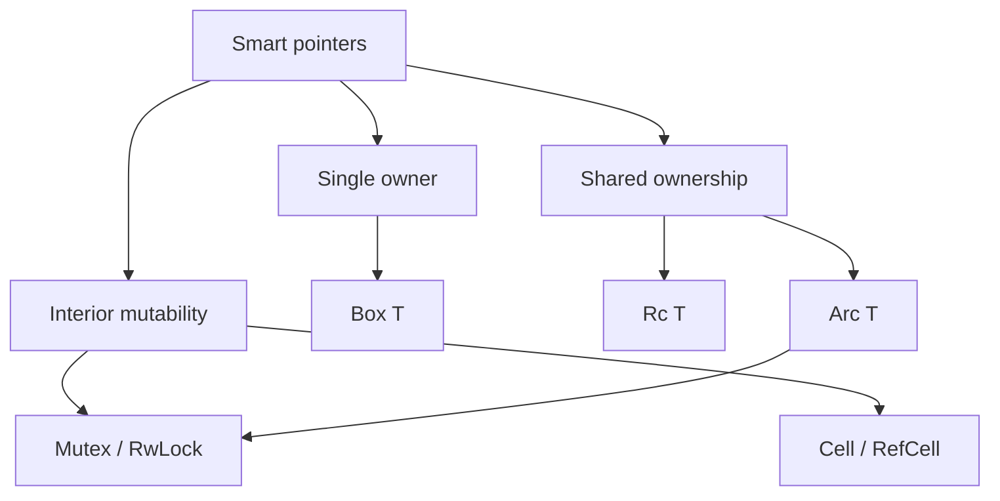

# Smart Pointers

## Learning Goals

- Choose among `Box`, `Rc`, `Arc`, `RefCell`, `Mutex`, `RwLock`, and `Cow` with clear intent.
- Explain ownership, borrowing, and interior mutability trade-offs.
- Share state safely across threads with `Arc` + synchronization.
- Avoid reference cycles with `Weak`.
- Recognize when a smart pointer is unnecessary abstraction cost.
- Apply patterns common in async services (`Arc<State>`, `Arc<Semaphore>`, etc.).

## Concept Diagram



Smart pointers are types that act like pointers **and** manage extra behavior: heap allocation, reference counting, borrowing rules at runtime, or locking.

## `Box<T>` — heap allocation, single owner

Use `Box` when:

- You need a **recursive type** (otherwise infinite size).
- You want to move large data cheaply by pointer.
- You need a trait object: `Box<dyn Trait>`.

```rust
enum List {
    Cons(i32, Box<List>),
    Nil,
}

use List::{Cons, Nil};

fn main() {
    let list = Cons(1, Box::new(Cons(2, Box::new(Cons(3, Box::new(Nil))))));
    let _ = list;
}
```

```rust
trait Greeter {
    fn greet(&self) -> String;
}

struct En;
impl Greeter for En {
    fn greet(&self) -> String {
        "hello".into()
    }
}

fn main() {
    let g: Box<dyn Greeter> = Box::new(En);
    println!("{}", g.greet());
}
```

`Box` is `Send`/`Sync` if `T` is — no runtime refcount.

## `Rc<T>` — single-threaded shared ownership

`Rc` clones are cheap pointer bumps (strong count). Not thread-safe.

```rust
use std::rc::Rc;

fn main() {
    let a = Rc::new(String::from("shared"));
    let b = Rc::clone(&a);
    let c = Rc::clone(&a);
    println!("{a} {b} {c} count={}", Rc::strong_count(&a));
}
```

Prefer `Rc` for tree graphs in single-threaded UI or interpreters. Prefer `Arc` in multi-thread and most async servers.

## `Arc<T>` — atomic reference counting

```rust
use std::sync::Arc;
use std::thread;

fn main() {
    let data = Arc::new(vec![1, 2, 3]);
    let mut handles = vec![];

    for i in 0..3 {
        let d = Arc::clone(&data);
        handles.push(thread::spawn(move || {
            println!("thread {i}: sum={}", d.iter().sum::<i32>());
        }));
    }
    for h in handles {
        h.join().unwrap();
    }
}
```

Async variant:

```rust
use std::sync::Arc;
use tokio::sync::Mutex;

struct State {
    hits: u64,
}

#[tokio::main]
async fn main() {
    let state = Arc::new(Mutex::new(State { hits: 0 }));
    let mut set = tokio::task::JoinSet::new();

    for _ in 0..10 {
        let s = Arc::clone(&state);
        set.spawn(async move {
            s.lock().await.hits += 1;
        });
    }
    while set.join_next().await.is_some() {}
    println!("hits={}", state.lock().await.hits);
}
```

## Interior Mutability: `Cell`, `RefCell`

Rust’s default: mutation needs `&mut` exclusive borrow. Interior mutability moves that check to **runtime** (`RefCell`) or restricts to `Copy` (`Cell`).

```rust
use std::cell::RefCell;

fn main() {
    let data = RefCell::new(vec![1]);
    data.borrow_mut().push(2);
    println!("{:?}", data.borrow());
}
```

`RefCell` panics if you violate borrow rules (e.g. two active `borrow_mut`). Use in single-threaded code when the static checker is too strict but logic is sound.

```rust
use std::cell::Cell;

fn main() {
    let n = Cell::new(1);
    n.set(n.get() + 1);
    println!("{}", n.get());
}
```

## `Mutex` and `RwLock`

### `std::sync::Mutex`

```rust
use std::sync::{Arc, Mutex};
use std::thread;

fn main() {
    let m = Arc::new(Mutex::new(0));
    let mut hs = vec![];
    for _ in 0..8 {
        let m = Arc::clone(&m);
        hs.push(thread::spawn(move || {
            *m.lock().unwrap() += 1;
        }));
    }
    for h in hs {
        h.join().unwrap();
    }
    println!("{}", *m.lock().unwrap());
}
```

### Async: prefer `tokio::sync::Mutex` across await

```rust
// hold std mutex across await → deadlock risk on re-enter same task / runtime issues
// let guard = std_mutex.lock().unwrap();
// some_async().await; // BAD
```

`RwLock` allows many readers or one writer — good for read-heavy config; watch writer starvation.

## Combining `Rc<RefCell<T>>` vs `Arc<Mutex<T>>`

| Context | Pattern |
|---------|---------|
| Single thread, shared mutate | `Rc<RefCell<T>>` |
| Multi thread / async tasks | `Arc<Mutex<T>>` or `Arc<tokio::sync::Mutex<T>>` |
| Multi thread, read-heavy | `Arc<RwLock<T>>` |
| Immutable share | `Arc<T>` alone |

## `Weak<T>` — break cycles

`Rc`/`Arc` cycles leak memory (strong counts never hit zero). Store parents as `Weak`.

```rust
use std::cell::RefCell;
use std::rc::{Rc, Weak};

struct Node {
    value: i32,
    parent: RefCell<Weak<Node>>,
    children: RefCell<Vec<Rc<Node>>>,
}

fn main() {
    let leaf = Rc::new(Node {
        value: 3,
        parent: RefCell::new(Weak::new()),
        children: RefCell::new(vec![]),
    });

    let branch = Rc::new(Node {
        value: 5,
        parent: RefCell::new(Weak::new()),
        children: RefCell::new(vec![Rc::clone(&leaf)]),
    });

    *leaf.parent.borrow_mut() = Rc::downgrade(&branch);

    println!(
        "leaf parent = {:?}",
        leaf.parent.borrow().upgrade().map(|n| n.value)
    );
}
```

## `Cow<'_, T>` — clone only when needed

```rust
use std::borrow::Cow;

fn normalize(input: &str) -> Cow<'_, str> {
    if input.contains(' ') {
        Cow::Owned(input.replace(' ', "_"))
    } else {
        Cow::Borrowed(input)
    }
}

fn main() {
    println!("{}", normalize("hello"));
    println!("{}", normalize("hello world"));
}
```

Useful in APIs that rarely mutate strings/bytes.

## `Pin` preview

`Pin<Box<T>>` appears with async trait objects and self-referential futures. Most app code uses `Box::pin(async { ... })` without deep Pin theory—covered in the Pin & Futures chapter.

```rust
use std::future::Future;
use std::pin::Pin;

fn boxed(n: u32) -> Pin<Box<dyn Future<Output = u32> + Send>> {
    Box::pin(async move { n + 1 })
}
```

## Drop and RAII

Smart pointers run `Drop` of the inner value when the last owner goes away. This is how locks unlock, files close, and refcounts free memory.

```rust
struct Loud;

impl Drop for Loud {
    fn drop(&mut self) {
        println!("dropped");
    }
}

fn main() {
    let b = Box::new(Loud);
    drop(b); // explicit
    println!("after");
}
```

## Performance Notes

- Prefer stack values when sizes are small and ownership is simple.
- `Box` is one allocation; fine for large objects and trait objects.
- `Arc` clones are cheap but not free (atomic ops); pass references when a single owner is enough.
- Don’t wrap everything in `Arc<Mutex<_>>` “just in case.”
- For hot counters, `AtomicU64` beats mutexes.

```rust
use std::sync::atomic::{AtomicU64, Ordering};
use std::sync::Arc;
use std::thread;

fn main() {
    let n = Arc::new(AtomicU64::new(0));
    let mut hs = vec![];
    for _ in 0..4 {
        let n = Arc::clone(&n);
        hs.push(thread::spawn(move || {
            for _ in 0..1000 {
                n.fetch_add(1, Ordering::Relaxed);
            }
        }));
    }
    for h in hs {
        h.join().unwrap();
    }
    println!("{}", n.load(Ordering::Relaxed));
}
```

## Mini Project: Shared Config + Metrics

```rust
use std::sync::Arc;
use tokio::sync::{RwLock, watch};

#[derive(Clone, Debug)]
struct Config {
    max_conns: u32,
}

struct Metrics {
    requests: std::sync::atomic::AtomicU64,
}

#[tokio::main]
async fn main() {
    let (cfg_tx, cfg_rx) = watch::channel(Config { max_conns: 100 });
    let metrics = Arc::new(Metrics {
        requests: std::sync::atomic::AtomicU64::new(0),
    });

    // background: hot-reload simulation
    tokio::spawn(async move {
        tokio::time::sleep(std::time::Duration::from_millis(50)).await;
        let _ = cfg_tx.send(Config { max_conns: 200 });
    });

    let mut cfg_rx = cfg_rx;
    let m = Arc::clone(&metrics);
    tokio::spawn(async move {
        loop {
            tokio::select! {
                _ = cfg_rx.changed() => {
                    println!("config reloaded: {:?}", *cfg_rx.borrow());
                }
                _ = async {
                    m.requests.fetch_add(1, std::sync::atomic::Ordering::Relaxed);
                    tokio::time::sleep(std::time::Duration::from_millis(10)).await;
                } => {}
            }
            if m.requests.load(std::sync::atomic::Ordering::Relaxed) > 5 {
                break;
            }
        }
    })
    .await
    .ok();

    // RwLock example for rarer mutable table
    let table = Arc::new(RwLock::new(vec!["a".to_string()]));
    {
        table.write().await.push("b".into());
    }
    println!("{:?}", table.read().await);
}
```

## Hands-On Practice

1. Implement a recursive binary tree with `Box`.
2. Share a read-only `Arc<Vec<u8>>` across 4 threads that checksum it.
3. Build a single-threaded graph node with `Rc`/`RefCell`/`Weak` parent links; prove no leak by checking counts.
4. Compare `Arc<Mutex<u64>>` vs `AtomicU64` increments in a tight loop (rough timing).
5. Write a function returning `Cow<str>` that uppercases only if lowercase letters exist.
6. Create `Arc<tokio::sync::Mutex<HashMap<...>>>` and update from several tasks.
7. Intentionally double-`borrow_mut` a `RefCell` in a test that `#[should_panic]`.
8. `cargo fmt`, `clippy`, tests.

## Common Mistakes

- Using `Rc` across threads (compile error — good; don’t fight it with unsafe).
- `Arc<Mutex<...>>` for immutable data — drop the mutex.
- Reference cycles with only strong `Rc`/`Arc` edges.
- Holding locks while doing heavy I/O.
- Cloning `Arc` in hot loops when a local `&T` would do after one clone into the task.
- Expecting `RefCell` to be thread-safe.

## Review Questions

1. When is `Box<dyn Trait>` preferable to generics?
2. Why does `Arc` use atomic operations?
3. How does `Weak` prevent memory leaks?
4. Why is `RefCell` a runtime check?
5. Which pointer combo fits multi-threaded async shared state?

## Chapter Summary

Smart pointers encode **allocation**, **sharing**, and **mutation** policies. Reach for `Box` for heap/ indirection, `Arc` for cross-thread sharing, interior mutability only when needed, and atomics for simple counters. Prefer the simplest ownership model that matches your concurrency story. Next: **unsafe Rust** — when the compiler’s guarantees must be extended carefully.
