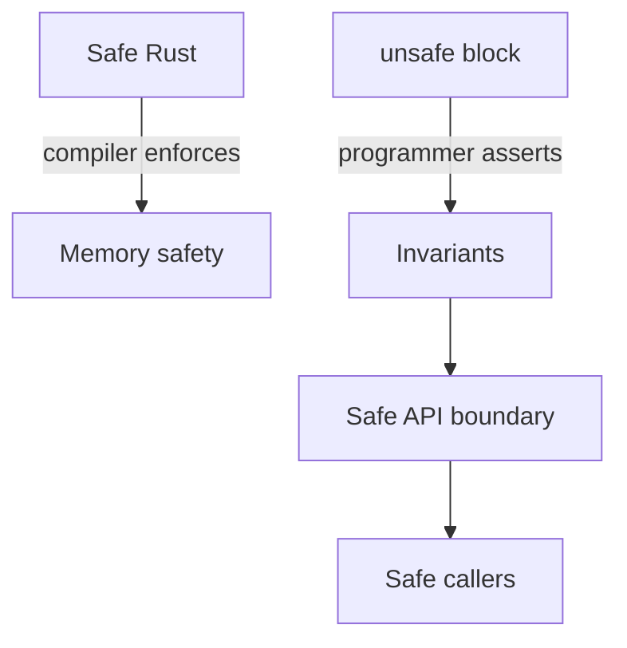

# Unsafe Rust

## Learning Goals

- Know what `unsafe` allows and what it does **not** magically verify.
- Keep unsafe blocks **minimal** and wrap them in **safe APIs** with documented invariants.
- Use raw pointers, `unsafe fn`, and `unsafe trait` implementations responsibly.
- Read and write `SAFETY:` comments that a reviewer can audit.
- Avoid undefined behavior (UB): invalid pointers, data races, invalid values.
- Prefer safe abstractions (`slice::get`, `Vec`, crates) unless unsafe is justified.

## Concept Diagram



`unsafe` is a **proof obligation**, not a performance free lunch. It means: “I am responsible for rules the compiler cannot check here.”

## What `unsafe` Can Do

Inside `unsafe` you may:

1. Dereference raw pointers (`*const T`, `*mut T`).
2. Call `unsafe fn` (including many FFI and intrinsics).
3. Access / modify `static mut`.
4. Implement `unsafe trait`s (e.g. `Send`, `Sync` — rare and serious).
5. Access fields of `union`s.

It does **not** turn off the borrow checker entirely for safe references, nor does it make data races OK.

## Undefined Behavior (UB) You Must Not Cause

Examples of UB:

- Dereferencing null or dangling pointers
- Out-of-bounds pointer offset and read/write
- Violating aliasing rules (e.g. `&mut` aliasing)
- Creating invalid values (e.g. `bool` that isn’t 0/1)
- Data races on non-atomic memory
- Unwinding across FFI boundaries incorrectly

If you cause UB, the optimizer may delete checks or miscompile your program—bugs become heisenbugs.

## Pattern: Safe Wrapper around Unsafe

```rust
/// Returns the first byte of `s`, if any.
pub fn first_byte(s: &str) -> Option<u8> {
    if s.is_empty() {
        return None;
    }
    let ptr = s.as_ptr();
    // SAFETY: `s` is non-empty, so `ptr` points to a valid `u8` within the
    // same allocation for the lifetime of `s`. We only read one byte.
    Some(unsafe { *ptr })
}

fn main() {
    assert_eq!(first_byte("abc"), Some(b'a'));
    assert_eq!(first_byte(""), None);
}
```

Checklist for every unsafe block:

1. **Preconditions** validated in safe code above.
2. **Minimal** unsafe surface (one operation if possible).
3. **`SAFETY:` comment** explaining why invariants hold.
4. **Safe return type** that cannot be misused to recreate UB.

## Raw Pointers

```rust
fn main() {
    let mut x = 42i32;
    let r1: *const i32 = &x;
    let r2: *mut i32 = &mut x;

    unsafe {
        println!("r1={}", *r1);
        *r2 = 7;
        println!("x={x}");
    }
}
```

Prefer references and slices. Use pointers when:

- FFI demands them
- Building custom collections / arenas
- Expressing aliasing patterns references forbid

### Pointer provenance and offsets

```rust
fn read_at(slice: &[u8], idx: usize) -> Option<u8> {
    if idx >= slice.len() {
        return None;
    }
    // Prefer safe indexing: slice[idx]
    // Teaching form with get_unchecked:
    // SAFETY: idx checked against length.
    Some(unsafe { *slice.get_unchecked(idx) })
}
```

In real code, write `slice.get(idx).copied()` unless you have measured a need for `get_unchecked`.

## `unsafe fn` and Safe Facades

```rust
/// # Safety
/// - `ptr` must be valid for reads of `len` bytes.
/// - Memory must not be mutated for the duration of the call.
unsafe fn sum_u8_raw(ptr: *const u8, len: usize) -> u32 {
    let mut sum = 0u32;
    // SAFETY: caller guarantees ptr/len validity.
    let slice = unsafe { std::slice::from_raw_parts(ptr, len) };
    for &b in slice {
        sum += u32::from(b);
    }
    sum
}

pub fn sum_u8(data: &[u8]) -> u32 {
    // SAFETY: slice pointer/length are valid for the borrow.
    unsafe { sum_u8_raw(data.as_ptr(), data.len()) }
}

fn main() {
    assert_eq!(sum_u8(&[1, 2, 3]), 6);
}
```

Document **`# Safety`** on `unsafe fn`; document **`SAFETY:`** at call sites.

## Building a Tiny Arena-Like API (illustrative)

```rust
pub struct ByteBuf {
    data: Vec<u8>,
}

impl ByteBuf {
    pub fn new() -> Self {
        Self { data: Vec::new() }
    }

    pub fn as_slice(&self) -> &[u8] {
        &self.data
    }

    /// Appends bytes; returns the start index of the appended region.
    pub fn push_bytes(&mut self, bytes: &[u8]) -> usize {
        let start = self.data.len();
        self.data.extend_from_slice(bytes);
        start
    }

    /// # Safety
    /// `start` and `start+len` must be within the buffer, and no mutable
    /// aliasing of that region may exist.
    pub unsafe fn raw_region(&self, start: usize, len: usize) -> *const u8 {
        self.data.as_ptr().wrapping_add(start)
        // Caller must not use after buffer grows in a way that reallocates
        // without care—another reason to prefer safe slices.
    }
}
```

This example also teaches why **safe slices** are better: reallocation invalidates raw pointers.

## Unions (rare)

```rust
#[repr(C)]
union IntOrFloat {
    i: i32,
    f: f32,
}

fn main() {
    let u = IntOrFloat { i: 0x3f80_0000 };
    let f = unsafe { u.f };
    println!("f={f}"); // reinterpret bits; know what you're doing
}
```

Prefer `enum` for type-safe variants.

## `static mut` — almost always avoid

```rust
static mut COUNTER: u64 = 0;

fn bad_inc() {
    unsafe {
        COUNTER += 1; // data race if multi-threaded; hard to audit
    }
}
```

Prefer `AtomicU64`, `thread_local!`, or explicit owned state.

```rust
use std::sync::atomic::{AtomicU64, Ordering};

static COUNTER: AtomicU64 = AtomicU64::new(0);

fn good_inc() {
    COUNTER.fetch_add(1, Ordering::Relaxed);
}
```

## Implementing `Send` / `Sync` unsafely

Only if you truly understand the type’s thread-safety. Incorrect impls = data races = UB.

```rust
// Illustrative: wrapping a raw pointer that you pinky-swear is thread-safe.
// Do not copy this pattern without a real concurrency proof.

// pub struct Handle(*mut u8);
// unsafe impl Send for Handle {}
// unsafe impl Sync for Handle {}
```

Prefer types from the standard library and audited crates.

## FFI touches unsafe

Calling C is `unsafe` because the compiler cannot verify the C side.

```rust
use std::os::raw::c_int;

extern "C" {
    fn abs(input: c_int) -> c_int;
}

fn main() {
    let v = unsafe { abs(-3) };
    println!("{v}");
}
```

Next chapters cover FFI in depth; same rule: wrap in safe Rust with validation.

## When Unsafe Is Justified

Good reasons:

- FFI boundary
- Implementing a primitive data structure (lock-free queue, custom allocator)
- Avoiding checked costs in a **proven** hot loop after benchmarks
- Interfacing with OS / hardware

Bad reasons:

- “The borrow checker is annoying” without a sound design
- Copy-pasting Stack Overflow `unsafe` to silence errors
- Premature optimization without measurements

## Tools That Help

```bash
# Miri: interpret unsafe code and detect many UB classes
rustup component add miri
cargo miri test

# AddressSanitizer / other sanitizers (nightly or specific setups)
RUSTFLAGS="-Z sanitizer=address" cargo test  # often nightly

# Thorough clippy
cargo clippy --all-targets -- -D warnings
```

Write tests that hit edge cases: empty slices, max indices, concurrent access if claimed `Send`.

## Worked Example: Split at unchecked (safe API)

```rust
pub fn split_at_checked(slice: &[u8], mid: usize) -> Option<(&[u8], &[u8])> {
    if mid > slice.len() {
        return None;
    }
    // Safe version is simply: Some(slice.split_at(mid))
    // Teaching: equivalent unchecked path after validation.
    let len = slice.len();
    let ptr = slice.as_ptr();
    // SAFETY: mid <= len; both regions in-bounds; immutable borrow of slice.
    unsafe {
        let left = std::slice::from_raw_parts(ptr, mid);
        let right = std::slice::from_raw_parts(ptr.add(mid), len - mid);
        Some((left, right))
    }
}

#[cfg(test)]
mod tests {
    use super::*;

    #[test]
    fn splits() {
        let (a, b) = split_at_checked(b"hello", 2).unwrap();
        assert_eq!(a, b"he");
        assert_eq!(b, b"llo");
    }

    #[test]
    fn oob() {
        assert!(split_at_checked(b"hi", 5).is_none());
    }
}
```

## Unsafe and Async

- Don’t hold raw pointers to stack data across `.await` without pinning guarantees.
- Prefer owning `Vec`/`Bytes` over pointer smuggling between tasks.
- Self-referential futures interact with `Pin`—see that chapter; mixing ad-hoc unsafe + pin without expertise is a UB minefield.

## Reviewer Checklist (paste into PRs)

- [ ] Why is unsafe required?
- [ ] Invariants listed and enforced at boundary?
- [ ] SAFETY comments at each unsafe block?
- [ ] Tests including edge cases / Miri?
- [ ] Public API impossible to misuse for UB?
- [ ] No panics/unwind across FFI without care?
- [ ] Alternatives considered (safe crates, safe std APIs)?

## Hands-On Practice

1. Implement `first_byte` and tests; run under `cargo miri test` if available.
2. Wrap `slice::get_unchecked` in a safe `get_u8(slice, idx) -> Option<u8>`.
3. Write an `unsafe fn` that builds a slice from pointer+len; only call it from a safe function taking `&[u8]`.
4. Find one place in your code tempted by unsafe; rewrite with safe APIs instead.
5. Use `AtomicU64` instead of `static mut` for a global counter.
6. Read the std docs for `from_raw_parts` and list all preconditions.
7. Intentionally try to create two `&mut` via raw pointers in a private experiment—then delete it; write a short note on why it’s UB.
8. `cargo fmt`, `clippy`, `test`, optional `miri`.

## Common Mistakes

- Large `unsafe` blocks that mix validation and operations.
- Missing SAFETY comments (“obvious” is not auditable).
- Returning raw pointers from public APIs without lifetimes/ownership rules.
- Assuming `unsafe` means “faster” without benchmarks.
- Implementing `Send`/`Sync` to silence compiler errors.
- Forgetting that `Vec` reallocation invalidates pointers into its buffer.
- Using `transmute` for everyday conversions (`from_ne_bytes`, `bytemuck` with care, etc.).

## Review Questions

1. What proof does `unsafe` shift from the compiler to you?
2. Why wrap unsafe in a small safe module boundary?
3. Name three kinds of undefined behavior.
4. Why is `static mut` dangerous in multi-threaded programs?
5. What should a `# Safety` section document?

## Chapter Summary

Unsafe Rust is a precision tool for **extending** the language’s guarantees, not discarding them. Keep unsafe **rare, small, documented, tested**, and hidden behind APIs that safe code cannot misuse. Next: **macros** — generating safe code so you need less boilerplate and less unsafe.
