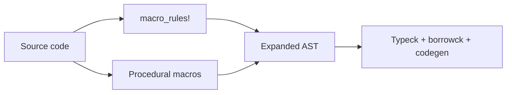

# Macros

## Learning Goals

- Distinguish **declarative** (`macro_rules!`) and **procedural** macros (derive, attribute, function-like).
- Write hygienic `macro_rules!` helpers for repetitive safe code.
- Understand expansion order, fragment specifiers, and common pitfalls.
- Use `#[derive(...)]` effectively; know when to write a custom derive (conceptually).
- Debug expansions with `cargo expand` (or equivalent).
- Prefer macros for **syntax abstraction**, not for hiding complex business logic.

## Concept Diagram



Macros run at **compile time** and produce Rust code. They are not functions: they manipulate syntax trees (or token streams).

## Why Macros?

| Need | Tool |
|------|------|
| Variadic helpers, DSLs | `macro_rules!` |
| Generate impls from structs | derive proc macros |
| Modify items (`#[tokio::main]`) | attribute proc macros |
| Custom literal syntax | function-like proc macros |
| Runtime repetition | plain functions / generics |

If generics + traits solve it, prefer that—better error messages and tooling.

## Declarative Macros: `macro_rules!`

### First example: `vec`-like

```rust
#[macro_export]
macro_rules! myvec {
    () => { Vec::new() };
    ($($x:expr),+ $(,)?) => {{
        let mut v = Vec::new();
        $( v.push($x); )+
        v
    }};
}

fn main() {
    let a = myvec![];
    let b = myvec![1, 2, 3];
    let c = myvec![1, 2, 3,];
    assert!(a.is_empty());
    assert_eq!(b, vec![1, 2, 3]);
    assert_eq!(c.len(), 3);
}
```

### Fragment specifiers

| Specifier | Matches |
|-----------|---------|
| `expr` | expression |
| `ident` | identifier |
| `ty` | type |
| `path` | path |
| `tt` | single token tree |
| `block` | `{ ... }` |
| `item` | item (fn, struct, …) |
| `pat` | pattern |
| `lifetime` | `'a` |
| `literal` | literal |
| `meta` | attribute meta |
| `stmt` | statement |
| `vis` | visibility |

### Repetition

- `$( ... )*` zero or more  
- `$( ... )+` one or more  
- `$( ... )?` optional  
- Separators: `$( ... ),*` etc.

### Key-value helper

```rust
macro_rules! kv {
    ($($key:expr => $val:expr),+ $(,)?) => {{
        let mut m = ::std::collections::HashMap::new();
        $( m.insert($key, $val); )+
        m
    }};
}

fn main() {
    let m = kv! {
        "a" => 1,
        "b" => 2,
    };
    assert_eq!(m["a"], 1);
}
```

Use fully qualified paths (`::std::collections::HashMap`) for **hygiene / resilience** when the caller has different imports.

### Creating a mini assert

```rust
macro_rules! assert_ok {
    ($expr:expr) => {
        match $expr {
            Ok(v) => v,
            Err(e) => panic!("expected Ok, got Err({e:?})"),
        }
    };
    ($expr:expr, $($arg:tt)*) => {
        match $expr {
            Ok(v) => v,
            Err(e) => panic!("expected Ok, got Err({e:?}): {}", format_args!($($arg)*)),
        }
    };
}

fn main() {
    let v = assert_ok!(Ok::<_, &str>(41), "should work");
    assert_eq!(v + 1, 42);
}
```

## Hygiene Basics

Declarative macros are hygienic for local variables: identifiers introduced inside the macro don’t accidentally capture caller locals in surprising ways (with some nuances for `$crate` and imported macros).

```rust
macro_rules! using_a {
    ($e:expr) => {{
        let a = 42;
        $e // caller expression does not see macro's `a` as a capture the way C macros would
    }};
}
```

Prefer `$crate::` when your macro must refer to items from the defining crate after export.

## Debugging Expansion

```bash
cargo install cargo-expand
# nightly often required for expand:
rustup toolchain install nightly
cargo +nightly expand --bin your_bin
```

Read expanded code when derive/attribute magic confuses you.

## Common Declarative Patterns

### Implement a trait for many types

```rust
trait Id {
    fn name() -> &'static str;
}

macro_rules! impl_id {
    ($($t:ty => $name:literal),+ $(,)?) => {
        $(
            impl Id for $t {
                fn name() -> &'static str { $name }
            }
        )+
    };
}

impl_id! {
    u32 => "u32",
    String => "String",
}

fn main() {
    assert_eq!(u32::name(), "u32");
}
```

### Forwarding with `tt` muncher (advanced lite)

Token-tree munchers parse custom syntax step by step. Use sparingly; complexity grows fast. Prefer proc macros for rich DSLs.

## Procedural Macros (Conceptual + Usage)

Proc macros are separate crates with `proc-macro = true`. Three kinds:

1. **Derive** — `#[derive(MyTrait)]`  
2. **Attribute** — `#[my_attr]` on items  
3. **Function-like** — `my_macro!(...)`

You will **use** them constantly:

```rust
use serde::{Deserialize, Serialize};

#[derive(Debug, Clone, Serialize, Deserialize)]
struct User {
    id: u64,
    email: String,
}

#[tokio::main] // attribute macro
async fn main() {
    let u = User {
        id: 1,
        email: "a@b.co".into(),
    };
    println!("{u:?}");
}
```

```toml
serde = { version = "1", features = ["derive"] }
tokio = { version = "1", features = ["macros", "rt-multi-thread"] }
```

### Minimal custom derive shape (reference)

```rust
// In a proc-macro crate (illustration only — not expanded fully here):
// #[proc_macro_derive(MyDebug)]
// pub fn my_debug(input: TokenStream) -> TokenStream {
//     // parse with syn, generate with quote
// }
```

Building production proc macros needs `syn`, `quote`, `proc-macro2`, good error spans, and thorough tests (`trybuild`). For most application code, **compose existing derives**.

## Macros vs Functions vs Generics

```rust
// Function: runtime, typed, great IDE support
fn max_i32(a: i32, b: i32) -> i32 {
    if a > b { a } else { b }
}

// Generic: still functions, monomorphized
fn max_gen<T: PartialOrd>(a: T, b: T) -> T {
    if a > b { a } else { b }
}

// Macro: can accept varying syntax forms, but worse errors
macro_rules! maxm {
    ($a:expr, $b:expr) => {
        if $a > $b { $a } else { $b }
    };
}
```

Prefer `max_gen` unless you need syntax that functions cannot express.

## Logging / Instrumentation Pattern

```rust
macro_rules! timed {
    ($label:expr, $body:block) => {{
        let start = ::std::time::Instant::now();
        let out = $body;
        eprintln!("[{}] took {:?}", $label, start.elapsed());
        out
    }};
}

fn main() {
    let sum = timed!("sum", {
        (0..10_000).sum::<u64>()
    });
    println!("{sum}");
}
```

In services, prefer `tracing::instrument` over hand-rolled macros once you adopt tracing.

## Avoid Macro Pitfalls

1. **Multiple evaluation** of `$expr` used twice → unexpected side effects.  
2. **Unintended move** if expressions are not careful with ownership.  
3. **Inscrutable errors** deep inside expansion.  
4. **Over-abstracting** team-specific mini-languages.  
5. **Export/import confusion** — `#[macro_export]` places macros at crate root.

```rust
macro_rules! bad_twice {
    ($e:expr) => {
        $e + $e // if $e is `expensive()`, it runs twice
    };
}
```

Bind once:

```rust
macro_rules! good_twice {
    ($e:expr) => {{
        let tmp = $e;
        tmp + tmp
    }};
}
```

## Built-in Macros Worth Mastery

```rust
fn main() {
    println!("hello {}", 1);
    eprintln!("stderr");
    dbg!(1 + 2);

    let v = vec![1, 2, 3];
    assert_eq!(v.len(), 3);
    assert!(true);
    debug_assert!(true); // stripped in release unless configured

    let name = stringify!(HelloWorld);
    let bytes = include_bytes!("../../Cargo.toml"); // path relative to file — adjust
    let _ = (name, bytes.len());

    todo!("implement later"); // panic with message; useful while scaffolding
}
```

Note: `include_bytes!` path must exist when you compile—adjust or remove in samples you don’t wire to a real file.

Safer demo:

```rust
fn main() {
    let ty = std::any::type_name::<Vec<u8>>();
    println!("{ty}");
    let s = concat!("foo", "bar");
    assert_eq!(s, "foobar");
    let n = line!();
    println!("line {n}");
}
```

## Feature-Gate Style Helpers

```rust
macro_rules! cfg_log {
    ($($arg:tt)*) => {
        #[cfg(feature = "verbose")]
        {
            eprintln!($($arg)*);
        }
    };
}
```

Often clearer as normal `#[cfg]` modules.

## Macro-Aware Crate Design

- Keep macros in `src/macros.rs` and `#[macro_use] mod macros;` **or** use modern `use crate::my_macro`.
- Document macro syntax with examples in rustdoc.
- Provide non-macro functions for the simple cases.
- Version carefully: macro expansions can break callers subtly.

## Worked Example: Builder-ish field init (declarative)

```rust
struct Config {
    host: String,
    port: u16,
    tls: bool,
}

macro_rules! config {
    ( $($field:ident : $val:expr),+ $(,)? ) => {{
        // defaults
        let mut host = String::from("127.0.0.1");
        let mut port = 8080u16;
        let mut tls = false;
        $(
            // match field names via nested macro or manual assignments:
            // simple approach: separate macros per field pattern
            paste_assign!(host, port, tls, $field, $val);
        )+
        Config { host, port, tls }
    }};
}

// Without paste crate, expand fields manually with match-like rules:
macro_rules! config2 {
    () => {
        Config {
            host: "127.0.0.1".into(),
            port: 8080,
            tls: false,
        }
    };
    (host: $h:expr $(, $($rest:tt)*)?) => {{
        let mut c = config2!($($($rest)*)?);
        c.host = $h.into();
        c
    }};
    (port: $p:expr $(, $($rest:tt)*)?) => {{
        let mut c = config2!($($($rest)*)?);
        c.port = $p;
        c
    }};
    (tls: $t:expr $(, $($rest:tt)*)?) => {{
        let mut c = config2!($($($rest)*)?);
        c.tls = $t;
        c
    }};
}

fn main() {
    let c = config2!(port: 3000, tls: true);
    assert_eq!(c.port, 3000);
    assert!(c.tls);
}
```

This shows power **and** complexity—typed builders with methods are often clearer for public APIs.

## Hands-On Practice

1. Write `myvec!` and tests for empty, one, many, trailing comma.
2. Write `kv!` inserting into `BTreeMap` with fully qualified paths.
3. Create `assert_ok!` and use it in tests.
4. Implement `impl_id!` for three types.
5. Install/use `cargo expand` on a small crate using `#[derive(Debug)]` and read the output.
6. Refactor a macro that evaluates `$e` twice into a single binding version.
7. Replace a home-grown log macro with `tracing::info!` in a tiny example.
8. `cargo fmt`, `clippy`, `test`.

## Common Mistakes

- Using macros where a generic function suffices.
- Double-evaluating expressions with side effects.
- Exporting macros without docs/examples.
- Writing unreadable recursive munchers.
- Expecting great IDE refactoring inside macro calls.
- Ignoring that proc macros increase compile times.

## Review Questions

1. When should you prefer generics over `macro_rules!`?
2. What does `$(,)?` allow in a macro matcher?
3. Why bind `$e` to a local before using it twice?
4. Name the three kinds of procedural macros.
5. How do you inspect expanded code?

## Chapter Summary

Macros generate code at compile time. Start with **`macro_rules!`** for small DSLs and repetition; lean on **derive/attribute** macros from the ecosystem for serialization, async entrypoints, and errors. Keep expansions simple, hygienic, and documented—and drop to functions when syntax sugar is not needed. Next: **FFI with C**, where macros sometimes help generate bindings—but safety discipline matters more.
