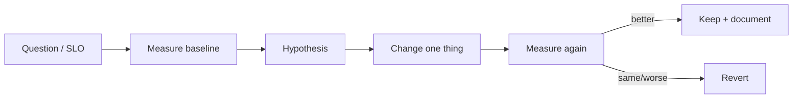

# Performance Basics

## Learning Goals

- Measure before optimizing: latency percentiles, throughput, allocations.
- Use `Criterion` (or equiv.) for microbenchmarks with statistical rigor.
- Read basic profiles (CPU, alloc) and identify hot paths.
- Apply high-ROI Rust techniques: avoid needless clones, choose collections wisely, reserve capacity, batch I/O.
- Know async-specific costs: tasks, channels, wakeups—not just CPU cycles.
- Avoid performance theater: micro-opts that harm clarity without wins.

## Concept Diagram



Performance work is a **scientific loop**. Without numbers, you are guessing.

## What to Measure

| Metric | Meaning | Tools |
|--------|---------|-------|
| Throughput | ops/sec, bytes/sec | load tests, custom counters |
| Latency p50/p95/p99 | tail experience | histograms, tracing |
| CPU time | hot functions | `perf`, Instruments, `samply` |
| Allocations | count / bytes | dhat, heaptrack, tracy, alloc instrumentation |
| Error rate | under load | metrics backends |

For APIs, **p99 latency under target RPS** usually beats average latency.

## Quick Timing (not a benchmark)

```rust
use std::time::Instant;

fn work(n: u64) -> u64 {
    (0..n).map(|x| x.wrapping_mul(0x9e3779b97f4a7c15)).sum()
}

fn main() {
    let start = Instant::now();
    let out = work(10_000_000);
    eprintln!("took {:?} checksum={out}", start.elapsed());
}
```

Good for rough signals; bad for claiming 3% wins (noise, turbo, cold start).

## Criterion Microbenchmarks

```toml
# Cargo.toml
[dev-dependencies]
criterion = { version = "0.5", features = ["html_reports"] }

[[bench]]
name = "sum"
harness = false
```

```rust
// benches/sum.rs
use criterion::{black_box, criterion_group, criterion_main, Criterion};

fn sum_slice(v: &[u64]) -> u64 {
    v.iter().sum()
}

fn bench_sum(c: &mut Criterion) {
    let data: Vec<u64> = (0..10_000).collect();
    c.bench_function("sum_10k", |b| {
        b.iter(|| sum_slice(black_box(&data)))
    });
}

criterion_group!(benches, bench_sum);
criterion_main!(benches);
```

```bash
cargo bench
# open target/criterion/report/index.html
```

`black_box` stops the compiler from deleting work. Use realistic inputs (size, distribution).

## Release Builds Matter

```bash
cargo run --release
cargo bench   # already optimized
```

Debug builds insert checks and disable many opts—never compare debug timings to production.

```toml
# Cargo.toml optional tuning for release
[profile.release]
lto = "thin"
codegen-units = 1
# panic = "abort"  # smaller, no unwind tables — trade carefully
```

## Allocation Hygiene

### Reserve capacity

```rust
fn collect_lines(n: usize) -> Vec<String> {
    let mut v = Vec::with_capacity(n);
    for i in 0..n {
        v.push(format!("line-{i}"));
    }
    v
}
```

### Avoid needless clones

```rust
fn process(items: &[String]) -> usize {
    items.iter().map(|s| s.len()).sum()
}

// Prefer &str / &[T] parameters over String / Vec when you only read.
```

### Reuse buffers

```rust
fn read_loop(mut reread: impl FnMut(&mut Vec<u8>) -> std::io::Result<usize>) -> std::io::Result<()> {
    let mut buf = Vec::with_capacity(8192);
    loop {
        buf.clear();
        let n = reread(&mut buf)?;
        if n == 0 {
            break;
        }
        // parse buf
    }
    Ok(())
}
```

### Prefer iterators over temporary Vecs

```rust
fn sum_even(xs: &[i32]) -> i32 {
    xs.iter().copied().filter(|x| x % 2 == 0).sum()
}
```

## Data Structure Choices

| Need | Prefer |
|------|--------|
| Dense indexed data | `Vec` |
| Stack small arrays | array / `ArrayVec` / `SmallVec` |
| Unique keys, fast lookup | `HashMap` |
| Sorted keys | `BTreeMap` |
| Dedup many short strings | `string_cache` / interning |
| Bytes protocols | `bytes::Bytes` for cheap clones of refcounted buffers |
| Concurrent counter | atomics |

```rust
use std::collections::HashMap;

fn freq(words: &[&str]) -> HashMap<String, u32> {
    let mut m = HashMap::with_capacity(words.len());
    for w in words {
        *m.entry((*w).to_string()).or_insert(0) += 1;
    }
    m
}
```

For hot maps with string keys, consider `entry` API carefully to avoid double lookup; sometimes `hashbrown` features help—measure.

## Parallelism vs Concurrency

- **CPU-bound**: `rayon` or dedicated thread pool; avoid pure async.
- **I/O-bound**: async; avoid one thread per connection.
- Hybrid: async orchestration + `spawn_blocking` / rayon for compute.

```toml
rayon = "1"
```

```rust
use rayon::prelude::*;

fn parallel_sum(v: &[u64]) -> u64 {
    v.par_iter().sum()
}

fn main() {
    let v: Vec<u64> = (0..1_000_000).collect();
    println!("{}", parallel_sum(&v));
}
```

## Async Performance Footguns

1. **Too many tasks** — each task has overhead; batch work.  
2. **Unbounded channels** — memory growth, latency spikes.  
3. **`Mutex` over await** — serializes the world.  
4. **Blocking on workers** — kills throughput for everyone.  
5. **Per-request memory alloc storms** — reuse buffers / arenas carefully.  
6. **Logging too much at info** on the hot path.

```rust
// Prefer
// stream::iter(ids).for_each_concurrent(32, ...)
// over spawn-all-at-once for 100k jobs.
```

## Profiling Sketch

### Linux `perf` (when available)

```bash
cargo build --release
perf record -g ./target/release/your_bin
perf report
```

### `samply` (cross-platform friendly option)

```bash
cargo install samply
samply record ./target/release/your_bin
```

Interpret flamegraphs: wide plateaus = hot functions. Optimize those first.

## Compiler-Friendly Code

- Prefer monomorphized generics on hot paths over `dyn Trait` when profiling shows dispatch cost (often small—measure).
- Avoid megamorphic `Box<dyn ...>` in nano-second loops.
- Keep hot loops simple for LLVM auto-vectorization.
- Use `get_unchecked` **only** after bounds proofs + benchmarks + safety review.

```rust
pub fn sum_checked(v: &[u32]) -> u32 {
    let mut s = 0u32;
    for x in v {
        s = s.wrapping_add(*x);
    }
    s
}
```

## I/O Performance Basics

- Batch writes; use `BufWriter` / `BufReader`.
- `write_all` in a loop without buffering can be syscall-heavy.
- For network, understand Nagle (`TCP_NODELAY`), buffer sizes, and framing copies.
- `mmap` can help large read-mostly files—also introduces complexity.

```rust
use std::fs::File;
use std::io::{BufWriter, Write};

fn write_lines(path: &str, lines: &[String]) -> std::io::Result<()> {
    let f = File::create(path)?;
    let mut w = BufWriter::new(f);
    for line in lines {
        w.write_all(line.as_bytes())?;
        w.write_all(b"\n")?;
    }
    w.flush()
}
```

## Memory Layout

- Struct field order can add padding; put larger fields first if you care about size.
- `Vec<Struct>` is cache-friendlier than `Vec<Box<Struct>>` for tight scans.
- Structure-of-arrays vs array-of-structures depends on access patterns.

```rust
struct BadPad {
    a: u8,
    b: u64,
    c: u8,
}

struct Better {
    b: u64,
    a: u8,
    c: u8,
}

fn main() {
    println!("BadPad {}", std::mem::size_of::<BadPad>());
    println!("Better {}", std::mem::size_of::<Better>());
}
```

## Establishing an SLO Mindset

Example service SLO: p95 < 100ms at 2k RPS, error rate < 0.1%.

Optimization backlog ordered by impact:

1. Fix N+1 I/O / blocking on async threads  
2. Add caching for hottest reads  
3. Bound concurrency / queueing  
4. Reduce allocations in encode/decode  
5. Micro-optimize CPU kernels  

## Before/After Template

```text
Change: pre-reserve Vec capacity in parser
Benchmark: parse_10kb_payload
Before: 12.4 µs/iter (±0.3)
After:  10.1 µs/iter (±0.2)
Allocs: 6 → 2 (dhat / approx)
Decision: keep; clarity OK
```

Document in commit messages so future you doesn’t “re-optimize” blindly.

## Hands-On Practice

1. Write a Criterion bench for two string-building strategies: `format!` loop vs `String::with_capacity` + `push_str`.
2. Build `--release` and compare to debug timing of the same function (order-of-magnitude check).
3. Create a program that processes 1M integers; implement sequential and `rayon` parallel sums; compare.
4. Instrument an async job runner: unbounded spawn vs semaphore=32; watch memory under load.
5. Add `BufWriter` to a file writer and count syscalls roughly (or just measure wall time for large writes).
6. Generate a flamegraph (samply/perf) for a CPU-heavy function; identify top frame.
7. Fix one clone on a hot path and re-bench.
8. Write a short performance note (markdown in your notes, not necessarily the repo).

## Common Mistakes

- Optimizing debug builds.
- Claiming wins without `black_box` / statistics.
- Micro-optimizing cold code.
- Ignoring tail latency (p99).
- Premature `unsafe` for speed.
- Using async for pure CPU kernels.
- Over-synchronizing with coarse locks.
- Logging at `trace` in production hot paths by accident.

## Review Questions

1. Why are p95/p99 more useful than mean latency for APIs?
2. What does Criterion’s warmup phase reduce?
3. Name three high-ROI allocation reductions.
4. When is rayon a better fit than Tokio tasks?
5. Why buffer disk writes?

## Chapter Summary

Performance engineering in Rust is **measure → change → measure**, with release builds, honest benchmarks, and attention to allocations and I/O. Prefer architectural fixes (batching, backpressure, right parallelism model) before micro-opts. Next: **Pin and Futures**—understanding the machinery under async so you can debug and design advanced APIs confidently.
