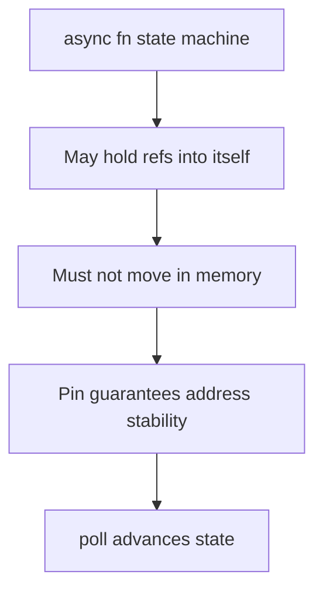

# Pin and Futures

## Learning Goals

- Explain why **pinning** exists: some futures are self-referential and must not move.
- Read the `Future` trait signature involving `Pin<&mut Self>`.
- Use `Pin<Box<dyn Future...>>` / `BoxFuture` for type erasure.
- Know when ordinary code can ignore Pin (`Unpin` types).
- Avoid writing unsafe `Pin` projections unless you deeply need them.
- Connect Pin to async/await state machines generated by the compiler.

## Concept Diagram



Most application developers rarely construct `Pin` manually—but understanding it unlocks async trait objects, custom futures, and many library signatures.

## The `Future` Trait (conceptual)

```rust
use std::future::Future;
use std::pin::Pin;
use std::task::{Context, Poll};

// Simplified mental model of std::future::Future:
// pub trait Future {
//     type Output;
//     fn poll(self: Pin<&mut Self>, cx: &mut Context<'_>) -> Poll<Self::Output>;
// }
```

Key points:

- `poll` is called by the executor when the task might make progress.
- Return `Poll::Pending` and arrange a **wake** later via `Context`’s `Waker`.
- Return `Poll::Ready(output)` when done.
- `self: Pin<&mut Self>` means the future value won’t be moved after pinning (until dropped).

## Why Self-Reference Breaks Moves

Imagine a generated state machine (illustrative):

```text
struct FooFuture {
    data: String,
    // borrow points into `data` while awaiting
    // ready_ref: *const u8,  // interior pointer
    state: u8,
}
```

If the future is moved to a new stack address, interior pointers dangle → UB. Pinning forbids moving the pinned memory.

`async`/`await` relies on this for correctness when the compiler generates self-references across await points.

## `Unpin`: the common case

Most types implement `Unpin`: they can be moved even after being pinned (pinning is “trivial”). Ordinary structs, `String`, `Vec`, etc. are `Unpin`.

Generated futures from `async` blocks are often `!Unpin` because of potential self-references.

```rust
fn assert_unpin<T: Unpin>(_: &T) {}

fn main() {
    assert_unpin(&String::from("hi"));
    // async {} futures may not be Unpin — cannot always assert_unpin them.
}
```

If `T: Unpin`, `Pin<&mut T>` behaves almost like `&mut T` for practical purposes.

## Creating and Pinning Futures

### Stack pin with `pin!` (modern ergonomic path)

```rust
use std::future::Future;
use std::pin::pin;

async fn answer() -> u32 {
    42
}

#[tokio::main]
async fn main() {
    let mut fut = pin!(answer());
    // fut is Pin<&mut impl Future>
    let v = fut.as_mut().await; // await works on pinned futures
    // simpler: just answer().await in real code
    println!("{v}");
}
```

Day-to-day you simply write `.await`; the compiler handles pinning for local awaits.

### Heap pin with `Box::pin`

```rust
use std::future::Future;
use std::pin::Pin;

type BoxFuture<T> = Pin<Box<dyn Future<Output = T> + Send>>;

fn make(n: u32) -> BoxFuture<u32> {
    Box::pin(async move { n + 1 })
}

#[tokio::main]
async fn main() {
    let v = make(41).await;
    assert_eq!(v, 42);
}
```

Use boxed futures when you need:

- **dyn Trait** with async behavior  
- recursive async functions  
- heterogeneous collections of futures  

Cost: heap allocation + virtual dispatch.

## Polling Manually (teaching only)

```rust
use std::future::Future;
use std::pin::Pin;
use std::task::{Context, Poll, Waker, RawWaker, RawWakerVTable};

fn dummy_waker() -> Waker {
    fn clone(_: *const ()) -> RawWaker {
        dummy_raw()
    }
    fn wake(_: *const ()) {}
    fn wake_by_ref(_: *const ()) {}
    fn drop(_: *const ()) {}
    fn dummy_raw() -> RawWaker {
        RawWaker::new(std::ptr::null(), &VTABLE)
    }
    static VTABLE: RawWakerVTable = RawWakerVTable::new(clone, wake, wake_by_ref, drop);
    unsafe { Waker::from_raw(dummy_raw()) }
}

fn main() {
    let mut fut = Box::pin(async { 7u32 });
    let waker = dummy_waker();
    let mut cx = Context::from_waker(&waker);
    match fut.as_mut().poll(&mut cx) {
        Poll::Ready(v) => println!("ready {v}"),
        Poll::Pending => println!("pending"),
    }
}
```

Real executors provide meaningful wakers that re-schedule tasks on I/O readiness. Don’t ship dummy wakers.

## `Stream` / async iteration (related)

Streams are to series of values as Futures are to one value. Many streams also use pinning when polling.

```rust
use futures::StreamExt;

#[tokio::main]
async fn main() {
    let mut s = futures::stream::iter(vec![1, 2, 3]);
    while let Some(x) = s.next().await {
        println!("{x}");
    }
}
```

## Pin Projections (advanced awareness)

When a struct contains a `!Unpin` field, projecting `Pin<&mut Struct>` to `Pin<&mut Field>` safely needs care (`pin-project` crate automates this).

```toml
# conceptual dependency
# pin-project = "1"
```

```rust
// With pin-project (illustrative API):
// #[pin_project]
// struct Wrapper<F> {
//     #[pin]
//     inner: F,
// }
```

**Do not** write `unsafe` pin projections by hand until you have read the Pin module docs carefully and have tests under Miri.

## Async Methods and `dyn`

Static dispatch (generics) is easiest:

```rust
async fn run<F, Fut>(f: F) -> Fut::Output
where
    F: FnOnce() -> Fut,
    Fut: std::future::Future,
{
    f().await
}
```

Dynamic dispatch needs boxed futures:

```rust
use std::future::Future;
use std::pin::Pin;

trait Handler: Send + Sync {
    fn handle(&self) -> Pin<Box<dyn Future<Output = String> + Send + '_>>;
}

struct H;

impl Handler for H {
    fn handle(&self) -> Pin<Box<dyn Future<Output = String> + Send + '_>> {
        Box::pin(async { "ok".into() })
    }
}

#[tokio::main]
async fn main() {
    let h: &dyn Handler = &H;
    println!("{}", h.handle().await);
}
```

Modern Rust also has RPITIT / async fn in traits for static dispatch; dyn remains the tricky case.

## Interaction with Cancellation

Dropping a pinned future before `Ready` cancels it. Drop runs on the state machine; partial progress must be safe.

```rust
struct Guard;

impl Drop for Guard {
    fn drop(&mut self) {
        println!("future dropped / cancelled");
    }
}

async fn work() {
    let _g = Guard;
    tokio::time::sleep(std::time::Duration::from_secs(10)).await;
}

#[tokio::main]
async fn main() {
    tokio::select! {
        _ = work() => {}
        _ = tokio::time::sleep(std::time::Duration::from_millis(10)) => {
            println!("timeout path");
        }
    }
}
```

## Common Library Type Aliases

```rust
use futures::future::BoxFuture;
// type BoxFuture<'a, T> = Pin<Box<dyn Future<Output = T> + Send + 'a>>;

fn task<'a>(x: &'a str) -> BoxFuture<'a, usize> {
    Box::pin(async move { x.len() })
}
```

`Send` bounds matter on multi-thread runtimes; omit `Send` only for single-thread / `LocalSet` designs.

## When You Can Ignore Pin

You can ignore pin details if you:

- Only write `async fn` and `.await`
- Don’t implement `Future` manually
- Don’t need `dyn` async traits
- Don’t build self-referential structs

Learn Pin when you:

- Read Tokio / hyper / tower internals
- Design library APIs returning futures
- Debug `!Unpin` + `Mutex` guard issues across await
- Write custom combinators

## Safety Notes

Unsafe operations related to Pin include:

- `Pin::new_unchecked`
- Getting `&mut T` out of `Pin<&mut T>` when `T: !Unpin`
- Transmuting pinned pointers

Violating pin guarantees can reintroduce the exact dangling self-ref UB Pin was invented to prevent.

## Hands-On Practice

1. Write `type BoxFuture<T> = Pin<Box<dyn Future<Output = T> + Send>>` and a function returning one.
2. Store two different async computations as `Vec<BoxFuture<u32>>` and await them in order.
3. Implement a small `Handler` trait using boxed futures; call via `dyn Handler`.
4. Use `tokio::select!` to cancel a sleeping future; observe `Drop`.
5. Read std docs for `Pin` and list three guarantees in your own words.
6. Optional: add `pin-project` to a toy wrapper and project an inner future (follow crate docs).
7. Try `cargo miri` on any unsafe pin experiments.
8. `cargo fmt`, `clippy`, tests.

## Common Mistakes

- Calling `Pin::new` on `!Unpin` types incorrectly.
- Assuming all futures are `Send` + `Unpin`.
- Manual `poll` without real wakers in production code.
- Using `std::mem::swap` on pinned data.
- Overusing `Box::pin` on hot paths without need (allocation tax).
- Fighting the compiler with unsafe instead of redesigning ownership.

## Review Questions

1. Why does `Future::poll` take `Pin<&mut Self>`?
2. What does `Unpin` mean for everyday types?
3. When is `Box::pin` the right tool?
4. How does cancellation relate to dropping futures?
5. Why are pin projections subtle enough to need a crate?

## Chapter Summary

**Pin** makes async state machines sound by preventing moves of potentially self-referential futures. Day-to-day Rust hides this behind `.await`, but library APIs, dyn async traits, and custom futures expose `Pin` and `BoxFuture`. Treat unsafe pin manipulations as expert territory. Next: an **advanced project** that pulls async, Tokio, smart pointers, and disciplined structure into one exercise.
