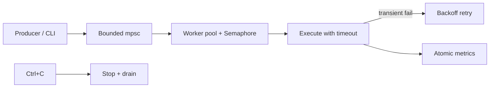

# Advanced Project

## Learning Goals

- Integrate async fundamentals, Tokio primitives, architecture, and smart pointers in one mini-system.
- Build a **bounded concurrent job worker** with timeouts, retries, metrics counters, and graceful shutdown.
- Practice structured concurrency with `JoinSet` / channels / `Semaphore`.
- Write tests with `#[tokio::test]` and keep unsafe/macros out unless clearly justified.
- Leave with a portfolio-quality crate layout you can extend toward HTTP or systems services.

## Project: `jobrun` — Concurrent Job Runner

You will build a library + binary that:

1. Accepts jobs with an ID and a simulated “duration + failure mode”.
2. Runs at most **N** jobs concurrently.
3. Applies a **per-job timeout**.
4. Retries **transient** failures with backoff (max attempts).
5. Tracks metrics: started, succeeded, failed, timed_out, retried.
6. Shuts down on Ctrl+C: stop accepting, drain in-flight with a deadline.

This is the skeleton of real workers (email senders, thumbnailers, webhook deliverers).

## Concept Diagram



## Suggested Crate Layout

```text
jobrun/
  Cargo.toml
  src/
    main.rs       # CLI wiring
    lib.rs        # re-exports
    job.rs        # Job type + error kinds
    runner.rs     # pool, retries, timeouts
    metrics.rs    # atomics
```

```toml
# Cargo.toml
[package]
name = "jobrun"
version = "0.1.0"
edition = "2024"

[dependencies]
tokio = { version = "1", features = ["full"] }
thiserror = "2"
tracing = "0.1"
tracing-subscriber = { version = "0.3", features = ["env-filter"] }
rand = "0.8"

[dev-dependencies]
tokio = { version = "1", features = ["full", "test-util"] }
```

## Step 1 — Domain types

```rust
// src/job.rs
use std::time::Duration;

#[derive(Debug, Clone)]
pub struct Job {
    pub id: String,
    pub work_ms: u64,
    /// If true, fail once with a transient error before succeeding.
    pub fail_transient_once: bool,
    /// If true, always fail with a permanent error.
    pub permanent_fail: bool,
}

#[derive(Debug, thiserror::Error)]
pub enum JobError {
    #[error("transient failure for job {id}")]
    Transient { id: String },
    #[error("permanent failure for job {id}")]
    Permanent { id: String },
    #[error("timeout for job {id}")]
    Timeout { id: String },
    #[error("cancelled")]
    Cancelled,
}

impl Job {
    pub fn demo(id: impl Into<String>, work_ms: u64) -> Self {
        Self {
            id: id.into(),
            work_ms,
            fail_transient_once: false,
            permanent_fail: false,
        }
    }

    pub fn duration(&self) -> Duration {
        Duration::from_millis(self.work_ms)
    }
}
```

## Step 2 — Metrics

```rust
// src/metrics.rs
use std::sync::atomic::{AtomicU64, Ordering};
use std::sync::Arc;

#[derive(Default)]
pub struct Metrics {
    pub started: AtomicU64,
    pub succeeded: AtomicU64,
    pub failed: AtomicU64,
    pub timed_out: AtomicU64,
    pub retried: AtomicU64,
}

impl Metrics {
    pub fn snapshot(&self) -> MetricsSnapshot {
        MetricsSnapshot {
            started: self.started.load(Ordering::Relaxed),
            succeeded: self.succeeded.load(Ordering::Relaxed),
            failed: self.failed.load(Ordering::Relaxed),
            timed_out: self.timed_out.load(Ordering::Relaxed),
            retried: self.retried.load(Ordering::Relaxed),
        }
    }
}

#[derive(Debug, Clone, Copy)]
pub struct MetricsSnapshot {
    pub started: u64,
    pub succeeded: u64,
    pub failed: u64,
    pub timed_out: u64,
    pub retried: u64,
}

pub type SharedMetrics = Arc<Metrics>;
```

## Step 3 — Execute a single attempt

```rust
// src/runner.rs (part)
use crate::job::{Job, JobError};
use std::sync::atomic::AtomicBool;
use std::sync::Arc;
use tokio::time::{sleep, timeout};

async fn run_attempt(job: &Job, already_failed: &AtomicBool) -> Result<(), JobError> {
    if job.permanent_fail {
        return Err(JobError::Permanent {
            id: job.id.clone(),
        });
    }
    if job.fail_transient_once && !already_failed.swap(true, std::sync::atomic::Ordering::SeqCst) {
        // simulate partial work then transient error
        sleep(job.duration() / 3).await;
        return Err(JobError::Transient {
            id: job.id.clone(),
        });
    }
    sleep(job.duration()).await;
    Ok(())
}

pub async fn run_with_timeout(job: &Job, job_timeout: std::time::Duration) -> Result<(), JobError> {
    let flag = AtomicBool::new(false);
    match timeout(job_timeout, run_attempt(job, &flag)).await {
        Ok(r) => r,
        Err(_) => Err(JobError::Timeout {
            id: job.id.clone(),
        }),
    }
}
```

## Step 4 — Retries with backoff

```rust
// still runner.rs
use crate::metrics::SharedMetrics;
use rand::Rng;
use std::time::Duration;
use tracing::{info, warn};

pub struct RetryPolicy {
    pub max_attempts: u32,
    pub base_ms: u64,
    pub max_backoff_ms: u64,
}

impl Default for RetryPolicy {
    fn default() -> Self {
        Self {
            max_attempts: 3,
            base_ms: 20,
            max_backoff_ms: 200,
        }
    }
}

pub async fn run_job(
    job: Job,
    job_timeout: Duration,
    retry: RetryPolicy,
    metrics: SharedMetrics,
) -> Result<(), JobError> {
    metrics
        .started
        .fetch_add(1, std::sync::atomic::Ordering::Relaxed);

    let mut attempt = 0;
    loop {
        attempt += 1;
        match run_with_timeout(&job, job_timeout).await {
            Ok(()) => {
                metrics
                    .succeeded
                    .fetch_add(1, std::sync::atomic::Ordering::Relaxed);
                info!(id = %job.id, attempt, "job ok");
                return Ok(());
            }
            Err(JobError::Transient { .. }) if attempt < retry.max_attempts => {
                metrics
                    .retried
                    .fetch_add(1, std::sync::atomic::Ordering::Relaxed);
                let exp = retry.base_ms.saturating_mul(2u64.pow(attempt - 1));
                let cap = exp.min(retry.max_backoff_ms);
                let sleep_ms = rand::thread_rng().gen_range(0..=cap);
                warn!(id = %job.id, attempt, sleep_ms, "transient; backing off");
                sleep(Duration::from_millis(sleep_ms)).await;
            }
            Err(JobError::Timeout { id }) => {
                metrics
                    .timed_out
                    .fetch_add(1, std::sync::atomic::Ordering::Relaxed);
                metrics
                    .failed
                    .fetch_add(1, std::sync::atomic::Ordering::Relaxed);
                return Err(JobError::Timeout { id });
            }
            Err(e) => {
                metrics
                    .failed
                    .fetch_add(1, std::sync::atomic::Ordering::Relaxed);
                return Err(e);
            }
        }
    }
}
```

## Step 5 — Runner service with bounded concurrency

```rust
use crate::job::Job;
use crate::metrics::{Metrics, SharedMetrics};
use std::sync::Arc;
use tokio::sync::{mpsc, Semaphore};
use tokio::task::JoinSet;
use tracing::error;

pub struct RunnerConfig {
    pub concurrency: usize,
    pub queue_capacity: usize,
    pub job_timeout: std::time::Duration,
    pub retry: RetryPolicy,
}

impl Default for RunnerConfig {
    fn default() -> Self {
        Self {
            concurrency: 4,
            queue_capacity: 32,
            job_timeout: std::time::Duration::from_millis(500),
            retry: RetryPolicy::default(),
        }
    }
}

pub struct Runner {
    tx: mpsc::Sender<Job>,
    metrics: SharedMetrics,
    join: JoinSet<()>,
}

impl Runner {
    pub fn start(cfg: RunnerConfig) -> Self {
        let (tx, mut rx) = mpsc::channel::<Job>(cfg.queue_capacity);
        let metrics: SharedMetrics = Arc::new(Metrics::default());
        let sem = Arc::new(Semaphore::new(cfg.concurrency));
        let mut join = JoinSet::new();
        let metrics_worker = Arc::clone(&metrics);

        join.spawn(async move {
            let mut child_set = JoinSet::new();
            while let Some(job) = rx.recv().await {
                let permit = match sem.clone().acquire_owned().await {
                    Ok(p) => p,
                    Err(_) => break,
                };
                let metrics = Arc::clone(&metrics_worker);
                let timeout = cfg.job_timeout;
                let retry = RetryPolicy {
                    max_attempts: cfg.retry.max_attempts,
                    base_ms: cfg.retry.base_ms,
                    max_backoff_ms: cfg.retry.max_backoff_ms,
                };
                child_set.spawn(async move {
                    let _permit = permit;
                    if let Err(e) = run_job(job, timeout, retry, metrics).await {
                        error!(error = %e, "job failed");
                    }
                });
            }
            while child_set.join_next().await.is_some() {}
        });

        Self { tx, metrics, join }
    }

    pub fn metrics(&self) -> SharedMetrics {
        Arc::clone(&self.metrics)
    }

    pub async fn submit(&self, job: Job) -> Result<(), mpsc::error::TrySendError<Job>> {
        // Prefer try_send for fail-fast under overload; or send().await for backpressure wait.
        self.tx.try_send(job)
    }

    pub async fn shutdown(mut self) {
        drop(self.tx);
        while self.join.join_next().await.is_some() {}
    }
}
```

## Step 6 — Binary with graceful Ctrl+C

```rust
// src/main.rs
use jobrun::job::Job;
use jobrun::runner::{Runner, RunnerConfig};
use std::time::Duration;
use tracing_subscriber::EnvFilter;

#[tokio::main]
async fn main() {
    tracing_subscriber::fmt()
        .with_env_filter(EnvFilter::from_default_env())
        .init();

    let runner = Runner::start(RunnerConfig {
        concurrency: 4,
        queue_capacity: 64,
        job_timeout: Duration::from_millis(300),
        ..Default::default()
    });

    let producer = {
        let runner_metrics = runner.metrics();
        tokio::spawn(async move {
            // produce demo jobs — in a full design, pass sender into producer
            let _ = runner_metrics;
        })
    };

    // Simpler teaching main: submit then wait for signal or completion
    let runner2 = Runner::start(RunnerConfig::default());
    for i in 0..20 {
        let mut job = Job::demo(format!("job-{i}"), 50 + (i as u64 % 5) * 10);
        if i % 7 == 0 {
            job.fail_transient_once = true;
        }
        if i % 11 == 0 {
            job.permanent_fail = true;
        }
        if let Err(e) = runner2.submit(job).await {
            eprintln!("rejected: {e}");
        }
    }

    tokio::select! {
        _ = tokio::signal::ctrl_c() => {
            eprintln!("shutting down...");
        }
        _ = tokio::time::sleep(Duration::from_secs(3)) => {
            eprintln!("demo time elapsed");
        }
    }

    runner2.shutdown().await;
    // drop unused
    drop(runner);
    let _ = producer;
}
```

> **Integration note:** The dual `Runner::start` in the sketch is for illustration while you refactor. Your finished `main` should create **one** runner, submit jobs with a shared handle, then `shutdown`. Prefer a design where `submit` uses `Sender` clones and `shutdown` drops all senders.

### Cleaner main shape (target)

```rust
#[tokio::main]
async fn main() {
    tracing_subscriber::fmt()
        .with_env_filter(EnvFilter::from_default_env())
        .init();

    let runner = Runner::start(RunnerConfig::default());
    let metrics = runner.metrics();

    for i in 0..20u32 {
        let mut job = Job::demo(format!("job-{i}"), 40);
        if i % 7 == 0 {
            job.fail_transient_once = true;
        }
        match runner.submit(job).await {
            Ok(()) => {}
            Err(e) => eprintln!("queue full: {e}"),
        }
    }

    tokio::select! {
        _ = tokio::signal::ctrl_c() => {}
        _ = tokio::time::sleep(Duration::from_secs(2)) => {}
    }

    runner.shutdown().await;
    eprintln!("metrics: {:?}", metrics.snapshot());
}
```

You may need to adjust `submit` to take `&self` with an internal `Sender` and make `shutdown` consume the runner—match the earlier struct.

## Step 7 — Tests

```rust
// src/runner.rs or tests/integration.rs
#[cfg(test)]
mod tests {
    use super::*;
    use crate::job::Job;
    use std::time::Duration;

    #[tokio::test]
    async fn succeeds_simple_job() {
        let metrics = std::sync::Arc::new(crate::metrics::Metrics::default());
        let job = Job::demo("a", 5);
        run_job(job, Duration::from_millis(100), RetryPolicy::default(), metrics.clone())
            .await
            .unwrap();
        assert_eq!(metrics.snapshot().succeeded, 1);
    }

    #[tokio::test]
    async fn retries_transient() {
        let metrics = std::sync::Arc::new(crate::metrics::Metrics::default());
        let mut job = Job::demo("b", 5);
        job.fail_transient_once = true;
        run_job(job, Duration::from_millis(200), RetryPolicy::default(), metrics.clone())
            .await
            .unwrap();
        assert!(metrics.snapshot().retried >= 1);
        assert_eq!(metrics.snapshot().succeeded, 1);
    }

    #[tokio::test]
    async fn timeout_counts() {
        let metrics = std::sync::Arc::new(crate::metrics::Metrics::default());
        let job = Job::demo("slow", 200);
        let err = run_job(job, Duration::from_millis(20), RetryPolicy { max_attempts: 1, ..Default::default() }, metrics.clone())
            .await
            .unwrap_err();
        assert!(matches!(err, crate::job::JobError::Timeout { .. }));
        assert_eq!(metrics.snapshot().timed_out, 1);
    }
}
```

```bash
cargo test
RUST_LOG=info cargo run
```

## Stretch Goals

1. Persist failed jobs to a `failed.jsonl` dead-letter file (`tokio::fs`).
2. Add `watch` channel for dynamic concurrency limits.
3. Expose metrics as a simple `GET /metrics` with `axum` (optional dependency).
4. Replace simulated sleep with real HTTP calls via `reqwest` + timeouts.
5. Use `CancellationToken` to cancel in-flight jobs on shutdown deadline.
6. Property-test that concurrent runs never exceed `concurrency` (atomic gauge).
7. Add Criterion bench for submission overhead (optional).

## Design Review Checklist

- [ ] Queue bounded; overload behavior defined (`try_send` vs wait)
- [ ] Concurrency limited by semaphore
- [ ] Timeouts on every job attempt
- [ ] Retries only for transient errors
- [ ] Metrics cover success/fail/timeout/retry
- [ ] Shutdown drains workers
- [ ] No `unwrap` in library paths without justification
- [ ] Tracing spans include `job.id`
- [ ] Tests for success, retry, timeout
- [ ] `cargo fmt` + `clippy` clean

## Hands-On Practice

1. Scaffold the crate and get a single job to succeed under test.
2. Implement retries; prove with `fail_transient_once`.
3. Implement timeout path; prove with short timeout.
4. Wire bounded queue; flood with jobs and count rejections.
5. Add Ctrl+C shutdown; ensure process exits.
6. Log a final metrics snapshot.
7. Complete at least two stretch goals.
8. Write a 10-line README for your crate explaining how to run it.

## Common Mistakes

- Unbounded `spawn` without semaphore.
- Retrying permanent failures.
- Forgetting to drop `Sender` so workers hang forever.
- Holding a `Mutex` across the entire job execution.
- Using debug builds for “performance” conclusions.
- Swallowing task panics by ignoring `JoinHandle` results.

## Review Questions

1. How does this project implement backpressure?
2. Why separate permanent vs transient errors?
3. What happens to in-flight jobs on shutdown in your implementation?
4. Which metrics would you alert on in production?
5. How would you extend this to a multi-node queue (Kafka/SQS)?

## Chapter Summary

The advanced project consolidates **async**, **Tokio**, **architecture**, and **shared state** into a realistic worker: bounded concurrency, timeouts, retries, metrics, and shutdown. Treat it as a template for production systems—and as a bridge into Part 4, where the same discipline meets **files, processes, sockets, and Linux services**.
