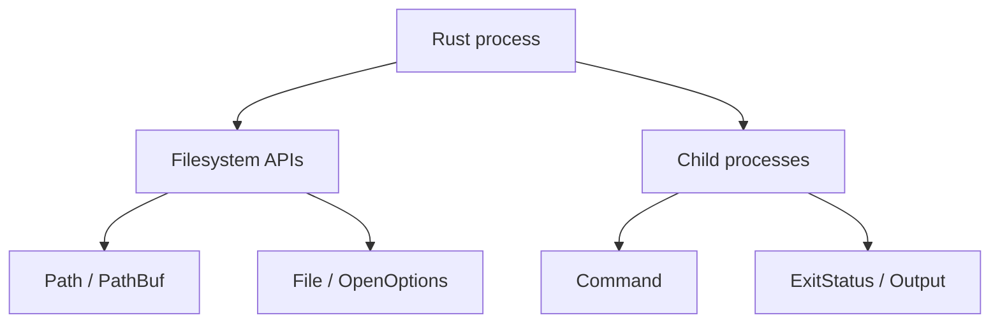

# Files and Processes

## Learning Goals

- Use Rust’s standard library for **paths**, **files**, **directories**, and **process** control.
- Write robust CLI/system tools: atomic writes, exit status checks, structured errors.
- Manage environment variables, working directory, and child stdio.
- Apply RAII so file descriptors and child handles close predictably.
- Avoid common security pitfalls with user-supplied paths.
- Target modern stable Rust (Edition 2024) for systems utilities.

## Concept Diagram



Systems programs glue the OS: read config, write state, spawn helpers, inspect results. Rust’s `std::fs` and `std::process` give portable, safe defaults with escape hatches when you need Unix specifics.

## Paths: `Path` and `PathBuf`

```rust
use std::path::{Path, PathBuf};

fn main() {
    let mut p = PathBuf::from("/var/log");
    p.push("app");
    p.set_extension("log");
    println!("{}", p.display());

    let file = Path::new("Cargo.toml");
    assert!(file.extension().and_then(|e| e.to_str()) == Some("toml"));
}
```

| Type | Role |
|------|------|
| `Path` | unsized view (`&Path`) |
| `PathBuf` | owned, mutable path |
| `OsString` / `OsStr` | OS-native, may be non-UTF-8 |

Never assume all paths are UTF-8 on Unix. Use `.display()` for printing; use `to_string_lossy()` when you must allocate a `String`.

### Joining and components

```rust
use std::path::{Component, Path};

fn is_safe_relative(user: &Path) -> bool {
    user.components().all(|c| matches!(c, Component::Normal(_)))
}

fn main() {
    assert!(is_safe_relative(Path::new("configs/app.toml")));
    assert!(!is_safe_relative(Path::new("../etc/passwd")));
    assert!(!is_safe_relative(Path::new("/etc/passwd")));
}
```

## Reading and Writing Files

### Convenience APIs

```rust
use std::fs;
use std::path::Path;

fn load_config(path: &Path) -> std::io::Result<String> {
    fs::read_to_string(path)
}

fn main() -> std::io::Result<()> {
    fs::write("sample.txt", b"hello systems\n")?;
    let s = load_config(Path::new("sample.txt"))?;
    println!("{s}");
    Ok(())
}
```

```bash
cargo run
cat sample.txt
```

### `OpenOptions` for control

```rust
use std::fs::OpenOptions;
use std::io::Write;

fn append_line(path: &str, line: &str) -> std::io::Result<()> {
    let mut f = OpenOptions::new()
        .create(true)
        .append(true)
        .open(path)?;
    writeln!(f, "{line}")?;
    Ok(())
}
```

### Buffered I/O

```rust
use std::fs::File;
use std::io::{BufRead, BufReader, BufWriter, Write};

fn line_count(path: &str) -> std::io::Result<usize> {
    let f = File::open(path)?;
    let reader = BufReader::new(f);
    Ok(reader.lines().count())
}

fn write_many(path: &str, lines: &[&str]) -> std::io::Result<()> {
    let f = File::create(path)?;
    let mut w = BufWriter::new(f);
    for line in lines {
        writeln!(w, "{line}")?;
    }
    w.flush()
}
```

## Atomic Write Pattern

Partially written configs corrupt services. Write temp → sync → rename.

```rust
use std::fs::{self, File};
use std::io::Write;
use std::path::{Path, PathBuf};

fn atomic_write(path: impl AsRef<Path>, content: &[u8]) -> std::io::Result<()> {
    let path = path.as_ref();
    let mut tmp = PathBuf::from(path);
    tmp.set_extension("tmp");

    {
        let mut f = File::create(&tmp)?;
        f.write_all(content)?;
        f.sync_all()?; // flush to disk (as far as the OS guarantees)
    }
    fs::rename(&tmp, path)?; // atomic on same filesystem
    Ok(())
}

fn main() -> std::io::Result<()> {
    atomic_write("state.json", br#"{"ok":true}"#)?;
    Ok(())
}
```

Caveats:

- `rename` atomicity is same-filesystem.
- On crash mid-write, old file remains (good).
- Consider `fsync` of parent directory for stronger durability on some systems.

## Directories

```rust
use std::fs;

fn main() -> std::io::Result<()> {
    fs::create_dir_all("data/logs")?;
    for entry in fs::read_dir("data")? {
        let entry = entry?;
        println!("{:?} {:?}", entry.path(), entry.file_type()?);
    }
    Ok(())
}
```

Walk recursively with the `walkdir` crate for production tools; std is enough for shallow trees.

## Metadata and Permissions

```rust
use std::fs;

fn main() -> std::io::Result<()> {
    let meta = fs::metadata("Cargo.toml")?;
    println!("len={} readonly={}", meta.len(), meta.permissions().readonly());
    #[cfg(unix)]
    {
        use std::os::unix::fs::PermissionsExt;
        println!("mode={:o}", meta.permissions().mode());
    }
    Ok(())
}
```

## Process Spawning with `Command`

```rust
use std::process::Command;

fn main() {
    let status = Command::new("echo")
        .arg("hello")
        .status()
        .expect("failed to spawn");
    assert!(status.success());
}
```

### Capture output

```rust
use std::process::Command;

fn run_checked(bin: &str, args: &[&str]) -> std::io::Result<String> {
    let out = Command::new(bin).args(args).output()?;
    if !out.status.success() {
        let stderr = String::from_utf8_lossy(&out.stderr);
        return Err(std::io::Error::other(format!(
            "{bin} failed: {} ({stderr})",
            out.status
        )));
    }
    Ok(String::from_utf8_lossy(&out.stdout).into_owned())
}

fn main() -> std::io::Result<()> {
    let s = run_checked("echo", &["systems"])?;
    println!("stdout={s}");
    Ok(())
}
```

```bash
cargo run
```

Always inspect **exit status** before trusting stdout.

### Streaming stdio

```rust
use std::io::{BufRead, BufReader};
use std::process::{Command, Stdio};

fn main() -> std::io::Result<()> {
    let mut child = Command::new("ping")
        .arg("-c")
        .arg("2")
        .arg("127.0.0.1")
        .stdout(Stdio::piped())
        .spawn()?;

    let stdout = child.stdout.take().expect("piped");
    for line in BufReader::new(stdout).lines() {
        println!("> {}", line?);
    }
    let status = child.wait()?;
    println!("exit={status}");
    Ok(())
}
```

Platform note: `ping` flags differ on macOS vs Linux; adjust for your OS.

### Environment and cwd

```rust
use std::process::Command;

fn main() {
    let out = Command::new("env")
        .env("APP_ENV", "dev")
        .env_remove("HTTP_PROXY")
        .current_dir("/tmp")
        .output()
        .expect("spawn");
    println!("{}", String::from_utf8_lossy(&out.stdout));
}
```

## Exit Codes for Your Own CLI

```rust
use std::process::ExitCode;

fn real_main() -> Result<(), String> {
    Err("config missing".into())
}

fn main() -> ExitCode {
    match real_main() {
        Ok(()) => ExitCode::SUCCESS,
        Err(e) => {
            eprintln!("error: {e}");
            ExitCode::from(2)
        }
    }
}
```

Conventions (Unix-ish):

- `0` success  
- `1` general error  
- `2` misuse / bad args (common for CLIs)  
- `130` interrupted (128+SIGINT) when you choose to mirror shell norms  

## Error Design for System Tools

```rust
use std::path::PathBuf;

#[derive(Debug)]
enum ToolError {
    Io { path: PathBuf, source: std::io::Error },
    BadArgs(String),
}

fn read_required(path: PathBuf) -> Result<String, ToolError> {
    std::fs::read_to_string(&path).map_err(|source| ToolError::Io { path, source })
}
```

Or use `anyhow` for binaries and `thiserror` for libraries—common mid-2026 practice.

## Path Traversal Hardening

When a user supplies a name that you join under a root:

```rust
use std::path::{Component, Path, PathBuf};

fn resolve_under(root: &Path, user: &str) -> Option<PathBuf> {
    let user = Path::new(user);
    if user.is_absolute() {
        return None;
    }
    if user
        .components()
        .any(|c| matches!(c, Component::ParentDir | Component::RootDir | Component::Prefix(_)))
    {
        return None;
    }
    let joined = root.join(user);
    let root = root.canonicalize().ok()?;
    let joined = joined.canonicalize().ok()?; // fails if missing — use careful variants for create
    joined.starts_with(&root).then_some(joined)
}
```

`canonicalize` requires the path to exist; for create flows, validate components then create under root carefully. Symlinks can still surprise you—know your threat model.

## Temporary Files

```rust
// Prefer the `tempfile` crate in real tools:
// let tmp = tempfile::NamedTempFile::new()?;
// writeln!(tmp, "data")?;
// tmp.persist("/var/app/state")?;

use std::env;
use std::fs;
use std::path::PathBuf;

fn scratch_path(name: &str) -> PathBuf {
    let mut p = env::temp_dir();
    p.push(name);
    p
}

fn main() -> std::io::Result<()> {
    let p = scratch_path("rust-systems-demo.txt");
    fs::write(&p, b"tmp")?;
    println!("wrote {}", p.display());
    fs::remove_file(&p)?;
    Ok(())
}
```

## Async Note

In Tokio services, prefer `tokio::fs` or `spawn_blocking` around `std::fs` so you don’t block the async runtime (see Advanced part). This chapter focuses on classic systems CLIs where blocking I/O is normal.

## Mini Tools to Build

### `cat-lite`

```rust
use std::env;
use std::fs;
use std::io::{self, Write};
use std::process::ExitCode;

fn main() -> ExitCode {
    let mut args = env::args().skip(1);
    let Some(path) = args.next() else {
        eprintln!("usage: cat-lite <file>");
        return ExitCode::from(2);
    };
    match fs::read(&path) {
        Ok(bytes) => {
            let _ = io::stdout().write_all(&bytes);
            ExitCode::SUCCESS
        }
        Err(e) => {
            eprintln!("cat-lite: {path}: {e}");
            ExitCode::from(1)
        }
    }
}
```

### `run-and-log`

```rust
use std::fs::OpenOptions;
use std::io::Write;
use std::process::{Command, ExitCode, Stdio};

fn main() -> ExitCode {
    let mut args = std::env::args().skip(1);
    let Some(bin) = args.next() else {
        eprintln!("usage: run-and-log <cmd> [args...]");
        return ExitCode::from(2);
    };
    let rest: Vec<String> = args.collect();
    let out = Command::new(&bin)
        .args(&rest)
        .stdout(Stdio::piped())
        .stderr(Stdio::piped())
        .output();

    match out {
        Ok(out) => {
            let mut log = OpenOptions::new()
                .create(true)
                .append(true)
                .open("run.log")
                .expect("log");
            let _ = writeln!(log, "cmd={bin:?} args={rest:?} status={}", out.status);
            let _ = log.write_all(&out.stdout);
            let _ = log.write_all(&out.stderr);
            if out.status.success() {
                ExitCode::SUCCESS
            } else {
                ExitCode::from(1)
            }
        }
        Err(e) => {
            eprintln!("spawn failed: {e}");
            ExitCode::from(1)
        }
    }
}
```

## Hands-On Practice

1. Implement `cat-lite` and compare to system `cat` on a UTF-8 file.
2. Implement `atomic_write` and crash-test by killing the process mid-write (optional; at least reason about failure modes).
3. Spawn `rustc --version` (or `echo`) and parse stdout; fail if status non-zero.
4. List a directory; print only files (not dirs).
5. Harden a “read file under `./data`” API against `../` paths; write tests.
6. Append lines to a log with `OpenOptions::append`.
7. Return distinct exit codes for bad args vs I/O errors.
8. `cargo fmt`, `clippy`, `test`.

## Common Mistakes

- Ignoring `ExitStatus` and parsing empty stdout as success.
- Partial writes to critical state files.
- Assuming path UTF-8.
- Blocking async workers with heavy `std::fs` (in async apps).
- Trusting user paths without confinement.
- Leaking zombies by not `wait`ing children (less common if you use `output()` / `status()`).
- Logging secrets from child env.

## Review Questions

1. Why is temp+rename preferred for config updates?
2. What does `output()` give you that `status()` does not?
3. How do you print a non-UTF-8 path safely?
4. Why check `success()` before trusting stdout?
5. What is a path traversal attack in a file-serving CLI?

## Chapter Summary

Files and processes are the backbone of systems tooling: **paths**, **safe I/O**, **atomic state updates**, and **checked child execution**. Combine RAII, clear exit codes, and path hygiene for utilities that behave well in pipelines and production hosts. Next: **Unix CLI streams**—stdin/stdout discipline, filters, and exit-code culture.
