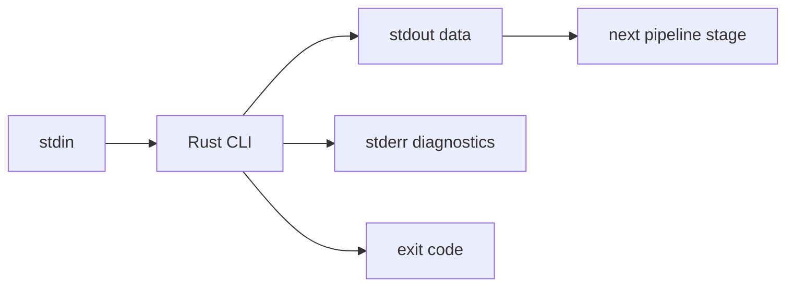

# Unix CLI Streams

## Learning Goals

- Design Rust CLIs that behave like good Unix citizens: stdin/stdout/stderr, exit codes, composability.
- Stream data line-by-line without loading entire files into memory.
- Distinguish text vs binary pipelines; handle invalid UTF-8 safely.
- Parse arguments cleanly (`std::env` or `clap`).
- Use filters, pipelines, and redirections effectively from the shell.
- Apply buffering consciously for throughput and interactivity.

## Concept Diagram



Unix philosophy: programs are filters. Your Rust binary should play well with `|`, `>`, and scripts.

## The Three Standard Streams

| Stream | FD | Use |
|--------|----|-----|
| stdin | 0 | input data |
| stdout | 1 | primary output (pipe-friendly) |
| stderr | 2 | logs, errors, progress |

**Rule:** never put diagnostics on stdout if the program’s stdout is data for another tool.

```rust
use std::io::{self, Write};

fn main() -> io::Result<()> {
    writeln!(io::stdout(), "payload-line")?;
    writeln!(io::stderr(), "info: processed 1 line")?;
    Ok(())
}
```

```bash
cargo run 2>err.log | wc -l
```

## Reading Stdin Fully vs Streaming

### Slurp (OK for small inputs)

```rust
use std::io::{self, Read};

fn main() -> io::Result<()> {
    let mut buf = String::new();
    io::stdin().read_to_string(&mut buf)?;
    println!("bytes={}", buf.len());
    Ok(())
}
```

### Stream lines (preferred for large logs)

```rust
use std::io::{self, BufRead};

fn main() -> io::Result<()> {
    let stdin = io::stdin();
    let mut count = 0usize;
    for line in stdin.lock().lines() {
        let line = line?;
        if line.contains("ERROR") {
            println!("{line}");
            count += 1;
        }
    }
    eprintln!("matched={count}");
    Ok(())
}
```

```bash
printf 'ok\nERROR boom\n' | cargo run
```

`lines()` splits on `\n` and errors on invalid UTF-8. For binary-safe tools, read bytes.

## Binary-Safe Line Splitting

```rust
use std::io::{self, BufRead, Write};

fn main() -> io::Result<()> {
    let stdin = io::stdin();
    let mut stdout = io::stdout().lock();
    for line in stdin.lock().split(b'\n') {
        let mut line = line?;
        // re-add newline for filter fidelity if desired
        stdout.write_all(&line)?;
        stdout.write_all(b"\n")?;
        let _ = &mut line;
    }
    Ok(())
}
```

## Exit Codes

```rust
use std::io::{self, BufRead};
use std::process::ExitCode;

fn main() -> ExitCode {
    let mut found = false;
    for line in io::stdin().lock().lines() {
        match line {
            Ok(l) if l.contains("TODO") => {
                println!("{l}");
                found = true;
            }
            Ok(_) => {}
            Err(e) => {
                eprintln!("read error: {e}");
                return ExitCode::from(1);
            }
        }
    }
    if found {
        ExitCode::SUCCESS
    } else {
        // grep-like: 1 means not found
        ExitCode::from(1)
    }
}
```

Mimic familiar tools when sensible (`grep` exit codes), but document your contract.

## Arguments: Minimal and `clap`

### Minimal

```rust
use std::env;

fn main() {
    let args: Vec<String> = env::args().skip(1).collect();
    match args.as_slice() {
        [] => eprintln!("usage: tool <pattern>"),
        [pat] => eprintln!("filter pattern={pat}"),
        _ => eprintln!("too many args"),
    }
}
```

### Production CLIs with clap

```toml
clap = { version = "4", features = ["derive"] }
```

```rust
use clap::Parser;
use std::io::{self, BufRead};
use std::process::ExitCode;

#[derive(Parser, Debug)]
#[command(name = "filterr", about = "Print lines containing a pattern")]
struct Args {
    /// Substring to match
    pattern: String,
    /// Invert match
    #[arg(short = 'v', long)]
    invert: bool,
}

fn main() -> ExitCode {
    let args = Args::parse();
    let mut matched = false;
    for line in io::stdin().lock().lines().map_while(Result::ok) {
        let is_match = line.contains(&args.pattern);
        if is_match ^ args.invert {
            println!("{line}");
            matched = true;
        }
    }
    if matched {
        ExitCode::SUCCESS
    } else {
        ExitCode::from(1)
    }
}
```

```bash
echo 'hello rust' | cargo run -- hello
echo 'hello rust' | cargo run -- -v hello
```

## Buffering and Flushing

Stdout is often **block-buffered** when piped and **line-buffered** on a TTY (implementation-dependent). If you write a progress spinner to stderr or need interactive prompts:

```rust
use std::io::{self, Write};

fn main() -> io::Result<()> {
    let mut out = io::stdout();
    write!(out, "type something: ")?;
    out.flush()?; // ensure prompt visible
    let mut input = String::new();
    io::stdin().read_line(&mut input)?;
    println!("got {}", input.trim());
    Ok(())
}
```

For high-throughput filters, wrap stdout in `BufWriter`—but flush on completion.

```rust
use std::io::{self, BufRead, BufWriter, Write};

fn main() -> io::Result<()> {
    let stdin = io::stdin();
    let mut out = BufWriter::new(io::stdout().lock());
    for line in stdin.lock().lines() {
        let line = line?;
        writeln!(out, "{}", line.to_uppercase())?;
    }
    out.flush()
}
```

## Composing Pipelines

```bash
# example once you build a release binary named `filterr`
cat app.log | ./filterr ERROR | ./filterr -v noise | wc -l
```

Design principles:

1. One job per tool (or clear subcommands).  
2. Deterministic output for the same input.  
3. Quiet on success if appropriate (`-q`).  
4. Machine-readable modes (`--json`) separate from human text.

## Signals and Partial Output

If a downstream pipe closes (e.g. `head` finishes), writers get `EPIPE` / `BrokenPipe`. For CLIs, exiting 0 on broken pipe is sometimes preferred for filters:

```rust
use std::io::{self, Write};

fn write_data() -> io::Result<()> {
    let mut out = io::stdout();
    for i in 0..10_000 {
        writeln!(out, "{i}")?;
    }
    Ok(())
}

fn main() {
    if let Err(e) = write_data() {
        if e.kind() == io::ErrorKind::BrokenPipe {
            // quiet exit for pipeline friendliness
            return;
        }
        eprintln!("{e}");
        std::process::exit(1);
    }
}
```

## Colors and TTY Detection

Only colorize when stdout is a TTY; disable when piping.

```rust
fn stdout_is_tty() -> bool {
    #[cfg(unix)]
    {
        // crude: isatty via libc or `std::io::IsTerminal` (Rust 1.70+)
        use std::io::IsTerminal;
        std::io::stdout().is_terminal()
    }
    #[cfg(not(unix))]
    {
        use std::io::IsTerminal;
        std::io::stdout().is_terminal()
    }
}

fn main() {
    if stdout_is_tty() {
        println!("\u{1b}[32mok\u{1b}[0m");
    } else {
        println!("ok");
    }
}
```

Respect `NO_COLOR` when building polished tools.

## Environment Conventions

| Variable | Common meaning |
|----------|----------------|
| `NO_COLOR` | disable ANSI colors |
| `RUST_LOG` | tracing/log filter |
| `PAGER` | user preferred pager |
| `XDG_CONFIG_HOME` | config location (Linux) |

```rust
fn main() {
    if std::env::var_os("NO_COLOR").is_some() {
        eprintln!("colors disabled");
    }
}
```

## Dual Input: File Args or Stdin

```rust
use std::env;
use std::fs::File;
use std::io::{self, BufRead, BufReader};

fn main() -> io::Result<()> {
    let mut args = env::args().skip(1);
    let reader: Box<dyn BufRead> = match args.next() {
        None | Some(ref s) if s == "-" => Box::new(BufReader::new(io::stdin())),
        Some(path) => Box::new(BufReader::new(File::open(path)?)),
    };
    for (i, line) in reader.lines().enumerate() {
        println!("{:6} {}", i + 1, line?);
    }
    Ok(())
}
```

```bash
cargo run -- Cargo.toml
cat Cargo.toml | cargo run -- -
```

## Testing CLI Tools

```rust
#[test]
fn uppercase_logic() {
    fn transform(s: &str) -> String {
        s.to_uppercase()
    }
    assert_eq!(transform("ab"), "AB");
}
```

Integration style: use `assert_cmd` and `predicates` crates, or spawn `Command` on your binary in tests.

```rust
use std::process::{Command, Stdio};
use std::io::Write;

#[test]
fn pipeline_smoke() {
    let mut child = Command::new(env!("CARGO_BIN_EXE_your_bin_name"))
        .stdin(Stdio::piped())
        .stdout(Stdio::piped())
        .spawn()
        .expect("spawn");
    // write stdin, read stdout...
    let _ = child;
}
```

(`CARGO_BIN_EXE_*` requires a bin target name.)

## Hands-On Practice

1. Build a `grep`-lite filter with `-v` invert; stream stdin.
2. Add clap; generate `--help`.
3. Handle broken pipe quietly when writing many lines into `| head`.
4. Support reading from a file path or `-` for stdin.
5. Count lines/words/bytes like a tiny `wc` (stream, don’t slurp).
6. Detect TTY and print a color only on terminals.
7. Document exit codes in `--help` / module docs.
8. `cargo fmt`, `clippy`, tests for pure transform functions.

## Common Mistakes

- Logging to stdout and breaking pipelines.
- Loading multi-GB logs into a `String`.
- Crashing on the first invalid UTF-8 byte without a binary mode.
- Forgetting to `flush` prompts.
- Non-zero exit on broken pipe making scripts noisy.
- Unstructured free-form args as the tool grows (migrate to clap).

## Review Questions

1. Why separate stdout and stderr?
2. When is line streaming mandatory?
3. How should a filter behave when its consumer is `head`?
4. Why disable colors when piping?
5. What exit code conventions might you copy from `grep`?

## Chapter Summary

Unix CLI streams make your Rust tools **composable**: clean stdin/stdout data paths, stderr diagnostics, sensible exit codes, and streaming I/O. Master filters and pipelines before building larger network services—the same discipline shows up in protocol framing and log shipping. Next: **socket programming**.
