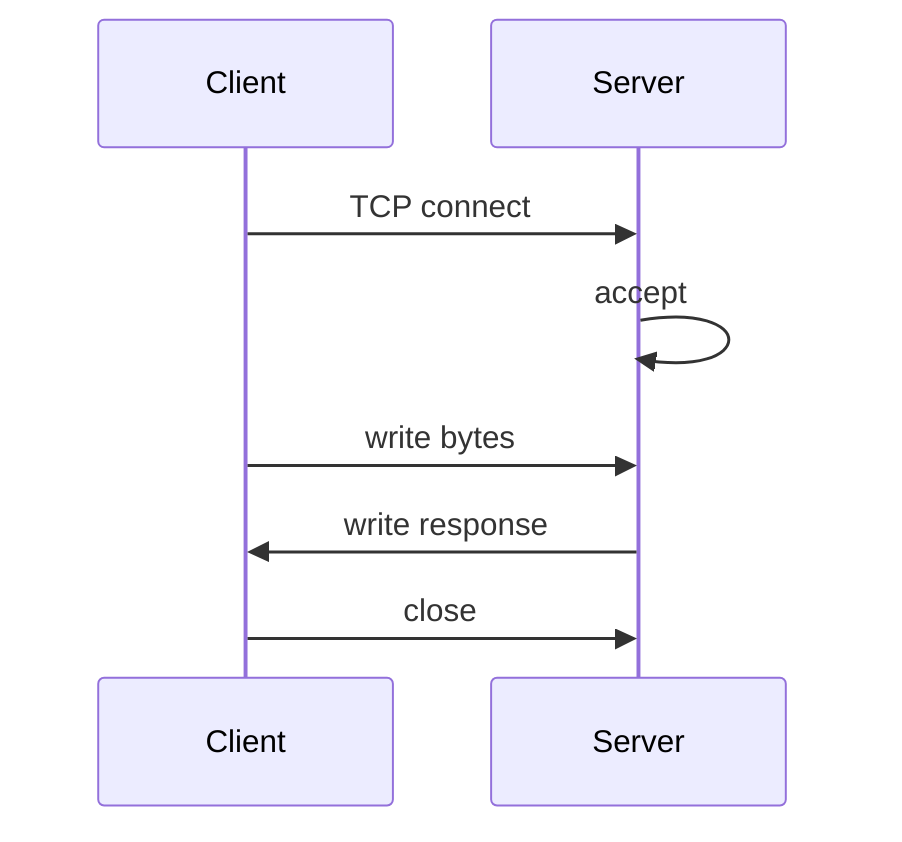

# Socket Programming

## Learning Goals

- Create TCP clients and servers with `std::net` and Tokio.
- Understand accept loops, connection lifecycle, and addressing (`SocketAddr`).
- Apply timeouts, `TCP_NODELAY`, and basic concurrency models.
- Contrast blocking vs async socket code.
- Handle partial reads/writes correctly (prelude to framing).
- Build a small multi-client echo service safely.

## Concept Diagram



Sockets are OS endpoints for network I/O. Most Internet services still start with **TCP streams** (HTTP, gRPC-over-HTTP/2, custom protocols).

## Addresses and Resolution

```rust
use std::net::{SocketAddr, ToSocketAddrs};

fn main() -> std::io::Result<()> {
    let addr: SocketAddr = "127.0.0.1:8080".parse().unwrap();
    println!("{addr}");

    for a in "localhost:8080".to_socket_addrs()? {
        println!("resolved {a}");
    }
    Ok(())
}
```

Prefer explicit IPs in tests; use DNS carefully in production (timeouts, caching).

## Blocking TCP Server (`std::net`)

```rust
use std::io::{Read, Write};
use std::net::TcpListener;

fn main() -> std::io::Result<()> {
    let listener = TcpListener::bind("127.0.0.1:9000")?;
    println!("listening on {}", listener.local_addr()?);

    for conn in listener.incoming() {
        let mut stream = conn?;
        let peer = stream.peer_addr()?;
        println!("accepted {peer}");

        let mut buf = [0u8; 1024];
        let n = stream.read(&mut buf)?;
        if n == 0 {
            continue;
        }
        stream.write_all(&buf[..n])?;
    }
    Ok(())
}
```

```bash
# terminal 1
cargo run

# terminal 2
nc 127.0.0.1 9000
```

This handles **one connection at a time**. For concurrency:

```rust
use std::io::{Read, Write};
use std::net::TcpListener;
use std::thread;

fn main() -> std::io::Result<()> {
    let listener = TcpListener::bind("127.0.0.1:9000")?;
    for conn in listener.incoming() {
        let mut stream = conn?;
        thread::spawn(move || {
            let mut buf = [0u8; 1024];
            loop {
                match stream.read(&mut buf) {
                    Ok(0) => break,
                    Ok(n) => {
                        if stream.write_all(&buf[..n]).is_err() {
                            break;
                        }
                    }
                    Err(_) => break,
                }
            }
        });
    }
    Ok(())
}
```

Thread-per-connection works for moderate load; async scales better for huge connection counts.

## Blocking TCP Client

```rust
use std::io::{Read, Write};
use std::net::TcpStream;
use std::time::Duration;

fn main() -> std::io::Result<()> {
    let mut stream = TcpStream::connect("127.0.0.1:9000")?;
    stream.set_read_timeout(Some(Duration::from_secs(5)))?;
    stream.set_write_timeout(Some(Duration::from_secs(5)))?;
    stream.write_all(b"hello\n")?;
    let mut buf = [0u8; 128];
    let n = stream.read(&mut buf)?;
    println!("got {}", String::from_utf8_lossy(&buf[..n]));
    Ok(())
}
```

## Async TCP with Tokio

```toml
tokio = { version = "1", features = ["full"] }
```

```rust
use tokio::io::{AsyncReadExt, AsyncWriteExt};
use tokio::net::TcpListener;

#[tokio::main]
async fn main() -> std::io::Result<()> {
    let listener = TcpListener::bind("127.0.0.1:9000").await?;
    loop {
        let (mut socket, addr) = listener.accept().await?;
        println!("accepted {addr}");
        tokio::spawn(async move {
            let mut buf = vec![0u8; 1024];
            loop {
                let n = match socket.read(&mut buf).await {
                    Ok(0) | Err(_) => return,
                    Ok(n) => n,
                };
                if socket.write_all(&buf[..n]).await.is_err() {
                    return;
                }
            }
        });
    }
}
```

Add a **connection semaphore** so accept storms cannot open unlimited tasks:

```rust
use std::sync::Arc;
use tokio::sync::Semaphore;

// let sem = Arc::new(Semaphore::new(256));
// let permit = sem.clone().acquire_owned().await?;
// spawn ... move permit into task
```

## Partial Reads and Writes

TCP is a **byte stream**, not a message stream. One `read` may return:

- part of a message  
- multiple messages  
- nothing to do with your logical frames  

```rust
use std::io::{self, Read};

fn read_exact_n<R: Read>(r: &mut R, n: usize) -> io::Result<Vec<u8>> {
    let mut buf = vec![0u8; n];
    r.read_exact(&mut buf)?;
    Ok(buf)
}
```

`write_all` loops until all bytes are written or an error occurs—prefer it over a single `write`.

Framing protocols properly is the next chapter; here, know the hazard.

## UDP Snapshot

```rust
use std::net::UdpSocket;

fn main() -> std::io::Result<()> {
    let sock = UdpSocket::bind("127.0.0.1:0")?; // ephemeral
    sock.connect("127.0.0.1:9001")?;
    sock.send(b"ping")?;
    let mut buf = [0u8; 64];
    // let n = sock.recv(&mut buf)?;
    let _ = buf;
    println!("local {}", sock.local_addr()?);
    Ok(())
}
```

UDP is datagram-oriented, unreliable, unordered. Useful for metrics, discovery, latency-sensitive media—not a drop-in TCP replacement.

## Socket Options Worth Setting

```rust
use std::net::TcpStream;
use std::time::Duration;

fn tune(stream: &TcpStream) -> std::io::Result<()> {
    stream.set_nodelay(true)?; // disable Nagle for small latency-sensitive messages
    stream.set_read_timeout(Some(Duration::from_secs(30))?;
    stream.set_write_timeout(Some(Duration::from_secs(30))?;
    Ok(())
}
```

Tokio equivalents exist on `TcpStream` (`set_nodelay`). Keepalive settings are platform-specific (`socket2` crate for advanced opts).

## Graceful Close

```rust
use std::io::Write;
use std::net::TcpStream;

fn finish(mut stream: TcpStream) -> std::io::Result<()> {
    stream.flush()?;
    stream.shutdown(std::net::Shutdown::Both)?;
    Ok(())
}
```

Half-close (`Shutdown::Write`) is useful when you finished sending but still read.

## Concurrent Client Example (async)

```rust
use tokio::io::AsyncWriteExt;
use tokio::net::TcpStream;
use tokio::task::JoinSet;

#[tokio::main]
async fn main() -> std::io::Result<()> {
    let mut set = JoinSet::new();
    for i in 0..10 {
        set.spawn(async move {
            let mut s = TcpStream::connect("127.0.0.1:9000").await?;
            s.write_all(format!("hello-{i}\n").as_bytes()).await?;
            Ok::<_, std::io::Error>(())
        });
    }
    while let Some(res) = set.join_next().await {
        res.expect("join")?
    }
    Ok(())
}
```

## Error Handling Patterns

| Error | Typical meaning |
|-------|-----------------|
| `ConnectionRefused` | nothing listening |
| `TimedOut` | firewall / slow peer |
| `ConnectionReset` | peer crashed |
| `BrokenPipe` | write after peer close |
| `AddrInUse` | bind conflict |

```rust
fn describe(e: &std::io::Error) {
    eprintln!("kind={:?} os={:?}", e.kind(), e.raw_os_error());
}
```

Retry **connect** with backoff for transient failures; do not blindly retry non-idempotent application messages without a protocol.

## Security Notes (preview)

- Validate/limit request sizes (next chapters).
- Prefer TLS for untrusted networks (`rustls` / `tokio-rustls`).
- Do not expose debug bind addresses (`0.0.0.0`) without intent.
- Separate control plane and data plane ports when relevant.

## Threaded vs Async Decision

| Approach | Pros | Cons |
|----------|------|------|
| Thread per conn | simple | memory, limits |
| Blocking + pool | controlled | complex scheduling |
| Async Tokio | huge concurrency | learning curve, blocking hazards |

For new network services in Rust, **Tokio + structured concurrency** is the default mid-2026 choice.

## Hands-On Practice

1. Run std echo server; connect with `nc`; observe partial line reads if you type slowly.
2. Convert to thread-per-connection; open multiple `nc` sessions.
3. Reimplement with Tokio; add a semaphore of 2 concurrent clients.
4. Write a client that sends 100 messages; ensure `write_all`.
5. Set read timeouts; verify a non-responsive peer fails.
6. Enable `nodelay` and document when you would/wouldn’t.
7. Bind to `127.0.0.1` only; explain why for local tools.
8. `cargo fmt`, `clippy`, and a test that connects to a listener on port `0` (ephemeral).

```rust
#[test]
fn ephemeral_bind() {
    let listener = std::net::TcpListener::bind("127.0.0.1:0").unwrap();
    let addr = listener.local_addr().unwrap();
    let _client = std::net::TcpStream::connect(addr).unwrap();
}
```

## Common Mistakes

- Treating TCP as message-oriented.
- Ignoring `Ok(0)` (EOF).
- Unlimited accept + spawn.
- No timeouts → hung tasks forever.
- Blocking `std::net` reads on async runtimes.
- Using `unwrap` on production accept loops.
- Logging entire payloads (PII/secrets).

## Review Questions

1. What does a TCP `read` returning 0 mean?
2. Why is `write_all` safer than a single `write`?
3. How do you limit concurrent connections in Tokio?
4. When do you enable `TCP_NODELAY`?
5. Why can’t you assume one `read` equals one application message?

## Chapter Summary

Socket programming in Rust spans **blocking `std::net`** and **async Tokio** models. Master accept loops, connection limits, timeouts, and the byte-stream nature of TCP. With those foundations, the next chapter solves the message problem properly via **protocol framing**.
