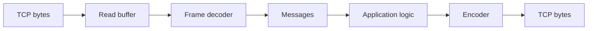

# Protocol Framing

## Learning Goals

- Explain why TCP needs **framing** to recover messages from a byte stream.
- Implement **newline**, **length-prefix**, and discuss **delimiter** trade-offs.
- Parse incrementally with a buffer; handle partial frames.
- Enforce **max frame size** to prevent memory abuse.
- Sketch versioning and error responses at the framing layer.
- Prefer proven codecs (`tokio_util::codec`) when building real services.

## Concept Diagram



Framing is the boundary between **transport bytes** and **application messages**.

## The Problem

Sender writes:

```text
MSG1MSG2MSG3
```

Receiver may `read` as:

```text
MSG1M
SG2MSG
3
```

Without rules, you cannot know where messages end.

## Strategy 1: Newline-Delimited Text

Simple for CLIs and logs.

```rust
fn split_lines(buf: &mut Vec<u8>) -> Vec<Vec<u8>> {
    let mut out = Vec::new();
    while let Some(pos) = buf.iter().position(|&b| b == b'\n') {
        let mut line = buf.drain(..=pos).collect::<Vec<_>>();
        if line.last() == Some(&b'\n') {
            line.pop();
        }
        if line.last() == Some(&b'\r') {
            line.pop(); // optional CRLF support
        }
        out.push(line);
    }
    out
}

fn main() {
    let mut buf = b"hello\nwor".to_vec();
    let frames = split_lines(&mut buf);
    assert_eq!(frames, vec![b"hello".to_vec()]);
    assert_eq!(buf, b"wor");
    buf.extend_from_slice(b"ld\n");
    let frames = split_lines(&mut buf);
    assert_eq!(frames, vec![b"world".to_vec()]);
    assert!(buf.is_empty());
}
```

**Pros:** debuggable with `nc`.  
**Cons:** payloads cannot contain raw newlines without escaping; awkward for binary.

### Streaming server sketch (std)

```rust
use std::io::{Read, Write};
use std::net::TcpListener;

fn main() -> std::io::Result<()> {
    let listener = TcpListener::bind("127.0.0.1:9100")?;
    for stream in listener.incoming() {
        let mut stream = stream?;
        let mut buf = Vec::new();
        let mut tmp = [0u8; 512];
        loop {
            let n = stream.read(&mut tmp)?;
            if n == 0 {
                break;
            }
            buf.extend_from_slice(&tmp[..n]);
            // cap buffer
            if buf.len() > 64 * 1024 {
                let _ = stream.write_all(b"ERR too long\n");
                break;
            }
            for line in split_lines(&mut buf) {
                stream.write_all(b"ECHO ")?;
                stream.write_all(&line)?;
                stream.write_all(b"\n")?;
            }
        }
    }
    Ok(())
}

fn split_lines(buf: &mut Vec<u8>) -> Vec<Vec<u8>> {
    let mut out = Vec::new();
    while let Some(pos) = buf.iter().position(|&b| b == b'\n') {
        let mut line = buf.drain(..=pos).collect::<Vec<_>>();
        if line.ends_with(&[b'\n']) {
            line.pop();
        }
        out.push(line);
    }
    out
}
```

## Strategy 2: Length-Prefix (Binary)

Common layout:

```text
[ u32 big-endian length N ][ N bytes payload ]
```

```rust
use std::io::{self, Read, Write};

fn write_frame<W: Write>(w: &mut W, payload: &[u8]) -> io::Result<()> {
    let len = u32::try_from(payload.len()).map_err(|_| io::Error::other("frame too large"))?;
    w.write_all(&len.to_be_bytes())?;
    w.write_all(payload)?;
    Ok(())
}

fn read_frame<R: Read>(r: &mut R, max: usize) -> io::Result<Vec<u8>> {
    let mut hdr = [0u8; 4];
    r.read_exact(&mut hdr)?;
    let len = u32::from_be_bytes(hdr) as usize;
    if len > max {
        return Err(io::Error::other("frame exceeds max"));
    }
    let mut buf = vec![0u8; len];
    r.read_exact(&mut buf)?;
    Ok(buf)
}
```

```rust
fn main() -> std::io::Result<()> {
    let mut cursor = std::io::Cursor::new(Vec::new());
    write_frame(&mut cursor, b"ping")?;
    cursor.set_position(0);
    let payload = read_frame(&mut cursor, 1024)?;
    assert_eq!(payload, b"ping");
    Ok(())
}
```

**Pros:** binary-safe, efficient.  
**Cons:** harder to debug by eye; need endianness agreement; max size critical.

## Incremental Decode State Machine

In async servers you rarely get a full frame per read. Keep a buffer:

```rust
struct Decoder {
    buf: Vec<u8>,
    max: usize,
}

enum DecodeError {
    TooLarge,
}

impl Decoder {
    fn new(max: usize) -> Self {
        Self {
            buf: Vec::new(),
            max,
        }
    }

    fn push(&mut self, data: &[u8]) -> Result<(), DecodeError> {
        if self.buf.len() + data.len() > self.max + 4 {
            return Err(DecodeError::TooLarge);
        }
        self.buf.extend_from_slice(data);
        Ok(())
    }

    /// Drain all complete length-prefixed frames.
    fn drain_frames(&mut self) -> Result<Vec<Vec<u8>>, DecodeError> {
        let mut out = Vec::new();
        loop {
            if self.buf.len() < 4 {
                break;
            }
            let len = u32::from_be_bytes(self.buf[0..4].try_into().unwrap()) as usize;
            if len > self.max {
                return Err(DecodeError::TooLarge);
            }
            if self.buf.len() < 4 + len {
                break; // wait for more bytes
            }
            let payload = self.buf[4..4 + len].to_vec();
            self.buf.drain(..4 + len);
            out.push(payload);
        }
        Ok(out)
    }
}

fn main() {
    let mut d = Decoder::new(16);
    d.push(&(4u32.to_be_bytes())).unwrap();
    d.push(b"pi").unwrap();
    assert!(d.drain_frames().unwrap().is_empty());
    d.push(b"ng").unwrap();
    let frames = d.drain_frames().unwrap();
    assert_eq!(frames, vec![b"ping".to_vec()]);
}
```

## Strategy 3: Fixed Size Frames

Every message is exactly N bytes (padding if needed). Simple hardware-style protocols; wasteful for variable content.

## Strategy 4: Self-Describing / Schema (protobuf, JSON with framing)

JSON over TCP still needs framing: often **NDJSON** (newline) or length-prefix + JSON body.

```rust
use serde::{Deserialize, Serialize};

#[derive(Debug, Serialize, Deserialize)]
struct Request {
    method: String,
    id: u64,
}

fn encode_json_line(req: &Request) -> Result<Vec<u8>, serde_json::Error> {
    let mut v = serde_json::to_vec(req)?;
    v.push(b'\n');
    Ok(v)
}
```

```toml
serde = { version = "1", features = ["derive"] }
serde_json = "1"
```

## Using `tokio_util::codec`

```toml
tokio = { version = "1", features = ["full"] }
tokio-util = { version = "0.7", features = ["codec"] }
futures = "0.3"
```

```rust
use futures::StreamExt;
use tokio::net::TcpListener;
use tokio_util::codec::{Framed, LinesCodec};

#[tokio::main]
async fn main() -> std::io::Result<()> {
    let listener = TcpListener::bind("127.0.0.1:9200").await?;
    loop {
        let (socket, _) = listener.accept().await?;
        tokio::spawn(async move {
            let mut framed = Framed::new(socket, LinesCodec::new_with_max_length(1024));
            while let Some(item) = framed.next().await {
                match item {
                    Ok(line) => {
                        use futures::SinkExt;
                        if framed.send(format!("ECHO {line}")).await.is_err() {
                            break;
                        }
                    }
                    Err(e) => {
                        eprintln!("codec error: {e}");
                        break;
                    }
                }
            }
        });
    }
}
```

`LinesCodec` enforces max line length—use that feature.

## Application-Level Errors vs Transport Errors

| Layer | Examples |
|-------|----------|
| Transport | reset, timeout, EOF mid-frame |
| Framing | length too large, invalid header |
| Application | unknown method, auth failure |

Respond with a structured error frame when possible; close the connection on unrecoverable framing errors (desync).

## Versioning

Put a version byte in the header:

```text
[ u8 version=1 ][ u32 len ][ payload ]
```

Or negotiate via first handshake message. Reject unknown versions explicitly.

```rust
fn parse_versioned(buf: &[u8]) -> Option<(u8, &[u8])> {
    let (ver, rest) = buf.split_first()?;
    Some((*ver, rest))
}
```

## Security: Max Size and Slowloris

Attackers may:

- claim `len = 4GB`  
- send headers extremely slowly  
- open many half-framed connections  

Mitigations:

1. Max frame size (e.g. 1 MiB)  
2. Read/idle timeouts  
3. Connection limits  
4. Per-IP rate limits (service layer)  

```rust
const MAX_FRAME: usize = 1024 * 1024;
```

## Heartbeats / Idle

Framing layers often define **ping/pong** messages so idle load balancers don’t kill connections, and so you detect half-open TCPs.

## Testing Frames

```rust
#[test]
fn length_prefix_roundtrip() {
    let mut cur = std::io::Cursor::new(Vec::new());
    write_frame(&mut cur, b"abc").unwrap();
    cur.set_position(0);
    let got = read_frame(&mut cur, 10).unwrap();
    assert_eq!(got, b"abc");
}

#[test]
fn rejects_too_large() {
    let mut cur = std::io::Cursor::new(Vec::new());
    write_frame(&mut cur, b"abcdefghij").unwrap();
    cur.set_position(0);
    assert!(read_frame(&mut cur, 4).is_err());
}
```

(Reuse the `write_frame` / `read_frame` functions from earlier in the chapter.)

## Hands-On Practice

1. Implement newline framing echo; test with `nc`.
2. Implement length-prefix encode/decode with unit tests.
3. Build the incremental `Decoder`; feed bytes one at a time in a test.
4. Enforce max frame size; prove oversize is rejected.
5. Define a tiny protocol: `PING` / `PONG` / `ECHO <text>` over lines.
6. Optional: use `LinesCodec` and `Framed` on Tokio.
7. Document your wire format in 10 lines of markdown in comments.
8. `cargo fmt`, `clippy`, `test`.

## Common Mistakes

- Assuming one `read` = one message.
- No max size → OOM.
- Using `String` mid-decode for binary protocols.
- Failing to retain remainder bytes in the buffer.
- Continuing after a desync without resync strategy (usually: disconnect).
- Mixing endianness with peers.

## Review Questions

1. Why is TCP not message-oriented?
2. Compare newline vs length-prefix for binary payloads.
3. What should you do if `len` exceeds your max?
4. Why test partial byte feeds?
5. Where does JSON fit into framing?

## Chapter Summary

**Framing** turns byte streams into messages using delimiters or length prefixes, always with **incremental buffering** and **size limits**. Use simple line protocols for tools; length-prefix or codecs for binary services. Next: **service lifecycle**—startup, readiness, and graceful shutdown around these connections.
