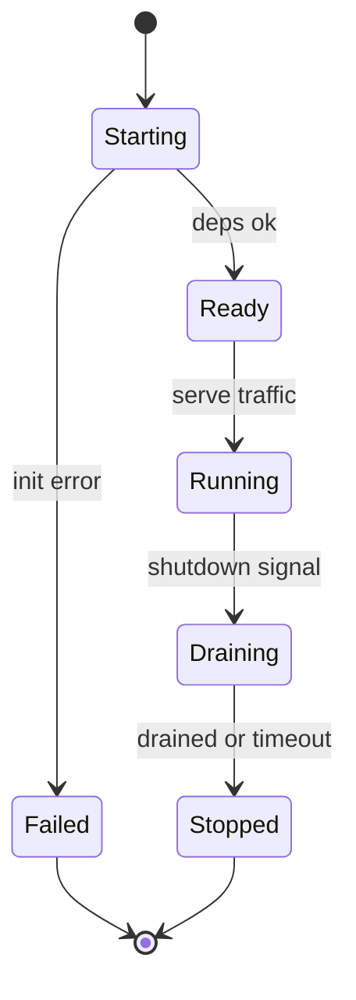

# Service Lifecycle

## Learning Goals

- Model service states: starting, ready, running, draining, stopped.
- Implement **graceful shutdown** with signals and deadlines.
- Separate **liveness** vs **readiness** concepts.
- Coordinate listeners, worker tasks, and dependency checks at startup.
- Avoid drop-in-the-floor in-flight work on deploy/restart.
- Integrate lifecycle hooks that later map cleanly to systemd / Kubernetes.

## Concept Diagram



A production binary is not `main → loop forever`. It is a **lifecycle** with explicit transitions.

## Lifecycle Phases

| Phase | Responsibilities |
|-------|------------------|
| Starting | parse config, open pools, migrate?, bind sockets |
| Ready | pass readiness checks; accept traffic |
| Running | serve; background tasks; health updates |
| Draining | stop accept; finish in-flight; flush |
| Stopped | release resources; exit code |

## Signal Handling (Tokio)

```rust
use tokio::signal;
use tokio::sync::watch;

#[tokio::main]
async fn main() {
    let (tx, rx) = watch::channel(false);
    let worker = tokio::spawn(worker_loop(rx));

    shutdown_signal().await;
    println!("signal received; draining");
    let _ = tx.send(true);
    let _ = worker.await;
}

async fn shutdown_signal() {
    let ctrl_c = async {
        signal::ctrl_c().await.expect("ctrl_c");
    };

    #[cfg(unix)]
    let terminate = async {
        use tokio::signal::unix::{signal, SignalKind};
        let mut sig = signal(SignalKind::terminate()).expect("SIGTERM");
        sig.recv().await;
    };

    #[cfg(not(unix))]
    let terminate = std::future::pending::<()>();

    tokio::select! {
        _ = ctrl_c => {},
        _ = terminate => {},
    }
}

async fn worker_loop(mut shutdown: watch::Receiver<bool>) {
    loop {
        tokio::select! {
            _ = shutdown.changed() => {
                if *shutdown.borrow() {
                    println!("worker exit");
                    break;
                }
            }
            _ = tokio::time::sleep(std::time::Duration::from_millis(200)) => {
                println!("work tick");
            }
        }
    }
}
```

On Unix, **SIGTERM** is the normal supervisor stop signal (systemd, k8s). Handle both SIGTERM and Ctrl+C (SIGINT).

## Drain with Deadline

```rust
use std::sync::Arc;
use std::time::Duration;
use tokio::sync::{broadcast, Semaphore};

struct Server {
    in_flight: Arc<Semaphore>, // permits = max concurrent requests
}

impl Server {
    async fn handle(&self) {
        let _permit = self.in_flight.acquire().await.unwrap();
        tokio::time::sleep(Duration::from_millis(50)).await;
    }

    async fn drain(&self, timeout: Duration) {
        // Stop accept separately; then wait until all permits free.
        let wait = self.in_flight.acquire_many(self.in_flight.available_permits() as u32 /* wrong if busy */);
        // Better: track AtomicUsize of active requests, or use JoinSet of requests.
        let _ = wait;
        let _ = timeout;
    }
}
```

A clearer pattern: count in-flight with an `AtomicUsize` or keep request tasks in a `JoinSet`.

```rust
use std::sync::atomic::{AtomicUsize, Ordering};
use std::sync::Arc;
use std::time::Duration;

#[derive(Clone, Default)]
struct Inflight(Arc<AtomicUsize>);

impl Inflight {
    fn guard(self) -> InflightGuard {
        self.0.fetch_add(1, Ordering::SeqCst);
        InflightGuard(self.0)
    }

    fn get(&self) -> usize {
        self.0.load(Ordering::SeqCst)
    }
}

struct InflightGuard(Arc<AtomicUsize>);

impl Drop for InflightGuard {
    fn drop(&mut self) {
        self.0.fetch_sub(1, Ordering::SeqCst);
    }
}

async fn wait_drain(inflight: Inflight, deadline: Duration) -> bool {
    let start = tokio::time::Instant::now();
    while inflight.get() > 0 {
        if start.elapsed() > deadline {
            return false;
        }
        tokio::time::sleep(Duration::from_millis(10)).await;
    }
    true
}
```

On drain timeout: **abort** remaining work, log how many dropped, exit non-zero if policy requires.

## Readiness vs Liveness

| Probe | Question | Fail action |
|-------|----------|-------------|
| Liveness | Is the process stuck deadlocked? | Restart container/service |
| Readiness | Can it take traffic now? | Remove from LB; don’t restart necessarily |

Examples:

- Readiness fails while still connecting to DB at startup, or while draining.  
- Liveness fails if the event loop is wedged (harder to detect; use careful watchdog designs).

```rust
use std::sync::atomic::{AtomicBool, Ordering};
use std::sync::Arc;

#[derive(Clone)]
struct Health {
    ready: Arc<AtomicBool>,
    alive: Arc<AtomicBool>,
}

impl Health {
    fn new() -> Self {
        Self {
            ready: Arc::new(AtomicBool::new(false)),
            alive: Arc::new(AtomicBool::new(true)),
        }
    }
    fn set_ready(&self, v: bool) {
        self.ready.store(v, Ordering::SeqCst);
    }
}
```

Expose via HTTP in networked services, or via simple TCP health ports—here the **state** matters more than the transport.

## Startup Ordering

```rust
async fn start() -> anyhow::Result<()> {
    let cfg = load_config()?;
    validate(&cfg)?;
    let db = connect_db(&cfg).await?;
    ping_deps(&db).await?;
    let listener = tokio::net::TcpListener::bind(&cfg.bind).await?;
    // only now mark ready
    Ok(())
}

fn load_config() -> anyhow::Result<Config> {
    Ok(Config {
        bind: "127.0.0.1:8080".into(),
    })
}

struct Config {
    bind: String,
}

fn validate(_: &Config) -> anyhow::Result<()> {
    Ok(())
}

async fn connect_db(_: &Config) -> anyhow::Result<()> {
    Ok(())
}

async fn ping_deps(_: &()) -> anyhow::Result<()> {
    Ok(())
}
```

Fail fast on bad config: non-zero exit so supervisors restart or alert.

## Cancel In-Flight Requests

```rust
use tokio_util::sync::CancellationToken;

async fn serve_one(cancel: CancellationToken) {
    tokio::select! {
        _ = cancel.cancelled() => {
            // client may get disconnect; log and return
        }
        _ = do_request() => {}
    }
}

async fn do_request() {
    tokio::time::sleep(std::time::Duration::from_secs(5)).await;
}
```

Root token cancelled on SIGTERM; each accept creates a child token if you need hierarchical cancel.

## Background Tasks

Spawn supervised tasks for:

- metric flush  
- config reload (SIGHUP optional)  
- connection pool reapers  

On shutdown, cancel them **after** or **during** drain depending on whether they are required for request completion.

```rust
let cancel = CancellationToken::new();
let bg = {
    let cancel = cancel.clone();
    tokio::spawn(async move {
        loop {
            tokio::select! {
                _ = cancel.cancelled() => break,
                _ = tokio::time::sleep(std::time::Duration::from_secs(1)) => {
                    // periodic
                }
            }
        }
    })
};
// on shutdown:
cancel.cancel();
let _ = bg.await;
```

## Config Reload (optional)

```rust
#[cfg(unix)]
async fn reload_listener(mut rx: tokio::sync::watch::Sender<Config>) {
    use tokio::signal::unix::{signal, SignalKind};
    let mut hup = signal(SignalKind::hangup()).expect("SIGHUP");
    while hup.recv().await.is_some() {
        if let Ok(cfg) = load_config() {
            let _ = rx.send(cfg);
        }
    }
}
```

Not all services need SIGHUP; many prefer redeploy for config changes.

## Exit Codes

| Code | Meaning |
|------|---------|
| 0 | clean shutdown after drain |
| 1 | fatal runtime error |
| 2 | bad config / usage |
| non-zero | drain timeout (policy-dependent) |

Orchestrators use exit codes + restart policies.

## Full Mini Skeleton

```rust
use std::sync::Arc;
use std::time::Duration;
use tokio::sync::watch;
use tracing::info;

#[tokio::main]
async fn main() {
    tracing_subscriber::fmt::init();
    let health_ready = Arc::new(std::sync::atomic::AtomicBool::new(false));

    // bind
    let listener = tokio::net::TcpListener::bind("127.0.0.1:0")
        .await
        .expect("bind");
    info!("bound {}", listener.local_addr().unwrap());
    health_ready.store(true, std::sync::atomic::Ordering::SeqCst);

    let (shutdown_tx, mut shutdown_rx) = watch::channel(false);
    let accept = tokio::spawn(async move {
        loop {
            tokio::select! {
                _ = shutdown_rx.changed() => {
                    if *shutdown_rx.borrow() { break; }
                }
                acc = listener.accept() => {
                    if let Ok((mut sock, _)) = acc {
                        tokio::spawn(async move {
                            use tokio::io::AsyncWriteExt;
                            let _ = sock.write_all(b"ok\n").await;
                        });
                    }
                }
            }
        }
        info!("accept loop stopped");
    });

    // wait for signal
    tokio::signal::ctrl_c().await.ok();
    health_ready.store(false, std::sync::atomic::Ordering::SeqCst);
    let _ = shutdown_tx.send(true);

    let drain = Duration::from_secs(5);
    let _ = tokio::time::timeout(drain, accept).await;
    info!("bye");
}
```

```toml
tracing = "0.1"
tracing-subscriber = "0.3"
tokio = { version = "1", features = ["full"] }
```

## Deploy Interaction

Rolling deploy:

1. New instance starts → readiness false until warm.  
2. Readiness true → LB adds instance.  
3. Old instance SIGTERM → readiness false → drain → exit.  

If drain is longer than platform `terminationGracePeriodSeconds` / systemd timeout, connections drop. **Align budgets.**

## Hands-On Practice

1. Write a Tokio service that ticks every 200ms until Ctrl+C.
2. Add SIGTERM handling on Linux/macOS.
3. Implement inflight counters with a guard `Drop`.
4. On shutdown, set ready=false, stop accept, wait up to 2s for inflight=0.
5. Simulate a long request; verify drain waits or times out as configured.
6. Return exit code 1 on drain timeout.
7. Log phase transitions with `tracing`.
8. Document your drain budget next to any deploy manifests you use.

## Common Mistakes

- Only handling Ctrl+C, not SIGTERM.
- Continuing to accept during drain.
- No deadline → stuck forever on a long request.
- Marking ready before dependencies work.
- Using liveness probes that fail during heavy GC/load (false restarts).
- Ignoring in-flight work on shutdown.

## Review Questions

1. Difference between readiness and liveness?
2. Why handle SIGTERM for production Rust services?
3. What should happen to the accept loop on shutdown?
4. How do you pick a drain timeout?
5. Why mark ready=false before draining?

## Chapter Summary

Service lifecycle makes restarts **safe**: ordered startup, readiness gates, signal-aware drain with deadlines, and clear exit codes. These patterns map directly to Linux supervisors—next chapter: **systemd** integration.
