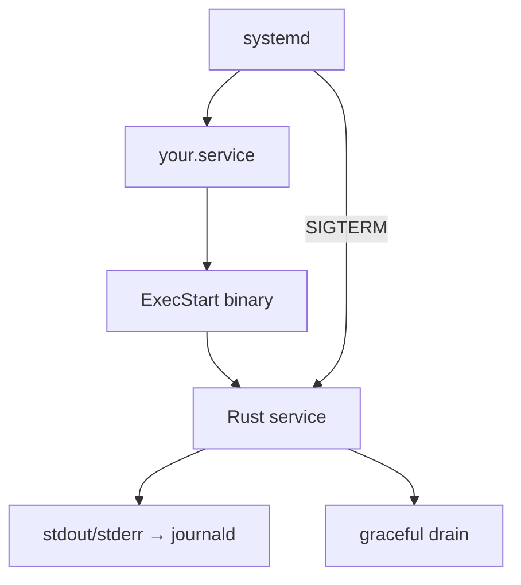

# Linux systemd

## Learning Goals

- Package a Rust binary as a **systemd service** with a solid unit file.
- Configure restart policy, user, environment, and logging to the journal.
- Align **graceful shutdown** with `TimeoutStopSec` and SIGTERM behavior.
- Use socket activation concepts (awareness) and hardening options.
- Operate services with `systemctl` / `journalctl`.
- Apply least-privilege patterns suitable for production Linux hosts.

## Concept Diagram



On modern Linux servers, **systemd** supervises long-running processes: start at boot, restart on failure, collect logs, and stop cleanly.

## Minimal Unit File

```ini
# /etc/systemd/system/jobrun.service
[Unit]
Description=Jobrun Rust worker
Documentation=https://example.local/jobrun
After=network-online.target
Wants=network-online.target

[Service]
Type=simple
ExecStart=/usr/local/bin/jobrun
Restart=on-failure
RestartSec=2
User=jobrun
Group=jobrun
WorkingDirectory=/var/lib/jobrun
Environment=RUST_LOG=info
Environment=APP_ENV=production
# Graceful stop budget — must be >= app drain timeout
TimeoutStopSec=30
KillSignal=SIGTERM
# Send SIGKILL only after timeout
FinalKillSignal=SIGKILL

# Hardening (start here; tighten further as needed)
NoNewPrivileges=true
PrivateTmp=true
ProtectSystem=strict
ProtectHome=true
ReadWritePaths=/var/lib/jobrun /var/log/jobrun

[Install]
WantedBy=multi-user.target
```

```bash
sudo useradd --system --home /var/lib/jobrun --shell /usr/sbin/nologin jobrun
sudo mkdir -p /var/lib/jobrun /var/log/jobrun
sudo chown jobrun:jobrun /var/lib/jobrun /var/log/jobrun
sudo install -m 755 target/release/jobrun /usr/local/bin/jobrun
sudo systemctl daemon-reload
sudo systemctl enable --now jobrun.service
systemctl status jobrun.service
```

## Service Types

| Type | When |
|------|------|
| `simple` | default; process is the main service (most Rust apps) |
| `exec` | like simple with stricter ExecStart failure semantics |
| `notify` | app calls `sd_notify` when ready (needs integration) |
| `forking` | legacy daemons that double-fork — avoid for new Rust |

Prefer `Type=simple` or `notify` for readiness-aware deploys.

## Logging

systemd captures **stdout/stderr** into the journal by default.

```rust
// Prefer structured logs to stdout
// tracing_subscriber::fmt().with_writer(std::io::stdout).init();
fn main() {
    println!("info: service starting"); // becomes journal
    eprintln!("warn: example warning");
}
```

```bash
journalctl -u jobrun.service -f
journalctl -u jobrun.service --since "10 min ago"
journalctl -u jobrun.service -p err
```

JSON logs: still write to stdout; parse later with your log stack. Avoid writing only to custom files unless required—journal integration is simpler for ops.

## Restart Policies

| Policy | Behavior |
|--------|----------|
| `no` | never restart |
| `on-failure` | restart on non-zero / signals (common default) |
| `always` | restart even on clean zero exit |
| `on-abnormal` | crash/signal focused |

```ini
Restart=on-failure
RestartSec=3
StartLimitIntervalSec=60
StartLimitBurst=5
```

`StartLimitBurst` prevents crash loops from thrashing the machine.

## Environment and Secrets

```ini
Environment=RUST_LOG=info,mycrate=debug
EnvironmentFile=-/etc/jobrun/jobrun.env
```

```bash
# /etc/jobrun/jobrun.env
# DATABASE_URL=postgres://...
```

```bash
sudo chmod 600 /etc/jobrun/jobrun.env
sudo chown root:jobrun /etc/jobrun/jobrun.env
```

Prefer secret managers / sealed files over committing secrets. The `-` prefix on `EnvironmentFile` means optional.

## Aligning App Drain with systemd

App handles SIGTERM → drain for e.g. 20s. Unit must allow at least that:

```ini
TimeoutStopSec=30
```

If the app ignores SIGTERM, systemd escalates to SIGKILL after the timeout—**in-flight work dies**.

Test:

```bash
sudo systemctl stop jobrun.service
# measure time; check logs for drain messages
```

## Resource Limits

```ini
LimitNOFILE=65535
MemoryMax=512M
CPUQuota=200%
```

File descriptor limits matter for high-connection services. MemoryMax engages cgroup kills—monitor OOM events.

## Hardening Options (practical set)

```ini
NoNewPrivileges=true
PrivateTmp=true
ProtectSystem=strict
ProtectHome=true
ProtectKernelTunables=true
ProtectControlGroups=true
RestrictSUIDSGID=true
RestrictRealtime=true
LockPersonality=true
CapabilityBoundingSet=
AmbientCapabilities=
SystemCallArchitectures=native
```

Add only the capabilities you need (e.g. `CAP_NET_BIND_SERVICE` for binding low ports without root).

```ini
AmbientCapabilities=CAP_NET_BIND_SERVICE
CapabilityBoundingSet=CAP_NET_BIND_SERVICE
```

## Socket Activation (awareness)

systemd can listen on a socket and pass the FD to your service (`sd_listen_fds`). Useful for:

- on-demand start  
- privilege separation (bind as root, run as user)  

Rust crates like `listenfd` or manual `LISTEN_FDS` handling integrate with this. For many apps, binding inside the process is enough; know socket activation exists for advanced deployments.

## Operator Cheat Sheet

```bash
sudo systemctl start jobrun
sudo systemctl stop jobrun
sudo systemctl restart jobrun
sudo systemctl reload jobrun    # only if you implement SIGHUP/reload
systemctl status jobrun
systemctl is-active jobrun
systemctl is-enabled jobrun
journalctl -u jobrun -n 100 --no-pager
sudo systemctl daemon-reload    # after unit file edits
sudo systemctl cat jobrun       # show effective unit
systemd-analyze security jobrun # hardening report
```

## Example: Notify Readiness (optional)

```ini
Type=notify
NotifyAccess=main
```

App side uses `sd-notify` protocol (crate `sd-notify` or `libsystemd`). Call ready after binding and dependency checks—maps to readiness better than `simple`.

```rust
// conceptual
// sd_notify::notify(true, &[sd_notify::NotifyState::Ready])?;
```

## Packaging the Binary

```bash
cargo build --release
# strip optional:
strip target/release/jobrun

# versioned deploy
sudo install -m 755 target/release/jobrun /usr/local/bin/jobrun-1.2.3
sudo ln -sfn /usr/local/bin/jobrun-1.2.3 /usr/local/bin/jobrun
sudo systemctl restart jobrun
```

Keep previous binary for quick rollback.

## Timers (cron replacement)

```ini
# /etc/systemd/system/jobrun-gc.timer
[Unit]
Description=Run GC daily

[Timer]
OnCalendar=daily
Persistent=true

[Install]
WantedBy=timers.target
```

```ini
# jobrun-gc.service
[Unit]
Description=GC oneshot

[Service]
Type=oneshot
ExecStart=/usr/local/bin/jobrun --gc
User=jobrun
```

```bash
sudo systemctl enable --now jobrun-gc.timer
systemctl list-timers
```

## Working with Non-Root Dev Boxes

You can use **user units** (`~/.config/systemd/user/`) with `systemctl --user` for personal daemons—great for homelab learning without root for everything (ports ≥1024).

```bash
systemctl --user daemon-reload
systemctl --user start jobrun.service
journalctl --user -u jobrun -f
```

## Rust Checklist for systemd-Friendly Apps

- [ ] Log to stdout/stderr  
- [ ] Handle SIGTERM (and SIGINT for dev)  
- [ ] Drain within `TimeoutStopSec`  
- [ ] Non-zero exit on fatal config errors  
- [ ] Don’t daemonize / double-fork  
- [ ] Configurable bind address and paths via env  
- [ ] Clear readiness definition if using notify/k8s  

## Hands-On Practice

1. Build a tiny Rust long-runner that logs every 5s and exits cleanly on SIGTERM.
2. Write a unit file; install binary; `enable --now`.
3. `journalctl -u ... -f` and verify logs.
4. `systemctl stop` and confirm SIGTERM path in logs.
5. Set `Restart=on-failure` and `kill -9` the PID; watch restart.
6. Apply `ProtectSystem=strict` + `ReadWritePaths=...`; verify app still works.
7. Run `systemd-analyze security your.service` and improve two items.
8. Document drain timeout vs `TimeoutStopSec` in a comment in the unit file.

## Common Mistakes

- App ignores SIGTERM; always dies via SIGKILL.  
- `TimeoutStopSec` shorter than drain.  
- Running as root without need.  
- Logging only to a file that operators don’t tail.  
- Crash loops without `StartLimitBurst`.  
- `WorkingDirectory` missing so relative paths break.  
- Forgetting `daemon-reload` after unit edits.

## Review Questions

1. Why is `Type=simple` appropriate for most Rust services?
2. How does journald receive your logs?
3. What signal does `systemctl stop` send by default?
4. Why set `NoNewPrivileges=true`?
5. How do restart limits protect a host?

## Chapter Summary

systemd turns your Rust binary into a **managed Linux service**: unit files, restarts, journal logging, hardening, and stop timeouts that must match graceful drain. Master the operator workflow (`systemctl` / `journalctl`) alongside the code. Next: **reliability patterns**—retries, isolation, and overload behavior beyond the supervisor.
