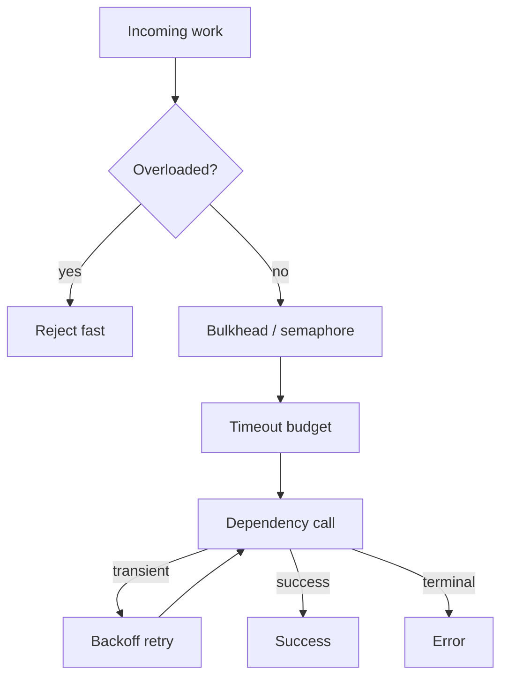

# Reliability Patterns

## Learning Goals

- Apply timeouts, retries, backoff, and idempotency in systems code.
- Use bulkheads and concurrency limits to isolate failures.
- Implement fail-fast overload behavior (load shedding).
- Distinguish retryable vs terminal errors at API boundaries.
- Combine patterns without creating retry storms.
- Express reliability as testable policy, not folklore.

## Concept Diagram



Reliability is the art of **bounding damage** when something fails—including your own retries.

## Core Patterns

| Pattern | Intent |
|---------|--------|
| Timeout | never wait forever |
| Retry + backoff | survive blips |
| Idempotency | safe retries |
| Circuit breaker | stop calling a sick dependency |
| Bulkhead | isolate resource pools |
| Load shedding | protect the core under overload |
| Hedging | race a backup request (careful) |

## Timeouts Everywhere

```rust
use std::time::Duration;
use tokio::time::timeout;

async fn fetch() -> Result<String, &'static str> {
    timeout(Duration::from_millis(200), slow())
        .await
        .map_err(|_| "timeout")?
}

async fn slow() -> Result<String, &'static str> {
    tokio::time::sleep(Duration::from_secs(2)).await;
    Ok("data".into())
}

#[tokio::main]
async fn main() {
    println!("{:?}", fetch().await);
}
```

Propagate **remaining budget** to nested calls so the whole request respects a single deadline (see Async Architecture).

## Retries with Full Jitter

```rust
use rand::Rng;
use std::time::Duration;

#[derive(Clone, Copy)]
struct Retry {
    max_attempts: u32,
    base: Duration,
    cap: Duration,
}

async fn call_with_retry<F, Fut, T, E>(policy: Retry, mut f: F) -> Result<T, E>
where
    F: FnMut() -> Fut,
    Fut: std::future::Future<Output = Result<T, E>>,
    E: IsRetryable,
{
    let mut attempt = 0;
    loop {
        attempt += 1;
        match f().await {
            Ok(v) => return Ok(v),
            Err(e) if e.is_retryable() && attempt < policy.max_attempts => {
                let exp = policy.base.as_millis() as u64 * 2u64.pow(attempt - 1);
                let cap = exp.min(policy.cap.as_millis() as u64);
                let sleep_ms = rand::thread_rng().gen_range(0..=cap.max(1));
                tokio::time::sleep(Duration::from_millis(sleep_ms)).await;
            }
            Err(e) => return Err(e),
        }
    }
}

trait IsRetryable {
    fn is_retryable(&self) -> bool;
}
```

### What to retry

Retry:

- connect timeouts  
- 503 / “overloaded” from peers  
- explicit transient error codes  

Do **not** retry:

- 400 validation errors  
- 401/403 auth  
- “already exists” without idempotency key  
- most 404s  

## Idempotency Keys

For side-effecting operations:

```rust
use std::collections::HashMap;
use std::sync::Mutex;

struct IdemStore {
    inner: Mutex<HashMap<String, String>>,
}

impl IdemStore {
    fn once(&self, key: &str, compute: impl FnOnce() -> String) -> String {
        let mut g = self.inner.lock().unwrap();
        if let Some(v) = g.get(key) {
            return v.clone();
        }
        let v = compute();
        g.insert(key.to_string(), v.clone());
        v
    }
}
```

Clients send `Idempotency-Key: <uuid>`; servers store results for a TTL. Retries then return the same outcome.

## Circuit Breaker (lightweight sketch)

```rust
use std::sync::atomic::{AtomicU32, Ordering};
use std::time::{Duration, Instant};
use std::sync::Mutex;

struct Breaker {
    failures: AtomicU32,
    threshold: u32,
    open_until: Mutex<Option<Instant>>,
    cool_down: Duration,
}

impl Breaker {
    fn allow(&self) -> bool {
        if let Some(until) = *self.open_until.lock().unwrap() {
            if Instant::now() < until {
                return false;
            }
            *self.open_until.lock().unwrap() = None;
            self.failures.store(0, Ordering::Relaxed);
        }
        true
    }

    fn on_success(&self) {
        self.failures.store(0, Ordering::Relaxed);
    }

    fn on_failure(&self) {
        let f = self.failures.fetch_add(1, Ordering::Relaxed) + 1;
        if f >= self.threshold {
            *self.open_until.lock().unwrap() = Some(Instant::now() + self.cool_down);
        }
    }
}
```

Production libraries add half-open probes and metrics; the design intent is **fail fast** when a dependency is down.

## Bulkheads

Separate pools so one storm doesn’t exhaust everything:

| Pool | Limit |
|------|-------|
| Inbound HTTP | 500 concurrent |
| Outbound HTTP client A | 100 |
| Outbound DB | 20 |
| Background jobs | 10 |

```rust
use std::sync::Arc;
use tokio::sync::Semaphore;

struct Pools {
    db: Arc<Semaphore>,
    http: Arc<Semaphore>,
}

async fn with_db<T>(pools: &Pools, f: impl std::future::Future<Output = T>) -> T {
    let _p = pools.db.acquire().await.unwrap();
    f.await
}
```

## Load Shedding

When queues are full, **reject early** with 503/busy instead of accepting infinite work:

```rust
use tokio::sync::mpsc;

async fn enqueue(tx: &mpsc::Sender<Job>, job: Job) -> Result<(), &'static str> {
    tx.try_send(job).map_err(|_| "busy")
}

struct Job;
```

Pair with client retries **only** if the operation is safe—and prefer that clients back off.

## Hedged Requests (use sparingly)

Send a second request if the first is slow; cancel the loser. Amplifies load—only for read-mostly, idempotent calls with careful budgets.

```rust
use tokio::select;
use tokio::time::{sleep, Duration};

async fn hedged() -> &'static str {
    let primary = async {
        sleep(Duration::from_millis(100)).await;
        "primary"
    };
    let hedge = async {
        sleep(Duration::from_millis(50)).await; // wait before hedge
        sleep(Duration::from_millis(30)).await;
        "hedge"
    };
    select! {
        v = primary => v,
        v = hedge => v,
    }
}
```

## Fallbacks

```rust
async fn price() -> Result<f64, &'static str> {
    Err("down")
}

async fn price_or_default() -> f64 {
    price().await.unwrap_or(0.0) // only if default is safe product-wise!
}
```

Fallbacks can hide outages—always **metric** when serving stale/default data.

## Health of Dependencies

At startup and periodically:

```rust
async fn dep_ok() -> bool {
    timeout(Duration::from_millis(100), ping())
        .await
        .unwrap_or(Ok(false))
        .unwrap_or(false)
}

async fn ping() -> Result<bool, ()> {
    Ok(true)
}

use tokio::time::timeout;
use std::time::Duration;
```

Fail readiness if critical deps are down; for optional deps, degrade features.

## Poison Messages / Dead Letter

Workers should not infinite-retry a permanently bad payload:

1. max attempts  
2. dead-letter queue / file  
3. alert on DLQ depth  

```rust
fn should_dead_letter(attempts: u32, permanent: bool) -> bool {
    permanent || attempts >= 5
}
```

## Combining Patterns Safely

Bad:

- edge retries × middleware retries × client retries × DB driver retries  

Good:

- **one** retry policy per hop  
- shared deadline  
- jittered backoff  
- bulkheads on each dependency  

## Testing Reliability

```rust
#[tokio::test]
async fn timeout_fires() {
    let res = tokio::time::timeout(
        Duration::from_millis(20),
        tokio::time::sleep(Duration::from_millis(100)),
    )
    .await;
    assert!(res.is_err());
}

use std::time::Duration;
```

Use fault injection (next chapters) to force transient errors and assert retry counts.

## Hands-On Practice

1. Wrap a flaky async function with retries; count attempts via atomic.
2. Add timeout smaller than work duration; assert error.
3. Implement `try_send` load shedding; flood and count rejects.
4. Split two semaphores for “db” vs “http” simulated work.
5. Classify five error cases as retryable or not in an enum.
6. Add an idempotency map for a fake “create charge” function.
7. Sketch circuit breaker open after N failures; unit test `allow()`.
8. Document policies in a table (timeouts, attempts, caps).

## Common Mistakes

- Infinite retries without deadline.  
- Retrying non-idempotent POSTs.  
- Synchronized retries thundering a recovering host (no jitter).  
- One giant pool for all I/O.  
- Serving fallbacks without metrics.  
- Ignoring DLQ growth.  
- Timeouts longer than caller’s patience (cascading waits).

## Review Questions

1. Why is full jitter preferred over fixed backoff?
2. What makes an operation safe to retry?
3. How do bulkheads limit blast radius?
4. When is failing fast better than queuing?
5. Why can nested retries be dangerous?

## Chapter Summary

Reliability patterns—**timeouts, retries, idempotency, breakers, bulkheads, shedding**—keep systems responsive under stress. Encode them as explicit policy with metrics and tests. Next: **observability basics** so you can see whether those patterns are working.
