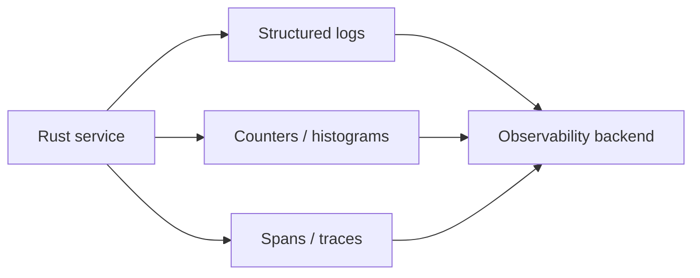

# Observability Basics

## Learning Goals

- Instrument Rust systems with **logs**, **metrics**, and **traces** (the three pillars).
- Use `tracing` effectively with structured fields and spans across await points.
- Define golden signals: latency, traffic, errors, saturation.
- Propagate correlation IDs through jobs and requests.
- Export metrics in a scrape-friendly way (conceptual Prometheus exposition).
- Avoid high-cardinality labels and secret leakage.

## Concept Diagram



If you can’t see it, you can’t operate it. Observability turns failures into **questions you can answer**.

## Structured Logging with `tracing`

```toml
tracing = "0.1"
tracing-subscriber = { version = "0.3", features = ["env-filter", "json"] }
```

```rust
use tracing::{error, info, warn, instrument};
use tracing_subscriber::EnvFilter;

#[instrument(fields(user_id = %user_id))]
async fn handle(user_id: u64) {
    info!("start");
    if user_id == 0 {
        warn!("suspicious id");
    }
    info!("done");
}

#[tokio::main]
async fn main() {
    tracing_subscriber::fmt()
        .with_env_filter(EnvFilter::from_default_env())
        .json() // or pretty for dev
        .init();

    handle(42).await;
}
```

```bash
RUST_LOG=info,mycrate=debug cargo run
```

### Field discipline

```rust
info!(request_id = %rid, path = %path, latency_ms = 12_i64, "request finished");
```

Prefer structured fields over string interpolation for queryability.

### Levels

| Level | Use |
|-------|-----|
| error | needs human attention |
| warn | degraded / retryable pain |
| info | lifecycle + request summaries |
| debug | detailed diagnostics |
| trace | extreme detail (usually off) |

## Correlation / Request IDs

```rust
use uuid::Uuid;

fn new_request_id() -> String {
    Uuid::new_v4().to_string()
}

async fn with_id() {
    let request_id = new_request_id();
    let span = tracing::info_span!("request", %request_id);
    let _g = span.enter();
    // or .instrument(span) on futures
    info!("inside request");
}
```

```toml
uuid = { version = "1", features = ["v4"] }
```

Pass the ID to downstream HTTP headers (`traceparent` / `x-request-id`) when you integrate OpenTelemetry later.

## Metrics: What to Measure

Golden signals (classic SRE):

1. **Latency** — histogram of request duration  
2. **Traffic** — QPS / job rate  
3. **Errors** — rate and ratio  
4. **Saturation** — queue depth, pool wait, CPU, memory  

```rust
use std::sync::atomic::{AtomicU64, Ordering};
use std::sync::Arc;

#[derive(Default)]
struct Metrics {
    requests: AtomicU64,
    errors: AtomicU64,
}

impl Metrics {
    fn inc_requests(&self) {
        self.requests.fetch_add(1, Ordering::Relaxed);
    }
    fn inc_errors(&self) {
        self.errors.fetch_add(1, Ordering::Relaxed);
    }
}

fn main() {
    let m = Arc::new(Metrics::default());
    m.inc_requests();
    println!("requests={}", m.requests.load(Ordering::Relaxed));
}
```

For production, prefer a metrics crate (`metrics` + Prometheus exporter, or OpenTelemetry meters). Atomics are fine for teaching and tiny tools.

### Histograms (conceptual)

Store latency buckets: e.g. 5, 10, 25, 50, 100, 250, 500, 1000, +Inf ms. Never compute only means.

```rust
fn bucket(ms: u64) -> &'static str {
    match ms {
        0..=5 => "le_5",
        6..=10 => "le_10",
        11..=50 => "le_50",
        51..=100 => "le_100",
        _ => "le_inf",
    }
}
```

## Prometheus Text Exposition (sketch)

```rust
use std::sync::atomic::{AtomicU64, Ordering};

static REQUESTS: AtomicU64 = AtomicU64::new(0);

fn render_metrics() -> String {
    let r = REQUESTS.load(Ordering::Relaxed);
    format!(
        "# HELP http_requests_total Total requests\n\
         # TYPE http_requests_total counter\n\
         http_requests_total {r}\n"
    )
}

fn main() {
    REQUESTS.fetch_add(1, Ordering::Relaxed);
    print!("{}", render_metrics());
}
```

Serve on an internal port; scrape with Prometheus. Label carefully.

### Cardinality warning

**Bad:** `path=/users/12345` as a label (unbounded).  
**Good:** `route=/users/:id` (bounded).

## Tracing Spans Across Async

```rust
use tracing::Instrument;

async fn downstream() {
    info!("downstream");
}

#[tokio::main]
async fn main() {
    tracing_subscriber::fmt().init();
    let span = tracing::info_span!("op", id = 7);
    downstream().instrument(span).await;
}

use tracing::info;
```

Without proper instrumentation, logs inside spawned tasks lose parent context—attach spans when spawning.

## Health Endpoints vs Metrics

| Endpoint | Purpose |
|----------|---------|
| `/healthz` or liveness | process up |
| `/readyz` | can serve traffic |
| `/metrics` | prometheus scrape |

Do not require heavy dependency checks on every liveness probe.

## Logging Security

Never log:

- passwords, tokens, session cookies  
- full payment card data  
- private keys  

Redact:

```rust
fn redact_email(email: &str) -> String {
    match email.split_once('@') {
        Some((u, d)) if !u.is_empty() => format!("{}***@{}", &u[..1], d),
        _ => "***".into(),
    }
}
```

## Sampling and Volume Control

High QPS services:

- sample traces (e.g. 1–5%) with always-on for errors  
- rate-limit debug logs  
- aggregate metrics instead of logging every request body  

## Local Dev Loop

```bash
RUST_LOG=debug cargo run
# JSON for shipping:
# use .json() subscriber format and pipe to jq
cargo run 2>&1 | jq .
```

## Minimal Production Setup Checklist

- [ ] `tracing` with `EnvFilter`  
- [ ] request/job ID on every log line  
- [ ] counter for requests/errors  
- [ ] latency histogram or summary  
- [ ] queue depth / semaphore available permits  
- [ ] `/metrics` or push model configured  
- [ ] log level configurable without rebuild  
- [ ] secrets redaction review  

## Example: Instrument a Job Handler

```rust
use std::time::Instant;
use tracing::{error, info, instrument};

#[instrument(skip(work), fields(job_id = %job_id))]
async fn run_job(job_id: &str, work: impl std::future::Future<Output = Result<(), String>>) {
    let start = Instant::now();
    match work.await {
        Ok(()) => info!(
            latency_ms = start.elapsed().as_millis() as u64,
            result = "ok",
            "job finished"
        ),
        Err(e) => error!(
            latency_ms = start.elapsed().as_millis() as u64,
            error = %e,
            result = "err",
            "job failed"
        ),
    }
}

#[tokio::main]
async fn main() {
    tracing_subscriber::fmt().init();
    run_job("abc", async { Ok(()) }).await;
    run_job("def", async { Err("boom".into()) }).await;
}
```

## Hands-On Practice

1. Add `tracing` to a small CLI or service; set `RUST_LOG`.
2. Emit structured fields (`request_id`, `latency_ms`).
3. Implement atomic counters for success/error; print Prometheus text.
4. Create a histogram bucketing helper; unit test buckets.
5. Instrument an async function with `#[instrument]` and nested span.
6. Add redaction helper for emails/tokens; test it.
7. List five metrics you would alert on for your advanced project worker.
8. `cargo fmt`, `clippy`, tests.

## Common Mistakes

- Unstructured `println!` only.  
- High-cardinality labels.  
- Logging secrets.  
- Metrics without units or help text.  
- Spans not attached across `tokio::spawn`.  
- Alerting on noisy debug conditions.  
- Mean latency without percentiles.

## Review Questions

1. Name the three observability pillars.
2. Why are structured fields better than free-text logs?
3. What are the four golden signals?
4. Why is `user_id` sometimes OK as a trace attribute but dangerous as a Prometheus label?
5. How do correlation IDs help incident response?

## Chapter Summary

Observability makes reliability engineering empirical: **structured logs**, **careful metrics**, and **traces** with correlation IDs. Start simple with `tracing` and a few golden signals; grow toward OpenTelemetry as systems scale. Next: **failure injection**—proving your instrumentation and reliability patterns under deliberate stress.
