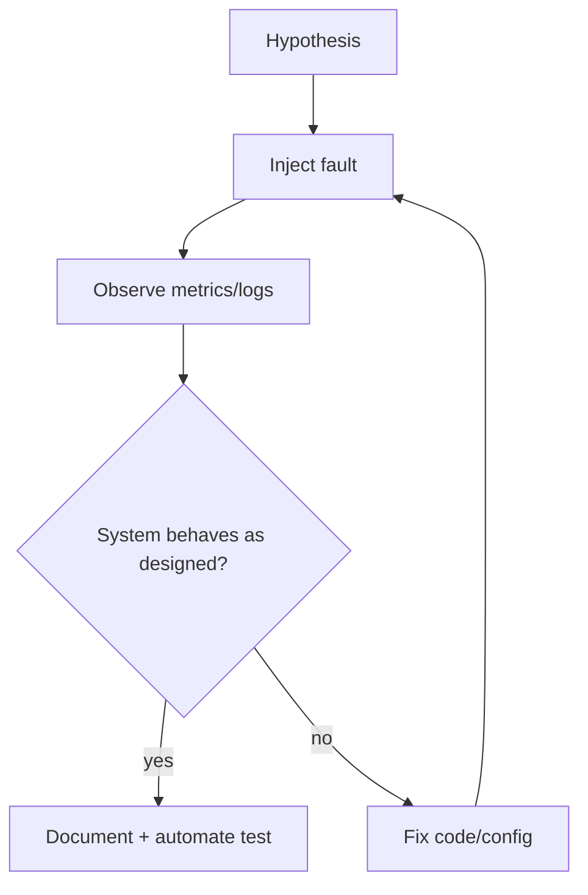

# Failure Injection

## Learning Goals

- Deliberately inject latency, errors, and process faults to validate reliability.
- Build test hooks (feature flags / chaos modules) that stay off in production by default.
- Use timeouts, kill -9, full disks, and dependency stubs as experimental tools.
- Design experiments with a hypothesis, blast radius, and abort criteria.
- Verify metrics and logs show the failure (observability closed loop).
- Avoid unsafe chaos in shared production without controls.

## Concept Diagram



Failure injection (chaos testing at small scale) proves that timeouts, retries, and drain logic work—not only that happy paths pass CI.

## Principles

1. **Hypothesis first** — “If DB latency is +500ms, p95 stays < 1s via timeout + 503.”  
2. **Minimize blast radius** — local process, staging, single tenant.  
3. **Prefer automation** — unit/integration tests with injected faults over manual only.  
4. **Make chaos optional** — compile-time features or runtime config, default off.  
5. **Observe** — if you can’t see the fault, the experiment failed.

## Inject Latency

```rust
use std::time::Duration;
use tokio::time::sleep;

#[derive(Clone, Default)]
struct Chaos {
    extra_latency: Duration,
}

impl Chaos {
    async fn hit(&self) {
        if !self.extra_latency.is_zero() {
            sleep(self.extra_latency).await;
        }
    }
}

async fn work(chaos: &Chaos) {
    chaos.hit().await;
    // real work
}
```

```rust
#[tokio::test]
async fn timeout_still_protects() {
    let chaos = Chaos {
        extra_latency: Duration::from_millis(100),
    };
    let res = tokio::time::timeout(Duration::from_millis(20), work(&chaos)).await;
    assert!(res.is_err());
}
```

## Inject Errors

```rust
use std::sync::atomic::{AtomicU32, Ordering};

struct Flaky {
    fail_times: AtomicU32,
}

impl Flaky {
    fn new(n: u32) -> Self {
        Self {
            fail_times: AtomicU32::new(n),
        }
    }

    async fn call(&self) -> Result<&'static str, &'static str> {
        let left = self.fail_times.load(Ordering::SeqCst);
        if left > 0 {
            self.fail_times.fetch_sub(1, Ordering::SeqCst);
            return Err("transient");
        }
        Ok("ok")
    }
}

#[tokio::test]
async fn retries_succeed() {
    let f = Flaky::new(2);
    // call retry helper from reliability chapter until Ok
    let mut attempts = 0;
    let mut result = Err("x");
    while attempts < 5 {
        attempts += 1;
        match f.call().await {
            Ok(v) => {
                result = Ok(v);
                break;
            }
            Err(_) => continue,
        }
    }
    assert_eq!(result, Ok("ok"));
    assert_eq!(attempts, 3);
}
```

## Feature-Gated Chaos Module

```toml
[features]
default = []
chaos = []
```

```rust
#[cfg(feature = "chaos")]
pub async fn maybe_fault() {
    if std::env::var("CHAOS_LATENCY_MS").ok().and_then(|s| s.parse().ok()) is_some_and(|ms: u64| ms > 0) {
        let ms: u64 = std::env::var("CHAOS_LATENCY_MS").unwrap().parse().unwrap_or(0);
        tokio::time::sleep(std::time::Duration::from_millis(ms)).await;
    }
}

#[cfg(not(feature = "chaos"))]
pub async fn maybe_fault() {}
```

```bash
cargo run --features chaos
CHAOS_LATENCY_MS=200 cargo run --features chaos
```

Never enable chaos features in production release pipelines without explicit, audited configuration.

## Process-Level Faults

```bash
# hang-like: stop process (SIGSTOP) then continue
kill -STOP <pid>
# observe LB/readiness if any
kill -CONT <pid>

# hard kill — does not run Drop / SIGTERM handlers
kill -9 <pid>
# systemd should restart if Restart=on-failure/always

# clean stop
systemctl stop myservice
```

Hypotheses:

- After SIGTERM, drain logs appear and exit within TimeoutStopSec.  
- After SIGKILL, supervisor restarts; clients retry successfully.

## Dependency Stubs

In tests, replace network with a stub implementing the same trait:

```rust
#[async_trait::async_trait]
trait Clock {
    async fn now_msg(&self) -> String;
}

struct OkClock;
struct SlowClock;

#[async_trait::async_trait]
impl Clock for OkClock {
    async fn now_msg(&self) -> String {
        "ok".into()
    }
}

#[async_trait::async_trait]
impl Clock for SlowClock {
    async fn now_msg(&self) -> String {
        tokio::time::sleep(std::time::Duration::from_millis(500)).await;
        "slow".into()
    }
}
```

```toml
async-trait = "0.1"
```

(Or use async fn in traits on modern Rust without the crate for simpler cases.)

## Resource Exhaustion Experiments

| Fault | How (local) | What to watch |
|-------|-------------|---------------|
| FD limit | `ulimit -n 32` then load | accept errors, metrics |
| Disk full | fill a loopback/tmp mount | write errors, atomic write safety |
| Memory pressure | large allocations / cgroup limits | OOM kills, restarts |
| CPU starve | `stress-ng` / busy loops | latency, timeouts |

```bash
# example: lower FD limit for a shell session
ulimit -n 64
./target/release/myservice
```

## Network Faults (tools)

When available on your platform:

```bash
# Linux tc netem examples (requires privileges; careful on shared hosts)
# sudo tc qdisc add dev lo root netem delay 200ms
# sudo tc qdisc del dev lo root
```

Safer for learning: inject delay in the client/server **application** chaos layer.

## Experiment Template

```markdown
## Experiment: DB delay 300ms
Date:
Environment: local docker-compose
Hypothesis: API returns 503 within 100ms client timeout; error metric +1; no crash
Method: CHAOS_LATENCY_MS=300 on db stub
Duration: 5 minutes
Blast radius: single laptop
Abort if: machine OOM / host network break
Results:
Metrics:
Logs:
Decision: pass / fail → follow-ups
```

## Automating in CI

```rust
#[tokio::test]
async fn overload_rejects() {
    let (tx, mut rx) = tokio::sync::mpsc::channel::<u32>(2);
    assert!(tx.try_send(1).is_ok());
    assert!(tx.try_send(2).is_ok());
    assert!(tx.try_send(3).is_err());
    assert_eq!(rx.recv().await, Some(1));
}
```

CI should run **deterministic** fault tests. Reserve full chaos days for staging.

## Observability Closed Loop

When you inject a fault, assert:

1. An **error counter** increases (or latency histogram shifts).  
2. Logs contain the correlation id + fault reason.  
3. Recovery: after chaos off, success rate returns.  

If none of these fire, fix instrumentation before more chaos.

## Safety Rules

- Do not chaos shared production without approval and progressive delivery.  
- Do not kill random host processes you don’t own.  
- Prefer application-level toggles over kernel network breaks on dev laptops used for work.  
- Clean up `tc` rules and env vars after experiments.  
- Never commit default-on chaos.

## Hands-On Practice

1. Add a `Chaos` latency hook to a sample async function; write a timeout test.
2. Build a flaky dependency that fails N times; prove retries.
3. Feature-gate chaos behind `features = ["chaos"]`.
4. Run your service under systemd; `kill -9` and confirm restart + journal logs.
5. Lower `ulimit -n` and open connections until failure; record the error.
6. Fill a temp directory mount (or simulate write error with a stub) and ensure atomic write leaves old file intact.
7. Write an experiment report using the template.
8. Add one CI test that encodes a reliability hypothesis.

## Common Mistakes

- Chaos without metrics (“looked fine”).  
- Experiments too large to interpret.  
- Leaving latency injection on in prod config.  
- Concluding “retries work” without testing permanent errors (retry storms).  
- Using only happy-path integration tests.  
- Ignoring recovery verification.

## Review Questions

1. Why start with a hypothesis?
2. What is blast radius?
3. Why feature-gate chaos code?
4. How does SIGKILL differ from SIGTERM for your app?
5. What three signals confirm a fault was observed?

## Chapter Summary

Failure injection validates that **timeouts, retries, supervisors, and observability** work under stress. Start with deterministic tests and application-level faults; graduate to process and environment chaos with clear safety boundaries. Next: the **systems capstone** pulls files, sockets, lifecycle, systemd thinking, reliability, and observability into one project.
