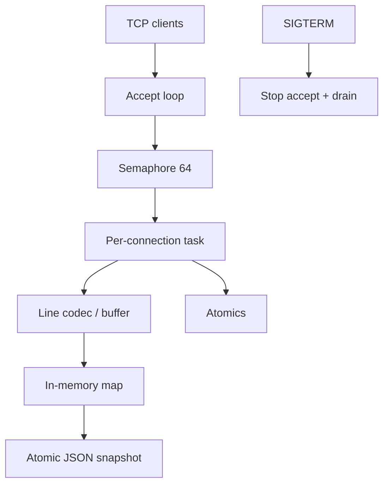

# Systems Capstone

## Learning Goals

- Build an end-to-end **systems service** that uses files, processes (optional helpers), sockets, framing, lifecycle, reliability, and observability.
- Ship a design you could run under systemd with graceful drain.
- Practice bounded concurrency, max frame sizes, and structured logs/metrics.
- Produce tests including at least one failure-injection case.
- Leave with a portfolio-ready README and operator notes.

## Capstone Project: `lined` — Line Protocol Daemon

You will implement **`lined`**: a TCP service that speaks a simple newline-framed protocol, persists a tiny key-value store to disk atomically, exposes metrics, and shuts down cleanly on SIGTERM/Ctrl+C.

### Protocol (v1)

Client sends UTF-8 lines; server responds with one line:

| Request | Response |
|---------|----------|
| `PING` | `PONG` |
| `GET <key>` | `VALUE <key> <value>` or `ERR not_found` |
| `SET <key> <value>` | `OK` |
| `DEL <key>` | `OK` or `ERR not_found` |
| `STATS` | `STATS keys=<n> requests=<n> errors=<n>` |
| anything else | `ERR unknown_command` |

Rules:

- Max line length: **4 KiB**  
- Keys: `[A-Za-z0-9_.:-]+` max 128 chars  
- Values: rest of line after key; max 3 KiB  
- Single space separators  

### Non-functional requirements

- Listen on configurable `HOST:PORT` (default `127.0.0.1:7070`)  
- Max concurrent connections: **64** (semaphore)  
- Idle read timeout: **30s**  
- Persist store to `DATA_DIR/store.json` via atomic write every N mutations or on shutdown  
- Structured logging with `tracing`  
- Counters: connections, requests, errors  
- Graceful shutdown: stop accept, drain up to 10s  

## Concept Diagram



## Suggested Layout

```text
lined/
  Cargo.toml
  README.md
  src/
    main.rs
    lib.rs
    config.rs
    proto.rs
    store.rs
    server.rs
    metrics.rs
  systemd/
    lined.service
  tests/
    proto.rs
    integration.rs
```

```toml
[package]
name = "lined"
version = "0.1.0"
edition = "2024"

[dependencies]
tokio = { version = "1", features = ["full"] }
serde = { version = "1", features = ["derive"] }
serde_json = "1"
tracing = "0.1"
tracing-subscriber = { version = "0.3", features = ["env-filter"] }
thiserror = "2"
anyhow = "1"
bytes = "1"

[dev-dependencies]
tokio = { version = "1", features = ["full", "test-util"] }
```

## Milestone 1 — Protocol parsing (pure Rust)

```rust
// src/proto.rs
#[derive(Debug, PartialEq, Eq)]
pub enum Request {
    Ping,
    Get { key: String },
    Set { key: String, value: String },
    Del { key: String },
    Stats,
}

#[derive(Debug, PartialEq, Eq)]
pub enum Response {
    Pong,
    Value { key: String, value: String },
    Ok,
    Stats { keys: u64, requests: u64, errors: u64 },
    Err(&'static str),
}

pub fn parse_line(line: &str) -> Result<Request, &'static str> {
    let line = line.trim_end_matches(['\r', '\n']);
    if line.len() > 4096 {
        return Err("too_large");
    }
    let mut parts = line.splitn(3, ' ');
    let cmd = parts.next().unwrap_or("");
    match cmd {
        "PING" => Ok(Request::Ping),
        "STATS" => Ok(Request::Stats),
        "GET" => {
            let key = parts.next().ok_or("bad_args")?;
            validate_key(key)?;
            Ok(Request::Get {
                key: key.to_string(),
            })
        }
        "SET" => {
            let key = parts.next().ok_or("bad_args")?;
            let value = parts.next().ok_or("bad_args")?;
            validate_key(key)?;
            if value.len() > 3072 {
                return Err("value_too_large");
            }
            Ok(Request::Set {
                key: key.to_string(),
                value: value.to_string(),
            })
        }
        "DEL" => {
            let key = parts.next().ok_or("bad_args")?;
            validate_key(key)?;
            Ok(Request::Del {
                key: key.to_string(),
            })
        }
        _ => Err("unknown_command"),
    }
}

fn validate_key(key: &str) -> Result<(), &'static str> {
    if key.is_empty() || key.len() > 128 {
        return Err("bad_key");
    }
    if !key
        .chars()
        .all(|c| c.is_ascii_alphanumeric() || matches!(c, '_' | '.' | ':' | '-'))
    {
        return Err("bad_key");
    }
    Ok(())
}

impl Response {
    pub fn encode(&self) -> String {
        match self {
            Response::Pong => "PONG\n".into(),
            Response::Ok => "OK\n".into(),
            Response::Value { key, value } => format!("VALUE {key} {value}\n"),
            Response::Stats {
                keys,
                requests,
                errors,
            } => format!("STATS keys={keys} requests={requests} errors={errors}\n"),
            Response::Err(code) => format!("ERR {code}\n"),
        }
    }
}

#[cfg(test)]
mod tests {
    use super::*;

    #[test]
    fn parses_set_get() {
        assert_eq!(
            parse_line("SET a hello world"),
            Ok(Request::Set {
                key: "a".into(),
                value: "hello world".into()
            })
        );
        assert_eq!(
            parse_line("GET a"),
            Ok(Request::Get { key: "a".into() })
        );
    }
}
```

## Milestone 2 — Store + atomic persistence

```rust
// src/store.rs
use serde::{Deserialize, Serialize};
use std::collections::HashMap;
use std::path::{Path, PathBuf};
use tokio::sync::RwLock;

#[derive(Default, Serialize, Deserialize)]
pub struct Snapshot {
    pub map: HashMap<String, String>,
}

pub struct Store {
    inner: RwLock<HashMap<String, String>>,
    path: PathBuf,
    dirty: std::sync::atomic::AtomicU64,
}

impl Store {
    pub async fn open(path: impl Into<PathBuf>) -> anyhow::Result<Self> {
        let path = path.into();
        let map = if path.exists() {
            let data = tokio::fs::read(&path).await?;
            let snap: Snapshot = serde_json::from_slice(&data).unwrap_or_default();
            snap.map
        } else {
            HashMap::new()
        };
        Ok(Self {
            inner: RwLock::new(map),
            path,
            dirty: std::sync::atomic::AtomicU64::new(0),
        })
    }

    pub async fn get(&self, key: &str) -> Option<String> {
        self.inner.read().await.get(key).cloned()
    }

    pub async fn set(&self, key: String, value: String) {
        self.inner.write().await.insert(key, value);
        self.dirty
            .fetch_add(1, std::sync::atomic::Ordering::Relaxed);
    }

    pub async fn del(&self, key: &str) -> bool {
        let removed = self.inner.write().await.remove(key).is_some();
        if removed {
            self.dirty
                .fetch_add(1, std::sync::atomic::Ordering::Relaxed);
        }
        removed
    }

    pub async fn len(&self) -> usize {
        self.inner.read().await.len()
    }

    pub async fn flush(&self) -> anyhow::Result<()> {
        let map = self.inner.read().await.clone();
        let bytes = serde_json::to_vec_pretty(&Snapshot { map })?;
        atomic_write(&self.path, &bytes).await?;
        self.dirty.store(0, std::sync::atomic::Ordering::Relaxed);
        Ok(())
    }

    pub fn dirty_count(&self) -> u64 {
        self.dirty.load(std::sync::atomic::Ordering::Relaxed)
    }
}

async fn atomic_write(path: &Path, bytes: &[u8]) -> anyhow::Result<()> {
    let tmp = path.with_extension("json.tmp");
    tokio::fs::write(&tmp, bytes).await?;
    // Best-effort durability; on some platforms File::sync_all after write is stronger.
    tokio::fs::rename(&tmp, path).await?;
    Ok(())
}
```

## Milestone 3 — Metrics

```rust
// src/metrics.rs
use std::sync::atomic::{AtomicU64, Ordering};
use std::sync::Arc;

#[derive(Default)]
pub struct Metrics {
    pub connections: AtomicU64,
    pub requests: AtomicU64,
    pub errors: AtomicU64,
}

pub type SharedMetrics = Arc<Metrics>;

impl Metrics {
    pub fn snapshot(&self) -> (u64, u64, u64) {
        (
            self.connections.load(Ordering::Relaxed),
            self.requests.load(Ordering::Relaxed),
            self.errors.load(Ordering::Relaxed),
        )
    }
}
```

## Milestone 4 — Server loop

```rust
// src/server.rs (sketch)
use crate::metrics::SharedMetrics;
use crate::proto::{parse_line, Request, Response};
use crate::store::Store;
use std::sync::Arc;
use std::time::Duration;
use tokio::io::{AsyncBufReadExt, AsyncWriteExt, BufReader};
use tokio::net::{TcpListener, TcpStream};
use tokio::sync::{watch, Semaphore};
use tracing::{info, warn};

pub struct Server {
    pub store: Arc<Store>,
    pub metrics: SharedMetrics,
    pub max_conns: usize,
}

impl Server {
    pub async fn run(
        self,
        addr: &str,
        mut shutdown: watch::Receiver<bool>,
    ) -> anyhow::Result<()> {
        let listener = TcpListener::bind(addr).await?;
        info!(%addr, "listening");
        let sem = Arc::new(Semaphore::new(self.max_conns));

        loop {
            tokio::select! {
                _ = shutdown.changed() => {
                    if *shutdown.borrow() {
                        info!("stopping accept");
                        break;
                    }
                }
                acc = listener.accept() => {
                    let (socket, peer) = acc?;
                    let permit = sem.clone().acquire_owned().await?;
                    let store = Arc::clone(&self.store);
                    let metrics = Arc::clone(&self.metrics);
                    tokio::spawn(async move {
                        let _permit = permit;
                        metrics.connections.fetch_add(1, std::sync::atomic::Ordering::Relaxed);
                        if let Err(e) = handle_conn(socket, store, metrics).await {
                            warn!(%peer, error=%e, "conn error");
                        }
                    });
                }
            }
        }
        Ok(())
    }
}

async fn handle_conn(
    socket: TcpStream,
    store: Arc<Store>,
    metrics: SharedMetrics,
) -> anyhow::Result<()> {
    let (reader, mut writer) = socket.into_split();
    let mut lines = BufReader::new(reader).lines();

    loop {
        let line = tokio::time::timeout(Duration::from_secs(30), lines.next_line()).await;
        let line = match line {
            Ok(Ok(Some(l))) => l,
            Ok(Ok(None)) => break,
            Ok(Err(e)) => return Err(e.into()),
            Err(_) => {
                writer.write_all(b"ERR timeout\n").await.ok();
                break;
            }
        };

        metrics
            .requests
            .fetch_add(1, std::sync::atomic::Ordering::Relaxed);
        let resp = match parse_line(&line) {
            Ok(req) => dispatch(req, &store, &metrics).await,
            Err(code) => {
                metrics
                    .errors
                    .fetch_add(1, std::sync::atomic::Ordering::Relaxed);
                Response::Err(code)
            }
        };
        writer.write_all(resp.encode().as_bytes()).await?;
    }
    Ok(())
}

async fn dispatch(req: Request, store: &Store, metrics: &SharedMetrics) -> Response {
    match req {
        Request::Ping => Response::Pong,
        Request::Get { key } => match store.get(&key).await {
            Some(value) => Response::Value { key, value },
            None => Response::Err("not_found"),
        },
        Request::Set { key, value } => {
            store.set(key, value).await;
            if store.dirty_count() >= 32 {
                if let Err(e) = store.flush().await {
                    warn!(error=%e, "flush failed");
                }
            }
            Response::Ok
        }
        Request::Del { key } => {
            if store.del(&key).await {
                Response::Ok
            } else {
                Response::Err("not_found")
            }
        }
        Request::Stats => {
            let (_c, requests, errors) = metrics.snapshot();
            Response::Stats {
                keys: store.len().await as u64,
                requests,
                errors,
            }
        }
    }
}
```

## Milestone 5 — `main` + shutdown + flush

```rust
// src/main.rs
use lined::metrics::Metrics;
use lined::server::Server;
use lined::store::Store;
use std::sync::Arc;
use std::time::Duration;
use tokio::sync::watch;
use tracing::info;
use tracing_subscriber::EnvFilter;

#[tokio::main]
async fn main() -> anyhow::Result<()> {
    tracing_subscriber::fmt()
        .with_env_filter(EnvFilter::from_default_env())
        .init();

    let addr = std::env::var("LINED_ADDR").unwrap_or_else(|_| "127.0.0.1:7070".into());
    let data = std::env::var("LINED_DATA").unwrap_or_else(|_| "./data/store.json".into());

    if let Some(parent) = std::path::Path::new(&data).parent() {
        tokio::fs::create_dir_all(parent).await?;
    }

    let store = Arc::new(Store::open(&data).await?);
    let metrics = Arc::new(Metrics::default());
    let server = Server {
        store: Arc::clone(&store),
        metrics,
        max_conns: 64,
    };

    let (tx, rx) = watch::channel(false);
    let serve = tokio::spawn(async move { server.run(&addr, rx).await });

    shutdown_signal().await;
    info!("shutdown signal");
    let _ = tx.send(true);

    let _ = tokio::time::timeout(Duration::from_secs(10), serve).await;
    store.flush().await?;
    info!("flushed and exit");
    Ok(())
}

async fn shutdown_signal() {
    let ctrl_c = async {
        tokio::signal::ctrl_c().await.ok();
    };
    #[cfg(unix)]
    {
        use tokio::signal::unix::{signal, SignalKind};
        let mut sigterm = signal(SignalKind::terminate()).expect("sigterm");
        tokio::select! {
            _ = ctrl_c => {}
            _ = sigterm.recv() => {}
        }
    }
    #[cfg(not(unix))]
    {
        ctrl_c.await;
    }
}
```

## Milestone 6 — systemd unit

```ini
# systemd/lined.service
[Unit]
Description=lined key-value TCP service
After=network.target

[Service]
Type=simple
ExecStart=/usr/local/bin/lined
Restart=on-failure
RestartSec=2
User=lined
Environment=RUST_LOG=info
Environment=LINED_ADDR=0.0.0.0:7070
Environment=LINED_DATA=/var/lib/lined/store.json
ReadWritePaths=/var/lib/lined
TimeoutStopSec=15
NoNewPrivileges=true
ProtectSystem=strict
ProtectHome=true
PrivateTmp=true

[Install]
WantedBy=multi-user.target
```

## Manual Test Script

```bash
cargo run

# other terminal
printf 'PING\n' | nc 127.0.0.1 7070
printf 'SET greeting hello lined\nGET greeting\nSTATS\n' | nc 127.0.0.1 7070
```

## Failure Injection for Capstone

1. Set idle timeout low in tests; ensure connection closes.  
2. Send a line > 4 KiB; expect error/close.  
3. Flood connections past 64; confirm wait or refuse behavior.  
4. Kill -9 during runtime; restart; verify last flushed data (may lose dirty buffer—document durability window).  
5. Inject flush I/O error (stub path to unwritable dir); service should log and keep serving.

## Acceptance Checklist

- [ ] Protocol unit tests pass  
- [ ] Integration: SET/GET over TCP  
- [ ] Max line length enforced  
- [ ] Concurrent clients ≥ 8 work  
- [ ] Ctrl+C / SIGTERM flushes store  
- [ ] `STATS` reflects counters  
- [ ] systemd unit file provided  
- [ ] README: run, env vars, protocol, durability notes  
- [ ] `cargo fmt`, `clippy`, `test`  
- [ ] At least one failure-injection test  

## Stretch Goals

1. AUTH token required as first command.  
2. Length-prefix binary mode alongside lines.  
3. Prometheus `/metrics` on a second port.  
4. `watch` config for max connections.  
5. Append-only write-ahead log for stronger durability.  
6. TLS with `tokio-rustls`.  
7. Integration with `LinesCodec` from `tokio_util`.  

## Hands-On Practice

1. Complete milestones 1–2 with tests only (no network).  
2. Add TCP server; manual `nc` test.  
3. Add semaphore + timeouts.  
4. Wire shutdown + flush.  
5. Write integration test spawning server on port 0.  
6. Add systemd unit and (if you have a Linux VM) install it.  
7. Run one chaos experiment; attach short report to README.  
8. Polish error messages and logging fields.

## Common Mistakes

- No max line length (memory DoS).  
- Shared `Mutex` held across slow disk flush on every SET.  
- Accepting during shutdown.  
- Forgetting to flush on stop.  
- Binding `0.0.0.0` without firewall awareness.  
- Skipping tests because “nc works on my machine.”  

## Review Questions

1. Where does framing show up in `lined`?  
2. How is bulkheading implemented?  
3. What durability guarantee do you actually provide?  
4. How do metrics help operate this service?  
5. What would you change first for multi-node deployment?  

## Chapter Summary

The systems capstone unifies **sockets, framing, files, lifecycle, reliability limits, and observability** into a small but realistic daemon. Completing `lined` (or an equally scoped variant) proves you can ship Rust systems software that operators can run, watch, stop, and trust. From here, later book parts expand into HTTP ecosystems, security, and distributed designs—on top of these foundations.
