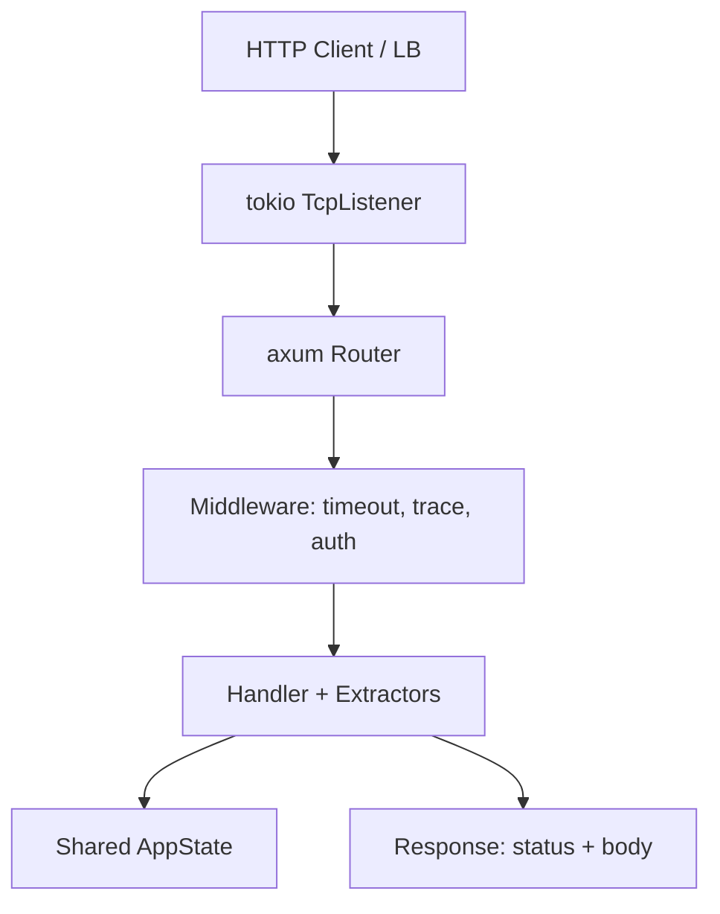

# HTTP Services with Axum and Hyper

## Learning Goals

- Build production-shaped HTTP APIs in Rust with **axum** (and understand where **hyper** sits underneath).
- Model routes, extractors, state, middleware, and typed JSON request/response bodies.
- Design health, readiness, and version endpoints that operators and load balancers can trust.
- Handle errors as HTTP status codes without panicking request workers.
- Know when to drop to hyper for custom protocols or ultra-low-level control.

## Why HTTP Still Dominates in 2026

Most internal and public APIs still speak HTTP/1.1 or HTTP/2. Clients, gateways, observability tooling, and browser ecosystems assume it. Rust’s ecosystem has settled on a clear stack:

| Layer | Crate | Role |
|-------|-------|------|
| Framework | **axum** | Routing, extractors, middleware, ergonomic handlers |
| Server / client core | **hyper** | HTTP/1 and HTTP/2 connection handling |
| Runtime | **tokio** | Async I/O, timers, tasks |
| TLS (optional) | **rustls** + tower/hyper adapters | Terminate TLS without OpenSSL |

Axum is a thin, type-driven layer on top of hyper + tower. You write handlers; axum turns them into a `Service` that hyper serves.

## Concept Diagram



## Mental Model: Request → Extract → Handle → Respond

1. A connection arrives on a `TcpListener`.
2. Hyper parses HTTP framing into a request.
3. Axum matches the path/method on the `Router`.
4. **Extractors** pull typed data from the request (`Path`, `Query`, `Json`, `State`, headers).
5. Your async handler runs and returns something that implements `IntoResponse`.
6. Errors convert to status codes via `IntoResponse` on your error type.

If extraction fails (bad JSON, missing path param), axum returns `4xx` before your handler runs.

## Project Skeleton

```bash
cargo new http-demo --bin
cd http-demo
```

`Cargo.toml` (2026-typical features; pin versions that resolve for you):

```toml
[package]
name = "http-demo"
version = "0.1.0"
edition = "2021"

[dependencies]
axum = "0.8"
tokio = { version = "1", features = ["full"] }
serde = { version = "1", features = ["derive"] }
serde_json = "1"
tower = "0.5"
tower-http = { version = "0.6", features = ["trace", "timeout", "cors"] }
tracing = "0.1"
tracing-subscriber = { version = "0.3", features = ["env-filter"] }
uuid = { version = "1", features = ["v4", "serde"] }
```

## Minimal Server: Health and Version

```rust
use axum::{
    routing::get,
    Json, Router,
};
use serde::Serialize;
use std::net::SocketAddr;
use tracing_subscriber::EnvFilter;

#[derive(Serialize)]
struct Health {
    status: &'static str,
}

#[derive(Serialize)]
struct Version {
    service: &'static str,
    version: &'static str,
}

async fn health() -> Json<Health> {
    Json(Health { status: "ok" })
}

async fn version() -> Json<Version> {
    Json(Version {
        service: "http-demo",
        version: env!("CARGO_PKG_VERSION"),
    })
}

#[tokio::main]
async fn main() {
    tracing_subscriber::fmt()
        .with_env_filter(EnvFilter::from_default_env().add_directive("info".parse().unwrap()))
        .init();

    let app = Router::new()
        .route("/health", get(health))
        .route("/version", get(version));

    let addr = SocketAddr::from(([127, 0, 0, 1], 3000));
    let listener = tokio::net::TcpListener::bind(addr).await.expect("bind");
    tracing::info!(%addr, "listening");
    axum::serve(listener, app).await.expect("serve");
}
```

Smoke test:

```bash
cargo run
# other terminal
curl -s http://127.0.0.1:3000/health
curl -s http://127.0.0.1:3000/version
```

## Shared State and a Small Resource API

Real services need shared state (config, pools, caches). Put it behind `Arc` and inject with `State`.

```rust
use axum::{
    extract::{Path, State},
    http::StatusCode,
    response::{IntoResponse, Response},
    routing::{get, post},
    Json, Router,
};
use serde::{Deserialize, Serialize};
use std::{
    collections::HashMap,
    net::SocketAddr,
    sync::Arc,
};
use tokio::sync::RwLock;
use uuid::Uuid;

#[derive(Clone)]
struct AppState {
    notes: Arc<RwLock<HashMap<Uuid, Note>>>,
}

#[derive(Clone, Serialize, Deserialize)]
struct Note {
    id: Uuid,
    title: String,
    body: String,
}

#[derive(Deserialize)]
struct CreateNote {
    title: String,
    body: String,
}

#[derive(Serialize)]
struct ErrorBody {
    error: String,
}

enum ApiError {
    NotFound,
    BadRequest(String),
}

impl IntoResponse for ApiError {
    fn into_response(self) -> Response {
        let (status, msg) = match self {
            ApiError::NotFound => (StatusCode::NOT_FOUND, "not found".into()),
            ApiError::BadRequest(m) => (StatusCode::BAD_REQUEST, m),
        };
        (status, Json(ErrorBody { error: msg })).into_response()
    }
}

async fn create_note(
    State(state): State<AppState>,
    Json(input): Json<CreateNote>,
) -> Result<(StatusCode, Json<Note>), ApiError> {
    if input.title.trim().is_empty() {
        return Err(ApiError::BadRequest("title required".into()));
    }
    let note = Note {
        id: Uuid::new_v4(),
        title: input.title,
        body: input.body,
    };
    state.notes.write().await.insert(note.id, note.clone());
    Ok((StatusCode::CREATED, Json(note)))
}

async fn get_note(
    State(state): State<AppState>,
    Path(id): Path<Uuid>,
) -> Result<Json<Note>, ApiError> {
    state
        .notes
        .read()
        .await
        .get(&id)
        .cloned()
        .map(Json)
        .ok_or(ApiError::NotFound)
}

async fn list_notes(State(state): State<AppState>) -> Json<Vec<Note>> {
    let notes = state.notes.read().await.values().cloned().collect();
    Json(notes)
}

#[tokio::main]
async fn main() {
    let state = AppState {
        notes: Arc::new(RwLock::new(HashMap::new())),
    };

    let app = Router::new()
        .route("/notes", post(create_note).get(list_notes))
        .route("/notes/{id}", get(get_note))
        .with_state(state);

    let listener = tokio::net::TcpListener::bind("127.0.0.1:3000")
        .await
        .expect("bind");
    axum::serve(listener, app).await.expect("serve");
}
```

Notes for 2026 axum:

- Path patterns use `{id}` style (not the older `:id` form in many older tutorials).
- Prefer explicit `ApiError: IntoResponse` over scattering `unwrap` in handlers.
- `RwLock` is fine for demos; production usually uses a DB pool (`sqlx`, `deadpool`, etc.).

## Middleware: Timeouts, Tracing, CORS

```rust
use axum::{Router, routing::get};
use std::time::Duration;
use tower_http::{
    timeout::TimeoutLayer,
    trace::TraceLayer,
};

async fn ping() -> &'static str {
    "pong"
}

fn app() -> Router {
    Router::new()
        .route("/ping", get(ping))
        .layer(TimeoutLayer::new(Duration::from_secs(5)))
        .layer(TraceLayer::new_for_http())
}
```

Order matters: layers wrap the inner service. Put auth/logging where you need them relative to routing. Use `tower::ServiceBuilder` when composing many layers.

## Liveness vs Readiness

| Endpoint | Meaning | When to fail |
|----------|---------|--------------|
| `/health` or `/livez` | Process is up | Almost never (unless self-check fails) |
| `/readyz` | Safe to receive traffic | DB down, cache cold, config missing |
| `/version` | Build identity | Never fails; used for deploy verification |

```rust
use axum::{extract::State, http::StatusCode, Json};
use serde::Serialize;
use std::sync::atomic::{AtomicBool, Ordering};
use std::sync::Arc;

#[derive(Clone)]
struct ReadyState {
    ready: Arc<AtomicBool>,
}

#[derive(Serialize)]
struct StatusMsg {
    status: &'static str,
}

async fn livez() -> Json<StatusMsg> {
    Json(StatusMsg { status: "alive" })
}

async fn readyz(State(s): State<ReadyState>) -> Result<Json<StatusMsg>, StatusCode> {
    if s.ready.load(Ordering::Relaxed) {
        Ok(Json(StatusMsg { status: "ready" }))
    } else {
        Err(StatusCode::SERVICE_UNAVAILABLE)
    }
}
```

Kubernetes-style probes call these separately. Mark ready only after migrations and dependency checks succeed.

## Where Hyper Fits

You rarely write raw hyper handlers for CRUD APIs. Use hyper when you need:

- Custom HTTP/1 vs HTTP/2 policy
- Client connection pooling with fine control (`hyper_util`)
- Streaming bodies without framework magic
- Non-REST protocols over HTTP

Conceptual client sketch (hyper + hyper-util style; check crate docs for exact 2026 APIs):

```rust
// Conceptual — wire exact types from hyper / hyper-util docs for your version
// Client::builder().build(connector) then send Request::builder()...
async fn fetch_example() {
    // Prefer reqwest for application clients unless you need hyper-level control.
}
```

For most application code, **reqwest** is the HTTP client and **axum** is the server.

## Structured Errors and Problem Details

Map domain failures to stable status codes:

| Domain | HTTP |
|--------|------|
| Validation | 400 |
| Auth missing | 401 |
| Authz denied | 403 |
| Missing resource | 404 |
| Conflict / duplicate | 409 |
| Rate limit | 429 |
| Upstream timeout | 504 or 503 |
| Bug / invariant | 500 (log + scrub) |

Never return raw `Display` of internal errors to clients. Log details; return a safe message and a correlation id.

```rust
use uuid::Uuid;

fn correlation_id() -> String {
    Uuid::new_v4().to_string()
}
```

## Testing Handlers Without Binding a Port

```rust
#[cfg(test)]
mod tests {
    use super::*;
    use axum::{
        body::Body,
        http::{Request, StatusCode},
    };
    use tower::ServiceExt; // for `oneshot`

    #[tokio::test]
    async fn health_ok() {
        let app = Router::new().route("/health", get(health));
        let res = app
            .oneshot(Request::builder().uri("/health").body(Body::empty()).unwrap())
            .await
            .unwrap();
        assert_eq!(res.status(), StatusCode::OK);
    }
}
```

This uses the tower `Service` interface axum implements — fast unit tests without sockets.

## Production Checklist

- [ ] Explicit timeouts on inbound requests and outbound clients
- [ ] Structured logs with request id / trace id
- [ ] Separate liveness and readiness
- [ ] Bound body size (reject multi-GB JSON)
- [ ] Graceful shutdown on SIGTERM (`axum::serve(...).with_graceful_shutdown`)
- [ ] No secrets in logs or error bodies
- [ ] CORS only where browsers need it — not open by default for APIs

Graceful shutdown sketch:

```rust
use tokio::signal;

async fn shutdown_signal() {
    let ctrl_c = async {
        signal::ctrl_c().await.expect("ctrl_c");
    };
    #[cfg(unix)]
    let terminate = async {
        signal::unix::signal(signal::unix::SignalKind::terminate())
            .expect("signal")
            .recv()
            .await;
    };
    #[cfg(not(unix))]
    let terminate = std::future::pending::<()>();

    tokio::select! {
        _ = ctrl_c => {},
        _ = terminate => {},
    }
}

// axum::serve(listener, app)
//     .with_graceful_shutdown(shutdown_signal())
//     .await
```

## Common Mistakes

- Holding a write lock across `.await` points that call other services (deadlocks / latency spikes).
- Using `unwrap` in handlers so one bad request kills the worker task.
- Treating `/health` as readiness and failing rollouts or black-holing traffic.
- Unbounded in-memory maps as “databases” (OOM under load).
- Forgetting that extractors short-circuit — validation errors never reach your custom logic unless you design for it.
- Copy-pasting `CorsLayer::permissive()` into production APIs.

## Hands-On Practice

1. Implement `POST /notes`, `GET /notes`, `GET /notes/{id}` with validation and typed errors.
2. Add `TraceLayer` and confirm request lines appear with `RUST_LOG=tower_http=trace`.
3. Add a 2-second `TimeoutLayer` and a slow handler; verify clients get timeout responses.
4. Write a `oneshot` test for `404` on missing note ids.
5. Add `/readyz` that flips to ready only after a simulated “migration” task finishes.

## Chapter Summary

HTTP services in modern Rust mean **tokio + hyper + axum + tower middleware**. Prefer axum for APIs, map domain errors to status codes, expose honest health/readiness signals, and keep shared state behind cheap clones of `Arc`. In the next chapter you will contrast this JSON-over-HTTP style with **gRPC** contracts and streaming RPCs.
