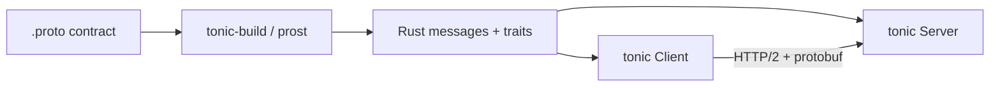

# gRPC Fundamentals in Rust

## Learning Goals

- Explain when gRPC beats REST/JSON and when it does not.
- Define services and messages with **Protocol Buffers** and generate Rust types.
- Stand up a minimal **tonic** server and client with deadlines and status codes.
- Design versioning, streaming, and error strategies for multi-service systems.
- Avoid common protobuf/gRPC pitfalls (large messages, missing timeouts, weak contracts).

## Why gRPC

gRPC is an RPC framework over **HTTP/2** with:

- Contract-first APIs (`.proto` files)
- Efficient binary encoding (protobuf)
- Multiplexed streams on one connection
- First-class deadlines, cancellation, and metadata
- Generated stubs in many languages

Rust’s mainstream stack in 2026:

| Piece | Crate / tool |
|-------|----------------|
| Runtime | tokio |
| gRPC | **tonic** |
| Protobuf codegen | **prost** + `tonic-build` |
| HTTP/2 / transport | hyper (via tonic) |
| TLS | tonic TLS features + rustls/native options |

Use gRPC for service-to-service APIs with stable schemas. Prefer HTTP/JSON for public browser APIs unless you have generated clients and HTTP/2 everywhere.

## Concept Diagram



## Four RPC Shapes

1. **Unary** — one request, one response (most common).
2. **Server streaming** — one request, stream of responses.
3. **Client streaming** — stream of requests, one response.
4. **Bidirectional streaming** — both sides stream.

Start with unary. Add streaming only when the domain needs it (log tails, large result sets, live telemetry).

## Project Layout

```text
grpc-demo/
  Cargo.toml
  build.rs
  proto/notes/v1/notes.proto
  src/main.rs          # or bin/server.rs + bin/client.rs
```

`Cargo.toml`:

```toml
[package]
name = "grpc-demo"
version = "0.1.0"
edition = "2021"

[dependencies]
tonic = "0.12"
prost = "0.13"
tokio = { version = "1", features = ["full"] }
tokio-stream = "0.1"
tracing = "0.1"
tracing-subscriber = "0.3"

[build-dependencies]
tonic-build = "0.12"
```

`build.rs`:

```rust
fn main() -> Result<(), Box<dyn std::error::Error>> {
    tonic_build::configure()
        .build_server(true)
        .build_client(true)
        .compile_protos(&["proto/notes/v1/notes.proto"], &["proto"])?;
    Ok(())
}
```

## Proto Contract

`proto/notes/v1/notes.proto`:

```protobuf
syntax = "proto3";

package notes.v1;

// Version the package path: notes.v1 → notes.v2 for breaking changes.

service NoteService {
  rpc CreateNote (CreateNoteRequest) returns (Note);
  rpc GetNote (GetNoteRequest) returns (Note);
  rpc ListNotes (ListNotesRequest) returns (ListNotesResponse);
}

message Note {
  string id = 1;
  string title = 2;
  string body = 3;
}

message CreateNoteRequest {
  string title = 1;
  string body = 2;
}

message GetNoteRequest {
  string id = 1;
}

message ListNotesRequest {}

message ListNotesResponse {
  repeated Note notes = 1;
}
```

Rules of thumb:

- Field numbers are forever — never reuse numbers after shipping.
- Add optional fields carefully; do not renumber.
- Prefer new RPCs or `v2` packages over mutating semantics of existing RPCs.
- Keep messages small; stream large payloads or use object storage + IDs.

## Server Implementation (Tonic)

```rust
use std::collections::HashMap;
use std::net::SocketAddr;
use std::sync::Arc;
use tokio::sync::RwLock;
use tonic::{Request, Response, Status, transport::Server};
use uuid::Uuid;

pub mod notes {
    tonic::include_proto!("notes.v1");
}

use notes::note_service_server::{NoteService, NoteServiceServer};
use notes::{
    CreateNoteRequest, GetNoteRequest, ListNotesRequest, ListNotesResponse, Note,
};

#[derive(Default)]
struct NoteSvc {
    store: Arc<RwLock<HashMap<String, Note>>>,
}

#[tonic::async_trait]
impl NoteService for NoteSvc {
    async fn create_note(
        &self,
        request: Request<CreateNoteRequest>,
    ) -> Result<Response<Note>, Status> {
        let req = request.into_inner();
        if req.title.trim().is_empty() {
            return Err(Status::invalid_argument("title required"));
        }
        let note = Note {
            id: Uuid::new_v4().to_string(),
            title: req.title,
            body: req.body,
        };
        self.store
            .write()
            .await
            .insert(note.id.clone(), note.clone());
        Ok(Response::new(note))
    }

    async fn get_note(
        &self,
        request: Request<GetNoteRequest>,
    ) -> Result<Response<Note>, Status> {
        let id = request.into_inner().id;
        self.store
            .read()
            .await
            .get(&id)
            .cloned()
            .map(Response::new)
            .ok_or_else(|| Status::not_found("note not found"))
    }

    async fn list_notes(
        &self,
        _request: Request<ListNotesRequest>,
    ) -> Result<Response<ListNotesResponse>, Status> {
        let notes = self.store.read().await.values().cloned().collect();
        Ok(Response::new(ListNotesResponse { notes }))
    }
}

#[tokio::main]
async fn main() -> Result<(), Box<dyn std::error::Error>> {
    tracing_subscriber::fmt::init();
    let addr: SocketAddr = "127.0.0.1:50051".parse()?;
    let svc = NoteSvc::default();

    tracing::info!(%addr, "gRPC listening");
    Server::builder()
        .add_service(NoteServiceServer::new(svc))
        .serve(addr)
        .await?;
    Ok(())
}
```

Add to dependencies if using UUIDs: `uuid = { version = "1", features = ["v4"] }`.

Map domain errors to **gRPC status codes**, not ad-hoc strings only:

| Situation | Status |
|-----------|--------|
| Bad input | `INVALID_ARGUMENT` |
| Missing entity | `NOT_FOUND` |
| Auth | `UNAUTHENTICATED` / `PERMISSION_DENIED` |
| Conflict | `ALREADY_EXISTS` / `ABORTED` |
| Rate limit | `RESOURCE_EXHAUSTED` |
| Dependency timeout | `DEADLINE_EXCEEDED` / `UNAVAILABLE` |
| Bug | `INTERNAL` (no secret leakage) |

## Client with Deadlines

```rust
use std::time::Duration;
use tonic::Request;
use tonic::transport::Channel;

pub mod notes {
    tonic::include_proto!("notes.v1");
}

use notes::note_service_client::NoteServiceClient;
use notes::CreateNoteRequest;

#[tokio::main]
async fn main() -> Result<(), Box<dyn std::error::Error>> {
    let mut client = NoteServiceClient::connect("http://127.0.0.1:50051").await?;

    let mut req = Request::new(CreateNoteRequest {
        title: "Ship it".into(),
        body: "gRPC notes".into(),
    });
    // Always set deadlines on outbound RPCs.
    req.set_timeout(Duration::from_millis(500));

    let resp = client.create_note(req).await?;
    println!("created: {:?}", resp.into_inner());
    Ok(())
}
```

Without deadlines, hung dependencies cascade into thread/task pileups. Budget timeouts top-down (client total → service → downstream).

## Metadata and Propagation

Pass correlation IDs and auth tokens via metadata (like HTTP headers):

```rust
use tonic::metadata::MetadataValue;
use tonic::Request;

fn with_request_id<T>(mut req: Request<T>, id: &str) -> Request<T> {
    if let Ok(v) = MetadataValue::try_from(id) {
        req.metadata_mut().insert("x-request-id", v);
    }
    req
}
```

On the server, read `request.metadata()` and attach the id to logs/spans.

## Interceptors and Middleware

Tonic supports interceptors for auth checks, metrics, and logging. Pattern:

1. Interceptor validates `authorization` metadata.
2. Rejects with `UNAUTHENTICATED` before the handler runs.
3. Injects peer identity into extensions if needed.

Keep interceptors fast; do not block on slow network calls without careful async design.

## Streaming Sketch (Server Stream)

Proto:

```protobuf
rpc TailNotes (TailNotesRequest) returns (stream Note);
```

Server yields notes over time with `tokio_stream` / `mpsc` channels. Clients cancel when the stream is dropped — honor cancellation so you stop work early.

## Load Balancing and Gateways

In Kubernetes-style deployments:

- Clients often talk to a **service mesh** or L7 proxy that understands gRPC (Envoy, Linkerd, cloud gateways).
- Client-side load balancing needs resolver + LB policy; many teams rely on the mesh instead.
- HTTP/1 JSON gateways can translate REST ↔ gRPC for browser clients; keep the core service gRPC-native.

## Versioning Strategy

1. **Additive**: new optional fields, new RPCs — same package.
2. **Breaking**: new package `notes.v2`, run dual servers during migration.
3. Document deprecation windows; never silently change field semantics.

Contract tests: compile both client and server from the same proto in CI; fail if generated code diverges.

## Testing

- Unit-test pure validation of request fields without tonic.
- Integration: start server on ephemeral port, connect client, exercise RPCs.
- Use `tonic::transport::Channel::from_shared` + listener for in-process tests when possible.

## Common Mistakes

- No timeouts on clients (distributed deadlock).
- Huge unary messages instead of streaming or external blobs.
- Reusing field numbers or changing types of existing fields.
- Returning `INTERNAL` with stack traces to untrusted callers.
- Treating gRPC as “REST with binary JSON” — design RPCs around operations, not only CRUD verbs.
- Forgetting that HTTP/2 and ALPN requirements break naive TLS setups.

## Hands-On Practice

1. Create the `notes.v1` proto, `build.rs`, server, and client above.
2. Add `DeleteNote` RPC with `NOT_FOUND` vs success paths.
3. Propagate `x-request-id` from client metadata into server logs.
4. Force a 10ms client timeout against a 100ms artificial delay; observe `DEADLINE_EXCEEDED`.
5. Write a short ADR: when your team chooses gRPC vs HTTP/JSON.

## Chapter Summary

gRPC in Rust is **tonic + prost + tokio**, driven by versioned `.proto` contracts. Prefer small unary RPCs with explicit deadlines and status codes; evolve packages carefully. Next: **QUIC** with quinn — multiplexed streams over UDP for latency-sensitive paths.
