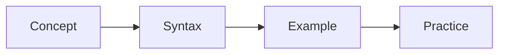

# QUIC Overview

## Learning Goals

- Understand the core idea behind **QUIC Overview** in simple terms.
- Apply the feature in small, readable Rust programs.
- Avoid common beginner mistakes and build good habits.

## Concept Diagram



## Detailed Lesson

This chapter explains **QUIC Overview** step by step. Start by understanding the intent, then focus on syntax, then practice with a small runnable example.

1. Read the concept and mental model first.
2. Type the sample code manually.
3. Change values and test your understanding.
4. Write one extra variation on your own.

When learning Rust, small focused repetitions are better than large complex examples. Keep each experiment short and verify compiler messages carefully.

## Example

```rust
#[tokio::main]
async fn main() {
    println!("async rust");
}
```

## Hands-On Practice

1. Recreate the example without copying line-by-line.
2. Add one new branch/field/argument and test behavior.
3. Write one failing case and one successful case.
4. Run `cargo fmt`, `cargo clippy`, and `cargo test` where applicable.

## Common Mistakes

- Skipping the ownership/borrowing implications of data flow.
- Using `unwrap()` where explicit error handling is better.
- Writing too much code before validating small units.

## Chapter Summary

You now have a practical foundation for **QUIC Overview**. Move to the next chapter only after the practice tasks run successfully on your machine.
