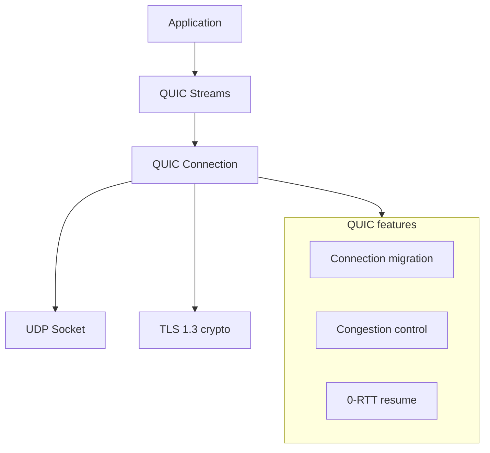

# QUIC Overview with Quinn

## Learning Goals

- Explain what QUIC fixes relative to TCP + TLS + HTTP/2.
- Map QUIC concepts (connection, stream, 0-RTT, congestion) to Rust’s **quinn** crate.
- Sketch a minimal client/server that opens bidirectional streams.
- Know how HTTP/3 relates to QUIC and when to adopt either.
- Recognize operational concerns: UDP, NAT, observability, and security (including 0-RTT risks).

## Why QUIC Exists

Classic web stack problems:

| Issue | TCP + TLS + HTTP/2 | QUIC |
|-------|--------------------|------|
| Handshake RTTs | TCP + TLS often 1–2+ RTTs | Combined crypto + transport, often 1 RTT; 0-RTT resume possible |
| Head-of-line blocking | One lost TCP packet stalls all HTTP/2 streams | Loss is mostly per-stream |
| Connection migration | Hard (4-tuple identity) | Connection IDs allow path change (e.g. Wi‑Fi → cellular) |
| User-space evolution | Kernel TCP is slow to change | QUIC lives in user space (library upgrades) |

QUIC runs over **UDP**. Encryption is built in (TLS 1.3 crypto). HTTP/3 is HTTP semantics mapped onto QUIC streams.

Rust ecosystem (2026):

- **quinn** — popular pure-Rust QUIC implementation (tokio-friendly).
- **h3** / **h3-quinn** — HTTP/3 on top of QUIC (when you need HTTP semantics).
- Browsers and CDNs speak HTTP/3 widely; many internal services still use HTTP/2 or gRPC.

## Concept Diagram



## Core Concepts

### Connection

A QUIC connection is multiplexed, encrypted, and identified by **connection IDs**, not only by IP:port. That enables migration when the client’s network path changes.

### Streams

Streams are independent ordered byte flows:

- **Bidirectional** — both sides send (like a TCP socket).
- **Unidirectional** — one side only (good for one-way events).

Opening many streams is cheap compared to many TCP connections.

### 0-RTT

After a prior session, a client may send application data with the first flight. **0-RTT data can be replayed** by an attacker who captured packets. Never use 0-RTT for non-idempotent operations (payments, POSTs that mutate).

### Flow and Congestion Control

QUIC implements flow control per stream and per connection, plus congestion control (implementations ship Reno/CUBIC/BBR-like algorithms). Application code still must bound buffers.

## Quinn Mental Model

```text
Endpoint  →  owns UDP socket, accepts/connects
Connection →  crypto + multipath state
SendStream / RecvStream →  application bytes
```

You typically:

1. Build a server or client `Endpoint` with TLS config (rustls certificates).
2. `accept` or `connect`.
3. `open_bi` / `accept_bi` for streams.
4. `write_all` / `read_to_end` (or framed messages) on streams.

## Certificates for Local Labs

QUIC requires TLS. For local development generate a self-signed cert (do not use in production):

```bash
# Example with rcgen-based tooling or openssl
openssl req -x509 -newkey rsa:2048 -nodes \
  -keyout key.pem -out cert.pem -days 365 \
  -subj "/CN=localhost"
```

Production uses real certs (ACME, internal PKI). Quinn integrates with **rustls**.

## Minimal Quinn Server Sketch

Exact APIs shift slightly across quinn major versions; treat this as a structural template and align imports with the crate docs for your version.

```rust
use std::{error::Error, net::SocketAddr, sync::Arc};
use quinn::{Endpoint, ServerConfig};
use rustls::pki_types::{CertificateDer, PrivateKeyDer, PrivatePkcs8KeyDer};

// Load cert/key PEM into rustls types (helper omitted for brevity).
fn server_config(
    certs: Vec<CertificateDer<'static>>,
    key: PrivateKeyDer<'static>,
) -> Result<ServerConfig, Box<dyn Error>> {
    let mut server = ServerConfig::with_single_cert(certs, key)?;
    let transport = Arc::get_mut(&mut server.transport).unwrap();
    transport.max_concurrent_bidi_streams(100_u32.into());
    Ok(server)
}

#[tokio::main]
async fn main() -> Result<(), Box<dyn Error>> {
    // let certs = ...; let key = ...;
    // let server = server_config(certs, key)?;
    // let addr: SocketAddr = "0.0.0.0:4433".parse()?;
    // let endpoint = Endpoint::server(server, addr)?;
    //
    // while let Some(connecting) = endpoint.accept().await {
    //     tokio::spawn(async move {
    //         let connection = connecting.await.expect("handshake");
    //         while let Ok((mut send, mut recv)) = connection.accept_bi().await {
    //             let data = recv.read_to_end(64 * 1024).await.expect("read");
    //             send.write_all(&data).await.expect("echo");
    //             send.finish().expect("finish");
    //         }
    //     });
    // }
    println!("See quinn examples for full cert loading + Endpoint::server");
    Ok(())
}
```

Client sketch:

```rust
use std::{error::Error, net::SocketAddr, sync::Arc};
use quinn::{ClientConfig, Endpoint};

fn configure_client() -> Result<ClientConfig, Box<dyn Error>> {
    // Install root certs or a custom verifier for lab self-signed certs.
    // let mut crypto = rustls::ClientConfig::builder()...;
    // Ok(ClientConfig::new(Arc::new(QuicClientConfig::try_from(crypto)?)))
    unimplemented!("wire rustls roots for your environment")
}

async fn run_client() -> Result<(), Box<dyn Error>> {
    // let mut endpoint = Endpoint::client("0.0.0.0:0".parse()?)?;
    // endpoint.set_default_client_config(configure_client()?);
    // let conn = endpoint
    //     .connect("127.0.0.1:4433".parse()?, "localhost")?
    //     .await?;
    // let (mut send, mut recv) = conn.open_bi().await?;
    // send.write_all(b"hello quic").await?;
    // send.finish()?;
    // let data = recv.read_to_end(1024).await?;
    // println!("{}", String::from_utf8_lossy(&data));
    Ok(())
}
```

Work through the official **quinn** examples repository for complete, version-matched cert loading — crypto types change more often than the stream model.

## Application Framing Over Streams

QUIC streams are raw bytes. Applications still need framing:

```rust
/// Length-prefixed message: u32 BE length + payload.
fn encode_frame(payload: &[u8]) -> Vec<u8> {
    let mut out = Vec::with_capacity(4 + payload.len());
    out.extend_from_slice(&(payload.len() as u32).to_be_bytes());
    out.extend_from_slice(payload);
    out
}

fn decode_frame(buf: &[u8]) -> Option<&[u8]> {
    if buf.len() < 4 {
        return None;
    }
    let n = u32::from_be_bytes(buf[0..4].try_into().ok()?) as usize;
    if buf.len() < 4 + n {
        return None;
    }
    Some(&buf[4..4 + n])
}
```

HTTP/3 already defines framing; custom protocols should version their frame headers explicitly.

## QUIC vs HTTP/3 vs gRPC

| Need | Choice |
|------|--------|
| Browser-facing web API | HTTP/3 (or HTTP/2) via reverse proxy |
| Internal typed RPC | gRPC (HTTP/2) still dominant; gRPC-over-QUIC exists experimentally |
| Custom low-latency multiplexed protocol | quinn streams directly |
| File sync / multi-stream bulk transfer | QUIC shines |

Do not adopt QUIC only for fashion — measure HOL blocking, handshake cost, and mobile path changes. Many services get enough from HTTP/2 + proper timeouts.

## Operations Reality Check

- **UDP must be allowed** on firewalls and cloud SGs (port 443/UDP for HTTP/3 is common).
- Some corporate networks still break or rate-limit UDP; always have **HTTP/2 fallback**.
- Observability: export QUIC metrics (RTT, loss, streams, 0-RTT accepts). Packet captures need specialized tools.
- CPU: user-space crypto is efficient in Rust but still needs capacity planning under high PPS.

## Security Notes

- Prefer mutual TLS patterns at the application or mesh layer when peer identity matters beyond server auth.
- Disable or carefully gate **0-RTT** for state-changing APIs.
- Validate certificates properly — custom verifiers that accept anything are lab-only.
- Bound `read_to_end(max)` so clients cannot force multi-GB allocations.

## Common Mistakes

- Treating QUIC as “UDP TCP” and ignoring stream concurrency limits.
- Using 0-RTT for banking-style mutations.
- No fallback path when UDP is blocked.
- Unbounded `read_to_end` without a max size.
- Expecting Wireshark skills from TCP days to transfer unchanged.
- Building a custom HTTP/3 stack instead of using battle-tested h3 crates or a proxy.

## Hands-On Practice

1. Clone or open the official quinn `examples` and run the echo server/client locally.
2. Add length-prefixed framing for JSON messages over a bi-stream.
3. Document three metrics you would export for a production QUIC service.
4. Write a short threat note: “why 0-RTT is dangerous for POST /transfer”.
5. Compare latency of a small payload over TCP+TLS vs QUIC on loopback (qualitative is fine).

## Chapter Summary

QUIC multiplexes encrypted streams over UDP, reducing handshake cost and head-of-line blocking; **quinn** is the main Rust entry point. Use it for latency-sensitive or custom multipath protocols, HTTP/3 at the edge, and always plan for UDP realities and 0-RTT safety. Next: **load testing** — measure whether your HTTP/gRPC/QUIC service actually holds under stress.
