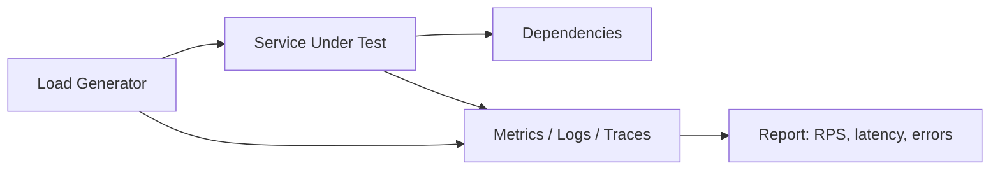

# Load Testing Network Services

## Learning Goals

- Design load tests that answer capacity and reliability questions — not vanity RPS numbers.
- Distinguish smoke, average-load, stress, spike, and soak tests.
- Instrument services so latency percentiles and error classes are visible under load.
- Build a small concurrent client in Rust and know when to use external tools (k6, vegeta, ghz).
- Interpret results: saturation, tail latency, coordinated omission, and error budgets.

## Why Load Test

Shipping without load testing means production is your first stress lab. Good tests answer:

1. What RPS can we sustain at p99 &lt; SLO?
2. What fails first — CPU, memory, locks, DB, file descriptors?
3. How does the system degrade (queue, shed load, cascade)?
4. How long until recovery after a spike?

## Concept Diagram



## Test Types

| Type | Goal | Duration |
|------|------|----------|
| Smoke | “Does it work at all under light load?” | minutes |
| Average-load | Typical production traffic | 10–60 min |
| Stress | Find breaking point | ramp until failure |
| Spike | Sudden 5–10× burst | short |
| Soak | Leaks, FD exhaustion, fragmentation | hours |

Always run a **baseline** at low load first so you know instrumentation works.

## Metrics That Matter

- **Throughput**: successful requests/sec
- **Latency**: p50, p95, p99, max (histograms, not only averages)
- **Error rate**: by class (4xx vs 5xx, timeout, reset)
- **Saturation**: CPU, RSS, goroutine/task count, queue depth, pool wait
- **Dependency health**: DB pool acquire time, cache hit ratio

Average latency lies. A system can look “fine” at 20 ms average while p99 is 2 s.

### Coordinated Omission

If your client waits for each response before sending the next on a worker, measured latency can **understate** wait time during slowdowns. Prefer:

- Open-loop generators that schedule starts by target rate, or
- Enough closed-loop workers that the client is not the bottleneck, and
- Tools that correct for coordinated omission when claiming “virtual users”

## Load Timeline

```mermaid
gantt
    dateFormat  X
    axisFormat %s
    title Example load profile
    section Load
    Warmup            :0, 30
    Ramp to target    :30, 60
    Steady state      :90, 120
    Spike             :210, 20
    Cool down         :230, 30
```



## External Tools (Practical)

| Tool | Good for |
|------|----------|
| **k6** | Scriptable HTTP scenarios, thresholds, CI |
| **vegeta** | Simple HTTP attack files, constant rate |
| **hey** / **wrk** | Quick HTTP checks |
| **ghz** | gRPC load |
| Custom Rust | Precise protocols, QUIC, weird framing |

Example vegeta:

```bash
echo "GET http://127.0.0.1:3000/health" | vegeta attack -rate=200 -duration=30s | vegeta report
```

Example k6 threshold mindset:

```javascript
// thresholds: { http_req_failed: ['rate<0.01'], http_req_duration: ['p(99)<200'] }
```

## Rust Concurrent Client (HTTP)

Useful when you want in-repo tests without extra runtimes.

```rust
use std::sync::Arc;
use std::sync::atomic::{AtomicU64, Ordering};
use std::time::{Duration, Instant};
use tokio::sync::Semaphore;

struct Stats {
    ok: AtomicU64,
    err: AtomicU64,
    // store latencies in a mutex vec for a tiny lab; use HDR histogram in real tools
    lat_us: tokio::sync::Mutex<Vec<u64>>,
}

impl Stats {
    fn new() -> Self {
        Self {
            ok: AtomicU64::new(0),
            err: AtomicU64::new(0),
            lat_us: tokio::sync::Mutex::new(Vec::new()),
        }
    }
}

async fn worker(
    client: reqwest::Client,
    url: Arc<String>,
    sem: Arc<Semaphore>,
    stats: Arc<Stats>,
    end: Instant,
) {
    while Instant::now() < end {
        let Ok(_permit) = sem.clone().acquire_owned().await else {
            break;
        };
        let start = Instant::now();
        let res = client.get(url.as_str()).send().await;
        let elapsed = start.elapsed().as_micros() as u64;
        match res {
            Ok(r) if r.status().is_success() => {
                stats.ok.fetch_add(1, Ordering::Relaxed);
                stats.lat_us.lock().await.push(elapsed);
            }
            _ => {
                stats.err.fetch_add(1, Ordering::Relaxed);
            }
        }
        // permit drops here → concurrency slot frees
    }
}

#[tokio::main]
async fn main() -> Result<(), Box<dyn std::error::Error>> {
    let url = Arc::new("http://127.0.0.1:3000/health".to_string());
    let concurrency = 50usize;
    let duration = Duration::from_secs(20);
    let end = Instant::now() + duration;

    let client = reqwest::Client::builder()
        .timeout(Duration::from_secs(2))
        .pool_max_idle_per_host(concurrency)
        .build()?;

    let stats = Arc::new(Stats::new());
    let sem = Arc::new(Semaphore::new(concurrency));

    let mut handles = Vec::new();
    for _ in 0..concurrency {
        let c = client.clone();
        let u = url.clone();
        let s = sem.clone();
        let st = stats.clone();
        handles.push(tokio::spawn(worker(c, u, s, st, end)));
    }
    for h in handles {
        h.await?;
    }

    let ok = stats.ok.load(Ordering::Relaxed);
    let err = stats.err.load(Ordering::Relaxed);
    let mut lat = stats.lat_us.lock().await;
    lat.sort_unstable();
    let p99 = lat.get(lat.len().saturating_mul(99) / 100).copied().unwrap_or(0);

    println!("ok={ok} err={err} samples={} p99_us={p99}", lat.len());
    Ok(())
}
```

`Cargo.toml` needs `reqwest` with `json` optional, `tokio` full.

This is a **closed-loop** generator (concurrency-limited). Good for lab work; document that fact in reports.

## Measuring the Server Side

Emit histograms from the service (not only the client):

```rust
use std::time::Instant;

async fn timed_handler() -> &'static str {
    let start = Instant::now();
    // ... work ...
    let ms = start.elapsed().as_secs_f64() * 1000.0;
    // metrics::histogram!("http_handler_ms").record(ms);
    tracing::debug!(ms, "handler done");
    "ok"
}
```

Export Prometheus histograms with carefully chosen buckets (ms: 1, 2, 5, 10, 25, 50, 100, 250, 500, 1000, …).

## Interpreting Saturation

Classic shape as load increases:

1. RPS rises, latency flat
2. Latency climbs (queues fill)
3. Errors appear (timeouts, 503, pool exhausted)
4. RPS plateaus or drops (collapse / retry storms)

```text
Load →
RPS:     ╱────────
p99:     ────╱────╱╱╱
errors:  ________╱──
```

Retry storms: clients retry on timeout → more load → worse timeouts. Mitigate with jittered backoff, budgets, and load shedding.

## Chaos Plus Load

Combine steady load with fault injection:

- Kill a replica
- Delay a dependency 200–500 ms
- Fill disk or starve CPU (carefully in shared labs)

Observe whether bulkheads and circuit breakers protect the core path. Capture error budget burn during the window.

## Report Template

```markdown
# Load test: notes-api 2026-03-01

## Goal
Sustain 500 RPS at p99 < 100ms for GET /notes/{id}

## Environment
- commit: abc123
- replicas: 2 x c7g.large
- deps: postgres 16, redis

## Method
- tool: k6, 10m steady + 30s spike
- payload: cached ids vs cold ids (separate runs)

## Results
| Phase | RPS | p50 | p99 | err% |
|-------|-----|-----|-----|------|
| steady| 502 | 8ms | 45ms | 0.1 |
| spike | 1200| 20ms| 380ms| 2.4 |

## Bottleneck
DB pool wait time rose; CPU 45%

## Actions
1. Raise pool size / add read replica
2. Cache hot keys
3. Add load shedding at 80% pool wait
```

## CI Integration

- Run smoke load on PRs (short, low RPS).
- Run full stress nightly or pre-release.
- Fail CI on threshold breach (`err_rate > 1%` or `p99 > SLO`).
- Pin tool versions; record generator host capacity so the client is not the bottleneck.

## Common Mistakes

- Testing only `/health` (no real code path).
- Warm caches only — never measuring cold path.
- Ignoring TLS and auth overhead.
- Load generator on the same noisy laptop as the server without noting it.
- Celebrating max RPS while p99 is multi-second.
- No test for dependency failure under load.
- Using averages instead of histograms.

## Hands-On Practice

1. Point vegeta or the Rust client at your axum notes service from the HTTP chapter.
2. Produce a table for 10, 50, 100 concurrent workers: RPS, p99, errors.
3. Add a 100 ms sleep in the handler; re-measure and explain queueing.
4. Run a 5-minute soak at moderate load; watch RSS with `ps` or a metrics endpoint.
5. Write a one-page report using the template above.

## Chapter Summary

Load testing is experimental science: define SLOs, apply a controlled profile, measure percentiles and errors, and find the first bottleneck. Use specialized tools for HTTP/gRPC and custom Rust clients for exotic protocols. Next: a **network resilience project** that ties HTTP, timeouts, retries, and measurement into one mini-system.
