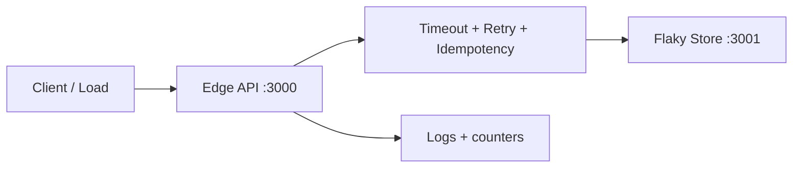

# Network Resilience Project

## Learning Goals

- Build a small multi-component system that survives timeouts, retries, and partial failure.
- Combine an axum edge API, an unreliable dependency, and client resilience patterns.
- Implement idempotent writes, bounded retries with jitter, and load shedding signals.
- Measure behavior under injected latency and errors.
- Leave with a portfolio-ready mini-project and a written failure-mode table.

## Project Brief

You will build **resilient-notes**:

1. **Edge API** (`:3000`) — public HTTP JSON API.
2. **Flaky dependency** (`:3001`) — simulated storage with configurable delay and failure rate.
3. **Client / load runner** — exercises create/get with retries and reports success rate.

The edge API must not cascade into meltdown when storage is slow or failing 30% of the time.

## Concept Diagram



## Success Criteria

| Criterion | Target |
|-----------|--------|
| Happy path create+get | Works with dep healthy |
| Dep latency 200 ms | Edge timeout budget respected; no hang &gt; 1 s |
| Dep error rate 30% | Client success via retries without duplicate notes |
| Spike 3× concurrency | Edge returns 503 when overloaded, recovers after |
| Docs | Failure mode table + how to run |

## Part 1 — Flaky Store Service

```rust
use axum::{
    extract::{Path, State},
    http::StatusCode,
    routing::{get, post},
    Json, Router,
};
use rand::Rng;
use serde::{Deserialize, Serialize};
use std::{
    collections::HashMap,
    net::SocketAddr,
    sync::Arc,
    time::Duration,
};
use tokio::sync::RwLock;
use uuid::Uuid;

#[derive(Clone)]
struct StoreState {
    notes: Arc<RwLock<HashMap<Uuid, Note>>>,
    fail_rate: f64,
    delay_ms: u64,
}

#[derive(Clone, Serialize, Deserialize)]
struct Note {
    id: Uuid,
    title: String,
    body: String,
}

#[derive(Deserialize)]
struct CreateBody {
    id: Option<Uuid>, // client-supplied id for idempotency
    title: String,
    body: String,
}

async fn maybe_flaky(state: &StoreState) -> Result<(), StatusCode> {
    if state.delay_ms > 0 {
        tokio::time::sleep(Duration::from_millis(state.delay_ms)).await;
    }
    let mut rng = rand::thread_rng();
    if rng.gen::<f64>() < state.fail_rate {
        return Err(StatusCode::SERVICE_UNAVAILABLE);
    }
    Ok(())
}

async fn put_note(
    State(state): State<StoreState>,
    Json(body): Json<CreateBody>,
) -> Result<(StatusCode, Json<Note>), StatusCode> {
    maybe_flaky(&state).await?;
    let id = body.id.unwrap_or_else(Uuid::new_v4);
    let mut guard = state.notes.write().await;
    if let Some(existing) = guard.get(&id) {
        return Ok((StatusCode::OK, Json(existing.clone())));
    }
    let note = Note {
        id,
        title: body.title,
        body: body.body,
    };
    guard.insert(id, note.clone());
    Ok((StatusCode::CREATED, Json(note)))
}

async fn get_note(
    State(state): State<StoreState>,
    Path(id): Path<Uuid>,
) -> Result<Json<Note>, StatusCode> {
    maybe_flaky(&state).await?;
    state
        .notes
        .read()
        .await
        .get(&id)
        .cloned()
        .map(Json)
        .ok_or(StatusCode::NOT_FOUND)
}

#[tokio::main]
async fn main() {
    let state = StoreState {
        notes: Arc::new(RwLock::new(HashMap::new())),
        fail_rate: std::env::var("FAIL_RATE")
            .ok()
            .and_then(|s| s.parse().ok())
            .unwrap_or(0.3),
        delay_ms: std::env::var("DELAY_MS")
            .ok()
            .and_then(|s| s.parse().ok())
            .unwrap_or(50),
    };

    let app = Router::new()
        .route("/notes", post(put_note))
        .route("/notes/{id}", get(get_note))
        .with_state(state);

    let addr = SocketAddr::from(([127, 0, 0, 1], 3001));
    let listener = tokio::net::TcpListener::bind(addr).await.unwrap();
    println!("flaky store on {addr}");
    axum::serve(listener, app).await.unwrap();
}
```

Run:

```bash
FAIL_RATE=0.3 DELAY_MS=100 cargo run --bin flaky_store
```

## Part 2 — Edge API with Budgets and Idempotency

```rust
use axum::{
    extract::State,
    http::StatusCode,
    routing::post,
    Json, Router,
};
use serde::{Deserialize, Serialize};
use std::{
    net::SocketAddr,
    sync::Arc,
    time::Duration,
};
use uuid::Uuid;

#[derive(Clone)]
struct EdgeState {
    http: reqwest::Client,
    store_base: String,
    in_flight: Arc<tokio::sync::Semaphore>,
}

#[derive(Deserialize)]
struct CreateNote {
    title: String,
    body: String,
    /// Clients should send a stable UUID for safe retries.
    idempotency_key: Uuid,
}

#[derive(Serialize, Deserialize, Clone)]
struct Note {
    id: Uuid,
    title: String,
    body: String,
}

async fn create_note(
    State(state): State<EdgeState>,
    Json(input): Json<CreateNote>,
) -> Result<(StatusCode, Json<Note>), StatusCode> {
    // Load shedding: reject when too many concurrent dependency calls.
    let Ok(_permit) = state.in_flight.clone().try_acquire_owned() else {
        return Err(StatusCode::SERVICE_UNAVAILABLE);
    };

    if input.title.trim().is_empty() {
        return Err(StatusCode::BAD_REQUEST);
    }

    let url = format!("{}/notes", state.store_base);
    let body = serde_json::json!({
        "id": input.idempotency_key,
        "title": input.title,
        "body": input.body,
    });

    // Bounded retries with exponential backoff + jitter.
    let mut attempt = 0u32;
    let max_attempts = 4u32;
    loop {
        attempt += 1;
        let res = state
            .http
            .post(&url)
            .timeout(Duration::from_millis(300))
            .json(&body)
            .send()
            .await;

        match res {
            Ok(r) if r.status().is_success() => {
                let note = r.json::<Note>().await.map_err(|_| StatusCode::BAD_GATEWAY)?;
                return Ok((StatusCode::CREATED, Json(note)));
            }
            Ok(r) if r.status().as_u16() == 503 || r.status().is_server_error() => {
                if attempt >= max_attempts {
                    return Err(StatusCode::BAD_GATEWAY);
                }
            }
            Ok(_) => return Err(StatusCode::BAD_GATEWAY),
            Err(_) => {
                if attempt >= max_attempts {
                    return Err(StatusCode::GATEWAY_TIMEOUT);
                }
            }
        }

        let base = 20u64 * 2u64.pow(attempt - 1);
        let jitter = rand::random::<u64>() % 20;
        tokio::time::sleep(Duration::from_millis(base + jitter)).await;
    }
}

#[tokio::main]
async fn main() {
    let state = EdgeState {
        http: reqwest::Client::new(),
        store_base: "http://127.0.0.1:3001".into(),
        in_flight: Arc::new(tokio::sync::Semaphore::new(32)),
    };

    let app = Router::new()
        .route("/notes", post(create_note))
        .with_state(state);

    let addr = SocketAddr::from(([127, 0, 0, 1], 3000));
    let listener = tokio::net::TcpListener::bind(addr).await.unwrap();
    println!("edge on {addr}");
    axum::serve(listener, app).await.unwrap();
}
```

Key design points:

- **Idempotency key** becomes the store id so retries do not create duplicates.
- **Per-attempt timeout** (300 ms) + max attempts cap total work.
- **Semaphore** sheds load when the edge is already waiting on too many dep calls.
- **Jitter** reduces synchronized retry storms.

## Part 3 — Client Workload

```rust
use std::time::Duration;
use uuid::Uuid;

#[tokio::main]
async fn main() -> Result<(), Box<dyn std::error::Error>> {
    let client = reqwest::Client::new();
    let mut ok = 0u32;
    let mut err = 0u32;

    for i in 0..100 {
        let key = Uuid::new_v4();
        // Retry same key on transport errors to prove idempotency.
        let body = serde_json::json!({
            "title": format!("note-{i}"),
            "body": "hello",
            "idempotency_key": key,
        });
        let res = client
            .post("http://127.0.0.1:3000/notes")
            .timeout(Duration::from_secs(2))
            .json(&body)
            .send()
            .await;
        match res {
            Ok(r) if r.status().is_success() => ok += 1,
            _ => err += 1,
        }
    }
    println!("ok={ok} err={err}");
    Ok(())
}
```

## Failure Mode Table (Fill In During Labs)

| Failure | Symptom without resilience | Mitigation in this project | Residual risk |
|---------|----------------------------|----------------------------|---------------|
| Dep 503 | Edge 502 immediately | Retries + idempotent key | Exhausted attempts |
| Dep slow | Edge hangs | 300 ms timeout | False timeouts under load |
| Retry storm | Collapse | Jitter + semaphore | Need circuit breaker next |
| Duplicate POST | Double write | Client key = store id | Client must reuse key |
| Edge overload | Latency explosion | try_acquire → 503 | Clients must back off |

## Optional Upgrades

1. **Circuit breaker** — after N consecutive failures, short-circuit for cooldown.
2. **Bulkhead** — separate semaphore for read vs write paths.
3. **Hedged requests** — only for idempotent GETs; never for non-idempotent POSTs without keys.
4. **Metrics** — counters for attempts, outcomes, shed rejects; histogram of dep latency.
5. **Chaos script** — toggle `FAIL_RATE` and `DELAY_MS` mid-run via env + restart or admin endpoint.

Circuit breaker sketch:

```rust
struct Breaker {
    failures: u32,
    open_until: Option<std::time::Instant>,
}

impl Breaker {
    fn allow(&mut self) -> bool {
        if let Some(until) = self.open_until {
            if std::time::Instant::now() < until {
                return false;
            }
            self.open_until = None;
            self.failures = 0;
        }
        true
    }

    fn on_result(&mut self, ok: bool) {
        if ok {
            self.failures = 0;
        } else {
            self.failures += 1;
            if self.failures >= 5 {
                self.open_until =
                    Some(std::time::Instant::now() + Duration::from_secs(2));
            }
        }
    }
}
```

Protect with a `Mutex` or use a dedicated crate in production.

## How to Run the Lab

```bash
# terminal 1
FAIL_RATE=0.3 DELAY_MS=80 cargo run --bin flaky_store

# terminal 2
cargo run --bin edge

# terminal 3
cargo run --bin workload
```

Vary:

```bash
FAIL_RATE=0 DELAY_MS=0     # baseline
FAIL_RATE=0.5 DELAY_MS=200 # harsh
```

Compare ok/err rates and total wall time.

## Acceptance Demo Script

1. Baseline: `FAIL_RATE=0` → ~100% success.
2. Harsh: `FAIL_RATE=0.3` → success still high; store contains **one note per key**.
3. Kill flaky store mid-run → edge returns 502/504, not hang forever.
4. Restart store → success recovers without redeploying edge.
5. Show logs with attempt counts (add `tracing` if you instrument retries).

## Common Mistakes

- Retrying without idempotency → duplicate records.
- Infinite retries → thread/task pileup.
- Timeouts longer than the caller’s timeout → wasted work.
- Shedding nothing → edge becomes a queue for a dead dependency.
- Generating a new UUID on every retry attempt (defeats idempotency).

## Hands-On Practice

1. Implement flaky store + edge + workload as three binaries in one workspace.
2. Prove duplicate-free creates under 30% failure with a fixed key reused three times.
3. Add a GET path with a shorter timeout than POST.
4. Implement a simple circuit breaker and graph success rate before/after.
5. Write a half-page postmortem from a forced failure run.

## Chapter Summary

Resilience is a system property: **timeouts, bounded retries with jitter, idempotency keys, and load shedding** working together. This project is a template for real services — swap the flaky store for Postgres or gRPC and keep the same budgets. Next part of the book: **security programming** — threat modeling the APIs you just built.
