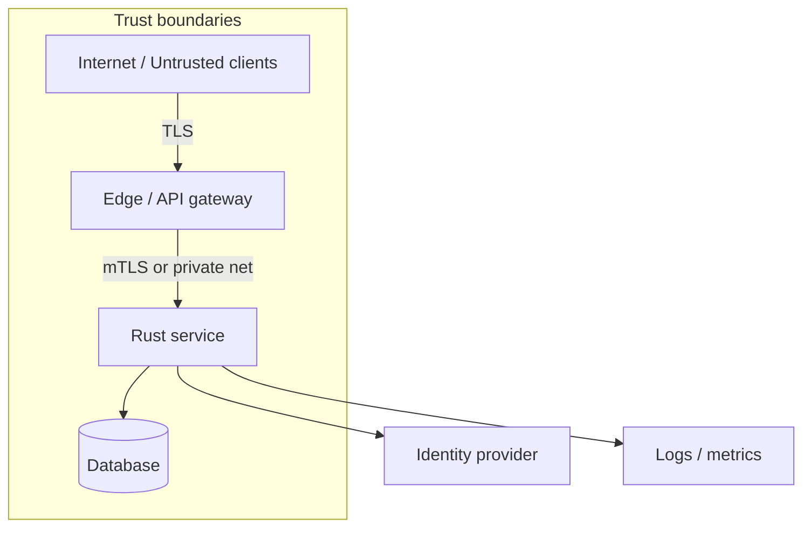

# Threat Modeling for Rust Services

## Learning Goals

- Run a lightweight threat model before and during implementation — not only after an incident.
- Apply **STRIDE** and trust-boundary diagrams to HTTP/gRPC services.
- Identify Rust-specific risk patterns (unsafe, panics, DoS via allocation, supply chain).
- Turn threats into testable mitigations and detection signals.
- Produce a short threat-model artifact suitable for design reviews.

## Why Threat Model

Security work without a model becomes random checklist theater. A threat model answers:

1. What are we protecting?
2. Who might attack, and from where?
3. What can go wrong at each trust boundary?
4. What do we mitigate, accept, or transfer?
5. How will we know if it is happening?

You do not need enterprise-scale process. A one-page model updated each major feature is enough for most services.

## Concept Diagram



Every arrow that crosses a box is a place to ask STRIDE questions.

## Assets Inventory

List assets with impact if lost:

| Asset | Example | Impact if compromised |
|-------|---------|------------------------|
| Credentials | API keys, session tokens, DB passwords | Account takeover |
| PII | emails, names, device ids | Privacy / legal |
| Control plane | admin RPCs, feature flags | Full system abuse |
| Crypto keys | TLS private keys, signing keys | Impersonation |
| Availability | capacity to serve SLOs | Revenue / safety |
| Integrity | audit logs, balances | Fraud, cover-up |

If you cannot name assets, you cannot prioritize defenses.

## STRIDE-Lite Sweep

For each component and data flow:

| Letter | Threat | Service questions |
|--------|--------|-------------------|
| **S** Spoofing | Forge identity | Can callers pretend to be another user/service? |
| **T** Tampering | Change data | Can body/query/path alter unauthorized state? |
| **R** Repudiation | Deny actions | Do we have non-repudiable audit trails? |
| **I** Info disclosure | Leak secrets | Logs, errors, side channels, verbose 500s? |
| **D** Denial of service | Exhaust resources | Unbounded body, fan-out, expensive queries? |
| **E** Elevation | Gain privilege | IDOR, missing authz on admin routes? |

### Example: Notes API

| Flow | Threat | Mitigation |
|------|--------|------------|
| `POST /notes` public | DoS via huge JSON | Body limit + timeouts |
| `GET /notes/{id}` | IDOR if ids leak | Authz: owner check |
| Service → DB | Credential theft from env | Secret manager, least privilege DB role |
| Logs | Token in URL | Structured redaction |
| Admin rebuild index | Privilege elevation | Separate authn + mTLS + role |

## Trust Boundaries and Entry Points

Enumerate entry points explicitly:

```text
Entry points
- HTTP :443 (public)
- gRPC :50051 (private VPC only)
- Admin HTTP :8443 (VPN + mTLS)
- Metrics :9090 (scrape from Prometheus only)
- Unix socket for local sidecars (optional)
```

For each: authentication required? rate limit? network policy?

## Data Flow Diagram (DFD) Levels

- **L0**: one box “system” and external actors
- **L1**: major processes (edge, app, workers)
- **L2**: modules (auth middleware, handlers, repository)

Stop when mitigations become obvious. Over-detailed DFDs that nobody updates are waste.

## Rust-Specific Threat Patterns

### Memory safety is not app security

Rust eliminates many memory corruption bugs in safe code. It does **not** stop:

- Broken authorization
- SQL injection via string concat (still possible)
- SSRF, XSS (if you generate HTML), CSRF
- Logic bugs and TOCTOU races
- Supply-chain malware in crates

### `unsafe` islands

Every `unsafe` block is a trust boundary inside the process. Threat model it: what invariants must hold? What fuzz targets cover it?

### Panic and abort as availability threats

`unwrap` on user input → worker crash → DoS. Prefer `Result` in request paths. In `no_std`/abort builds, panics are hard kills.

### Allocation bombs

```rust
// Dangerous if `n` comes from the client with no cap
fn bad_allocate(n: usize) -> Vec<u8> {
    vec![0u8; n]
}

fn safer_allocate(n: usize) -> Result<Vec<u8>, &'static str> {
    const MAX: usize = 1 << 20; // 1 MiB
    if n > MAX {
        return Err("too large");
    }
    Ok(vec![0u8; n])
}
```

### Timing side channels

Secret comparison with `==` on strings can leak via timing. Use constant-time compares for HMACs/tokens (`subtle` crate) where relevant.

## Abuse Cases (Attack Stories)

Write short stories, not only bullets:

1. **Scraping**: attacker enumerates UUID notes without auth.
2. **Credential stuffing**: password login without rate limits / MFA.
3. **Retry fraud**: payment webhook replayed 100 times.
4. **Log injection**: user agent with newlines spoofs audit lines.
5. **Dependency confusion**: malicious crate name typo-squats an internal package.

Each story gets: likelihood, impact, mitigation, detection.

## Mitigation Catalog

| Category | Examples |
|----------|----------|
| Prevent | authn/z, validation, least privilege, mTLS |
| Detect | audit logs, anomaly alerts, integrity checks |
| Respond | key rotation, kill switches, incident runbooks |
| Recover | backups, multi-AZ, rebuild from events |

Map each high-risk threat to at least one prevent **and** one detect where possible.

## Lightweight Process

```text
1. Kickoff (30–60 min): assets, actors, diagram
2. STRIDE pass on each boundary
3. Rank by risk = impact × likelihood (simple 1–5)
4. Decide mitigate / accept / transfer for top N
5. File tickets with acceptance tests
6. Revisit on major features or yearly
```

### Risk ranking example

| Threat | Impact | Likelihood | Score | Decision |
|--------|--------|------------|-------|----------|
| IDOR on notes | 4 | 3 | 12 | Mitigate: owner checks + tests |
| Huge body DoS | 3 | 4 | 12 | Mitigate: limit + timeout |
| Insider DB read | 5 | 1 | 5 | Accept with encryption at rest + audit |

## Threat Model Document Template

```markdown
# Threat model: notes-api

## Scope
In: public HTTP API, worker, Postgres
Out: corporate IdP internals, cloud provider physical security

## Assets
- user content, session tokens, DB credentials

## Actors
- anonymous internet, authenticated user, admin, malicious dependency

## Diagram
(attach mermaid or image)

## Top threats
1. ...
2. ...

## Mitigations & owners
| Threat | Control | Owner | Test |
|--------|---------|-------|------|

## Accepted risks
- ...

## Review date
2026-09-01
```

## Tying Model to Code

Make threats fail CI when controls regress:

```rust
#[test]
fn rejects_oversized_username() {
    assert!(validate_username(&"a".repeat(10_000)).is_err());
}

#[test]
fn forbids_cross_user_read() {
    // integration: user A token cannot GET user B note
}
```

Security unit tests are cheap residual risk reducers.

## Common Mistakes

- Modeling only external hackers — ignoring insider and supply chain.
- Cataloging threats with no owners or tickets.
- Assuming “we use Rust” closes the model.
- One huge model for the whole company that never updates.
- Skipping detection because prevention “should be enough.”
- Treating compliance questionnaires as threat models.

## Hands-On Practice

1. Draw an L1 diagram for the resilient-notes project (edge + flaky store).
2. Fill a STRIDE table for `POST /notes` and `GET /notes/{id}`.
3. List three assets and the blast radius if each leaks.
4. Convert the top two threats into automated tests or middleware tasks.
5. Write a half-page accepted-risk statement for something you will not fix yet.

## Chapter Summary

Threat modeling is structured curiosity about **assets, trust boundaries, and STRIDE abuse**. Rust helps with memory safety; you still design against logic abuse, DoS, and supply chain. Next: implement **authentication and authorization** that match the model — not bolt them on as an afterthought.
