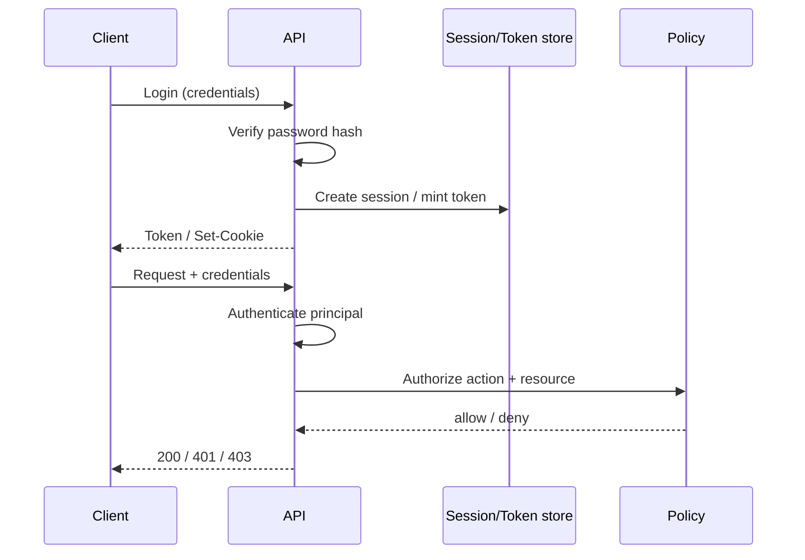

# Authentication and Authorization

## Learning Goals

- Separate **authentication** (who are you?) from **authorization** (what may you do?).
- Implement password hashing, session or JWT-style bearer tokens, and role checks in a Rust API.
- Avoid common auth pitfalls: plaintext passwords, alg=none JWTs, missing authz on “hidden” routes.
- Design least-privilege roles and resource-level ownership checks (prevent IDOR).
- Know when to delegate to an external IdP (OIDC) vs local auth.

## Core Definitions

| Term | Meaning |
|------|---------|
| Authentication (Authn) | Prove identity (password, token, mTLS cert, passkey) |
| Authorization (Authz) | Allow or deny an action on a resource |
| Session | Server-side state keyed by opaque cookie/token |
| Bearer token | Client sends `Authorization: Bearer …` each request |
| OIDC / OAuth2 | Delegate identity to an IdP; receive tokens |
| RBAC | Role-based access control |
| ABAC / ReBAC | Attribute- or relationship-based policies |

Never collapse authn and authz into one middleware that only checks “logged in.”

## Concept Diagram



## Password Storage (Never Plaintext)

Use a modern password KDF: **Argon2id** (preferred) or bcrypt. Not MD5/SHA alone.

```rust
use argon2::{
    password_hash::{PasswordHash, PasswordHasher, PasswordVerifier, SaltString},
    Argon2,
};
use rand::rngs::OsRng;

fn hash_password(password: &str) -> Result<String, argon2::password_hash::Error> {
    let salt = SaltString::generate(&mut OsRng);
    let hash = Argon2::default().hash_password(password.as_bytes(), &salt)?;
    Ok(hash.to_string())
}

fn verify_password(password: &str, password_hash: &str) -> bool {
    let Ok(parsed) = PasswordHash::new(password_hash) else {
        return false;
    };
    Argon2::default()
        .verify_password(password.as_bytes(), &parsed)
        .is_ok()
}
```

```toml
argon2 = "0.5"
rand = "0.8"
```

Rules:

- Hash on register; store only the encoded hash string.
- Constant-ish verification API (avoid early returns that distinguish “user missing” vs “bad password” in timing-sensitive contexts if accounts are enumerable — still return generic “invalid credentials”).
- Rate-limit login endpoints aggressively.

## Minimal User Model

```rust
use serde::{Deserialize, Serialize};
use uuid::Uuid;

#[derive(Clone, Serialize, Deserialize)]
#[serde(rename_all = "lowercase")]
enum Role {
    User,
    Admin,
}

#[derive(Clone)]
struct User {
    id: Uuid,
    username: String,
    password_hash: String,
    role: Role,
}

#[derive(Clone)]
struct Principal {
    user_id: Uuid,
    role: Role,
}
```

## Opaque Sessions vs JWTs

| Approach | Pros | Cons |
|----------|------|------|
| Opaque session id in cookie/store | Easy revoke, small client token | Needs shared session store |
| Signed JWT (stateless) | No central session read | Revocation harder; size; claims sprawl |
| JWT + server denylist / short TTL | Balance | Extra moving parts |

For learning services, **opaque tokens in memory/Redis** are clearer. For microservices, short-lived JWTs with refresh or introspection are common.

### HMAC session token (teaching example)

```rust
use hmac::{Hmac, Mac};
use sha2::Sha256;
use subtle::ConstantTimeEq;

type HmacSha256 = Hmac<Sha256>;

fn sign(secret: &[u8], message: &str) -> String {
    let mut mac = HmacSha256::new_from_slice(secret).expect("hmac key");
    mac.update(message.as_bytes());
    hex::encode(mac.finalize().into_bytes())
}

fn verify(secret: &[u8], message: &str, sig_hex: &str) -> bool {
    let expected = sign(secret, message);
    expected.as_bytes().ct_eq(sig_hex.as_bytes()).into()
}

/// token format: user_id.exp.sig
fn mint_token(secret: &[u8], user_id: &str, exp_unix: u64) -> String {
    let msg = format!("{user_id}.{exp_unix}");
    let sig = sign(secret, &msg);
    format!("{msg}.{sig}")
}

fn parse_token(secret: &[u8], token: &str, now: u64) -> Option<String> {
    let mut parts = token.split('.');
    let user_id = parts.next()?.to_string();
    let exp: u64 = parts.next()?.parse().ok()?;
    let sig = parts.next()?;
    if parts.next().is_some() {
        return None;
    }
    if now > exp {
        return None;
    }
    let msg = format!("{user_id}.{exp}");
    if !verify(secret, &msg, sig) {
        return None;
    }
    Some(user_id)
}
```

Production JWT libraries (`jsonwebtoken`, etc.) handle alg, `exp`, `nbf`, `aud`. **Reject `alg=none`**. Prefer asymmetric keys (RS256/EdDSA) when many services verify.

## Axum Auth Extractor Pattern

```rust
use axum::{
    async_trait,
    extract::FromRequestParts,
    http::{header::AUTHORIZATION, request::Parts, StatusCode},
};

struct AuthUser(Principal);

#[async_trait]
impl<S> FromRequestParts<S> for AuthUser
where
    S: Send + Sync,
{
    type Rejection = StatusCode;

    async fn from_request_parts(parts: &mut Parts, _state: &S) -> Result<Self, Self::Rejection> {
        let auth = parts
            .headers
            .get(AUTHORIZATION)
            .and_then(|v| v.to_str().ok())
            .ok_or(StatusCode::UNAUTHORIZED)?;

        let token = auth
            .strip_prefix("Bearer ")
            .ok_or(StatusCode::UNAUTHORIZED)?;

        // lookup session / verify JWT → Principal
        let principal = lookup_principal(token).ok_or(StatusCode::UNAUTHORIZED)?;
        Ok(AuthUser(principal))
    }
}

fn lookup_principal(_token: &str) -> Option<Principal> {
    None // wire to your store
}

async fn me(AuthUser(user): AuthUser) -> String {
    format!("user={}", user.user_id)
}
```

Handlers that require login simply take `AuthUser`. Missing/invalid token → **401**.

## Authorization: Roles and Ownership

```rust
use uuid::Uuid;

#[derive(Clone, Copy)]
enum Action {
    ReadNote,
    WriteNote,
    AdminAll,
}

fn authorize(principal: &Principal, action: Action, resource_owner: Option<Uuid>) -> bool {
    match action {
        Action::AdminAll => matches!(principal.role, Role::Admin),
        Action::ReadNote | Action::WriteNote => {
            if matches!(principal.role, Role::Admin) {
                return true;
            }
            match resource_owner {
                Some(owner) => owner == principal.user_id,
                None => false,
            }
        }
    }
}

async fn get_note(
    AuthUser(user): AuthUser,
    note_owner: Uuid, // loaded from DB for note id
) -> Result<&'static str, StatusCode> {
    if !authorize(&user, Action::ReadNote, Some(note_owner)) {
        return Err(StatusCode::FORBIDDEN); // authenticated but not allowed
    }
    Ok("secret note body")
}
```

Status codes:

- **401** — not authenticated (no/invalid credentials)
- **403** — authenticated but not allowed
- Do not use 404 to “hide” resources unless you deliberately choose that anti-enumeration policy and apply it consistently.

### IDOR

Insecure Direct Object Reference: `GET /notes/{id}` returns any note if you only check login. Always bind resource ownership (or ACL) to the principal.

## Cookie Sessions (Browser Apps)

```rust
// Conceptual: Set-Cookie: session=opaque; HttpOnly; Secure; SameSite=Lax; Path=/
```

Flags:

- `HttpOnly` — JS cannot read (mitigates XSS token theft)
- `Secure` — HTTPS only
- `SameSite=Lax` or `Strict` — CSRF mitigation baseline
- CSRF tokens still needed for cookie-authenticated state-changing requests on cross-site policies that allow them

APIs for SPAs often prefer bearer tokens in memory + refresh cookies with strict settings.

## External Identity (OIDC)

For corporate apps, prefer:

1. Redirect or device flow to IdP (Auth0, Keycloak, Okta, cloud IAM).
2. Validate access tokens (JWT JWKS or introspection).
3. Map `sub` → internal user id; never trust unverified claims for admin.

Do not reimplement OAuth by reading blog posts alone — use maintained crates/libraries and IdP docs.

## API Keys for Machines

```rust
fn hash_api_key(raw: &str) -> String {
    // store SHA-256 or HMAC of key; show raw key once at creation
    use sha2::{Digest, Sha256};
    let dig = Sha256::digest(raw.as_bytes());
    hex::encode(dig)
}
```

Prefix keys (`nk_live_…`) for leak scanning. Rotate and scope keys (read-only vs write).

## Permission Tests You Must Write

```rust
#[cfg(test)]
mod authz_tests {
    use super::*;

    #[test]
    fn user_cannot_read_others_note() {
        let user = Principal {
            user_id: Uuid::new_v4(),
            role: Role::User,
        };
        let other = Uuid::new_v4();
        assert!(!authorize(&user, Action::ReadNote, Some(other)));
    }

    #[test]
    fn admin_can_read_any() {
        let admin = Principal {
            user_id: Uuid::new_v4(),
            role: Role::Admin,
        };
        assert!(authorize(&admin, Action::ReadNote, Some(Uuid::new_v4())));
    }
}
```

## Common Mistakes

- Passwords with reversible encryption or single SHA-256.
- JWT without `exp` / accepting weird algorithms.
- Authn middleware on “important” routes only — forgetting admin debug endpoints.
- Using 401 vs 403 incorrectly (breaks clients and security monitors).
- Logging tokens or password fields.
- Long-lived tokens without revocation plan.
- Trusting client-supplied `user_id` in the body for ownership.

## Hands-On Practice

1. Implement register/login with Argon2 hashes in an in-memory user map.
2. Mint signed tokens; protect `GET /me` with an extractor.
3. Add notes owned by `user_id`; enforce ownership on get/update/delete.
4. Write negative tests for cross-user access.
5. Document whether your API uses cookies, bearer tokens, or both — and why.

## Chapter Summary

Authentication establishes a **principal**; authorization decides **actions on resources**. Hash passwords properly, prefer short-lived or revocable credentials, and enforce ownership on every object id. Next: **TLS and mTLS** — protecting credentials and data in transit, and authenticating services to each other.
