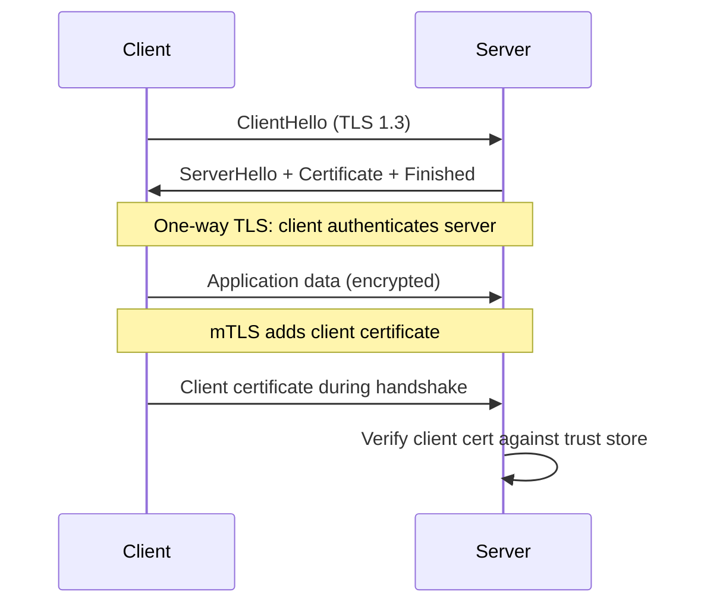

# TLS and mTLS

## Learning Goals

- Explain what TLS protects (confidentiality, integrity, server auth) and what it does not.
- Terminate TLS for a Rust service with **rustls** (via axum/hyper or tonic).
- Distinguish one-way TLS from **mutual TLS (mTLS)** and when each fits.
- Generate and inspect lab certificates; outline production PKI and rotation.
- Avoid insecure defaults: skip-verify, old protocol versions, mixed content.

## What TLS Gives You

| Property | Mechanism |
|----------|-----------|
| Server authentication | Certificate chain validates hostname to a trusted CA |
| Confidentiality | Symmetric encryption of the session |
| Integrity | AEAD ciphers detect tampering |
| Forward secrecy | Ephemeral key exchange (modern suites) |

TLS does **not** by itself provide application authorization, phishing resistance of users, or protection if the client or server is already compromised.

## Concept Diagram



## One-Way TLS vs mTLS

| Mode | Client proves | Server proves | Typical use |
|------|---------------|---------------|-------------|
| TLS | Optional app token later | Certificate | Public HTTPS APIs |
| mTLS | Certificate | Certificate | Service mesh, admin APIs, B2B |

mTLS is strong **service identity** when private keys are tightly controlled. It pairs well with SPIFFE/SPIRE or mesh-issued certs in Kubernetes.

## Certificates in Practice

Chain of trust:

```text
Root CA → Intermediate CA → Leaf (server or client)
```

Leaf server cert must match the name clients use (`localhost`, `api.example.com`) via SAN (Subject Alternative Name).

Lab generation with OpenSSL:

```bash
# Root CA (lab only)
openssl req -x509 -newkey rsa:4096 -nodes -keyout ca.key -out ca.crt -days 3650 \
  -subj "/CN=Lab Root CA"

# Server key + CSR
openssl req -newkey rsa:2048 -nodes -keyout server.key -out server.csr \
  -subj "/CN=localhost"

# Sign server cert (add SANs in a real config file / -addext)
openssl x509 -req -in server.csr -CA ca.crt -CAkey ca.key -CAcreateserial \
  -out server.crt -days 365 -sha256

# Client cert for mTLS lab
openssl req -newkey rsa:2048 -nodes -keyout client.key -out client.csr \
  -subj "/CN=notes-client"
openssl x509 -req -in client.csr -CA ca.crt -CAkey ca.key -CAcreateserial \
  -out client.crt -days 365 -sha256
```

Inspect:

```bash
openssl x509 -in server.crt -noout -text | head -n 40
```

## Rustls Mental Model

**rustls** is the dominant pure-Rust TLS stack in 2026. You typically:

1. Load certificates and private keys.
2. Build `ServerConfig` or `ClientConfig`.
3. Wrap TCP streams or hand configs to hyper/axum/tonic/quinn.

Never set a custom verifier that accepts all certs outside ephemeral tests.

## Axum HTTPS Server (Structure)

Exact helper crates evolve (`axum-server`, `hyper-rustls`, `tokio-rustls`). Structural pattern:

```rust
use std::{fs::File, io::BufReader, sync::Arc};
use rustls::ServerConfig;
use rustls::pki_types::{CertificateDer, PrivateKeyDer};

fn load_certs(path: &str) -> Vec<CertificateDer<'static>> {
    let mut reader = BufReader::new(File::open(path).expect("cert file"));
    rustls_pemfile::certs(&mut reader)
        .map(|r| r.expect("valid cert"))
        .collect()
}

fn load_key(path: &str) -> PrivateKeyDer<'static> {
    let mut reader = BufReader::new(File::open(path).expect("key file"));
    let key = rustls_pemfile::private_key(&mut reader)
        .expect("read key")
        .expect("key present");
    key
}

fn tls_server_config() -> Arc<ServerConfig> {
    let certs = load_certs("server.crt");
    let key = load_key("server.key");
    let mut config = ServerConfig::builder()
        .with_no_client_auth()
        .with_single_cert(certs, key)
        .expect("valid key/cert");
    // Prefer TLS 1.3-only where clients allow it
    config.alpn_protocols = vec![b"h2".to_vec(), b"http/1.1".to_vec()];
    Arc::new(config)
}
```

Wire `tls_server_config()` into your chosen accept loop (`axum_server::bind_rustls`, `tokio_rustls::TlsAcceptor`, etc.).

HTTP client with rustls roots:

```rust
// reqwest with rustls-tls feature
// let client = reqwest::Client::builder().use_rustls_tls().build()?;
```

## Enabling mTLS on the Server

Conceptually: switch `with_no_client_auth()` to require and verify client certs:

```rust
use rustls::{RootCertStore, server::WebPkiClientVerifier};
use std::sync::Arc;

fn mtls_server_config(
    server_certs: Vec<CertificateDer<'static>>,
    server_key: PrivateKeyDer<'static>,
    client_ca: CertificateDer<'static>,
) -> Arc<ServerConfig> {
    let mut roots = RootCertStore::empty();
    roots.add(client_ca).expect("client ca");
    let verifier = WebPkiClientVerifier::builder(Arc::new(roots))
        .build()
        .expect("verifier");

    let config = ServerConfig::builder()
        .with_client_cert_verifier(verifier)
        .with_single_cert(server_certs, server_key)
        .expect("server config");
    Arc::new(config)
}
```

Extract client identity after handshake (CN/SAN/SPIFFE URI) and map to a principal for authorization. Certificate auth **replaces or complements** bearer tokens for machine clients.

## Client with Client Certificate

```rust
// Conceptual reqwest identity:
// let identity = reqwest::Identity::from_pem(&pem_bundle)?;
// let client = reqwest::Client::builder().identity(identity).add_root_certificate(ca).build()?;
```

For tonic gRPC, enable TLS and client identity in the channel builder using the crate’s TLS features.

## Hostname Verification

Clients must verify the server name:

```rust
// Connecting to 127.0.0.1 with cert for "localhost" fails unless SNI/name is "localhost"
// Use https://localhost:8443 with proper SAN — not raw IP — unless cert includes IP SAN.
```

Disablement of verification is a common “temporary” hack that becomes permanent and catastrophic.

## Production Operations

### Termination points

| Pattern | Pros | Cons |
|---------|------|------|
| Mesh / ingress terminates TLS | Central certs | Hop inside cluster may be plaintext unless mesh mTLS |
| App terminates TLS | End-to-end to process | Cert distribution to every pod |
| Both (TLS to ingress + mTLS mesh) | Defense in depth | Complexity |

### Rotation

- Short-lived certs (hours/days) via ACME or SPIRE reduce theft impact.
- Automate reload without downtime (watch files, SIGHUP, or restart pods).
- Monitor expiry (`notAfter`) — expired certs are a common SEV.

### Cipher and version policy

- TLS 1.2+ minimum; prefer TLS 1.3.
- Disable legacy ciphers; follow current Mozilla/cloud baseline.
- HSTS at the edge for browsers.

## Threat Notes

| Threat | Mitigation |
|--------|------------|
| MITM on plain HTTP | Redirect + HSTS; never send tokens on HTTP |
| Stolen server key | Short TTL, HSM/KMS, detect dual issuance |
| Stolen client key (mTLS) | Device attestation, short TTL, revoke CRL/OCSP/SPIRE |
| Misconfigured skip-verify | Ban in lint/CI; code review |
| ALPN / HTTP2 downgrade issues | Explicit config tests |

## Testing TLS Locally

```bash
# Server identity
curl --cacert ca.crt https://localhost:8443/health

# mTLS
curl --cacert ca.crt --cert client.crt --key client.key \
  https://localhost:8443/admin
```

Negative tests: wrong CA, expired leaf, missing client cert → must fail.

## Common Mistakes

- `InsecureSkipVerify` equivalents in production.
- Certificates without SANs (browsers/clients reject CN-only historically/problematically).
- Private keys committed to git.
- One long-lived wildcard cert for everything with no rotation.
- Assuming mTLS alone is user authentication for browsers (it is awkward; use for services).
- Logging full client certificate PEMs at info level.

## Hands-On Practice

1. Generate lab CA, server, and client certs with OpenSSL.
2. Serve axum over HTTPS with rustls; curl with `--cacert`.
3. Require client certs for `/admin`; prove unauthenticated TLS client fails.
4. Document your cert rotation story for a Kubernetes deploy.
5. List three systems in your org that should use mTLS vs edge TLS only.

## Chapter Summary

TLS authenticates servers and encrypts traffic; **mTLS** extends authentication to clients with certificates. In Rust, **rustls** underpins axum, tonic, and quinn. Prefer automated short-lived certs, never skip verification, and map certificate identity into your authorization layer. Next: **input validation** — stop hostile payloads before they reach business logic.
