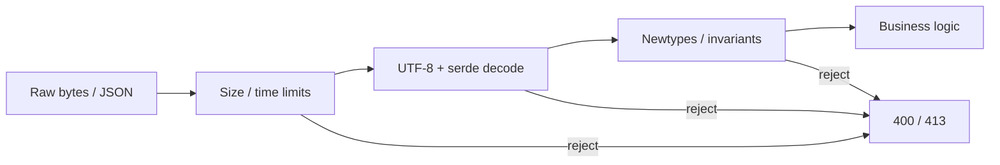

# Input Validation

## Learning Goals

- Treat all external data as hostile: HTTP bodies, headers, query strings, gRPC fields, files, env.
- Prefer **allowlists**, type-driven parsing, and explicit limits over ad-hoc checks.
- Use `serde` + custom deserializers / newtypes to make invalid states unrepresentable.
- Bound sizes and complexity to prevent DoS.
- Validate at trust boundaries; re-validate when data crosses privilege levels.

## Principle: Parse, Don’t Just Check

Stringly-typed APIs invite bugs:

```rust
// Weak: many invalid states still type-check as String
struct CreateUser {
    email: String,
    age: String,
}
```

Better: parse into domain types once at the edge:

```rust
use serde::Deserialize;

#[derive(Debug, Clone)]
struct Email(String);

#[derive(Debug, Deserialize)]
struct CreateUser {
    email: String,
    age: u8,
}

fn parse_email(raw: &str) -> Result<Email, &'static str> {
    let raw = raw.trim();
    if raw.len() > 254 {
        return Err("email too long");
    }
    // teaching-level check — use a maintained validator for production policy
    if !raw.contains('@') || raw.starts_with('@') || raw.ends_with('@') {
        return Err("email format");
    }
    Ok(Email(raw.to_ascii_lowercase()))
}
```

Once you have `Email`, inner code accepts only `Email`, not arbitrary strings.

## Concept Diagram



## Layers of Defense

1. **Transport limits** — max body bytes, timeouts, max headers.
2. **Syntax** — valid JSON/protobuf, valid UTF-8.
3. **Schema** — required fields, types, enums.
4. **Domain invariants** — ranges, formats, referential rules.
5. **Authorization** — even valid input may be forbidden for this principal.

Skipping straight to step 4 without 1–2 invites parser DoS and panics.

## Username / Slug Allowlists

```rust
fn validate_username(s: &str) -> Result<(), &'static str> {
    if s.len() < 3 || s.len() > 32 {
        return Err("length");
    }
    if !s.chars().all(|c| c.is_ascii_alphanumeric() || c == '_') {
        return Err("charset");
    }
    if s.starts_with('_') || s.ends_with('_') {
        return Err("edges");
    }
    Ok(())
}

#[cfg(test)]
mod tests {
    use super::*;

    #[test]
    fn username_ok() {
        assert!(validate_username("ada_lovelace").is_ok());
    }

    #[test]
    fn username_rejects_spaces_and_unicode_confusers() {
        assert!(validate_username("ada lovelace").is_err());
        assert!(validate_username("аda").is_err()); // Cyrillic 'а' if present
    }
}
```

Allowlists beat denylists (`filter <script>`) which fail open on the next bypass.

## Serde Newtypes with Custom Deserialize

```rust
use serde::{Deserialize, Deserializer};

#[derive(Debug, Clone)]
pub struct Username(String);

impl Username {
    pub fn as_str(&self) -> &str {
        &self.0
    }
}

impl<'de> Deserialize<'de> for Username {
    fn deserialize<D>(deserializer: D) -> Result<Self, D::Error>
    where
        D: Deserializer<'de>,
    {
        let s = String::deserialize(deserializer)?;
        validate_username(&s).map_err(serde::de::Error::custom)?;
        Ok(Username(s))
    }
}

#[derive(Debug, Deserialize)]
pub struct RegisterRequest {
    pub username: Username,
    pub age: u8,
}
```

Invalid JSON fields become 422/400 at the framework boundary if you map errors correctly.

## Numeric Ranges and Overflow Mindset

```rust
fn parse_page_size(raw: i64) -> Result<usize, &'static str> {
    if raw < 1 || raw > 100 {
        return Err("page size 1..=100");
    }
    Ok(raw as usize)
}
```

Watch:

- Negative values cast to large `usize`
- Multiplication for skip/offset overflowing
- Client-controlled array sizes

```rust
fn offset(page: usize, size: usize) -> Option<usize> {
    page.checked_mul(size)
}
```

## Path and File Inputs

Never concatenate user strings into filesystem paths:

```rust
use std::path::{Component, Path, PathBuf};

fn safe_join(base: &Path, user: &str) -> Option<PathBuf> {
    let user_path = Path::new(user);
    if user_path.is_absolute() {
        return None;
    }
    let mut out = base.to_path_buf();
    for c in user_path.components() {
        match c {
            Component::Normal(seg) => out.push(seg),
            Component::CurDir => {}
            _ => return None, // ParentDir, RootDir, Prefix — reject
        }
    }
    // optional: ensure canonicalize stays under base
    Some(out)
}
```

## SQL and Command Injection

Use parameterized queries (`sqlx` query macros/binds). Never:

```rust
// BAD
// let q = format!("SELECT * FROM users WHERE name = '{}'", name);
```

Same for shell:

```rust
// BAD: std::process::Command::new("sh").arg("-c").arg(user_input)
// GOOD: Command::new("convert").arg(&input_path).arg(&output_path) with validated paths
```

## HTML / XSS

If you render HTML, escape by default (templating engines with auto-escape). APIs returning JSON are not immune if clients inject into `innerHTML`.

## Header and Log Injection

```rust
fn sanitize_for_log(s: &str) -> String {
    s.chars()
        .map(|c| if c.is_control() { ' ' } else { c })
        .take(200)
        .collect()
}
```

Strip CR/LF from values that might forge log lines or HTTP header splitting in older stacks.

## Protobuf / gRPC Validation

Protobuf types are weaker than your domain. Validate after decode:

```rust
fn validate_create_title(title: &str) -> Result<(), tonic::Status> {
    if title.trim().is_empty() || title.len() > 200 {
        return Err(tonic::Status::invalid_argument("title"));
    }
    Ok(())
}
```

Recursion / repeated field counts can explode memory — cap list lengths.

## Body Limits in HTTP

```rust
// tower-http or hyper settings: max request body size
// Reject before buffering entire payload into memory when possible.
const MAX_BODY: usize = 1024 * 1024; // 1 MiB
```

Stream large uploads to disk with quotas; do not `read_to_end` unbounded.

## Canonicalization and Unicode

- Normalize emails/usernames policy (case folding) consistently before uniqueness checks.
- Be careful with Unicode homoglyphs in display names (spoofing admin UI).
- Prefer NFC normalization if you compare user-visible strings.

```rust
// optional crate: unicode-normalization
// use unicode_normalization::UnicodeNormalization;
// let n: String = input.nfc().collect();
```

## Error Messages

Return enough for legitimate clients, not oracle detail for attackers:

| Internal | Client |
|----------|--------|
| “user exists with email” on register | “could not register” (or carefully rate-limited existence policy) |
| Stack trace | correlation id only |
| SQL error | “invalid request” |

## Validation Checklist

- [ ] Max body / message size
- [ ] Timeouts on slowloris-style clients
- [ ] Allowlist char sets for identifiers
- [ ] Ranges for all integers
- [ ] Enums for status fields (serde deny unknown if appropriate)
- [ ] Path safety for any file operation
- [ ] Parameterized DB/commands
- [ ] Tests for empty, max+1, unicode, null bytes

## Common Mistakes

- Client-side validation only.
- Denylist “bad words” for security.
- Trusting `Content-Length` without enforcing read caps.
- Decoding JSON into `serde_json::Value` and passing trees unchecked.
- Validating only on write, not on read-from-DB after migrations or admin edits.
- Using regexes that are vulnerable to catastrophic backtracking on hot paths.

## Hands-On Practice

1. Implement `Username` newtype with serde validation and unit tests.
2. Add a 1 MiB body limit to an axum service; prove a large POST fails.
3. Write `safe_join` tests including `../etc/passwd` attempts.
4. Replace one string-built SQL fragment (if any) with bound parameters.
5. Fuzz one pure validator function with `cargo fuzz` (preview for next chapter).

## Chapter Summary

Validation is **parsing at trust boundaries** into constrained domain types, with hard limits against DoS. Allowlist, bound, and parameterize — then authorize. Next: **audit, fuzz, and hardening** to find what validation and reviews still miss.
