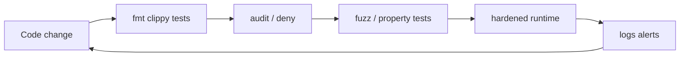

# Audit, Fuzz, and Hardening

## Learning Goals

- Build a practical security feedback loop: static checks, dependency audit, fuzzing, and runtime hardening.
- Run `cargo audit` / `cargo deny` style supply-chain gates in CI.
- Write a **cargo-fuzz** target for a pure parser/validator.
- Apply least-privilege OS and container hardening for Rust services.
- Know what code review should look for in unsafe, crypto, and auth code.

## Defense in Depth Loop



No single tool replaces design. Tools catch regressions and low-hanging fruit.

## Static Quality Gates

```bash
cargo fmt --check
cargo clippy -- -D warnings
cargo test
```

Clippy lints that matter for security posture:

- `unwrap_used` / `expect_used` (pedantic groups — enable selectively)
- Integer overflow related patterns in release (understand `overflow-checks`)
- Deprecated crypto APIs when flagged

Enable overflow checks in release for security-sensitive integer code if performance allows:

```toml
# Cargo.toml
[profile.release]
overflow-checks = true
```

## Dependency and Supply-Chain Hygiene

### cargo-audit

```bash
cargo install cargo-audit
cargo audit
```

Fails on known RustSec advisories. Run in CI on every PR and on a schedule (new CVEs appear after merge).

### cargo-deny

```bash
cargo install cargo-deny
cargo deny check
```

Policy examples:

- Deny yanked crates
- License allowlists
- Advisory severity thresholds
- Ban known-malicious or abandoned crates

### Version pinning and lockfiles

- Commit `Cargo.lock` for binaries and deployable services.
- Review sudden version jumps in PRs (`cargo tree -d` for duplicates).
- Prefer well-maintained crates with clear ownership.

### Typosquatting awareness

Before adding `serd` vs `serde`-like names, verify the crate URL and downloads. Pin exact versions for critical crypto crates.

## What to Audit Manually

| Area | Look for |
|------|----------|
| `unsafe` | Documented invariants, bounds checks, provenance |
| Crypto | Non-constant-time compares, DIY protocols, ECB jokes |
| Authn/z | Missing checks, IDOR, token in logs |
| Parsing | Unbounded allocation, recursion |
| FFI | Lifetime of pointers, null, alignment |
| Secrets | Hardcoded keys, debug prints |

Review checklist snippet for PRs:

```markdown
- [ ] No new unwrap on external input
- [ ] Authz tests for new routes
- [ ] Body/size limits considered
- [ ] Dependencies reviewed (cargo audit clean)
- [ ] Secrets not logged
```

## Property Testing vs Fuzzing

| Technique | Strength |
|-----------|----------|
| Unit tests | Known cases |
| Property tests (`proptest`) | Random structured inputs, shrink |
| Coverage-guided fuzzing | Finds deep parser crashes / panics |
| Integration tests | Authz and wiring |

Use all three at different layers.

### proptest example

```rust
use proptest::prelude::*;

fn validate_username(s: &str) -> bool {
    s.len() >= 3
        && s.len() <= 32
        && s.chars().all(|c| c.is_ascii_alphanumeric() || c == '_')
}

proptest! {
    #[test]
    fn never_panics(s in "\\PC*") {
        let _ = validate_username(&s);
    }

    #[test]
    fn accepts_only_reasonable_ascii(s in "[a-zA-Z0-9_]{3,32}") {
        prop_assert!(validate_username(&s));
    }
}
```

## cargo-fuzz Overview

[cargo-fuzz](https://github.com/rust-fuzz/cargo-fuzz) uses libFuzzer via `cargo fuzz`.

```bash
cargo install cargo-fuzz
# requires nightly for many setups
rustup toolchain install nightly
cargo fuzz init
```

Target for a parser:

```rust
// fuzz/fuzz_targets/parse_frame.rs
#![no_main]
use libfuzzer_sys::fuzz_target;

fn parse_length_prefixed(data: &[u8]) -> Option<&[u8]> {
    if data.len() < 4 {
        return None;
    }
    let n = u32::from_be_bytes(data[0..4].try_into().ok()?) as usize;
    if n > 1024 * 1024 {
        return None; // reject huge — fuzz will still try
    }
    if data.len() < 4 + n {
        return None;
    }
    Some(&data[4..4 + n])
}

fuzz_target!(|data: &[u8]| {
    let _ = parse_length_prefixed(data);
});
```

Run:

```bash
cargo +nightly fuzz run parse_frame -- -max_total_time=60
```

Goals: no panic, no hang, no memory blow-up. For `unsafe` parsers, fuzz is mandatory.

### Sanitizers

On supported platforms, ASan/UBSan builds catch memory issues in unsafe code. Embed fuzzing in nightly CI with a time box (5–15 minutes) plus longer weekly runs.

## Hardening the Runtime

### Linux process

```bash
# systemd snippets (concept)
# NoNewPrivileges=yes
# PrivateTmp=yes
# ProtectSystem=strict
# ProtectHome=yes
# CapabilityBoundingSet=
# RestrictAddressFamilies=AF_INET AF_INET6 AF_UNIX
# SystemCallFilter=@system-service
```

### Containers

```dockerfile
# conceptual hardening
# USER nonroot
# read-only root FS where possible
# drop ALL capabilities
# no privileged
# minimal distroless/static base
```

Static linking (`target` musl) can reduce glibc CVE surface for simple services — trade off carefully.

### Resource limits

```bash
ulimit -n 65536   # if needed, still finite
# cgroup memory/cpu limits in k8s: requests + limits
```

In-app: semaphore for concurrency, max body size, DB pool size — match cgroup limits so Linux OOM is not your only brake.

## Secrets Management

- Inject secrets via environment or files from a secrets manager — not images.
- Zeroize sensitive buffers when appropriate (`zeroize` crate).
- Rotate tokens; support dual keys during rotation windows.

```rust
// conceptual: prefer secrecy::SecretString for accidental Debug
```

## Logging and Audit Trails

Security-relevant events:

- login success/failure (with rate-limit awareness)
- authz denials
- admin actions
- TLS client identity (mTLS)

```rust
tracing::warn!(
    user_id = %user_id,
    resource = %note_id,
    "authorization denied"
);
```

Never log passwords, raw tokens, or full card data. Redact:

```rust
fn redact_token(t: &str) -> String {
    if t.len() <= 8 {
        return "***".into();
    }
    format!("{}…{}", &t[..4], &t[t.len() -4..])
}
```

## Feature Flags for Kill Switches

Keep a remote-config or env flag to disable risky features under attack:

```rust
fn payments_enabled() -> bool {
    std::env::var("PAYMENTS_ENABLED").ok().as_deref() != Some("0")
}
```

## Incident-Ready Artifacts

From hardening work you should produce:

1. SBOM or locked dependency list for releases
2. Runbook: rotate JWT secret / TLS cert
3. Contact path for vulnerability reports (`SECURITY.md`)
4. Known accepted risks from threat model

## Common Mistakes

- `cargo audit` only on developer laptops, never CI.
- Fuzzing only “for a minute once.”
- Ignoring transitive yanked crates.
- Running containers as root with writable root FS.
- Treating clippy clean as “secure.”
- Suppressing advisories without expiry dates.

## Hands-On Practice

1. Run `cargo audit` on a real service crate; file issues for findings.
2. Add a `proptest` suite for your validators.
3. Create one `cargo fuzz` target for a length-prefixed parser; run 60 seconds.
4. Write a Dockerfile that runs as non-root with a read-only rootfs where possible.
5. Draft `SECURITY.md` with a disclosure contact and supported versions.

## Chapter Summary

Hardening is continuous: **static gates, supply-chain policy, fuzzing parsers, least-privilege runtime, and audit logging**. Combine tools with human review of auth and unsafe code. Next book part: **distributed systems** — consistency, idempotency, and reliability when many nodes share the blame.
