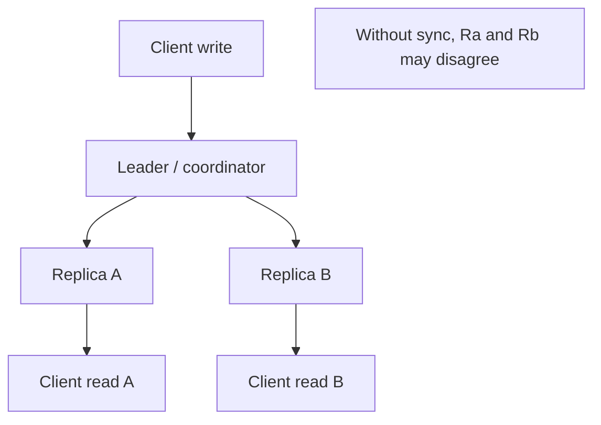

# Consistency Models

## Learning Goals

- Explain why distributed systems cannot give you perfect consistency, availability, and partition tolerance at once in the naive sense.
- Compare strong, sequential, causal, and eventual consistency in practical engineering terms.
- Choose consistency per operation (not per “the whole system”).
- Model read-your-writes and fencing tokens in Rust-shaped examples.
- Document consistency promises so clients and on-call engineers share the same truth.

## The Uncomfortable Reality

Multiple nodes + network delay + crashes means replicas diverge unless you coordinate. Coordination costs latency and availability during partitions. **Consistency is a product choice**, not a moral absolute.

Classic CAP-style teaching (simplified for practitioners):

| During a partition you prioritize… | Behavior |
|------------------------------------|----------|
| Consistency | Refuse or delay some operations |
| Availability | Serve possibly stale or conflicting data |

Most real systems are “CP-ish” for some ops and “AP-ish” for others.

## Concept Diagram



## Vocabulary You Will Use in Design Docs

| Term | Meaning |
|------|---------|
| Linearizability | Each op appears instantaneously at a single point in time; real-time order preserved |
| Sequential consistency | Ops appear in some single order agreeing with each process’s order (weaker real-time) |
| Causal consistency | Causally related ops seen in order; concurrent ops may diverge |
| Eventual consistency | If writes stop, replicas converge |
| Read-your-writes | A client sees its own writes immediately |
| Monotonic reads | A client never goes backward in time |
| Quorum | Need R+W &gt; N (typical) so reads intersect writes |

You rarely implement a full linearizable store from scratch. You **choose systems** (etcd, Postgres, Kafka, Dynamo-style DBs) that provide specific guarantees.

## Strong Consistency (When It Pays Off)

Use when wrong answers are worse than downtime:

- Bank ledger final balances
- Unique username reservation
- Distributed locks / leader election
- Inventory hard reservation (with care)

Pattern: single leader or consensus (Raft/Paxos family) for the critical key space.

```text
Client → primary → durable log → ack → followers catch up
Read from primary (or quorum) for linearizable reads
```

Tradeoff: primary failover, higher write latency, capacity ceiling on the leader.

## Eventual Consistency (When It Pays Off)

Use when availability and partition survival matter more:

- Social feed counters
- CDN metadata
- Shopping cart (with merge rules)
- Device telemetry

Pattern: write locally/regionally, async replicate, resolve conflicts.

```rust
/// Last-write-wins register (teaching toy — clocks lie; prefer version vectors in real CRDTs).
#[derive(Clone, Debug)]
struct LwwRegister {
    value: String,
    ts: u64, // logical or Hybrid Logical Clock in real systems
}

impl LwwRegister {
    fn merge(&mut self, other: LwwRegister) {
        if other.ts >= self.ts {
            *self = other;
        }
    }
}
```

Conflict strategies:

| Strategy | Notes |
|----------|-------|
| Last-write-wins | Simple; can lose data under clock skew |
| Application merge | e.g. set union for tags |
| CRDTs | Principled converge |
| Human reconcile | Support tooling for rare conflicts |

## Causal and Session Guarantees

Users notice:

- “I posted then refreshed and it’s gone” (missing read-your-writes)
- “Count went 5 → 3 → 6” (non-monotonic)

Session guarantees often implemented with:

- Sticky sessions to the same replica
- Client tokens carrying last seen version (“read at ≥ v”)
- Read-from-primary after write for that user

```rust
#[derive(Clone, Copy, Default)]
struct SessionToken {
    last_seen_version: u64,
}

fn read_allowed(replica_version: u64, session: SessionToken) -> bool {
    replica_version >= session.last_seen_version
}
```

## Quorums (Dynamo-Style Intuition)

For N replicas, write quorum W, read quorum R:

- If **R + W &gt; N**, read and write sets intersect → reader sees latest durable write (under common assumptions).
- Example: N=3, W=2, R=2.

```rust
fn quorum_ok(acks: usize, need: usize) -> bool {
    acks >= need
}

fn default_quorum(n: usize) -> (usize, usize) {
    let w = n / 2 + 1;
    let r = n / 2 + 1;
    (r, w) // R+W = 2*(n/2+1) > n for typical n
}
```

Tuning: W=N, R=1 → fast reads, slow durable writes; W=1, R=N → opposite.

## Postgres / Single-Node Mental Model

A single primary Postgres gives you **transactional** consistency for data inside that database. Distributed chaos starts when you:

- Add read replicas (replication lag → stale reads)
- Split across microservices (no distributed transaction by default)
- Cache in Redis (TTL staleness)

Document:

```text
GET /profile may be up to 2s stale (replica lag)
POST /profile is linearizable on primary
```

## Outbox and Dual Writes

Classic bug: write DB then publish message (or reverse). One can succeed while the other fails → inconsistent views.

**Transactional outbox** pattern:

1. In one DB transaction: update business row + insert outbox row.
2. Publisher polls outbox and emits to Kafka/NATS.
3. Mark sent (or use CDC).

```rust
struct OutboxEvent {
    id: uuid::Uuid,
    topic: String,
    payload: Vec<u8>,
    sent: bool,
}

// Pseudocode:
// begin;
// update accounts...;
// insert outbox...;
// commit;
// async: publish where sent=false
```

## Fencing Tokens for Locks

Stale lock holders must not clobber state after lease expiry.

```rust
#[derive(Clone, Copy)]
struct Fence {
    token: u64,
}

fn apply_write(store_token: &mut u64, op_token: u64, apply: impl FnOnce()) -> Result<(), &'static str> {
    if op_token < *store_token {
        return Err("stale fence");
    }
    apply();
    *store_token = op_token;
    Ok(())
}
```

Any storage write carries the fence; storage rejects lower tokens.

## Choosing Per Operation

| Operation | Suggested consistency |
|-----------|----------------------|
| Charge card | Strong / ledger + idempotency |
| Update avatar URL | Eventual OK |
| Feature flag admin | Strong |
| Metrics scrape | Eventual |
| Unique email signup | Strong uniqueness constraint |

API design tip: **don’t hide** “this is eventually consistent” behind the same SLA as strong reads.

## Testing Consistency Mentally

Tools and techniques:

- Jepsen-style partition tests for serious stores (not every app)
- Chaos: kill primary, assert clients error or failover cleanly
- Property: after quiescence, all replicas equal for LWW keys

```rust
#[test]
fn lww_converges() {
    let mut a = LwwRegister {
        value: "x".into(),
        ts: 1,
    };
    let b = LwwRegister {
        value: "y".into(),
        ts: 2,
    };
    a.merge(b.clone());
    let mut c = b;
    c.merge(a.clone());
    assert_eq!(a.value, c.value);
}
```

## Common Mistakes

- “We’re on Kubernetes so we’re consistent.”
- Reading your own write from a lagging replica.
- Dual writes without outbox/CDC.
- Using wall clock alone for LWW across regions.
- Assuming clients can “just retry” without defining merge.
- One global consistency story for every endpoint.

## Hands-On Practice

1. Write a design note: three endpoints with three different consistency promises.
2. Implement LWW merge + a test for convergence.
3. Diagram a dual-write bug and the outbox fix for your notes service.
4. Simulate replica lag with a `version` field and session token check.
5. List which data in your job would hurt most if stale for 30 seconds.

## Chapter Summary

Consistency models are **contracts** about what readers can observe under delay and failure. Pick strong coordination only where correctness demands it; elsewhere design merge rules and session guarantees. Next: **idempotency** — the twin of retries in an at-least-once world.
