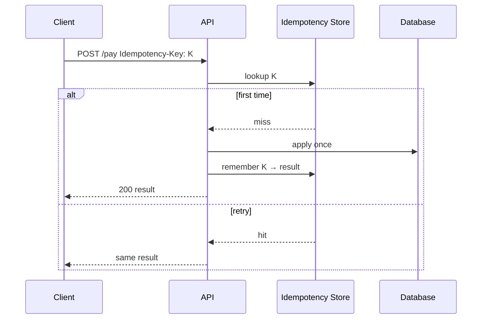

# Idempotency

## Learning Goals

- Explain why retries and at-least-once delivery make non-idempotent APIs dangerous.
- Design idempotency keys for HTTP and message consumers.
- Implement in-memory and durable idempotency stores with correct conflict behavior.
- Distinguish safe retries for GET vs POST/payment side effects.
- Combine idempotency with timeouts, fencing, and exactly-once illusions.

## Why Idempotency Exists

Networks hide outcomes:

```text
Client → request → server applied write → response lost
Client retries → without idempotency → double charge / double ship
```

Delivery guarantees in practice:

| Claim | Reality |
|-------|---------|
| At-most-once | Can lose messages |
| At-least-once | Can duplicate |
| Exactly-once | Usually at-least-once + idempotent handlers + dedupe storage |

Build for **at-least-once** + **idempotent processing**.

## Concept Diagram



## HTTP Idempotency Keys

Common pattern (Stripe-style):

- Client generates a unique key per logical operation (UUID).
- Sends `Idempotency-Key: <uuid>` on POST.
- Server stores key → response (status + body hash or body) for a retention window.
- Replays return the **same** outcome; conflicting body for same key → **409**.

```rust
use std::collections::HashMap;
use sha2::{Digest, Sha256};

#[derive(Clone)]
struct StoredResponse {
    status: u16,
    body: String,
    request_hash: String,
}

#[derive(Default)]
struct IdempotencyMap {
    map: HashMap<String, StoredResponse>,
}

fn hash_body(body: &str) -> String {
    let mut h = Sha256::new();
    h.update(body.as_bytes());
    hex::encode(h.finalize())
}

impl IdempotencyMap {
    fn begin_or_replay(
        &mut self,
        key: &str,
        body: &str,
    ) -> Result<Option<StoredResponse>, &'static str> {
        let req_hash = hash_body(body);
        if let Some(stored) = self.map.get(key) {
            if stored.request_hash != req_hash {
                return Err("idempotency key reuse with different body");
            }
            return Ok(Some(stored.clone()));
        }
        Ok(None)
    }

    fn commit(&mut self, key: String, status: u16, body: String, request_hash: String) {
        self.map.insert(
            key,
            StoredResponse {
                status,
                body,
                request_hash,
            },
        );
    }
}
```

Wire into a handler:

```rust
fn apply_payment(amount_cents: u64) -> String {
    format!(r#"{{"charged":{amount_cents}}}"#)
}

fn pay_handler(
    store: &mut IdempotencyMap,
    key: &str,
    body: &str,
    amount_cents: u64,
) -> Result<(u16, String), &'static str> {
    if let Some(replay) = store.begin_or_replay(key, body)? {
        return Ok((replay.status, replay.body));
    }
    let response_body = apply_payment(amount_cents);
    let status = 200;
    store.commit(key.to_string(), status, response_body.clone(), hash_body(body));
    Ok((status, response_body))
}
```

Production store: Redis/Postgres with TTL (e.g. 24h), unique constraint on key, and careful in-progress states.

## In-Progress and Concurrent Retries

Two concurrent requests with the same key must not both apply:

```rust
enum Record {
    InProgress,
    Done(StoredResponse),
}

// Pseudo-transaction:
// INSERT key IN_PROGRESS — if conflict, wait or return 409/429
// apply business logic
// UPDATE key DONE + response
// on failure: delete or mark failed so client can retry policy-wise
```

Options when a twin arrives while in progress:

- Wait (with timeout) for completion
- Return `409 Conflict` / `102`-style processing (HTTP semantics vary)
- Return `429` with Retry-After

## Natural vs Synthetic Idempotency

| Kind | Example |
|------|---------|
| Naturally idempotent | `PUT /users/1 {name:ada}` full replace |
| Naturally idempotent | Set membership `SADD tag` |
| Needs key | `POST /charges` amount 10 |
| Needs key | “increment balance by 10” |

Prefer natural idempotency in API design (`PUT` absolute state) when possible.

```rust
// Non-idempotent intent
// POST /balance/increment { "by": 10 }

// Better absolute or tokenized form
// PUT /balance { "amount": 50, "if_version": 3 }
// or POST with idempotency key
```

## Message Consumers

Queues redeliver. Consumer pattern:

```rust
use std::collections::HashSet;

struct Consumer {
    processed: HashSet<String>,
}

impl Consumer {
    fn handle(&mut self, message_id: &str, mut process: impl FnMut()) {
        if !self.processed.insert(message_id.to_string()) {
            return; // duplicate delivery
        }
        process();
        // persist processed id BEFORE or WITH side effects using same transaction when possible
    }
}
```

Better: store dedupe keys in the **same database transaction** as the side effect (or use outbox + unique constraints).

Kafka: prefer deterministic keys and transactional producers where needed; still design consumers idempotently.

## Exactly-Once Myths

“Exactly-once” end-to-end across arbitrary systems is extraordinarily hard. What people ship:

1. At-least-once transport
2. Idempotent handler
3. Deduplicating store with uniqueness constraints
4. Sometimes transactional messaging within one vendor ecosystem

Be precise in design docs: “exactly-once **effect**” not “exactly-once delivery.”

## Idempotency + Timeouts

Server applied, client timed out → client retries with **same** key. If the client generates a new UUID per attempt, you double-apply.

Client rule:

```rust
fn client_charge(client: &reqwest::Client, key: uuid::Uuid) {
    // reuse `key` across retries for the same logical charge
    let _ = key;
    let _ = client;
}
```

## Storage Schema Sketch (SQL)

```sql
CREATE TABLE idempotency_keys (
  key            TEXT PRIMARY KEY,
  request_hash   TEXT NOT NULL,
  status         INT  NOT NULL,
  response_body  TEXT NOT NULL,
  created_at     TIMESTAMPTZ NOT NULL DEFAULT now(),
  expires_at     TIMESTAMPTZ NOT NULL
);

CREATE INDEX ON idempotency_keys (expires_at);
```

Cleanup job deletes expired rows. Unique primary key enforces single winner under concurrency.

## Testing

```rust
#[test]
fn retry_same_key_same_result() {
    let mut store = IdempotencyMap::default();
    let body = r#"{"amount":10}"#;
    let (s1, b1) = pay_handler(&mut store, "k1", body, 10).unwrap();
    let (s2, b2) = pay_handler(&mut store, "k1", body, 10).unwrap();
    assert_eq!(s1, s2);
    assert_eq!(b1, b2);
}

#[test]
fn same_key_different_body_conflicts() {
    let mut store = IdempotencyMap::default();
    pay_handler(&mut store, "k1", r#"{"amount":10}"#, 10).unwrap();
    let err = pay_handler(&mut store, "k1", r#"{"amount":11}"#, 11).unwrap_err();
    assert!(err.contains("reuse"));
}
```

Chaos test: kill process after apply but before respond; restart; retry with same key → one effect.

## Common Mistakes

- New key on every HTTP retry.
- Storing only “seen” without the response → retries return empty/wrong body.
- No conflict check when key reused with different payload.
- Dedupe set only in memory on multi-instance deploy (each instance double-applies).
- Infinite retention of keys without TTL/GDPR story.
- Assuming GET retries need keys (safe methods are already idempotent by HTTP semantics if implemented correctly).

## Hands-On Practice

1. Add `Idempotency-Key` support to the edge notes API from the network project.
2. Persist keys in SQLite/Postgres with a unique constraint.
3. Prove concurrent double POST with same key only inserts one row.
4. Document retention (24h?) and client requirements.
5. Convert one “increment” API to versioned absolute update.

## Chapter Summary

Idempotency turns duplicate deliveries into safe no-ops (or safe replays of the same result). Use **client keys**, **durable dedupe**, and **request hashing** for payments and other side effects. Next: **messaging and streams** — where at-least-once is the default weather.
