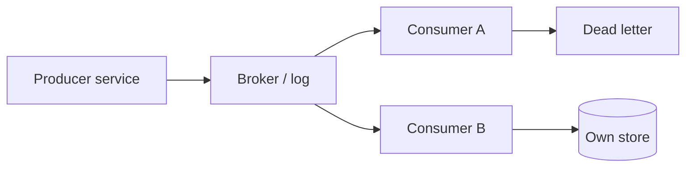

# Messaging and Streams

## Learning Goals

- Choose between synchronous RPC and asynchronous messaging for a given use case.
- Compare queues, pub/sub, and logs/streams (Kafka-style) for Rust services.
- Implement producer/consumer patterns with ack, retry, and dead-letter thinking.
- Apply schema evolution and poison-message handling.
- Avoid classic pitfalls: dual writes, unbounded retries, and chatty topics.

## Sync vs Async Communication

| Style | Pros | Cons |
|-------|------|------|
| Sync RPC (HTTP/gRPC) | Simple request/response, easy debugging | Temporal coupling; cascading failures |
| Async message | Temporal decoupling; buffering; fan-out | Eventual consistency; harder tracing |
| Stream/log | Replay, multiple consumers, audit | Operational complexity; ordering nuances |

Use messaging when work can finish **after** the user request returns, or when multiple systems must react to the same fact.

## Concept Diagram



## Messaging Models

### Work queue

- Each message consumed by **one** worker.
- Good for jobs: resize image, send email.
- Competing consumers scale throughput.

### Pub/sub

- Each subscriber gets a copy (fan-out).
- Good for notifications: “user.created”.

### Log / stream (Kafka, Redpanda, Pulsar, NATS JetStream)

- Ordered append-only log per partition.
- Consumers track **offsets**; can replay.
- Good for event sourcing, analytics, CDC.

## Rust Ecosystem Snapshot (2026)

| Need | Crates / clients |
|------|------------------|
| NATS | `async-nats` |
| Kafka | `rdkafka`, `kafka-thread` style wrappers |
| RabbitMQ | `lapin` |
| AWS SQS/SNS | `aws-sdk-sqs` |
| Redis streams | `redis` |
| In-process | `tokio::sync::mpsc` |

This chapter stays broker-agnostic with portable patterns.

## Message Envelope

Always wrap business payloads:

```rust
use serde::{Deserialize, Serialize};
use uuid::Uuid;

#[derive(Serialize, Deserialize, Clone, Debug)]
struct Envelope<T> {
    message_id: Uuid,
    correlation_id: Uuid,
    schema: String, // e.g. "note.created.v1"
    occurred_at_unix_ms: u64,
    payload: T,
}

#[derive(Serialize, Deserialize, Clone, Debug)]
struct NoteCreated {
    note_id: Uuid,
    owner_id: Uuid,
    title: String,
}
```

`message_id` for dedupe; `correlation_id` for tracing; `schema` for evolution.

## Producer Responsibilities

1. Make the business decision durable (DB) **with** intent to publish (outbox).
2. Serialize with a versioned schema.
3. Set a partition/routing key for ordering (e.g. `user_id`).
4. Handle publish failures without silent loss.

```rust
fn serialize_note_created(ev: &Envelope<NoteCreated>) -> Result<Vec<u8>, serde_json::Error> {
    serde_json::to_vec(ev)
}
```

### Ordering

Kafka-style: order is per **partition**. Choose key so related events land together (`account_id`). Global order across partitions is not free.

## Consumer Responsibilities

1. Deserialize + validate schema.
2. Idempotently apply side effects.
3. Ack/commit offset only after success (or use transactional patterns carefully).
4. On poison messages: retry budget then dead-letter.

```rust
use std::collections::HashSet;

struct Handler {
    seen: HashSet<Uuid>,
}

impl Handler {
    fn handle(&mut self, env: Envelope<NoteCreated>) -> Result<(), String> {
        if !self.seen.insert(env.message_id) {
            return Ok(()); // duplicate delivery
        }
        // apply to DB...
        Ok(())
    }
}
```

## Ack Semantics

| Mode | Risk |
|------|------|
| Auto-ack on receive | Lose message if crash mid-process |
| Ack after success | At-least-once; need idempotency |
| At-most-once | May lose; rare for business events |

Prefer ack-after-success + idempotency.

## Retry and Dead Letter

```rust
struct RetryPolicy {
    max_attempts: u32,
}

fn should_dead_letter(attempt: u32, policy: RetryPolicy) -> bool {
    attempt >= policy.max_attempts
}
```

- Transient errors (timeout, 503): exponential backoff + jitter, requeue.
- Permanent errors (schema invalid): DLQ quickly; alert.
- DLQ monitor is mandatory — silent DLQ is a data black hole.

## Backpressure

If consumers are slow:

- Broker retains messages up to retention limits.
- Lag metrics (`consumer_lag`) should page before retention drops data.
- Scale consumers; or shed load; or pause producers.

```rust
// In-process backpressure: bounded channel
// let (tx, rx) = tokio::sync::mpsc::channel(1024);
// tx.send(...).await — waits when full
```

Unbounded in-process queues are OOM machines waiting to happen.

## Schema Evolution

Rules that keep consumers alive:

- Add optional fields with defaults.
- Never reuse field numbers (protobuf) or change meaning silently (JSON keys).
- Use `note.created.v2` when breaking; dual-publish during migration if needed.
- Consumer tolerates unknown fields (`#[serde(deny_unknown_fields)]` only when you mean to be strict).

```rust
#[derive(Serialize, Deserialize)]
struct NoteCreatedV2 {
    note_id: Uuid,
    owner_id: Uuid,
    title: String,
    #[serde(default)]
    tags: Vec<String>, // additive
}
```

## Outbox Review (Messaging Edition)

```text
Transaction:
  INSERT notes ...
  INSERT outbox(message_id, topic, bytes) ...
Commit
Publisher:
  SELECT outbox WHERE published=false
  PUBLISH
  MARK published
```

CDC (Debezium-style) is the managed variant of the same idea.

## When Not to Use a Broker

- Simple CRUD where the caller needs the result now — use RPC.
- Two services in the same process — function call.
- Low scale and one consumer — a DB work table may suffice.

Brokers add ops cost; earn it with fan-out, durability, or load leveling.

## Observability for Messaging

Log/metric fields:

- `message_id`, `correlation_id`, `topic`, `partition`, `offset`
- process latency, success/fail, DLQ count
- lag per consumer group

Trace: inject trace context into envelope headers (OpenTelemetry propagation).

## Minimal In-Process Lab (No Broker)

```rust
use tokio::sync::mpsc;
use uuid::Uuid;

#[derive(Debug)]
struct Msg {
    id: Uuid,
    body: String,
}

#[tokio::main]
async fn main() {
    let (tx, mut rx) = mpsc::channel::<Msg>(16);

    let producer = tokio::spawn(async move {
        for i in 0..5 {
            tx.send(Msg {
                id: Uuid::new_v4(),
                body: format!("job-{i}"),
            })
            .await
            .unwrap();
        }
    });

    let consumer = tokio::spawn(async move {
        while let Some(msg) = rx.recv().await {
            println!("processing {} {}", msg.id, msg.body);
            // ack is dropping / looping — simulate work
            tokio::time::sleep(std::time::Duration::from_millis(10)).await;
        }
    });

    let _ = tokio::join!(producer, consumer);
}
```

Replace the channel with NATS/Kafka once the handler is idempotent and instrumented.

## Common Mistakes

- Dual write without outbox.
- Non-idempotent consumers on at-least-once buses.
- Giant messages (prefer object store + pointer).
- One topic for all event types with no schema discipline.
- Infinite retries hammering a broken dependency.
- No lag alerts until retention expires.

## Hands-On Practice

1. Define `Envelope<NoteCreated>` and round-trip serde tests.
2. Build an outbox table + poller that prints JSON to stdout.
3. Add a consumer that dedupes on `message_id` and writes to a HashMap store.
4. Inject a poison message; route to a DLQ vec after 3 attempts.
5. Write a short ADR: NATS vs Kafka for your scale and ordering needs.

## Chapter Summary

Messaging decouples services in **time** but demands envelope design, idempotent consumers, backpressure, and schema care. Prefer outbox/CDC for reliable emission. Next: **reliability at scale** — timeouts, bulkheads, load shedding, and multi-instance reality.
