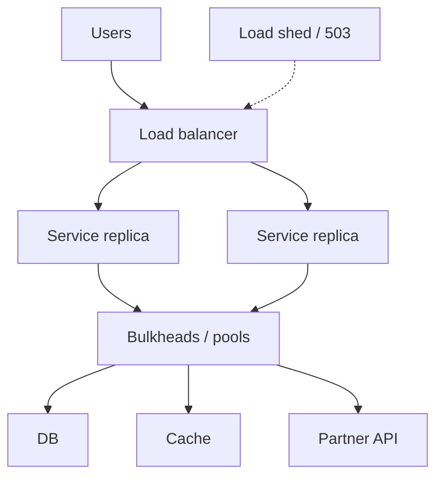

# Reliability at Scale

## Learning Goals

- Apply timeout budgets, bulkheads, retries, and load shedding as a coherent policy.
- Reason about blast radius across multi-instance and multi-dependency systems.
- Use health signals, circuit breakers, and graceful degradation deliberately.
- Define SLIs/SLOs that drive reliability work (not vanity uptime alone).
- Stress multi-instance state: sticky sessions, leader election, and shared limits.

## Scale Changes the Failure Mode

What worked on one box fails at N replicas:

- In-memory rate limits disagree
- Caches diverge
- “It works on my pod” thundering herds
- Retries amplify traffic 10× during brownouts

Reliability at scale is about **bounding overload** and **failing predictably**.

## Concept Diagram



## Timeout Budgets

Every outbound call needs a timeout. Nested calls need a **budget**:

```text
Client deadline: 1000ms
  Edge remaining: 900ms
    Auth check: 50ms
    DB: 200ms
    Partner API: 400ms  (must be < remaining)
```

```rust
use std::time::{Duration, Instant};

struct Deadline {
    start: Instant,
    total: Duration,
}

impl Deadline {
    fn new(total: Duration) -> Self {
        Self {
            start: Instant::now(),
            total,
        }
    }

    fn remaining(&self) -> Duration {
        self.total.saturating_sub(self.start.elapsed())
    }

    fn for_call(&self, desired: Duration) -> Duration {
        desired.min(self.remaining())
    }
}
```

Pass deadlines as headers (`grpc-timeout`, custom `X-Deadline`) so callees can stop early.

## Retries Without Meltdown

Retry only when:

- Error is transient (timeout, 503, connection reset)
- Side effect is idempotent or keyed
- Budget remains
- Attempts are capped
- Backoff has **jitter**

```rust
use rand::Rng;
use std::time::Duration;

fn backoff_ms(attempt: u32) -> Duration {
    let base = 20u64 * 2u64.saturating_pow(attempt.saturating_sub(1));
    let jitter = rand::thread_rng().gen_range(0..50);
    Duration::from_millis(base.min(2_000) + jitter)
}
```

**Server-side** should prefer shedding to receiving infinite client retries. Publish `Retry-After` when possible.

## Bulkheads

Isolate resource pools so one dependency cannot take the whole process:

```rust
use std::sync::Arc;
use tokio::sync::Semaphore;

struct Pools {
    db: Arc<Semaphore>,
    partner: Arc<Semaphore>,
}

impl Pools {
    fn new() -> Self {
        Self {
            db: Arc::new(Semaphore::new(50)),
            partner: Arc::new(Semaphore::new(20)),
        }
    }
}

async fn with_db_permit<F, T>(pools: &Pools, f: F) -> Result<T, &'static str>
where
    F: std::future::Future<Output = T>,
{
    let permit = pools
        .db
        .clone()
        .try_acquire_owned()
        .map_err(|_| "db bulkhead full")?;
    let out = f.await;
    drop(permit);
    Ok(out)
}
```

Separate thread pools / task priorities for latency-critical vs batch work when needed.

## Load Shedding

When saturated, reject **cheaply** and early:

```rust
use std::sync::atomic::{AtomicUsize, Ordering};

struct Inflight {
    n: AtomicUsize,
    max: usize,
}

impl Inflight {
    fn enter(&self) -> Result<Guard<'_>, ()> {
        let cur = self.n.fetch_add(1, Ordering::SeqCst);
        if cur >= self.max {
            self.n.fetch_sub(1, Ordering::SeqCst);
            return Err(());
        }
        Ok(Guard { parent: self })
    }
}

struct Guard<'a> {
    parent: &'a Inflight,
}

impl Drop for Guard<'_> {
    fn drop(&mut self) {
        self.parent.n.fetch_sub(1, Ordering::SeqCst);
    }
}
```

Return **503** with clear body; do not queue unboundedly.

Shed non-critical traffic first (recommendations before checkout).

## Circuit Breakers

Stop calling a dead dependency for a cooldown:

```rust
use std::time::{Duration, Instant};

struct Circuit {
    failures: u32,
    threshold: u32,
    open_until: Option<Instant>,
    cool: Duration,
}

impl Circuit {
    fn allow(&mut self) -> bool {
        if let Some(until) = self.open_until {
            if Instant::now() < until {
                return false;
            }
            self.open_until = None;
            self.failures = 0; // half-open: allow trial
        }
        true
    }

    fn record(&mut self, ok: bool) {
        if ok {
            self.failures = 0;
            self.open_until = None;
        } else {
            self.failures += 1;
            if self.failures >= self.threshold {
                self.open_until = Some(Instant::now() + self.cool);
            }
        }
    }
}
```

Combine with bulkheads: open circuit → fail fast → protect threads.

## Graceful Degradation

| Feature | Full mode | Degraded mode |
|---------|-----------|---------------|
| Product page | Personalized recs | Popular static list |
| Search | ML ranker | Keyword only |
| Writes | Sync index | Queue for async index |

Degradation must be **explicit** in metrics and user experience, not silent corruption.

## Multi-Instance Concerns

### Shared rate limiting

In-memory token buckets per pod = N× limit. Use Redis/Gateway for global limits or accept per-pod approximation.

### Leader election

Only one worker should run a singleton job (cleanup, partition assignor). Use etcd/Consul/K8s leases — not “sleep random.”

### Sticky sessions

Prefer stateless JWTs or shared session store. Stickiness complicates deploys and failure domains.

## SLIs, SLOs, Error Budgets

| SLI | Example |
|-----|---------|
| Availability | successful requests / total (exclude 4xx if product says so) |
| Latency | % of requests with latency &lt; 300 ms |
| Freshness | change-data lag &lt; 60 s |

SLO: e.g. 99.9% monthly availability. **Error budget** = 1 − SLO. When budget burned, freeze risky deploys.

```rust
fn availability(success: u64, total: u64) -> f64 {
    if total == 0 {
        return 1.0;
    }
    success as f64 / total as f64
}
```

## Rolling Deploys and Reliability

- Readiness gates: don’t take traffic until warm.
- MaxUnavailable / surge settings matched to capacity.
- Feature flags for instant rollback of logic.
- Forward/backward compatible messages and DB migrations (expand/contract).

## Failure Injection at Scale

Regularly:

- Kill one AZ/pod under load
- Delay dependency 200–500 ms
- Fill connection pools

Expect: shed, degrade, recover — not silent data loss.

## Common Mistakes

- Same timeout for all outbound calls.
- Retries without jitter or idempotency.
- One giant thread pool for everything.
- “Optimistic” clients with no backoff during outages.
- Uptime measured as process up, not successful user ops.
- Ignoring cold cache on deploy as a self-DDoS.

## Hands-On Practice

1. Add a deadline helper and enforce it on two nested simulated calls.
2. Bulkhead DB vs partner with different semaphore sizes; overload partner and show DB still works.
3. Implement circuit breaker around a flaky function; chart success rate.
4. Write SLOs for one service (avail + latency) and list burn alerts.
5. Document three degradation modes for your product.

## Chapter Summary

At scale, reliability is **budgets, isolation, shedding, and honest SLOs**. Retries without architecture amplify outages; bulkheads and breakers localize them. Next: a **distributed capstone** that stitches consistency, idempotency, messaging, and reliability into one design-and-build exercise.
