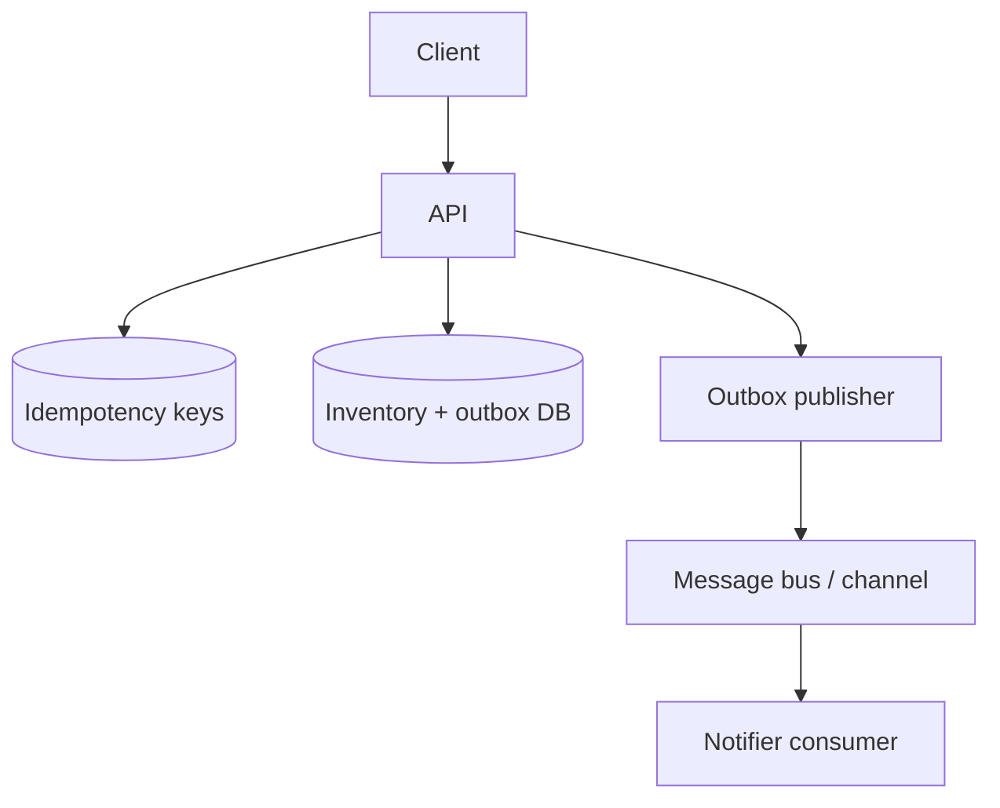

# Distributed Capstone

## Learning Goals

- Design and implement a multi-component system that survives retries, lag, and dependency failure.
- Apply consistency choices, idempotency keys, an outbox, and reliability policies in one project.
- Produce operational artifacts: failure mode table, SLOs, and a demo script.
- Practice the tradeoffs you would defend in a staff-level design review.

## Capstone Brief: **FairTicket**

Build a mini ticket reservation backend:

1. **API** — reserve and confirm seats for events.
2. **Inventory service/store** — seat counts with concurrency safety.
3. **Async notifier** — “reservation created” events for email/analytics (stdout or channel is fine).
4. **Client load** — concurrent reservers with retries.

Hard requirements:

- No double-selling the same seat unit under concurrent clients.
- Client retries must not double-charge inventory when responses are lost.
- Notifier must not lose events if the API process crashes after commit (outbox).
- Under inventory slowness, API times out cleanly and sheds load.

## Concept Diagram



## Data Model

```rust
use serde::{Deserialize, Serialize};
use uuid::Uuid;

#[derive(Clone, Serialize, Deserialize)]
struct Event {
    id: Uuid,
    name: String,
    seats_left: i64,
}

#[derive(Clone, Serialize, Deserialize)]
struct Reservation {
    id: Uuid,
    event_id: Uuid,
    user_id: Uuid,
    seats: i64,
    status: ReservationStatus,
}

#[derive(Clone, Serialize, Deserialize)]
#[serde(rename_all = "snake_case")]
enum ReservationStatus {
    Held,
    Confirmed,
    Expired,
}

#[derive(Clone, Serialize, Deserialize)]
struct OutboxRow {
    id: Uuid,
    topic: String,
    payload: String,
    published: bool,
}
```

## Consistency Choices (Document These)

| Operation | Consistency | Implementation |
|-----------|-------------|----------------|
| Reserve seats | Strong on inventory | Single DB transaction with row lock / `UPDATE … WHERE seats_left >= n` |
| List popular events | Eventual OK | Cache TTL 5s optional |
| Notification | At-least-once | Outbox + idempotent consumer |
| Confirm payment | Strong + idempotent | Idempotency-Key on confirm |

SQL-shaped reserve (concept):

```sql
UPDATE events
SET seats_left = seats_left - $1
WHERE id = $2 AND seats_left >= $1
RETURNING seats_left;
-- if 0 rows → sold out
INSERT INTO reservations (...);
INSERT INTO outbox (...);
-- single transaction
```

In pure Rust lab without SQL, use a `tokio::sync::Mutex` around inventory + outbox vec to simulate atomicity — then note that production needs a real DB transaction.

## In-Process Atomic Lab Core

```rust
use std::collections::HashMap;
use uuid::Uuid;

struct Db {
    seats: HashMap<Uuid, i64>,
    reservations: HashMap<Uuid, Reservation>,
    outbox: Vec<OutboxRow>,
    idem: HashMap<String, Uuid>, // key → reservation id
}

impl Db {
    fn reserve(
        &mut self,
        idem_key: &str,
        event_id: Uuid,
        user_id: Uuid,
        seats: i64,
    ) -> Result<Reservation, &'static str> {
        if let Some(rid) = self.idem.get(idem_key) {
            return self
                .reservations
                .get(rid)
                .cloned()
                .ok_or("idem map broken");
        }
        let left = self.seats.get_mut(&event_id).ok_or("no event")?;
        if *left < seats {
            return Err("sold out");
        }
        *left -= seats;
        let res = Reservation {
            id: Uuid::new_v4(),
            event_id,
            user_id,
            seats,
            status: ReservationStatus::Held,
        };
        let payload = serde_json::to_string(&res).unwrap_or_default();
        self.outbox.push(OutboxRow {
            id: Uuid::new_v4(),
            topic: "reservation.created.v1".into(),
            payload,
            published: false,
        });
        self.idem.insert(idem_key.to_string(), res.id);
        self.reservations.insert(res.id, res.clone());
        Ok(res)
    }
}
```

## API Surface

```http
POST /events/{id}/reservations
Idempotency-Key: <uuid>
{ "user_id": "...", "seats": 2 }

GET /reservations/{id}

POST /reservations/{id}/confirm
Idempotency-Key: <uuid>
```

Return:

- `201` + body on first success
- Same body on idempotent retry
- `409` sold out
- `503` when shedding

## Reliability Policy

```text
Inbound request timeout: 2s
Inventory mutex/DB call budget: 300ms (simulate with timeout)
Max concurrent reserves per instance: 64 (semaphore)
Retries (client): 3 with jitter, same Idempotency-Key
Publisher: every 100ms drain outbox
Consumer: dedupe on reservation.id
```

## Publisher + Consumer

```rust
async fn publish_loop(db: std::sync::Arc<tokio::sync::Mutex<Db>>, tx: tokio::sync::mpsc::Sender<String>) {
    loop {
        {
            let mut guard = db.lock().await;
            for row in guard.outbox.iter_mut().filter(|r| !r.published) {
                if tx.send(row.payload.clone()).await.is_ok() {
                    row.published = true;
                }
            }
        }
        tokio::time::sleep(std::time::Duration::from_millis(100)).await;
    }
}

async fn notifier(mut rx: tokio::sync::mpsc::Receiver<String>) {
    let mut seen = std::collections::HashSet::<String>::new();
    while let Some(payload) = rx.recv().await {
        if !seen.insert(payload.clone()) {
            continue;
        }
        println!("notify: {payload}");
    }
}
```

## Failure Mode Table (Complete During Build)

| Failure | Expected behavior | How you tested |
|---------|-------------------|----------------|
| Client timeout after reserve commits | Retry same key → same reservation, seats not double-decremented | |
| Concurrent 100× last seat | Exactly one winner | |
| Publisher down | Outbox grows; catches up when up | |
| Notifier crash mid-way | Redelivery; no duplicate emails if deduped | |
| Inventory slow | 503/504; no hang | |
| Process kill mid-transaction | No partial seat loss (DB) / document lab limits | |

## SLOs (Example)

- 99% of `POST /reservations` succeed or fail with 4xx/409 within 500 ms under load L.
- Zero confirmed double-sells in chaos suite.
- Outbox lag p99 &lt; 5 s in lab.

## Demo Script

```bash
# 1. Start API + publisher + notifier
# 2. Create event with seats_left=1
# 3. Fire 50 concurrent reserves for 1 seat with unique keys → 1 success
# 4. Fire 10 retries with SAME key after artificial response drop → still 1 seat used
# 5. Pause publisher 10s → outbox pending → resume → notifier prints once
# 6. Show metrics/logs: shed count, sold out count, outbox lag
```

## Stretch Goals

1. Replace mutex DB with SQLite transactions.
2. Add hold TTL expiry worker (release seats).
3. Partition events across two inventory shards with a router (document consistency cost).
4. Export Prometheus metrics for reserves, conflicts, lag.
5. gRPC interface alongside HTTP.

## Design Review Questions (Self-Check)

1. What is your consistency promise for `GET seats_left` under load?
2. Where is the source of truth for “how many seats remain”?
3. What happens if outbox publish succeeds but mark-published fails?
4. How do you prevent a stalled `Held` reservation from leaking inventory?
5. Which errors are retryable for clients?

## Common Mistakes

- Checking seats and decrementing in two non-atomic steps.
- New idempotency keys on client retries.
- Publishing events before commit.
- Infinite outbox growth with no lag alert.
- Treating the lab mutex as production-ready multi-host safety.

## Hands-On Practice

1. Implement `Db::reserve` with tests for sold-out and idempotent replay.
2. Wrap with axum routes and a concurrency stress test (`tokio::join!` many tasks).
3. Complete the failure mode table with real run evidence.
4. Write a 1-page design doc as if for peer review.
5. List three production upgrades (DB, metrics, TTL) ordered by risk.

## Chapter Summary

FairTicket forces the distributed essentials into one place: **atomic inventory, idempotent APIs, outbox messaging, and load-aware reliability**. Ship the demo script and design doc — they matter as much as the code. Next part: **embedded and IoT** with `no_std`, HALs, and power-aware design.
