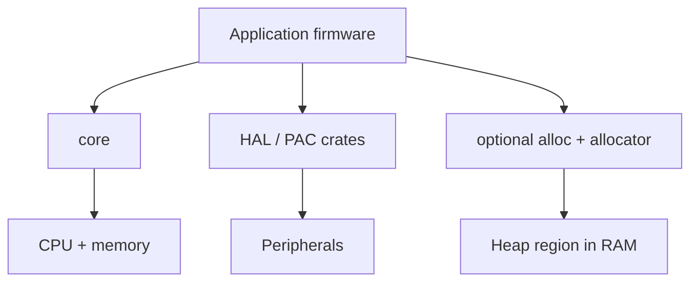

# no_std Fundamentals

## Learning Goals

- Explain what `#![no_std]` removes and what remains via `core` and optional `alloc`.
- Structure a minimal embedded binary with panic handler and entry point concepts.
- Cross-compile to a common ARM Cortex-M target (even without hardware).
- Choose panic strategy, memory layout awareness, and crate features for bare metal.
- Host-simulate logic with `std` tests while keeping firmware crates `no_std`.

## Why Embedded Rust Feels Different

Typical microcontroller constraints:

| Resource | Implication |
|----------|-------------|
| No OS | You own startup, interrupts, memory |
| Tens–hundreds KB RAM | Avoid careless allocation |
| Flash limits | Binary size matters |
| Power | Sleep strategies, peripheral clocks |
| Safety | Panic policy is a product decision |

`#![no_std]` means: do not link the standard library (`std`), which assumes OS facilities (threads, filesystem, networking, heap by default).

You still get **`core`**: primitives, `Option`, `Result`, iterators, `fmt` traits (with care), atomics on supporting platforms, etc.

## Concept Diagram



## Minimal no_std Binary Shape

```rust
#![no_std]
#![no_main]

use core::panic::PanicInfo;

/// On real firmware, entry is provided by cortex-m-rt / riscv-rt etc.
/// This example shows the required panic handler shape.
#[panic_handler]
fn panic(_info: &PanicInfo) -> ! {
    // Production: log to RTT/ITM/serial if possible, then reset or halt
    loop {}
}
```

Notes:

- `#![no_main]` — you are not using the Rust/Unix `main` startup; the runtime crate defines entry.
- `#[panic_handler]` — required in `no_std` binaries; exactly one per image.

### Host-simulatable pure logic

Keep algorithms in a `no_std` library crate; test on the host with `std`:

```rust
// src/lib.rs
#![no_std]

pub fn celsius_to_fahrenheit(c: i32) -> i32 {
    c * 9 / 5 + 32
}

#[cfg(test)]
mod tests {
    use super::*;

    #[test]
    fn freezing() {
        assert_eq!(celsius_to_fahrenheit(0), 32);
    }
}
```

```bash
cargo test
```

Tests compile with `std` even if the lib is `no_std` — a key productivity pattern.

## core vs alloc vs std

| Crate | Provides | Needs |
|-------|----------|-------|
| `core` | Language essentials | Nothing |
| `alloc` | `Vec`, `String`, `Box` | Global allocator |
| `std` | OS abstractions | OS / libc-like environment |

Many IoT firmwares stay **core-only** for predictability. If you enable `alloc`, define a global allocator (`embedded-alloc`, etc.) and size the heap in the linker script.

```rust
// conceptual — only when you intentionally want a heap
// #[global_allocator]
// static HEAP: ... = ...;
```

## Cross-Compilation Toolchain

```bash
# Cortex-M4F example target
rustup target add thumbv7em-none-eabihf

# Build without running (no hardware needed)
cargo build --target thumbv7em-none-eabihf
```

`Cargo.toml` for firmware often includes:

```toml
[dependencies]
cortex-m = "0.7"
cortex-m-rt = "0.7"
panic-halt = "0.2"

[profile.release]
lto = true
codegen-units = 1
opt-level = "s"   # or "z" for size
debug = true      # symbols for probe-rs; stripped later if needed
```

Entry with `cortex-m-rt` (hardware-oriented; compile even if you cannot flash):

```rust
#![no_std]
#![no_main]

use panic_halt as _; // panic handler
use cortex_m_rt::entry;

#[entry]
fn main() -> ! {
    let mut counter = 0u32;
    loop {
        counter = counter.wrapping_add(1);
        // wfi() in real apps when idle
    }
}
```

## Memory Layout Awareness

You will meet:

- **`memory.x`** — FLASH/RAM origins and lengths for the linker
- **Vector table** — reset + interrupt handlers
- **Stack** — grows in RAM; overflow is catastrophic
- **`.bss` / `.data`** — zeroed vs initialized statics

```text
FLASH: vector table, code, rodata
RAM:   .data, .bss, heap?, stack
```

Budget statics carefully. Prefer stack buffers with clear max sizes.

```rust
fn checksum(bytes: &[u8]) -> u32 {
    bytes.iter().fold(0u32, |acc, b| acc.wrapping_add(*b as u32))
}
```

## Panic Strategies

| Strategy | Crate / approach | When |
|----------|------------------|------|
| Halt | `panic-halt` | Simple; device freezes |
| Abort/reset | custom handler | Field devices that must recover |
| Semihosting | debug only | Host-connected labs |
| Probe RTT log + halt | `panic-rtt-target` | Dev boards |

Never use panicking for routine error handling in hot paths — prefer `Result` in drivers.

```rust
#[derive(Debug)]
enum SensorError {
    Timeout,
    Crc,
}

fn read_sensor() -> Result<u16, SensorError> {
    Err(SensorError::Timeout)
}
```

## Features and Conditional Compilation

```rust
// Portable driver core
pub fn scale_raw(raw: u16) -> u16 {
    raw / 4
}

#[cfg(feature = "std-logging")]
fn log_error(msg: &str) {
    eprintln!("{msg}");
}

#[cfg(not(feature = "std-logging"))]
fn log_error(_msg: &str) {}
```

Use Cargo features for host vs target, not `#ifdef` soup.

## What You Lose (and Replacements)

| std item | Embedded replacement |
|----------|----------------------|
| `println!` | `defmt`, RTT, semihosting, UART |
| `Vec` | heapless `Vec`/`ArrayVec` or static buffers |
| `HashMap` | `heapless::FnvIndexMap` or sorted arrays |
| threads | interrupts + async (`embassy`) or RTOS |
| `std::fs` | N/A or littlefs on flash |

```rust
use heapless::Vec as HVec;

fn push_sample(buf: &mut HVec<u16, 32>, sample: u16) -> Result<(), u16> {
    buf.push(sample)
}
```

`heapless` is a staple for bounded collections without a global allocator.

## Build and Size Inspection

```bash
cargo build --release --target thumbv7em-none-eabihf
# After linking a full image:
# cargo install cargo-binutils
# rustup component add llvm-tools-preview
# cargo size --release --target thumbv7em-none-eabihf
```

Track size in CI when near flash limits.

## Common Mistakes

- Pulling `std`-only crates into firmware by accident (check features).
- Allocating in interrupt handlers without care.
- Ignoring stack size until random hard faults.
- `unwrap` in drivers → surprise halt in the field.
- Testing only on hardware; zero host unit tests.
- Forgetting that floating point ABI must match target (`eabihf` vs soft).

## Hands-On Practice

1. Create a `no_std` lib with pure functions + host `cargo test`.
2. Add `thumbv7em-none-eabihf` and compile a `cortex-m-rt` hello-loop (no flash required).
3. Replace a growing `Vec` design with `heapless::Vec` capacity 16.
4. Document your panic strategy for a battery sensor node vs a lab demo.
5. List five crates you would check for `no_std` support before depending on them.

## Chapter Summary

`no_std` is the gateway to bare-metal Rust: **core + runtime + careful memory**. Keep logic host-testable, pick panic policy deliberately, and cross-compile early. Next: **HALs and peripherals** — talking to GPIO, timers, and sensors portably.
