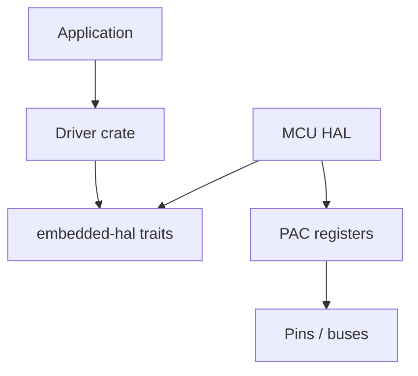

# HAL and Peripherals

## Learning Goals

- Navigate the PAC → HAL → board crate stack in embedded Rust.
- Use **embedded-hal** traits so drivers stay portable across MCUs.
- Model GPIO, timers, and simple digital sensors with host-simulatable mocks.
- Understand ownership of peripherals as a compile-time safety tool.
- Sketch SPI/I2C transaction patterns without requiring physical hardware.

## Layers of the Stack

| Layer | Role | Example |
|-------|------|---------|
| PAC | Register access from SVD | `stm32f4` peripheral access crate |
| HAL | Safe, idiomatic wrappers | `stm32f4xx-hal` |
| Board | Pin aliases, clocks for a PCB | `feather_f405` style crates |
| Driver | Sensor/display logic on `embedded-hal` | `bme280`, custom |
| App | Product behavior | your firmware |

Prefer writing drivers against **traits**, not one vendor’s concrete types.

## Concept Diagram



## embedded-hal Ideas (2026)

`embedded-hal` defines traits for:

- Digital GPIO input/output
- Delays
- I2C / SPI / UART
- PWM, ADC (as ecosystem evolves across 0.2/1.0 trait generations)

Exact trait names differ across major versions; the **pattern** is stable: drivers are generic over bus types.

```rust
/// Teaching sketch of a digital output trait — see embedded-hal for real traits.
pub trait OutputPin {
    type Error;
    fn set_high(&mut self) -> Result<(), Self::Error>;
    fn set_low(&mut self) -> Result<(), Self::Error>;
}

/// Blink logic portable across any OutputPin + Delay.
pub fn blink_once<P, D>(led: &mut P, delay: &mut D, ms: u32) -> Result<(), P::Error>
where
    P: OutputPin,
    D: DelayMs,
{
    led.set_high()?;
    delay.delay_ms(ms);
    led.set_low()?;
    Ok(())
}

pub trait DelayMs {
    fn delay_ms(&mut self, ms: u32);
}
```

## Host-Simulatable GPIO Mock

Run on desktop during TDD:

```rust
#[derive(Default)]
pub struct MockLed {
    pub high_count: u32,
    pub low_count: u32,
    state: bool,
}

impl OutputPin for MockLed {
    type Error = core::convert::Infallible;

    fn set_high(&mut self) -> Result<(), Self::Error> {
        self.state = true;
        self.high_count += 1;
        Ok(())
    }

    fn set_low(&mut self) -> Result<(), Self::Error> {
        self.state = false;
        self.low_count += 1;
        Ok(())
    }
}

pub struct MockDelay;

impl DelayMs for MockDelay {
    fn delay_ms(&mut self, _ms: u32) {}
}

#[cfg(test)]
mod tests {
    use super::*;

    #[test]
    fn blink_toggles() {
        let mut led = MockLed::default();
        let mut d = MockDelay;
        blink_once(&mut led, &mut d, 10).unwrap();
        assert_eq!(led.high_count, 1);
        assert_eq!(led.low_count, 1);
    }
}
```

## Peripheral Ownership

HALs typically expose peripherals **once** via a singleton split:

```rust
// Conceptual stm32-style init
// let dp = pac::Peripherals::take().unwrap();
// let gpioa = dp.GPIOA.split();
// let mut led = gpioa.pa5.into_push_pull_output();
```

You cannot accidentally alias the same pin as two outputs — the type system prevents double `take`/`split` misuse when APIs are designed well.

If a driver needs exclusive bus access, it may take ownership or use shared-bus mutex patterns for multi-driver I2C.

## I2C Transaction Sketch

```rust
pub trait I2c {
    type Error;
    fn write(&mut self, addr: u8, bytes: &[u8]) -> Result<(), Self::Error>;
    fn write_read(
        &mut self,
        addr: u8,
        write: &[u8],
        read: &mut [u8],
    ) -> Result<(), Self::Error>;
}

pub struct TempSensor<I> {
    i2c: I,
    addr: u8,
}

impl<I: I2c> TempSensor<I> {
    pub fn read_raw(&mut self) -> Result<u16, I::Error> {
        let mut buf = [0u8; 2];
        self.i2c.write_read(self.addr, &[0x00], &mut buf)?;
        Ok(u16::from_be_bytes(buf))
    }

    pub fn read_celsius(&mut self) -> Result<i16, I::Error> {
        let raw = self.read_raw()?;
        // fake scale for teaching
        Ok((raw as i16) / 100)
    }
}
```

Mock I2C for tests:

```rust
pub struct MockI2c {
    pub last_addr: u8,
    pub respond: [u8; 2],
}

impl I2c for MockI2c {
    type Error = &'static str;

    fn write(&mut self, addr: u8, _bytes: &[u8]) -> Result<(), Self::Error> {
        self.last_addr = addr;
        Ok(())
    }

    fn write_read(
        &mut self,
        addr: u8,
        _write: &[u8],
        read: &mut [u8],
    ) -> Result<(), Self::Error> {
        self.last_addr = addr;
        read.copy_from_slice(&self.respond);
        Ok(())
    }
}

#[cfg(test)]
mod sensor_tests {
    use super::*;

    #[test]
    fn scales_temp() {
        let i2c = MockI2c {
            last_addr: 0,
            respond: 2500u16.to_be_bytes(), // → 25.00
        };
        let mut s = TempSensor { i2c, addr: 0x48 };
        assert_eq!(s.read_celsius().unwrap(), 25);
    }
}
```

## SPI Pattern

SPI typically: select chip, exchange bytes, deselect.

```rust
pub trait SpiBus {
    type Error;
    fn transfer(&mut self, words: &mut [u8]) -> Result<(), Self::Error>;
}

fn read_register<S: SpiBus>(spi: &mut S, reg: u8) -> Result<u8, S::Error> {
    let mut buf = [reg | 0x80, 0x00]; // device-specific R/W bit
    spi.transfer(&mut buf)?;
    Ok(buf[1])
}
```

## Clocking and Time

Almost every peripheral needs clocks enabled and a time base:

- System clock config (wrong clocks → wrong baud rates)
- Monotonic for deadlines (`embedded-hal` delay, timers, `embassy-time`)

Host tests inject a fake clock:

```rust
#[derive(Clone, Copy)]
pub struct InstantMs(pub u64);

pub struct FakeClock {
    pub now: u64,
}

impl FakeClock {
    pub fn advance(&mut self, ms: u64) {
        self.now += ms;
    }
}
```

## Embassy / Async Note

In 2026, many new firmwares use **embassy** for async on MCUs (executor + HAL integration). The mental model:

- `async` tasks instead of a big superloop
- Interrupt-driven futures for UART/SPI
- Still `no_std` + careful resource sharing (`Mutex`, channels)

You can learn HAL traits first with a superloop; adopt embassy when concurrency grows.

## Board Bring-Up Checklist

1. Clocks and reset
2. One GPIO blink (proves toolchains + flash)
3. UART log (`defmt` or serial)
4. I2C scan or SPI ID register read
5. Integrate sensor driver with timeouts

```bash
# Common debug tooling (hardware)
# probe-rs run --chip STM32F407VGTx
# or cargo embed
```

Without hardware, complete steps 1–5 at the **mock** layer and compile for the target.

## Common Mistakes

- Driver crate depends on a specific HAL instead of traits.
- Blocking I2C without timeout → hang if sensor NACK/wiring fault.
- Wrong pin AF (alternate function) for UART/SPI.
- Sharing I2C without synchronization across interrupts/tasks.
- Assuming bit-bang delays are accurate under load.

## Hands-On Practice

1. Implement `MockLed` + `blink_once` tests on the host.
2. Write `TempSensor` generic over `I2c` with a mock that returns fixed bytes.
3. Add a timeout wrapper concept: fail if `FakeClock` advances past deadline before NACK recovery.
4. Read an actual `embedded-hal` trait definition for your chosen version; map names to this chapter.
5. Sketch pin table for a real board (LED, UART TX/RX, I2C SDA/SCL).

## Chapter Summary

HALs turn registers into safe Rust types; **embedded-hal** traits keep drivers portable. Mock buses on the host, compile for the MCU target, and only then flash. Next: **real-time constraints** — deadlines, interrupts, and latency budgets.
