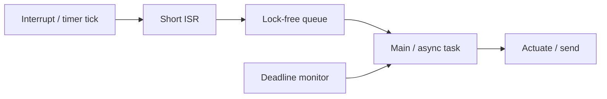

# Real-Time Constraints

## Learning Goals

- Distinguish hard, firm, and soft real-time requirements for IoT products.
- Structure firmware with interrupt priorities, short ISRs, and deferred work.
- Budget latency: sense → decide → actuate loops with measurable deadlines.
- Avoid heap and lock patterns that break predictability.
- Host-simulate a cyclic executive and deadline miss detector in Rust.

## What “Real-Time” Means

Real-time means **correctness includes timing**, not “as fast as possible.”

| Class | Missed deadline means | Example |
|-------|----------------------|---------|
| Hard | System failure / safety hazard | Motor cutout, medical pump |
| Firm | Result useless; system continues | Dropped audio frame |
| Soft | Degraded quality | UI lag, telemetry delay |

Most commercial IoT is soft/firm; industrial control may be hard. Do not claim “hard real-time” without WCET analysis and a certified stack.

## Concept Diagram



## Superloop vs Interrupts vs RTOS/Async

| Architecture | Pros | Cons |
|--------------|------|------|
| Superloop | Simple | Jitter if one task hogs CPU |
| Interrupts + main | Responsive I/O | Priority inversion, reentrancy bugs |
| RTOS threads | Isolation | Stack per task, complexity |
| Embassy async | Structured concurrency | Learning curve; still need ISR discipline |

Pattern that scales: **ISR does minimal work**, signals a task for the rest.

## Host-Simulatable Cyclic Executive

```rust
use std::time::{Duration, Instant};

struct Task {
    name: &'static str,
    period: Duration,
    worst_case: Duration,
    next: Instant,
    work: fn(),
}

fn run_schedule(tasks: &mut [Task], until: Instant) {
    while Instant::now() < until {
        let now = Instant::now();
        for t in tasks.iter_mut() {
            if now >= t.next {
                let start = Instant::now();
                (t.work)();
                let elapsed = start.elapsed();
                if elapsed > t.worst_case {
                    eprintln!("DEADLINE RISK {} took {:?}", t.name, elapsed);
                }
                t.next += t.period;
                if t.next < Instant::now() {
                    // fell behind — count overrun
                    t.next = Instant::now() + t.period;
                    eprintln!("OVERRUN {}", t.name);
                }
            }
        }
        std::thread::sleep(Duration::from_millis(1));
    }
}

fn sample_sensor() {}
fn control_step() {}

fn main() {
    let start = Instant::now();
    let mut tasks = [
        Task {
            name: "sense",
            period: Duration::from_millis(10),
            worst_case: Duration::from_millis(2),
            next: start,
            work: sample_sensor,
        },
        Task {
            name: "control",
            period: Duration::from_millis(20),
            worst_case: Duration::from_millis(5),
            next: start,
            work: control_step,
        },
    ];
    run_schedule(&mut tasks, start + Duration::from_millis(100));
}
```

On-device, replace `Instant` with a monotonic timer driver; replace `sleep` with WFI between ticks.

## Deadline Budget Example

Control loop 1 kHz (1 ms period):

```text
Budget 1000 µs
  ADC sample + convert     100 µs
  Filter                   150 µs
  Control law               50 µs
  PWM update                20 µs
  Margin / interrupts      680 µs
```

Measure with cycle counters (`cortex_m::peripheral::DWT`) or GPIO toggle + logic analyzer.

```rust
/// Teaching: record max execution in a sliding window (host).
pub struct ExecStats {
    pub max_us: u64,
}

impl ExecStats {
    pub fn record(&mut self, us: u64) {
        if us > self.max_us {
            self.max_us = us;
        }
    }
}
```

## Interrupt Rules of Thumb

1. Keep ISRs short — read peripheral, push byte, set flag.
2. Do not log/format in high-priority ISRs.
3. Avoid heap allocation in ISRs.
4. Mind reentrancy: shared data needs atomics or critical sections.
5. Match NVIC priorities to latency needs; document the priority map.

```rust
use core::sync::atomic::{AtomicU32, Ordering};

static TICKS: AtomicU32 = AtomicU32::new(0);

// called from timer ISR
fn on_tick() {
    TICKS.fetch_add(1, Ordering::Relaxed);
}

fn millis() -> u32 {
    TICKS.load(Ordering::Relaxed)
}
```

Critical section (concept):

```rust
// cortex_m::interrupt::free(|cs| { /* access shared RefCell */ });
```

## Priority Inversion

Low-priority task holds a lock; high-priority task blocks on it; medium task preempts low → high waits too long.

Mitigations:

- Avoid locks in hot paths; use wait-free queues
- Priority inheritance (RTOS)
- Resource ceilings
- Do work without sharing when possible

## Jitter Sources

- Cache/flash wait states
- Higher priority interrupts
- Disable-interrupt regions too long
- Print/debug I/O
- DMA contention

Measure **min/avg/max** period error, not only average rate.

## Soft Real-Time Networking

IoT devices often mix:

- Hard-ish local control loop
- Soft cloud MQTT/HTTP

Never block the control loop on network I/O. Use a separate task and timeouts:

```rust
enum Cmd {
    Setpoint(i32),
    None,
}

fn control_iteration(setpoint: i32, measurement: i32) -> i32 {
    // simple P controller
    let err = setpoint - measurement;
    err / 4
}
```

## Watchdogs

Hardware watchdog resets the MCU if not kicked in time — last line for deadlocks.

```rust
struct Watchdog {
    // hardware register ownership on device
}

impl Watchdog {
    fn kick(&mut self) {
        // reload counter
    }
}

fn main_loop_host_sim() {
    let mut last_progress = std::time::Instant::now();
    loop {
        // work...
        if last_progress.elapsed() > std::time::Duration::from_secs(1) {
            panic!("simulated watchdog: no progress");
        }
        last_progress = std::time::Instant::now();
        break; // lab
    }
}
```

Kick only from a path that proves forward progress, not from a blind high-rate ISR that can run while the app is wedged.

## Common Mistakes

- Calling into heavy drivers inside ISRs.
- Using `unwrap` that panics under rare timing races.
- Busy-waiting with interrupts disabled.
- Claiming hard RT without WCET evidence.
- One big critical section around “everything shared.”

## Hands-On Practice

1. Run the cyclic executive host example; force a slow task and observe OVERUN logs.
2. Add `ExecStats` around each task work function.
3. Design a priority map for: 1 kHz control, UART RX, 1 Hz telemetry.
4. Rewrite a blocking “read sensor then send MQTT” flow into two tasks + channel.
5. Document three jitter sources on a board you use (or a hypothetical one).

## Chapter Summary

Real-time firmware is about **deadlines, priorities, and short critical paths**. Simulate schedules on the host, measure on the device, and isolate control from networking. Next: **power and reliability** — sleep modes, brownout, and field longevity.
