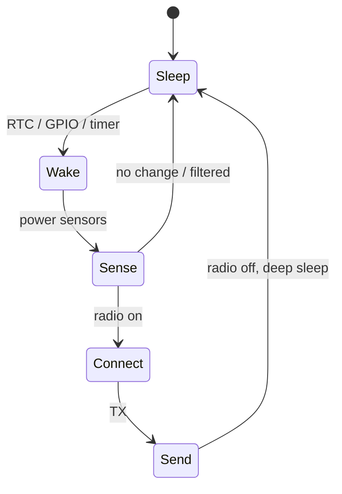

# Power and Reliability

## Learning Goals

- Estimate energy use from duty cycle, sleep current, and radio cost.
- Design duty-cycled firmware: sense → transmit → deep sleep.
- Handle brownout, corrupt flash state, and safe defaults after reset.
- Plan OTA/update reliability and factory reset behaviors.
- Host-simulate energy accounting and crash-safe state machines.

## Why Power Dominates IoT

Battery nodes live or die by microamps. A “working” sensor that needs weekly battery changes is a failed product. Reliability and power intertwine: flaky radios cause retries; retries kill batteries.

## Concept Diagram



## Energy Budget Back-of-Envelope

```text
Energy ≈ Σ (current_mA × time_s)   [mAs]
Battery_mAh / average_mA ≈ life_hours
```

```rust
#[derive(Clone, Copy)]
struct Phase {
    name: &'static str,
    current_ma: f64,
    duration_s: f64,
}

fn energy_mas(phases: &[Phase]) -> f64 {
    phases.iter().map(|p| p.current_ma * p.duration_s).sum()
}

fn average_ma(phases: &[Phase], period_s: f64) -> f64 {
    energy_mas(phases) / period_s
}

fn main() {
    let period = 60.0; // one wake per minute
    let phases = [
        Phase {
            name: "sleep",
            current_ma: 0.005,
            duration_s: 59.7,
        },
        Phase {
            name: "sense",
            current_ma: 3.0,
            duration_s: 0.05,
        },
        Phase {
            name: "tx",
            current_ma: 25.0,
            duration_s: 0.25,
        },
    ];
    let avg = average_ma(&phases, period);
    let batt_mah = 600.0;
    let life_h = batt_mah / avg;
    println!("avg_mA={avg:.4} life_days={:.1}", life_h / 24.0);
}
```

Tune **period**, **TX size/retries**, and **sleep current** first — not micro-optimizing integer math.

## Duty Cycling Patterns

1. **Fixed interval** — simple RTC wake every N minutes.
2. **Adaptive** — report faster when values change (delta threshold).
3. **Event-driven** — GPIO interrupt on reed switch / PIR; careful debounce.
4. **Batching** — buffer N samples, one radio session (flash wear vs energy tradeoff).

```rust
fn should_transmit(prev: i32, cur: i32, threshold: i32) -> bool {
    (cur - prev).abs() >= threshold
}
```

## Peripheral Power Hygiene

- Power-gate sensors via MOSFET / regulator enable GPIO.
- Disable unused clocks and pull-ups that leak.
- Put radio to true sleep; SPI lines at defined levels.
- Avoid floating inputs (leakage and noise).

```rust
struct SensorPower<Pin> {
    enable: Pin,
}

impl<P: crate::OutputPin> SensorPower<P> {
    fn on(&mut self) -> Result<(), P::Error> {
        self.enable.set_high()
    }
    fn off(&mut self) -> Result<(), P::Error> {
        self.enable.set_low()
    }
}

// Bring-up sequence
// power.on()?; delay(stabilize); read?; power.off()?;
```

(Reuse your HAL `OutputPin` trait from the previous chapter.)

## Crash-Safe State

Devices reset from watchdog, brownout, and OTA. Persist only what you must:

```rust
#[derive(Clone, Copy, PartialEq, Eq)]
#[repr(u8)]
enum NodeState {
    Factory = 0,
    Provisioning = 1,
    Running = 2,
    SafeMode = 3,
}

struct StateStore {
    // On device: flash page / EEPROM / NVS
    state: NodeState,
    boot_count: u32,
}

impl StateStore {
    fn record_boot(&mut self) {
        self.boot_count = self.boot_count.saturating_add(1);
        if self.boot_count > 5 {
            self.state = NodeState::SafeMode;
        }
    }

    fn mark_healthy_run(&mut self) {
        self.boot_count = 0;
    }
}
```

Use **atomic** multi-byte updates carefully (double-buffer + CRC) so power loss mid-write does not brick config.

```rust
fn crc8(data: &[u8]) -> u8 {
    let mut c = 0u8;
    for b in data {
        c ^= *b;
        for _ in 0..8 {
            if c & 0x80 != 0 {
                c = (c << 1) ^ 0x07;
            } else {
                c <<= 1;
            }
        }
    }
    c
}

fn config_valid(bytes: &[u8]) -> bool {
    if bytes.len() < 2 {
        return false;
    }
    let (payload, crc) = bytes.split_at(bytes.len() - 1);
    crc8(payload) == crc[0]
}
```

## Brownout and Clocks

Brownout detectors (BOD) reset before RAM goes weird. After reset:

1. Assume peripherals need full re-init.
2. Do not trust half-written flash.
3. Optionally stay in low-power safe mode if supply unstable.

## Radio Reliability vs Power

Retries help delivery but cost energy:

```rust
struct TxPolicy {
    max_attempts: u8,
}

fn send_with_retries<F>(policy: TxPolicy, mut attempt: F) -> bool
where
    F: FnMut(u8) -> bool,
{
    for i in 1..=policy.max_attempts {
        if attempt(i) {
            return true;
        }
        // exponential sleep — on device use RTC
    }
    false
}
```

Strategies:

- Duty-cycled listen (LoRaWAN classes)
- ACK only when needed
- Adaptive data rate
- Offline store-and-forward with flash limits

## OTA Reliability Basics

| Risk | Mitigation |
|------|------------|
| Bad image bricks device | A/B slots + bootloader confirm |
| Power loss mid-flash | Dual bank / resume |
| Rollback storm | Version gates, signed images |
| Soft brick bootloop | App must “confirm OK” before making slot permanent |

```rust
enum BootSlot {
    A,
    B,
}

struct BootMeta {
    active: BootSlot,
    pending_confirm: bool,
}

fn app_start(meta: &mut BootMeta) {
    if meta.pending_confirm {
        // after self-check:
        meta.pending_confirm = false; // mark image good in bootloader storage
    }
}
```

## Field Diagnostics

When you cannot attach a debugger:

- Last-reset cause register logging
- Breadcrumb ring buffer in retained RAM/flash
- Safe mode with BLE/UART recovery window

```rust
const N: usize = 8;
struct Breadcrumbs {
    buf: [u8; N],
    i: usize,
}

impl Breadcrumbs {
    const fn new() -> Self {
        Self { buf: [0; N], i: 0 }
    }
    fn leave(&mut self, code: u8) {
        self.buf[self.i % N] = code;
        self.i += 1;
    }
}
```

## Common Mistakes

- Measuring current only while awake with a multimeter average that misses TX spikes.
- Leaving debug UART clocks on in “sleep.”
- Unlimited radio retries.
- Single-copy config in flash without CRC.
- Kicking watchdog from idle ISR while main is deadlocked.

## Hands-On Practice

1. Run the energy budget program; find which phase dominates.
2. Change period from 60s to 600s; recompute life.
3. Implement `StateStore` bootloop → SafeMode with unit tests.
4. Design A/B OTA flow as a state diagram in markdown.
5. List three product metrics (battery %, fail TX count, boot count) you would telemetrize sparingly.

## Chapter Summary

Power design is an **energy budget + duty cycle** problem; reliability is **safe state across resets** and careful radios/OTA. Simulate budgets on the host, validate sleep current on hardware. Next: **embedded capstone** — a host-first sensor node design you can compile and reason about end-to-end.
