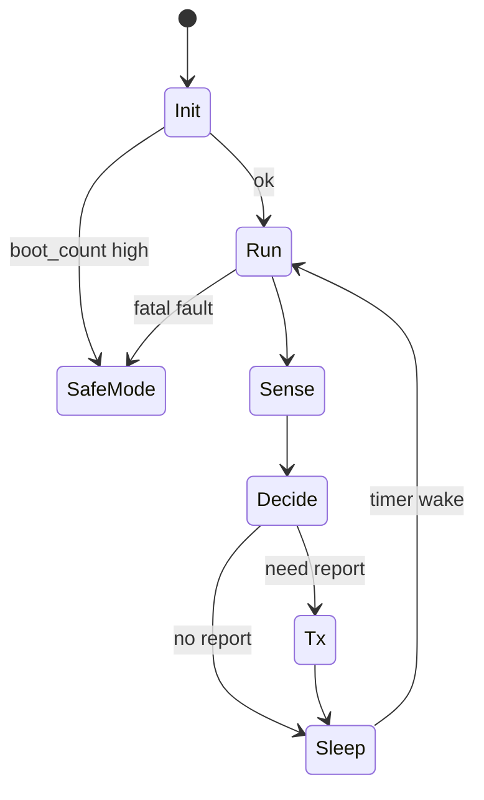

# Embedded Capstone

## Learning Goals

- Design a complete IoT sensor node as a modular Rust workspace (host-testable).
- Integrate scheduling, mock HAL drivers, power policy, and crash-safe config.
- Produce a bring-up checklist and field failure mode table.
- Compile logic on the host; optionally cross-compile a `no_std` binary skeleton for Cortex-M.

## Capstone Brief: **SoilNode**

You are shipping a battery soil-moisture monitor:

| Item | Spec |
|------|------|
| Measure moisture | Every 15 minutes (adaptive if change large) |
| Transmit | LoRa/MQTT abstraction — mock radio on host |
| Sleep | Deep sleep between cycles |
| Button | Factory reset (hold) |
| Safety | Bootloop → safe mode; CRC config |
| LEDs | Status: OK / fault / pairing |

Hardware optional. **Host simulation is mandatory.**

## Concept Diagram



## Workspace Layout

```text
soilnode/
  Cargo.toml                # workspace
  app-host/                 # std binary simulator
  node-core/                # no_std lib: FSM, CRC, policy
  drivers-mock/             # mock moisture, radio, clock
  firmware/                 # optional no_std binary skeleton
```

## Core Types (`node-core`)

```rust
#![no_std]

#[derive(Clone, Copy, PartialEq, Eq)]
pub enum Mode {
    Run,
    Safe,
}

#[derive(Clone, Copy)]
pub struct Config {
    pub period_s: u32,
    pub delta_threshold: i32,
    pub max_tx_attempts: u8,
}

impl Config {
    pub const DEFAULT: Self = Self {
        period_s: 15 * 60,
        delta_threshold: 5,
        max_tx_attempts: 3,
    };
}

#[derive(Clone, Copy)]
pub struct Snapshot {
    pub moisture: i32,
    pub battery_mv: u32,
    pub boot_count: u32,
}

#[derive(Clone, Copy, PartialEq, Eq)]
pub enum Decision {
    Sleep,
    Transmit,
}

pub fn decide(prev: Option<i32>, cur: i32, cfg: &Config, force: bool) -> Decision {
    if force {
        return Decision::Transmit;
    }
    match prev {
        None => Decision::Transmit,
        Some(p) if (cur - p).abs() >= cfg.delta_threshold => Decision::Transmit,
        Some(_) => Decision::Sleep,
    }
}

pub fn crc8(data: &[u8]) -> u8 {
    let mut c = 0u8;
    for &b in data {
        c ^= b;
        for _ in 0..8 {
            c = if c & 0x80 != 0 {
                (c << 1) ^ 0x07
            } else {
                c << 1
            };
        }
    }
    c
}
```

## Driver Traits (Portable)

```rust
pub trait MoistureSensor {
    type Error;
    fn read_percent(&mut self) -> Result<i32, Self::Error>;
}

pub trait Radio {
    type Error;
    fn send(&mut self, payload: &[u8]) -> Result<(), Self::Error>;
}

pub trait Clock {
    fn now_s(&self) -> u64;
    fn sleep_s(&mut self, s: u32);
}

pub trait StatusLed {
    fn set_ok(&mut self);
    fn set_fault(&mut self);
}
```

## Mock Drivers for Host

```rust
pub struct MockMoisture {
    pub value: i32,
}

impl MoistureSensor for MockMoisture {
    type Error = &'static str;
    fn read_percent(&mut self) -> Result<i32, Self::Error> {
        Ok(self.value)
    }
}

pub struct MockRadio {
    pub sent: Vec<Vec<u8>>,
    pub fail_times: u8,
}

impl Radio for MockRadio {
    type Error = &'static str;
    fn send(&mut self, payload: &[u8]) -> Result<(), Self::Error> {
        if self.fail_times > 0 {
            self.fail_times -= 1;
            return Err("air busy");
        }
        self.sent.push(payload.to_vec());
        Ok(())
    }
}

pub struct MockClock {
    pub now: u64,
}

impl Clock for MockClock {
    fn now_s(&self) -> u64 {
        self.now
    }
    fn sleep_s(&mut self, s: u32) {
        self.now += u64::from(s);
    }
}
```

## Application Cycle

```rust
pub struct Node<S, R, C, L> {
    pub cfg: Config,
    pub mode: Mode,
    pub sensor: S,
    pub radio: R,
    pub clock: C,
    pub led: L,
    pub last_moisture: Option<i32>,
    pub boot_count: u32,
}

impl<S, R, C, L> Node<S, R, C, L>
where
    S: MoistureSensor,
    R: Radio,
    C: Clock,
    L: StatusLed,
{
    pub fn power_on_self_test(&mut self) {
        if self.boot_count > 5 {
            self.mode = Mode::Safe;
            self.led.set_fault();
        } else {
            self.mode = Mode::Run;
            self.led.set_ok();
        }
    }

    pub fn cycle(&mut self) -> Result<(), &'static str> {
        if self.mode == Mode::Safe {
            self.clock.sleep_s(60);
            return Ok(());
        }

        let m = self
            .sensor
            .read_percent()
            .map_err(|_| "sensor")?;
        let decision = decide(self.last_moisture, m, &self.cfg, false);

        if decision == Decision::Transmit {
            let mut payload = [0u8; 8];
            payload[0..4].copy_from_slice(&(m as i32).to_le_bytes());
            payload[4..8].copy_from_slice(&(self.clock.now_s() as u32).to_le_bytes());

            let mut ok = false;
            for attempt in 1..=self.cfg.max_tx_attempts {
                if self.radio.send(&payload).is_ok() {
                    ok = true;
                    break;
                }
                let _ = attempt;
            }
            if !ok {
                self.led.set_fault();
                return Err("tx failed");
            }
            self.led.set_ok();
            self.last_moisture = Some(m);
        }

        self.clock.sleep_s(self.cfg.period_s);
        Ok(())
    }
}
```

## Host Simulator `main`

```rust
fn main() {
    // wire mocks, call power_on_self_test, run N cycles
    // print energy estimate using phase model from prior chapter
    // assert radio.sent length matches decide() policy
}
```

## Tests You Must Have

```rust
#[test]
fn adaptive_tx_only_on_delta() {
    let cfg = Config::DEFAULT;
    assert_eq!(decide(Some(10), 12, &cfg, false), Decision::Sleep);
    assert_eq!(decide(Some(10), 20, &cfg, false), Decision::Transmit);
}

#[test]
fn crc_roundtrip_detects_flip() {
    let mut bytes = [1u8, 2, 3, 0];
    let n = bytes.len();
    bytes[n - 1] = crc8(&bytes[..n - 1]);
    assert!(bytes[n - 1] == crc8(&bytes[..n - 1]));
    bytes[0] ^= 0xff;
    assert!(bytes[n - 1] != crc8(&bytes[..n - 1]));
}
```

## Optional Firmware Skeleton

```rust
#![no_std]
#![no_main]

use panic_halt as _;
use cortex_m_rt::entry;

#[entry]
fn main() -> ! {
    // init clocks/gpio when you have a board
    // for now: prove link
    loop {
        cortex_m::asm::wfi();
    }
}
```

```bash
rustup target add thumbv7em-none-eabihf
cargo build -p firmware --target thumbv7em-none-eabihf
```

## Energy + Reliability Report Template

```markdown
# SoilNode design report

## Energy
- period, phases, avg_mA, estimated life on 2xAA

## Reliability
- bootloop policy
- TX retry policy
- config CRC
- safe mode behavior

## Failure modes
| Failure | Detection | Response |
|---------|-----------|----------|
| Sensor open | read error | fault LED, skip TX |
| Radio jam | retries exhausted | backoff period * 2 |
| Bootloop | boot_count | SafeMode |

## Bring-up order
1. Host tests green
2. GPIO blink on hardware
3. ADC moisture
4. Radio join
5. Sleep current measurement
```

## Demo Script

1. Host: moisture stable → zero TX after first.
2. Jump moisture by 10 → one TX.
3. Force `fail_times=5` → fault path, retries observed.
4. `boot_count=6` → SafeMode sleeps only.
5. Show `cargo test` and optional thumb build.

## Stretch Goals

1. Embassy async tasks on hardware.
2. `defmt` logging over RTT.
3. Flash config double-buffer.
4. Property tests for `decide`.
5. Minimal LoRaWAN ATG path when you have a radio.

## Common Mistakes

- Entangling mock drivers with product FSM (hard to test).
- Transmitting every wake “just in case” (battery death).
- No safe mode (field brick on bad OTA/config).
- Skipping sleep current measurement on real silicon.

## Hands-On Practice

1. Create the workspace crates and pass unit tests.
2. Run 100 simulated hours of clock time in &lt;1s wall clock.
3. Fill the failure mode table with observed behaviors.
4. Cross-compile the firmware skeleton.
5. Write the one-page energy/reliability report.

## Chapter Summary

SoilNode is a portfolio pattern: **`no_std` core + mock HAL + power-aware FSM + optional MCU binary**. That is how professional embedded Rust is developed when hardware is scarce. Next book part: **observability, performance, and career** — operating services and growing as an engineer.
