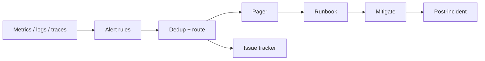

# Alerts and On-Call

## Learning Goals

- Design alerts that page on **user impact**, not on every noisy metric blip.
- Map SLIs/SLOs to multi-window burn-rate alerts.
- Structure on-call rotations, escalations, and runbooks so humans can act.
- Instrument a Rust service so alerts have the labels they need.
- Reduce toil: dedup, inhibit, and ticket vs page decisions.

## Purpose of Alerting

Alerts exist to **change human behavior quickly** when customers are hurt or about to be. They are not a substitute for dashboards, logs, or curiosity.

| Signal | Action |
|--------|--------|
| Page | Wake a human now |
| Ticket | Work in business hours |
| Dashboard | Explore, no auto noise |
| Log | Debug after the fact |

If everything pages, nothing does.

## Concept Diagram



## SLI → SLO → Alert

Example SLI: proportion of HTTP requests faster than 300 ms and non-5xx.

```text
SLO: 99.9% success over 30 days
Error budget: 0.1% ≈ 43 minutes of full outage / month
  (or equivalent partial burn)
```

### Multi-window burn rate (concept)

Page when budget burns fast:

- **Fast burn**: e.g. 14× burn over 1h and 5m windows → page
- **Slow burn**: e.g. 1× burn over 3d and 6h → ticket

Exact numbers follow Google SRE workbook style; tune to your traffic.

```rust
/// Toy: estimate budget remaining given events.
fn budget_remaining(slo: f64, total: u64, bad: u64) -> f64 {
    let good_ratio = if total == 0 {
        1.0
    } else {
        (total - bad) as f64 / total as f64
    };
    // positive => under burn, negative => over SLO
    good_ratio - slo
}
```

## What to Alert On

**Good**

- Error rate above threshold for the user-facing entrypoint
- Latency p99 above SLO with burn
- Traffic zero when it should not be (saturation/false quiet)
- Queue lag near retention limit
- Certificate expiry &lt; 14 days (ticket) / &lt; 3 days (page)

**Bad**

- CPU &gt; 70% alone (may be fine)
- Single replica restart in k8s (often normal)
- Disk 60% on a growing volume without trend
- “Log line contains error” without rate/impact

## Alert Document Skeleton

Every page-worthy alert needs:

```markdown
## Alert: HttpHighErrorRate

### Severity
page

### Symptom
5xx ratio > 5% for 5 minutes on service=notes-api

### Impact
Users cannot create/read notes

### Dashboard
https://.../notes-api

### Runbook
https://.../runbooks/notes-api-5xx.md

### First checks
1. Deploy in last hour?
2. Dependency health (db, cache)
3. Error logs by exception type

### Mitigations
- rollback
- shed noncritical traffic
- failover read replica
```

## Rust Instrumentation Hooks

Expose metrics alerts can use:

```rust
use std::sync::atomic::{AtomicU64, Ordering};

struct HttpMetrics {
    requests: AtomicU64,
    errors_5xx: AtomicU64,
}

impl HttpMetrics {
    fn record(&self, status: u16) {
        self.requests.fetch_add(1, Ordering::Relaxed);
        if status >= 500 {
            self.errors_5xx.fetch_add(1, Ordering::Relaxed);
        }
    }

    fn error_ratio(&self) -> f64 {
        let t = self.requests.load(Ordering::Relaxed);
        let e = self.errors_5xx.load(Ordering::Relaxed);
        if t == 0 {
            0.0
        } else {
            e as f64 / t as f64
        }
    }
}
```

In production prefer Prometheus histograms/counters via `metrics` / OpenTelemetry crates, with labels: `route`, `status`, `service` — cardinality-controlled.

### Logs for on-call

```rust
tracing::error!(
    request_id = %id,
    error = %err,
    "handler failed"
);
```

Include `request_id` / `trace_id` so the first dashboard jump works.

## Routing and Escalation

```text
Primary on-call → 5m no ack → Secondary → 10m → Incident commander / manager
```

Rules:

- Follow-the-sun or weekly rotations with handoff notes
- No single point of heroics — backups required
- Silence / maintenance windows documented

## Dedup, Grouping, Inhibition

| Technique | Purpose |
|-----------|---------|
| Group by `service` + `alertname` | One page per outage |
| Inhibit child alerts when parent fires | Avoid 40 pages for one DB outage |
| Dedup window | Flapping |
| Dependency-aware routing | DB team vs app team |

Example: inhibit `ApiHighLatency` when `DatabaseDown` is firing for the same cluster.

## On-Call Hygiene

**Before shift**

- [ ] Laptop/VPN/MFA works
- [ ] Escalation path known
- [ ] Runbooks linked from pager
- [ ] Privileged access still valid

**During**

- Ack promptly; communicate status
- Mitigate first, root-cause second
- Capture timeline notes for postmortem

**After**

- Handoff: open issues, risky deploys, muted alerts
- Fix noisy alerts within a week or demote them

## Measuring Alert Quality

| Metric | Goal |
|--------|------|
| Pages per week per person | Sustainable (team-defined) |
| % pages actionable | High |
| MTTA / MTTR | Improving |
| Flapping alerts | Near zero |

If engineers ignore pages, the system has already failed.

## Synthetic Probes

Black-box checks from outside the cluster:

```bash
# conceptual cron / checker
curl -fsS -o /dev/null -w "%{http_code}" https://api.example.com/health
```

Alert when region probes fail from multiple vantage points — catches DNS/TLS/LB issues metrics inside the cluster miss.

## Common Mistakes

- Alerting on causes only (CPU) not symptoms (errors/latency).
- No runbook link in the page body.
- Same severity for “disk 75%” and “payments down.”
- Autoremediate that pages nothing and hides outages.
- Leaving silences forever after an incident.

## Hands-On Practice

1. Define 2 SLIs and 1 SLO for a service you know.
2. Write a full alert doc for high 5xx rate with runbook stubs.
3. List 5 metrics you would **not** page on and why.
4. Add request/error counters to a toy axum app; sketch a Prometheus rule.
5. Design an escalation path for a 3-person team.

## Chapter Summary

Good on-call is **symptom-based alerts, burn-rate thinking, runbooks, and sustainable routing**. Instrument Rust services for the few signals that matter. Next: **incidents and postmortems** — what happens after the page fires.
