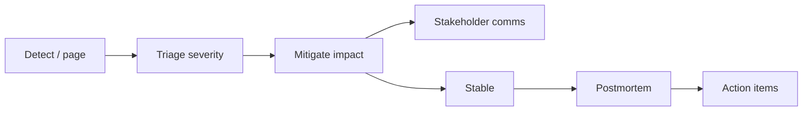

# Incident Response and Postmortems

## Learning Goals

- Run a lightweight incident command structure under stress.
- Separate mitigation from root-cause analysis.
- Write blameless postmortems that produce real corrective actions.
- Capture timelines from logs, metrics, and deploy events (including Rust services).
- Practice communication templates for stakeholders.

## What Counts as an Incident

An **incident** is an unplanned disruption or degradation that needs coordinated response beyond normal ticket work. Teams define severity:

| Sev | Example | Response |
|-----|---------|----------|
| SEV1 | Full outage payments | Immediate all-hands |
| SEV2 | Major feature broken | Urgent on-call + backup |
| SEV3 | Partial degradation | Business hours OK |
| SEV4 | Minor / cosmetic | Ticket |

Severity is about **impact**, not how interesting the bug is.

## Concept Diagram



## Roles

| Role | Responsibility |
|------|----------------|
| Incident Commander (IC) | Coordinates; does not deep-dive alone |
| Tech lead / primary | Investigates and changes systems |
| Comms | Updates status page / customers / eng channel |
| Scribe | Timeline notes |
| Subject experts | DB, network, security as needed |

On a small team one person wears many hats — still separate **mitigate vs explain**.

## First 15 Minutes Checklist

1. Ack the page; declare a channel (`#inc-2026-03-01-notes`).
2. State known impact: “writes failing 30% eu-west.”
3. Assign IC if not obvious.
4. Check: deploy? flag? dependency status? cert? traffic spike?
5. Prefer **roll forward/back** that restores service over perfect diagnosis.
6. Timebox deep dives (10–15 minutes) before trying the next mitigation.

## Mitigation Patterns

| Situation | Mitigation |
|-----------|------------|
| Bad deploy | Rollback / redeploy previous |
| Bad feature flag | Toggle off |
| Dependency down | Fail soft / cache / degrade |
| Overload | Shed load, scale out, rate limit |
| Data wrong | Stop writers; restore from backup with care |
| Security issue | Isolate, rotate keys, preserve forensics |

Mitigations should be **reversible** when possible and logged.

## Timeline Discipline

Write events in UTC as you go:

```text
14:02 Page: HttpHighErrorRate notes-api
14:04 IC declared in #inc-...
14:06 Identified deploy d3adb33 at 13:55
14:12 Rollback started
14:18 Error rate normal; monitoring
14:40 SEV2 closed pending postmortem
```

Auto sources:

- Deploy system history
- Metric annotations
- `git log` / release tags
- Tracing: first elevated error spans

```bash
# example forensic greps (adapt to your log store)
# rg "panic|ERROR" /var/log/notes-api.log
journalctl -u notes-api --since "2026-03-01 13:50" --until "2026-03-01 14:30"
```

## Communication Templates

**Internal**

```text
Impact: ~25% of note creates fail with 502
Status: Investigating; rollback in progress
Next update: 15 minutes
```

**External (status page)**

```text
We are investigating elevated errors on the Notes API.
A fix is in progress. Next update by 15:00 UTC.
```

Avoid speculation (“probably the database”) externally until verified.

## Blameless Postmortems

Goal: improve systems and processes, not punish individuals. Humans operate inside incentives and tools you built.

### Template

```markdown
# Postmortem: Notes API 502s — 2026-03-01

## Summary
One paragraph: impact, duration, root cause, trigger.

## Impact
- Users/customers affected
- Duration (detect → mitigate → resolve)
- SEV level
- Error budget burn

## Timeline
UTC table of events

## Root causes
Distinguish:
- proximate cause (nil pointer / bad config)
- contributing factors (no canary, missing alert)
- systemic issues (too much manual config)

## What went well
## What went poorly

## Action items
| Action | Owner | Due | Priority |
|--------|-------|-----|----------|
| Add canary deploy | … | … | P0 |
| Alert on deploy error spike | … | … | P0 |
| Runbook: rollback | … | … | P1 |

## Lessons
```

Action items without owners and dates are theater. Track them in the same system as product work.

## Five Whys — Carefully

```text
Service 502
→ pool exhausted
→ slow queries
→ missing index after migration
→ migration not load-tested
→ no perf gate in release checklist
```

Stop at **actionable systemic** causes. Do not stop at “engineer made a mistake.”

## Rust-Specific Incident Clues

| Symptom | Investigation |
|---------|----------------|
| Sudden panics | `RUST_BACKTRACE`, panic hooks, recent `unwrap` |
| Memory climb | allocations, caches without bound, fragmentation |
| Latency after deploy | blocking in async, mutex contention |
| Tokio task explosion | unbounded `spawn`, recursive retries |
| Native crash | `unsafe`, FFI, corrupted state |

```rust
// install a panic hook in services to log before abort
std::panic::set_hook(Box::new(|info| {
    tracing::error!("panic: {info}");
}));
```

Prefer graceful error paths so one request does not kill a worker; still detect elevated panic rates if you use `catch_unwind` at boundaries (rare).

## Severity Exit Criteria

Define “all clear”:

- Error rate back within SLO for N minutes
- No elevated customer tickets
- Mitigation documented
- Follow-up owners assigned

Do not linger “half-mitigated” without a clear owner.

## Practice Game Days

Schedule game days:

- Kill a pod under load
- Expire a cert in staging
- Break a feature flag

Treat like real incidents: IC, timeline, postmortem lite.

## Common Mistakes

- Debugging for an hour without mitigating.
- Blameful language that kills honesty.
- 40 action items, zero finished.
- No customer communication until fully fixed.
- Closing the incident without checking secondary regions.
- Missing “detect delay” in the timeline (often the real pain).

## Hands-On Practice

1. Write a fictional SEV2 timeline for a bad Rust deploy with rollback.
2. Fill a postmortem template including 3 action items with owners.
3. Draft internal and external status updates (3 messages each over an hour).
4. List your team’s severity definitions; find one ambiguity to clarify.
5. Run a 30-minute tabletop: “Redis latency 200ms” — who does what?

## Chapter Summary

Incidents are managed with **roles, mitigation-first discipline, clear comms, and blameless learning**. Postmortems only count if actions land. Next: **performance anti-patterns** in Rust services that often *cause* the pages you just learned to handle.
