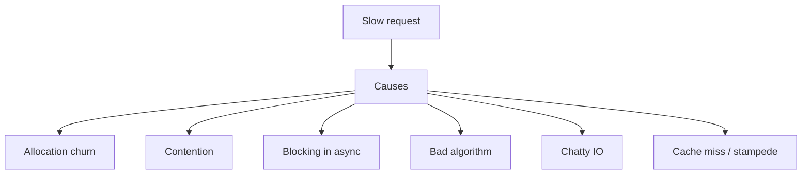

# Performance Anti-Patterns

## Learning Goals

- Recognize common Rust and systems performance footguns in real services.
- Measure before “optimizing” — use profiles, not folklore.
- Fix the highest-leverage issues: allocation churn, lock contention, blocking-in-async, accidental O(n²).
- Apply bounded data structures and streaming to avoid latency cliffs.
- Build a personal checklist for code review and load-test follow-up.

## Measure First

Anti-patterns are hypotheses until data says so.

```bash
# CPU profile (Linux)
cargo install flamegraph
cargo flamegraph --bin my-service
# or perf / samply / tokio-console for async
```

Look at:

- CPU hot stacks
- Allocation rates (`dhat`, heaptrack, allocator metrics)
- Lock wait / scheduled times
- p99 latency under realistic load

## Concept Diagram



## Anti-Pattern 1: Allocation in Hot Paths

```rust
// Bad: allocates a String every call
fn label_bad(id: u64) -> String {
    format!("user-{id}")
}

// Better: reuse buffer
fn label_good(id: u64, buf: &mut String) {
    buf.clear();
    use std::fmt::Write;
    let _ = write!(buf, "user-{id}");
}
```

Other hits:

- Repeated `clone` of large graphs
- Building `Vec` without `with_capacity`
- `collect` when an iterator consume would do
- Logging `format!` on every request at info level

```rust
fn sum_bad(items: &[u64]) -> u64 {
    items.iter().map(|x| x.to_string().parse::<u64>().unwrap()).sum()
}

fn sum_good(items: &[u64]) -> u64 {
    items.iter().copied().sum()
}
```

## Anti-Pattern 2: Blocking the Async Runtime

```rust
// Bad on tokio multi-thread: blocks worker thread
async fn bad_read() {
    let _ = std::fs::read_to_string("big.json");
}

// Better
async fn good_read() -> std::io::Result<String> {
    tokio::fs::read_to_string("big.json").await
}

// Or offload
async fn good_cpu_bound(data: Vec<u8>) -> usize {
    tokio::task::spawn_blocking(move || expensive_parse(&data))
        .await
        .expect("join")
}

fn expensive_parse(data: &[u8]) -> usize {
    data.len()
}
```

Symptoms: latency rises across unrelated requests; `tokio-console` shows few workers stuck.

## Anti-Pattern 3: Mutex / RwLock Over-Hold

```rust
use std::sync::Mutex;

// Bad: lock held across slow IO
async fn bad(state: &Mutex<Vec<String>>) {
    let mut g = state.lock().unwrap();
    // g.push(fetch().await); // if this compiled — disaster
    g.push("x".into());
}

// Better: compute outside lock
async fn better(state: &Mutex<Vec<String>>, value: String) {
    let value = value; // await work before lock
    state.lock().unwrap().push(value);
}
```

Prefer:

- Shard locks
- `tokio::sync` only when holding across `.await`
- Channels for ownership transfer
- Lock-free counters for metrics (`AtomicU64`)

## Anti-Pattern 4: Unbounded Queues and Caches

```rust
use std::collections::HashMap;

struct NaiveCache {
    map: HashMap<String, Vec<u8>>,
}

impl NaiveCache {
    fn put(&mut self, k: String, v: Vec<u8>) {
        self.map.insert(k, v); // grows forever → OOM
    }
}
```

Use LRU with cap, TTL, or explicit eviction. Same for `mpsc` — prefer bounded channels and backpressure.

## Anti-Pattern 5: Accidental Quadratic Work

```rust
fn join_bad(parts: &[String]) -> String {
    let mut s = String::new();
    for p in parts {
        s = s + p; // realloc + copy each time
    }
    s
}

fn join_good(parts: &[String]) -> String {
    let cap = parts.iter().map(|p| p.len()).sum();
    let mut s = String::with_capacity(cap);
    for p in parts {
        s.push_str(p);
    }
    s
}
```

Watch nested loops over request batches and N+1 DB queries:

```rust
// Bad: N queries
// for id in ids { db.get(id).await }
// Better: batch get where id in (...)
```

## Anti-Pattern 6: Chatty Serialization

```rust
#[derive(serde::Serialize)]
struct Big {
    payload: Vec<u8>,
}

fn often_too_heavy(v: &Big) -> String {
    serde_json::to_string(v).unwrap()
}
```

Fixes: protobuf/MessagePack for internal RPC, avoid logging full bodies, stream responses, compress only when CPU-cheaper than bandwidth.

## Anti-Pattern 7: Sync Contagion and Too Many Tasks

```rust
// Bad: spawn per tiny packet without bound
// for pkt in endless { tokio::spawn(handle(pkt)); }

// Better: worker pool
use tokio::sync::Semaphore;
use std::sync::Arc;

async fn handle_all(packets: Vec<u32>) {
    let sem = Arc::new(Semaphore::new(32));
    let mut handles = Vec::new();
    for p in packets {
        let permit = sem.clone().acquire_owned().await.unwrap();
        handles.push(tokio::spawn(async move {
            let _permit = permit;
            // handle p
            let _ = p;
        }));
    }
    for h in handles {
        let _ = h.await;
    }
}
```

## Anti-Pattern 8: Premature Micro-Optimization

Rewriting in SIMD while waiting on a remote DB is wasted effort. Order:

1. Correctness + bounds
2. Algorithm / IO batching
3. Allocation & contention
4. CPU micro-opts with benchmarks

```rust
// criterion bench skeleton
// fn bench(c: &mut Criterion) { c.bench_function("sum", |b| b.iter(|| sum_good(&data))); }
```

## Anti-Pattern 9: Debug Costs in Release Paths

- Leaving `DEBUG` logs at high volume
- `assert!` with expensive messages in hot loops (debug only usually)
- Debug builds in production (`opt-level = 0`)

```bash
cargo build --release
```

## Anti-Pattern 10: Cache Stampede

Many requests miss simultaneously → all hit DB.

```rust
use std::sync::Arc;
use tokio::sync::Mutex;

struct SingleFlight<T> {
    inflight: Mutex<Option<Arc<tokio::sync::Mutex<Option<T>>>>>,
}

// Simplified idea: only one loader; others wait for result
```

Use locks per key, request coalescing, or probabilistic early expire.

## Review Checklist

- [ ] Any `std` blocking IO in async code?
- [ ] Locks held across `.await`?
- [ ] Unbounded maps/queues?
- [ ] Allocations per request avoidable?
- [ ] N+1 queries / chatty RPC?
- [ ] Logging volume under max RPS?
- [ ] Timeouts on all IO?
- [ ] Benchmarks/profiles for claimed wins?

## Common Mistakes

- Optimizing median when p99 is the SLO.
- Trusting microbenchmarks that the optimizer deletes.
- Copying Go/Java habits (huge thread pools) into Tokio.
- Ignoring allocator choice (jemalloc/mimalloc) before fixing algorithmic waste — sometimes useful, not magic.

## Hands-On Practice

1. Take a slow handler; capture a flamegraph or at least timestamps around sections.
2. Remove one hot `format!`/`clone`; measure allocation or latency change.
3. Find and fix one blocking call in an async path.
4. Add a capacity limit to a cache; write a test that inserts &gt; cap.
5. Document three anti-patterns you have seen in the wild.

## Chapter Summary

Performance anti-patterns cluster around **allocations, contention, blocking async, unbounded growth, and bad algorithms**. Profile, fix the top stack, re-measure. Next: **capacity planning** — turning performance knowledge into fleet size and cost.
