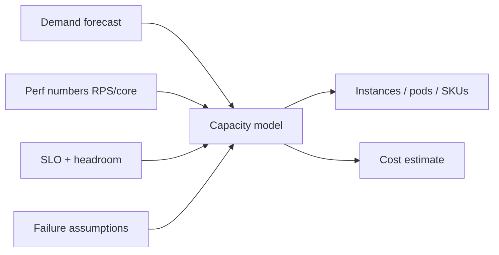

# Capacity Planning

## Learning Goals

- Translate measured performance into fleet size, headroom, and cost.
- Use Little’s Law and utilization targets to avoid queueing collapse.
- Plan for peaks, growth, failover (N+1), and dependency capacity.
- Connect Rust service limits (connections, memory, tasks) to infrastructure quotas.
- Build a simple capacity spreadsheet model you can defend in a review.

## Why Capacity Planning

Without it you either:

- Overpay for idle CPUs, or
- Discover limits in production via outage.

Capacity planning answers: **how much do we need for SLO X at load Y with failure Z?**

## Concept Diagram



## Inputs You Must Measure

| Input | How |
|-------|-----|
| Peak RPS / messages/s | metrics, 99th percentile week |
| Cost per request (CPU ms, allocs) | profile + load test |
| Memory per connection/request | RSS under load |
| p99 latency vs load curve | load test ramp |
| Dependency limits | DB max_conn, API quotas |
| Growth rate | product forecast |

Never plan only on average daily traffic — use **peak** plus event spikes.

## Little’s Law (Intuition)

```text
L = λ × W
in-flight ≈ arrival_rate × time_in_system
```

```rust
/// Rough concurrent requests in system
fn inflight(rps: f64, latency_s: f64) -> f64 {
    rps * latency_s
}

fn main() {
    let rps = 2000.0;
    let p99_s = 0.05;
    println!("approx in-flight p99: {:.0}", inflight(rps, p99_s));
}
```

If each instance handles 500 RPS at target latency, peak 2000 RPS → ≥4 instances before headroom and failover.

## Utilization and Headroom

Running at 90% CPU “efficiency” often destroys tail latency. Common targets:

| Resource | Steady target | Notes |
|----------|---------------|-------|
| CPU | 50–70% | leave burst room |
| Memory | &lt;70–80% | avoid OOM / reclaim thrash |
| DB connections | &lt;70% of max | |
| Disk | alert well before 100% | growth trend |

```rust
fn instances_needed(peak_rps: f64, rps_per_instance: f64, headroom: f64) -> usize {
    // headroom 0.3 => use only 70% of theoretical
    let effective = rps_per_instance * (1.0 - headroom);
    (peak_rps / effective).ceil() as usize
}

#[test]
fn sizing() {
    assert_eq!(instances_needed(2000.0, 500.0, 0.3), 6);
}
```

## Failure Domains: N+1 and N+2

| Policy | Meaning |
|--------|---------|
| N | Exact capacity for peak — fragile |
| N+1 | Survive one instance/AZ loss |
| N+2 | Higher assurance / rolling deploys |

```rust
fn with_failover(n: usize, extra: usize) -> usize {
    n + extra
}
```

If one AZ holds 1/3 of pods, losing an AZ may remove more than one pod — model **zone balance**.

## Load Curve Method

From load tests:

```text
RPS   p99    CPU/inst
100   10ms   15%
500   20ms   45%
800   40ms   70%
1000  120ms  85%  ← cliff
```

Plan **below the cliff**. Capacity is the RPS where you still meet SLO with margin, not the max RPS before total meltdown.

## Memory and Connection Math

```rust
fn memory_gb(per_conn_kb: f64, conns: f64, base_mb: f64) -> f64 {
    base_mb / 1024.0 + (per_conn_kb * conns) / (1024.0 * 1024.0)
}
```

Tokio services: each idle connection still costs buffers/tasks. Enforce `max_connections` and load shed before OOM.

DB:

```text
app_pods * pool_size_per_pod <= db_max_connections * safety
```

```rust
fn pool_ok(pods: u32, pool: u32, db_max: u32) -> bool {
    pods.saturating_mul(pool) < (db_max * 7 / 10)
}
```

## Dependency Capacity

Your service is fine until the dependency is not:

- Partner API 100 RPS quota
- Redis `maxclients`
- Kafka partition throughput
- DNS rate limits (yes, really)

Plan **ingress and egress**. Circuit breakers and caches reduce dependency RPS — account for that in the model.

## Growth and Seasonality

```text
capacity(t) = peak_today * (1+g)^months * event_multiplier
```

Event multiplier: launches, holidays (2–10×). Pre-scale or use autoscaling with **warm pools** if cold start hurts.

## Autoscaling Caveats

HPA on CPU alone:

- Scales late if bottleneck is locks/DB
- Flaps if metrics noisy
- Needs min replicas for sudden spikes

Prefer SLI-based scaling (RPS, lag, concurrency) + predictive scale for known events.

## Cost Model Sketch

```rust
fn monthly_cost(instances: usize, hourly: f64) -> f64 {
    instances as f64 * hourly * 24.0 * 30.0
}
```

Include:

- Compute
- Managed DB
- Egress bandwidth
- Observability ingest (can dominate!)

Right-size instance types: Rust often wins on smaller SKUs — re-benchmark when changing architecture.

## Capacity Review Artifact

```markdown
# Capacity: notes-api 2026Q3

## Demand
- Peak RPS: 2.0k (p99 week), launch target 4k

## Perf basis
- Load test commit abc: 500 RPS/pod @ p99 40ms, CPU 60%

## Proposal
- 6 pods steady (headroom 30%) + HPA max 12
- N+1 across 3 AZs
- Postgres: pool 10 * 12 < 200 max_conn

## Risks
- Search dependency quota 1k RPS
- Cache stampede on deploy

## Cost
- ~$X/month compute
```

## Rust Service Knobs Tied to Capacity

| Knob | Capacity impact |
|------|-----------------|
| `worker_threads` | CPU parallelism |
| DB pool size | Dependency saturation |
| Body size limit | Memory amplification |
| Semaphore bulkheads | Protection vs under-utilization |
| Cache size | Memory vs backend load |

Document defaults next to the capacity sheet.

## Common Mistakes

- Planning from average RPS.
- Ignoring failover and deploy surge.
- Scaling app pods until the database melts.
- No re-validation after major version/Rust release/config change.
- Treating load test on laptop Wi-Fi as production truth.

## Hands-On Practice

1. From a fictional load table, pick operating RPS and size pods with 30% headroom.
2. Compute in-flight with Little’s Law at that RPS.
3. Check `pods * pool` against a DB max_conn of 100.
4. Add N+1 and re-cost at $0.08/hour per pod.
5. Write a half-page capacity proposal for a 2× traffic launch.

## Chapter Summary

Capacity planning converts **measured RPS/latency curves** into fleets with headroom, failover, and dependency math. Revisit after every major perf change. Next: **career roadmap** — turning these engineering skills into roles and growth paths.
