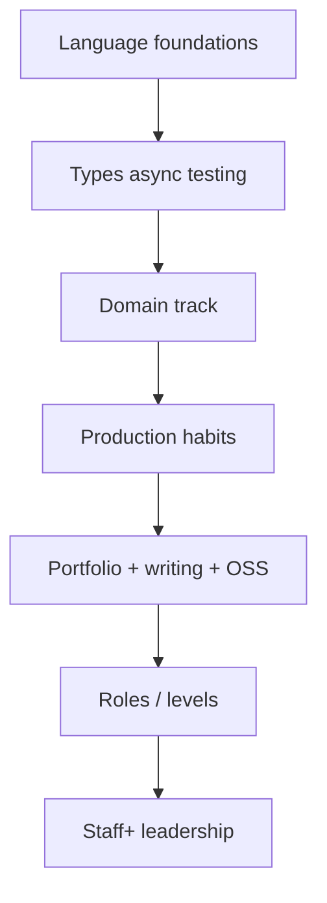

# Career Roadmap for Rust Engineers

## Learning Goals

- Map Rust skills to real job families: systems, backend, embedded, security, and infrastructure.
- Build a portfolio that proves production judgment — not only syntax.
- Plan a 6–18 month learning path with projects, writing, and community signal.
- Prepare for interviews: ownership, async, debugging, and design.
- Grow beyond IC coding into technical leadership without abandoning craft.

## Rust Careers Are Not One Path

| Track | Daily work | Rust angle |
|-------|------------|------------|
| Backend / platform | APIs, data, reliability | axum, tonic, queues, observability |
| Systems / infrastructure | Runtimes, networking, storage | low-level performance, unsafe care |
| Embedded / IoT | Firmware, devices | `no_std`, HAL, power |
| Security | Tooling, crypto eng, hardening | memory safety + threat modeling |
| Data / WASM edge | Pipelines, edge compute | performance, portability |
| Developer tooling | CLIs, compilers, linters | excellent rustc ecosystem fit |

Pick a **primary track** and a **secondary literacy** (e.g. backend + security).

## Concept Diagram



## Skill Stacks by Level (Approximate)

### Early (0–1 year Rust)

- Ownership, borrowing, traits, errors (`Result`), iterators
- `cargo test`, fmt, clippy
- Small CLIs and one HTTP service

**Proof:** published CLI or axum CRUD with tests.

### Mid

- Async (tokio), modules/crates, generics in APIs
- Observability, timeouts, idempotency
- Read foreign codebases; write design notes

**Proof:** multi-crate workspace; load test report; postmortem on a game day.

### Senior

- Performance diagnosis, unsafe boundaries, FFI when needed
- Distributed design tradeoffs
- Mentoring, RFCs, cross-team APIs

**Proof:** owned service with SLOs; security review participation; technical blog or talks.

### Staff+

- Multi-system strategy, roadmaps, hiring standards
- Risk management, incident culture
- Influence without writing every line

**Proof:** org-level reliability or platform outcomes; technical strategy docs.

## Portfolio Projects That Hire Managers Trust

Avoid “yet another todo app.” Prefer:

1. **Resilient service** — HTTP/gRPC, timeouts, idempotency, metrics, load report (Parts 5–7 of this book).
2. **Security-minded API** — authn/z, validation, `cargo audit` in CI.
3. **Embedded host-sim node** — `no_std` core + mocks + energy budget (Part 8).
4. **Tooling** — profiler wrapper, schema migrator, or fuzz target that found a real bug.
5. **Contribution** — meaningful PR to a crate you use (docs + tests count).

Each project README should include:

```markdown
## Problem
## Design tradeoffs
## How to run
## Tests / load / threat notes
## What I'd do next
```

## Public Signal

| Channel | Tip |
|---------|-----|
| GitHub | Consistent quality &gt; 40 dead repos |
| Blog / dev logs | Explain one hard bug you fixed |
| Talks / meetups | 10-minute demos beat perfect slides |
| OSS issues | Triage and reproduce for maintainers |
| Internal wiki | Staff promotions often read design docs |

Write about **failures and measurements**. “I rewrote in Rust and it was 10× faster” without methodology is noise.

## Learning Plan Template (12 Months)

```text
Q1 Language depth + one HTTP service with tests
Q2 Async + observability + load testing
Q3 Domain specialization (embedded OR distributed OR security)
Q4 Portfolio polish + interview loops + OSS contribution
```

Weekly cadence:

- 3–5 focused coding hours on the main project
- 1 debugging/reading session in a real codebase
- 1 short write-up (even private)

## Interview Themes for Rust Roles

| Theme | Expect |
|-------|--------|
| Ownership | Design APIs that borrow correctly |
| Error handling | `Result` strategies, no panic-driven control flow |
| Async | cancellation, blocking hazards, select |
| Concurrency | Send/Sync intuition, channels vs locks |
| Systems | TCP framing, backpressure |
| Debugging | Read a failing test / flamegraph story |
| Design | Consistency, idempotency, SLOs |

Practice aloud:

```text
"I'd put a timeout on every outbound call, use idempotency keys for POSTs,
and shed load with a semaphore when the DB pool waits spike."
```

Code interviews may use rust playground-level tasks; system design may be language-agnostic — still mention Rust ecosystem choices when relevant.

## Resume Bullets That Work

Weak:

> Wrote Rust services.

Strong:

> Owned Notes API in Rust (axum/tokio): cut p99 latency 40% by fixing lock hold across await; added SLOs and burn alerts; zero SEV1s in 2 quarters.

Quantify reliability, cost, or latency when you can.

## Open Source Strategy

1. Use a crate heavily for 2 weeks.
2. Fix a docs bug or add a test — land a first PR.
3. Take a “good first issue” only if it teaches the crate’s internals.
4. Avoid drive-by feature bombs.

Maintainer trust &gt; star count.

## Specialization Depth vs Breadth

T-shape:

```text
    breadth: Linux, HTTP, SQL, security basics, CI
         |
         +—— deep: e.g. async networking in Rust
```

Deep work makes you irreplaceable; breadth makes you effective in incidents.

## Soft Skills That Multiply Rust Skill

- Clear design docs and ADRs
- Calm incident communication
- Code review that teaches
- Estimation honesty
- Saying no to unsafe scope creep

## Anti-Patterns in Career Building

- Tutorial treadmill without shipping
- Rewriting everything in Rust for the resume
- Unsafe cowboy culture in interviews
- Ignoring adjacent skills (SQL, k8s, TLS)
- Waiting to feel “ready” before applying

## Self-Assessment Checklist

- [ ] I can explain ownership to a competent engineer in 10 minutes
- [ ] I have shipped something others use
- [ ] I can diagnose a latency regression with data
- [ ] I write tests for authz and failure paths
- [ ] I have one public artifact I am proud of
- [ ] I know which track I am optimizing for this year

## Hands-On Practice

1. Choose primary track + secondary literacy; write them down.
2. Outline one portfolio project from this book’s later parts with milestones.
3. Draft three strong resume bullets (even if aspirational — then execute).
4. Schedule a mock design interview with a peer on FairTicket or SoilNode.
5. Publish one technical write-up this month (blog or internal).

## Chapter Summary

A Rust career is **track choice + production judgment + visible proof**. Use this book’s projects as portfolio bones: network resilience, security hardening, distributed FairTicket, embedded SoilNode, and on-call discipline. Keep measuring systems — and your own growth — the same way.

## Book Closing Note

You have traveled from language foundations through systems, networks, security, distributed design, embedded constraints, and operational excellence. The craft continues in production: ship, observe, revise, and teach someone else the path.
