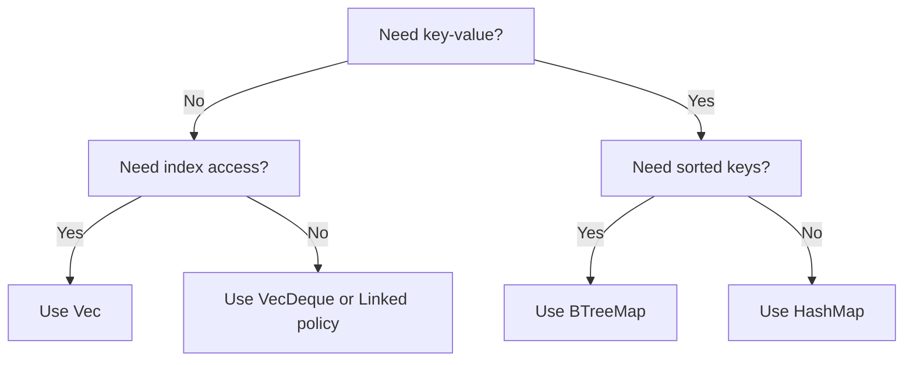

# Collections and Iterators Deep Dive

## Why This Chapter Matters

Collections and iterators are core to idiomatic Rust. High-quality Rust code is usually iterator-driven, allocation-aware, and explicit about ownership.

## Data Structure Selection Guide

| Need | Best Choice | Why |
|---|---|---|
| Ordered append/read | `Vec<T>` | Cache-friendly and simple |
| Key-value lookup | `HashMap<K, V>` | Average O(1) lookup |
| Ordered keys | `BTreeMap<K, V>` | Sorted iteration |
| Unique items | `HashSet<T>` | Fast membership checks |

## Collection Decision Flow



## Iterator Pipeline Example

```rust
fn top_three_even_squares(nums: &[i32]) -> Vec<i32> {
    let mut out: Vec<i32> = nums
        .iter()
        .copied()
        .filter(|n| n % 2 == 0)
        .map(|n| n * n)
        .collect();

    out.sort_unstable_by(|a, b| b.cmp(a));
    out.truncate(3);
    out
}
```

## Ownership in Iteration

```rust
fn main() {
    let words = vec!["rust".to_string(), "book".to_string()];

    for w in &words {
        println!("borrowed: {w}");
    }

    for w in words {
        println!("moved: {w}");
    }
}
```

- `for w in &words` borrows.
- `for w in words` consumes.

## Advanced Patterns

### `filter_map`

```rust
fn parse_ports(raw: &[&str]) -> Vec<u16> {
    raw.iter()
        .filter_map(|s| s.parse::<u16>().ok())
        .collect()
}
```

### `fold`

```rust
fn checksum(bytes: &[u8]) -> u32 {
    bytes.iter().fold(0u32, |acc, b| acc.wrapping_add(*b as u32))
}
```

## Mini Lab

Build `student_stats`:

1. Parse CSV-like lines into structs.
2. Group by class name using `HashMap`.
3. Compute per-class average and top performers.
4. Output sorted report.

## Review Questions

1. When is `BTreeMap` better than `HashMap`?
2. Why prefer iterator pipelines over manual indexing loops?
3. How does consuming iteration affect ownership?
