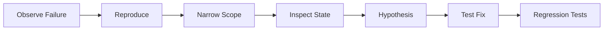

# Debugging and Error Diagnosis

## Debugging Mindset

Treat failures as data. Capture context, reproduce reliably, isolate scope, and apply smallest safe fix.

## Debugging Workflow Diagram



## Compiler Errors as Guidance

Rust compiler messages are often solution hints. Read fully, including note lines.

## Example: Trace a Parsing Bug

```rust
fn parse_age(s: &str) -> Result<u8, String> {
    s.parse::<u8>().map_err(|e| format!("invalid age '{s}': {e}"))
}

fn main() {
    let input = "300";
    println!("{:?}", parse_age(input));
}
```

## Logging for Diagnosis

```rust
use tracing::{error, info};

fn process(input: &str) {
    info!(%input, "processing request");
    if input.is_empty() {
        error!("input was empty");
    }
}
```

## Panic vs Error Return

- Use `panic!` for invariant violations that cannot safely continue.
- Use `Result` for recoverable user/system errors.

## Practical Lab

Create `debug_lab` crate:

1. Add one intentional parsing bug.
2. Add logs to isolate bug.
3. Fix and add regression test.

## Review Questions

1. Why are reproducible steps critical in debugging?
2. When should you avoid `unwrap()`?
3. What minimum context should a production error include?
