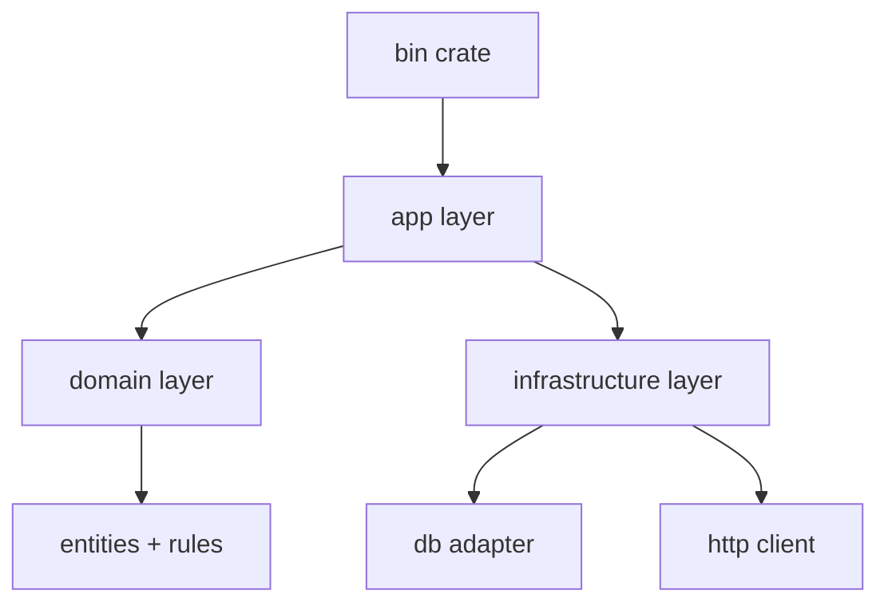

# Module and Crate Architecture

## Goal

Design Rust codebases that scale beyond toy projects while keeping compile times, coupling, and onboarding complexity manageable.

## Architecture Blueprint



## Workspace Structure

```text
rust-platform/
  Cargo.toml
  crates/
    core-domain/
    app-services/
    infra-postgres/
    cli/
    api/
```

## Public API Boundaries

- Export only stable abstractions from each crate.
- Keep implementation details private.
- Prefer explicit constructors and configuration structs.

## Example: Layered Traits

```rust
pub trait UserRepo {
    fn find_email(&self, user_id: u64) -> Option<String>;
}

pub struct UserService<R: UserRepo> {
    repo: R,
}

impl<R: UserRepo> UserService<R> {
    pub fn new(repo: R) -> Self {
        Self { repo }
    }
}
```

## Common Anti-Patterns

- One giant `mod.rs` with hidden cyclic dependencies.
- Domain layer importing transport-specific types.
- Public APIs exposing third-party crate types everywhere.

## Lab: Refactor a Monolith

1. Identify domain/app/infra boundaries.
2. Split into two crates first.
3. Introduce trait ports at boundaries.
4. Add integration tests across crates.

## Review Questions

1. Why keep domain crate dependency-light?
2. When is a workspace worth introducing?
3. How do crate boundaries improve team ownership?
