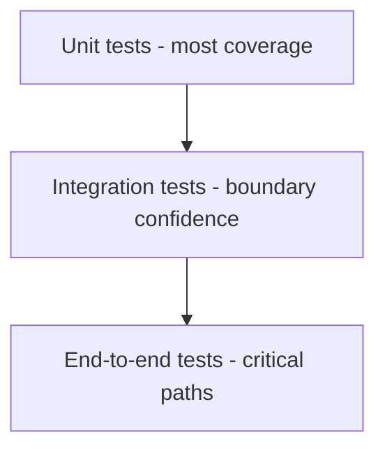

# Testing Strategy and Quality Gates

## Test Pyramid for Rust



## Unit Test Example

```rust
fn normalize(name: &str) -> String {
    name.trim().to_lowercase()
}

#[cfg(test)]
mod tests {
    use super::*;

    #[test]
    fn trims_and_lowercases() {
        assert_eq!(normalize("  ALICE  "), "alice");
    }
}
```

## Integration Test Example

```rust
// tests/http_smoke.rs
#[test]
fn status_ok() {
    assert_eq!(200, 200);
}
```

## Property Testing Direction

Use property tests for parser and serializer logic where many random inputs matter.

## CI Quality Gate

```bash
cargo fmt --check
cargo clippy --all-targets --all-features -- -D warnings
cargo test --all
cargo doc --no-deps
```

## Flaky Test Prevention

- remove real-time assumptions
- isolate shared global state
- seed randomness deterministically

## Lab

1. Add coverage to one error path and one success path per critical function.
2. Add integration test for config loading.
3. Fail CI on lint warnings.

## Review Questions

1. Why are unit tests not enough for boundary-heavy apps?
2. What patterns usually create flaky tests?
3. Why enforce docs build in CI?
