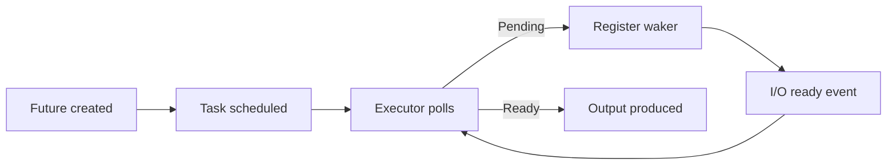

# Async Runtime Internals

## Why Internals Matter

Understanding runtime behavior helps you debug stalls, tune throughput, and avoid hidden blocking.

## Runtime Concepts

- Future: lazy state machine.
- Task: scheduled future unit.
- Executor: polls tasks.
- Reactor: receives I/O readiness events.

## Polling Model Diagram



## Blocking Hazard Example

```rust
#[tokio::main]
async fn main() {
    // Bad: blocks async worker thread
    std::thread::sleep(std::time::Duration::from_secs(1));
    println!("done");
}
```

Use `tokio::time::sleep` or `spawn_blocking` for CPU-heavy/blocking work.

## Bounded Task Fan-Out

```rust
use futures::{stream, StreamExt};

async fn run(ids: Vec<u64>) {
    stream::iter(ids)
        .for_each_concurrent(32, |id| async move {
            println!("task {id}");
        })
        .await;
}
```

## Lab

1. Build async downloader with concurrency cap.
2. Inject artificial delay and observe throughput.
3. Move blocking file work to `spawn_blocking`.

## Review Questions

1. What does `Pending` mean in future polling?
2. Why can blocking calls inside async tasks hurt unrelated requests?
3. What controls fan-out pressure in async systems?
